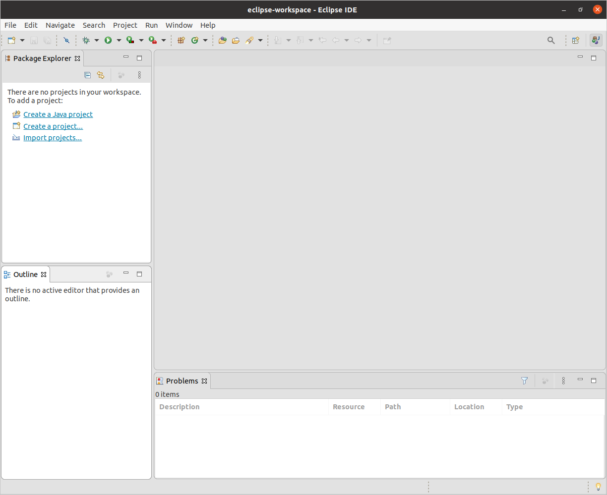

# (PART) Weekly Workshops {-}

# Building and testing {#building}

## Introduction {#Introduction}

In this workshop, we will be building and testing a system called Marauroa. We will look at some essential processes for working on an existing team-developed software system. We'll be assuming that, after this workshop, you are capable of carrying out the following tasks for yourself, without needing much guidance:


* Acquire the right version of the source code on which to work.
* Create an executable version of the source code using an automated build tool.
* Test the system, prior to making changes.
* Use a test suite to find functional regression in the system.    
* Run a piece of software consisting of multiple distributed subsystems.

In this, and some later workshops, we'll be working with the code of the *Marauroa games engine* for constructing online multi-player games.

Marauroa is an open-source *framework* and engine for developing games. It provides a simple way of creating games on a portable and robust server architecture. Marauroa manages client-server communication and provides an object-orientated view of the world for game developers. It further handles database access in a transparent way to store player accounts, character progress and the state of the world.

You should already have begun to practice some of these skills, through the GitLab Access Check activity.
In this workshop, we will build on that activity to carry out these basic skills on a large open-source software system.  During the workshop, you will:

1. Use an IDE to clone a local copy of the Marauroa repository.
1. Build executable versions of the client and server components, using the Ant build tool.
1. Run the test suite provided for Marauroa
1. Use a code coverage tool to assess the strength of the test suite.
1. See how the test suite can help us pinpoint errors in the code.

You may work at your own pace, but you should try to complete step 4 by the end of the workshop if you can.  You will need to finish the exercise in your own time if you don't manage it in the workshop, as you'll need to use these techniques for the team coursework. **If you are not up-to-speed with them, then you could slow your team down.**

## Acquiring Marauroa {#acquiring}

First, you'll need to acquire a local copy of the Marauroa Project.

### Run the IDE {#runide}

The Department provides a range of Integrated Development Environments (IDEs) for use by students. You are welcome to use any of these IDEs to carry out the work for this workshop. However, we are only able to provide technical support for Eclipse, specifically (ref:ideversion). If you do want to use one of the other IDEs, we will do our best to help should you get stuck, but we can't guarantee to be able to fix all problems.  At the bare minimum, you should feel confident that you can do all the tasks listed in the introduction in your chosen IDE before you finalise the decision.

The instructions that follow assume you are using (ref:ideversion) on a lab machine in the Kilburn building running Linux (not Windows). You can use Windows or Mac if you like, but we (academic staff and graduate teaching assistants) can't support multiple combinations of operating systems, IDE's and software.

You can start Eclipse from the Applications menu.

### Select the Workspace {#selectw}

Eclipse calls a folder containing one or more Eclipse projects a `workspace`.  At start-up, Eclipse will ask you which workspace you want to use for the session.  You can either accept the default location or use the File Browser to locate or create a different one.  A sensible standard location is something like:

    ~/EclipseWorkspace

If you choose to create a new workspace, Eclipse will show the Welcome View when it loads.  Uncheck the box at the bottom right of the window (labelled `Always show Welcome on start up`) and close it down, as we do not need this view for this workshop.  (You can get it back whenever you want by selecting the `Welcome` option from the `Help` menu.)

### Organise Workspace  {#organisew}

You'll need to organise your main Eclipse workspace window and you should now see a window that looks something like figure \@ref(fig:firstview-fig).

```{r firstview-fig, echo = FALSE, fig.align = "center", out.width = "100%", fig.cap = "Your main eclipse window should look something like this"}

```

If you used the same workspace you created for the individual coursework exercises, you'll see the project for that in the Package Explorer view.  If you used a new workspace, it will be empty like the one shown above.

This is the standard layout for working on Java projects.  The central empty space is where we will use the various Eclipse editor tools and views to work on individual files.  It is empty at the moment, as we are not working on any specific file.  Around it are a number of other views.  We'll talk about the main ones and what they tell us later.

I find this screen rather cluttered, and would immediately delete all the views I don't need regularly, to free up space for the ones I do, and move the views I do use to more convenient locations. You might want to do the same.  You can experiment with moving the views around by clicking and dragging on their tabs.  Delete any views you don't think you'll need, but **make sure you keep the Package Explorer view, the Outline view and the Problems view open**, as we'll be making use of those very soon.

Note that you can always get any views you delete back again, using the `Window` > `Show View` menu option.


### Create a New Project by Cloning {#newproj}

Next, we're going to pull down (git clone) the public Marauroa source code into a local repository where we can work on it.  You've already had experience working with Git from the command line.  In this course unit, we ask you to use your IDE for (at least) your basic interactions with Git and GitLab.  This will help you to understand the strengths and weaknesses of both approaches if you are not already familiar with them.

The first step is to ask Eclipse to import the Marauroa project for us, from a public Git repository.

Select the `File` > `Import` menu option.  Then choose `Git` >  `ImportFromGit` shown in figure \@ref(fig:eclipseImportProjectFromGit-fig)

```{r eclipseImportProjectFromGit-fig, echo = FALSE, fig.align = "center", out.width = "100%", fig.cap = "Your main eclipse window should look something like this"}
knitr::include_graphics("images/1.4.eclipseImportProjectFromGit.png")
```
You can either double-click on `Projects from Git`, or single-click on it and press `Next`.

A dialogue box appears showing the two ways in which you can import a project from Git.  We're going to **clone a project from a URI**, so select that option shown in figure \@ref(fig:eclipseCloneFromURI-fig)

```{r eclipseCloneFromURI-fig, echo = FALSE, fig.align = "center", out.width = "100%", fig.cap = "Your main eclipse window should look something like this"}
knitr::include_graphics("images/1.4.eclipseCloneFromURI.png")
```

Next, we need to tell Eclipse which URI to clone from.  The team behind Marauroa have set up their own Git server, which we'll connect to anonymously.  Enter the following into the URI field:

````md
git://git.code.sf.net/p/arianne/marauroa
````

Eclipse **Should fill in the rest of the fields automatically**. If it doesn't, it's likely that something went wrong when copying the link from this PDF: try typing it instead. Check that your dialogue looks like figure \@ref(fig:enterMarauroaURI-fig) before proceeding.

```{r enterMarauroaURI-fig, echo = FALSE, fig.align = "center", out.width = "100%", fig.cap = "Your Import Projects from Git dialogue box should look like this"}
knitr::include_graphics("images/1.4enterMarauroaURI.png")
```

If everything looks okay then select `Next`.

::: {.rmdnote}
**Does your Clone Attempt Fail With An Error?**

If so, the Arianne project Git server may be temporarily down.  If you can't clone using the URI given above, you can try using this GitHub repository URI instead:
````md
https://github.com/arianne/marauroa.git
````
:::

Eclipse will now communicate with the remote Git repository specified in the URI. It will ask us which branches we want to work with locally, that is, which branches we want to create local remote tracking branches for.  Note that this is not the same as asking us which commits we want to include in our clone.  A standard Git clone will always include all the commits in the cloned repository, regardless of which branches we select here.  And it is not asking us which remote branches we want to have in the repository.  Again, a standard Git clone will include all the remote branches by default.  The question Eclipse is asking here applies only to the question of which tracking branches should be created in the clone.

We're not going to be making any serious changes to the Marauroa code base in this workshop, so we will just ask for a remote tracking branch to be created for the `master` branch of the repository, see figure \@ref(fig:selectMarauroaBranches-fig). If you need to remind yourself how branching works, you might like to visit (or revisit) [learngitbranching.js.org](https://learngitbranching.js.org/).

```{r selectMarauroaBranches-fig, echo = FALSE, fig.align = "center", out.width = "100%", fig.cap = "Take a look at the list of branches contained in the project, by scrolling up and down the list. You'll see that the Marauroa project uses separate branches to describe specific releases, as well as other development branches. Another common approach is to have a single release branch and to use tags to distinguish specific releases on that branch."}
knitr::include_graphics("images/1.4selectMarauroaBranches.png")
```


Make sure that the `master` branch is selected, and press `Next`.

::: {.rmdcaution}
(ref:cautionbox)
**Master or Main?**

Historically, the default name for initial branch in a git repository was `master`. The initial branch was called "master repository" with other copies serving as "slave repositories".

Note that as of 2021, the use of `master` has now been deprecated. We're using it in this course unit, but by default, new projects using git will call the initial branch `main` not `master` to avoid problematic [master/slave terminology](https://en.wikipedia.org/wiki/Master/slave_(technology)).

See [about.gitlab.com/blog/2021/03/10/new-git-default-branch-name/](https://about.gitlab.com/blog/2021/03/10/new-git-default-branch-name/) for more details on the switch.
:::


As in the GitLab Access Check activity, we need to tell Eclipse where we want the cloned repository to be stored before it can issue the Git command to create it see figure \@ref(fig:configureLocalStorageMarauroa-fig)

```{r configureLocalStorageMarauroa-fig, echo = FALSE, fig.align = "center", out.width = "100%", fig.cap = "Cloning from git dialog box"}
knitr::include_graphics("images/1.4configureLocalStorageMarauroa.png")
```
You can use the default location suggested, or you can use the Browse button to use the file selector to create a new directory in a different location.  Here, I've followed the standard convention of putting the repository inside my personal `git` folder.

When you have selected your preferred location, select `Next`.

Eclipse now issues the commands to clone the project.

The next step is to import the Marauroa project from your local Git repository into Eclipse, so you can start to work on it.

::: {.rmdnote}
**What is a project in this context?**

One of the confusing things about IDEs when we first start to use them is the notion of a `project`.  When we code from the command line, we tend to organise our work in directories.  Sometimes these directories relate to specific tasks we are carrying out (like coding up the solution to a lab exercise) and sometimes they relate to the structure of the code we are creating (like different directories for source code and object code, or libraries or documentation).

We use directories for all these purposes when we code in an IDE as well, but in order to be able to support us well, the IDE needs to know the *root* directory of a piece of software that we are building.  That way, it can perform useful tasks for us, like automatically setting the `classpath` for us, and automatically compiling code and reporting on errors while we type.  This root directory is typically referred to as a *project*. IDEs use the concept of a project as a means of recording metadata about the project.  For example, Eclipse will remember that a specific project is a Java project, and will then know to apply the set of tools appropriate to Java projects, and not (for example) tools relating to Ruby or Python.
:::

As in the GitLab Access Check activity, we have to tell Eclipse which wizard to use to import the project for us. Since the Marauroa team uses Eclipse, we can use the wizard that looks for existing Eclipse projects in the repository, see figure \@ref(fig:wizardImport-fig) If we were loading a project built in another IDE, we would need to use one of the other wizards.

```{r wizardImport-fig, echo = FALSE, fig.align = "center", out.width = "100%", fig.cap = "Cloning from git dialog box"}
knitr::include_graphics("images/1.4wizardImport.png")
```

Click on `Next` when the correct wizard has been chosen.

Eclipse will now scan the local Git repository looking for anything that it recognises as an Eclipse project. It looks through all the folders, searching for the metadata files that Eclipse creates and stores in the root directory of a project.  In this case, it finds just one (called `newmarauroa`) see figure \@ref(fig:eclipseSelectProjectsToImport-fig)

```{r eclipseSelectProjectsToImport-fig, echo = FALSE, fig.align = "center", out.width = "100%", fig.cap = "Import projects from a git repository and the newmarauroa project"}
knitr::include_graphics("images/1.4eclipseSelectProjectsToImport.png")
```


Since there is just one project in the repository, we have an easy decision here.  Click on the `newmarauroa` project to select it, and then click on `Finish` (finally!).

Eclipse can now import the project into your workspace.  When that is done, you'll be taken back to the main Eclipse work screen (strictly speaking, we're taken back to what Eclipse calls the 'Java Perspective').  You should see that a project has appeared in the Package Explorer view, and that the Problems view has now been populated with information see figure \@ref(fig:finallyImportedProject-fig)


```{r finallyImportedProject-fig, echo = FALSE, fig.align = "center", out.width = "100%", fig.cap = "Import projects from a git repository and the newmarauroa project"}
knitr::include_graphics("images/1.4finallyImportedProject.png")
```


### Checkout a Specific Commit

Although we asked for the `master` branch to be checked out locally when we cloned the repository, we are actually going to be working with a different commit, one that is not pointed to by `master`.  This is partly to make sure everyone in the workshop uses the same commit for the exercise, even if `master` gets updated between the creation of these notes and the running of the workshops.  But it is also to give you confidence in working with non-head commits (that is, commits that are not pointed to by a branch or tag).

For this activity, we are going to work with the commit with the short SHA of (ref:commit-were-using).

The easiest way to check out a commit, branch or tag from within Eclipse is to use the History View.  To open it, right-click on the `newmarauroa` project name in the Package Explorer view.  Select `Team` > `Show in History` from the menu that appears.  The History View shown in figure \@ref(fig:historyTab-fig), should now be visible in the bottom panel of your Eclipse window.  You may wish to double-click on the view tab to expand it, so that the contents are more easily seen.

```{r historyTab-fig, echo = FALSE, fig.align = "center", out.width = "100%", fig.cap = "In this view, you should now see the most recent part of the network of the Marauroa project repository. You can scroll down to see the full commit log. As you can see, the history is significantly more complex than the simple repository we looked at in the GitLab Access Check. Marauroa has been under development since 2003, and its history reflects its age.  Note that your view of the repository may be a little different than that shown in the screenshot.  We are working with a live repository, and new commits are being made on a regular basis."}
knitr::include_graphics("images/1.4historyTab.png")
```

Look for the commit with SHA (ref:commit-were-using).  It should have the (not terribly helpful) commit message (ref:commit-message). As of September 2023, this commit will show as being from "1 Year 6 Months ago".  Right-click on it, and select `Checkout` from the menu that appears.

At this point, Eclipse will warn you that you are in a `detached HEAD` state shown in figure \@ref(fig:detachedHEAD-fig)

```{r detachedHEAD-fig, echo = FALSE, fig.align = "center", out.width = "100%", fig.cap = "(ref:captiondetach)"}
knitr::include_graphics("images/1.4historyTab.png")
```

(ref:captiondetach)  A warning of the detached HEAD state which reads:  “You are in the `detached HEAD` state. This means you don't have a local branch checked out. You can look around but it's not recommended to commit changes. The reason is that these commits would not be on any branch and would not be visible after checking out another branch.”


This just means that we have checked out a commit that is not pointed to by any current branch or tag.  The `HEAD` in Git is the currently checked-out commit.  Eclipse (and Git) are warning us about this because any changes we make and commit from this point will also not be pointed to by any branch or tag (unless we create one specifically).  In fact, they will be unreachable from any branch or tag, and so will be treated by Git as if they had been deleted. They will be scheduled for garbage collection, the next time that takes place. We're not going to commit any changes for this exercise, so we don't care whether the `HEAD` commit is detached or not. We can safely ignore this warning for now.

::: {.rmdnote}
**Checkout and Detached Heads**

If you're interested to learn more about checking out a detached head, you could read this article: [What's a "detached HEAD" in the Git FAQ](https://www.git-tower.com/learn/git/faq/detached-head-when-checkout-commit)
:::

Press `OK` and double-click on the History View tab, to shrink the view back to its original size and location, now that we have finished working with it.


### Explore your Project {#explore}

You now have your own copy of the Marauroa project source to play with and look around a little. Take a few minutes to look around and explore what is inside it before moving on to the next step.  Look at the way the contents of the project are organised into folders.  Can you guess the contents of each folder from its name?

Explore some of the folders.  Can you find some Java class files?  What clues did you use to track them down?

Notice the icon that Eclipse has placed next to the project name. Quite a lot of information is packed into this small symbol. The folder symbol indicates that this is a project.  The small J just above it indicates that this is a Java project.  The small orange drum under the J indicates that this project is under version control.  Eclipse also tells us the name of the Git repository the project is stored under, and which branch or commit of the project we current have checked out, in the text following the project name: `[marauroa (ref:commit-were-using)]` (or similar).  Finally, the small yellow road sign with the exclamation mark in the middle tells us that when Eclipse used its internal builder on the Java code in the project, it encountered some compiler warnings.

You might be surprised to see that the Marauroa team have released code that produces compiler warnings.  Let's take a look at what the warnings are, using the Problems view.  You'll notice that this view has already been populated with some information about the project, without us having to ask for it to be generated.  IDEs will commonly provide services like this, performing key analyses of the project source and letting you know about problems without you having to explicitly request it.  After all, if we have introduced a compilation error, we want to know about it as soon as it happens, and not much later when we finally remember to ask Eclipse to compile the code.

Because the Marauroa team have configured this project as a Java project, Eclipse already knows how to find the Java source files, and it uses its internal Java build tool to compile them.  In fact, it will recompile every time we make even a small change to the code, as well as when we import new code. From the Problems view, we can see that this automatic compilation produced no compiler errors (good!) but 158 compiler warnings (eek!).

If you have time, you can take a few minutes to explore the compiler warnings generated, by clicking on the small triangle beside the warning `Warnings` in the Problem view.   Take a look and see if you think these are serious problems or whether the Marauroa creators were making a reasonable decision not to fix them.

**STEP 1 of 4 COMPLETED**

You've now completed the first step, and have a code base to explore.  But, that is only the beginning.  Please proceed to the next step, where we'll look at how to **use the automated build scripts** provided by the Marauroa team to build an executable version of the Marauroa engine.


## Building the Marauroa Engine

If we are going to make changes to an existing body of code, we have to be able to create an executable version of it.  There is no point in making changes to source code if we can't actually run the new version of the code.

In this step, you're going to be introduced to the Apache Ant automated build tool, which is the tool chosen by the Marauroa team for use on their project.  You'll learn how to use it to create executable code from the source we've just downloaded.

::: {.rmdnote}
**Note:** we will not cover a full tutorial on the use of the Ant tool in this workshop --- nor indeed in any workshop to follow in the semester.  One of the key skills we need when working with large existing software systems is *the ability to keep moving forward* even when we don't have much of a clue about what is going on.  We have to accept that we will never know everything there is to know about the tools used by the system, or the source code of the system, or any other aspect of the system.
:::

For our purposes today, you just need to know how to run an Ant script to create an executable project. We'll take a look at the build script, to get an idea of how it works, but there will be a lot that we ignore or skip over very briefly.  Becoming comfortable with this approach is one of the skills you need to develop over the course of this semester.  (Many of you will already possess this skill, of course!)


### Locate and Examine the Build Script

Open up the `newmarauroa` project in the Package Explorer (if you have not already done so), and scroll down until you see a file called `build.xml`. This is the default name for Ant build scripts.  Double-click on it, to get Eclipse to load the file into an Editor view, so that we can see its contents shown in figure \@ref(fig:buildfile-fig)

```{r buildfile-fig, echo = FALSE, fig.align = "center", out.width = "100%", fig.cap = "An XML build file"}
knitr::include_graphics("images/2.1buildFile.png")
```

If the filename wasn't already enough of a clue, you'll see from this that Ant build scripts are XML files.  XML tags are used to define the things that the file knows how to build, and the steps involved in building them, as well as key configuration information, such as class paths (shown in the screenshot above).

Notice that the Outline view has also now been populated.  This very useful view gives a high-level summary of the contents of a file, by listing its main components as a tree view.  In the case of a Java file, the Outline view shows the classes defined by the file, and their members (fields and methods).  In the case of XML files, like our build file, the Outline view shows the hierarchy of tags defined by the files.

We can use the Outline view to run Ant builds, by right-clicking on the XML tags that represent descriptions of how to build things.  But an even more useful view is the **Ant View**.  This is a view that has been created with knowledge of how the Ant build tool works, and added into Eclipse as a plugin.  Open it by selecting `Window` > `Show View` > `Ant` from the top-level menus.

Now open `build.xml` from the view by clicking on the `Add Buildfiles` icon in the view toolbar.  It looks like an ant with a green plus on its left shown in figure \@ref(fig:antAddBuildfile-fig)

```{r antAddBuildfile-fig, echo = FALSE, fig.align = "center", out.width = "100%", fig.cap = "An XML build file"}
knitr::include_graphics("images/2.1antAddBuildfile.png")
```

This will open a new dialogue that allows you to select a Buildfile. Select `build.xml` and click `OK` shown in figure \@ref(fig:selectBuildfile-fig)

```{r selectBuildfile-fig, echo = FALSE, fig.align = "center", out.width = "100%", fig.cap = "Buildfile Selection"}
knitr::include_graphics("images/2.1selectBuildfile.png")
```

Notice that the Ant view has been populated.  Instead of listing all the top-level XML tags, this view knows just to list the  **build targets**.  These are the things the Ant script knows how to build.  The user of the script can request which target she or he wishes to build.

Scan down the targets and see if you can guess from the name what each one builds. Hint: `dist` here stands for `distribution`.

Let's take a look at the definitions of some of the targets.  Right-click on the name of any of the targets, and select `Open In` > `Ant Editor` from the context menu that appears.  You will see that the contents of the `build.xml` editor window are changed, so that the definition of the target we have clicked on is displayed.  For example, in figure \@ref(fig:jarallTarget-fig), we've clicked look at the `jar-all` target and take a look.

<!--Redo in Ant View-->
```{r jarallTarget-fig, echo = FALSE, fig.align = "center", out.width = "100%", fig.cap = "The jar-all target"}
knitr::include_graphics("images/2.1jarallTarget.png")
```

We can get a rough idea of what this definition is telling us.  First, note the `depends` attribute in the target tag.  This states that before we can build the jar file for the project, we must have built the `compile` target.  This makes sense as we need to have compiled Java code before we can create a Jar file.

These dependencies between targets are one of the key strengths of build tools such as Ant.  We can describe individual steps in the build process, and state the other steps that they depend on.  At build time, Ant will examine all the targets and their dependencies and find an order of execution that means that no target is built before the targets it depends on.

It's important to note, again, that you don't need to understand everything about the Ant build file to be able to make some educated guesses about what it is doing.  We don't need a detailed understanding just now.  We are just looking for easy-to-absorb clues as to what the various targets do.

::: {.rmdnote}

**A Note on Automated Build**

At this point, you might be wondering why we are bothering with this complicated build script when the Eclipse internal Java builder already seems to be doing a good job of compiling all the Java classes for us, without us needing to do anything at all.

The answer is that there is typically more to turning source code for a non-trivial system into deployable software than just compiling the Java code.  The Eclipse internal builder creates class files for all the Java files.  But when was the last time you downloaded an app or application and what you got was a folder full of class files?  

Quite what *deployment* means differs from application to application. Simple Java applications may simply be wrapped up into a jar file, but even then we often need to supply a shell script for setting the class path and executing the main method of the entry point class.  If we are building a Web application then deployment typically means packaging up the components of the application in a `*.war` file (web archive file) and copying it into a particular directory (the one used by the container manager our web server provides).  Or, we might need to prepare a zip archive of files, or to package up the files ready for use by an install tool.

As these examples show, the steps needed to deploy a system are often very simple, but they are also quite fiddly and fussy.  One wrong keystroke and we end up with something unusable.  Explicitly documenting the deployment steps in an automated build script make the deployment process quick, easy and reliable for anyone on the development team to carry out, even the newest team member.  That is very important, as it means that tests can be run on the deployable form of the system (even if it is not, at that point, deployed in the live environment).  As we have seen, the closer our test environment can be to the live environment, the more chance there is that we'll find errors before they reach the customer rather than afterwards.
:::


### Build the System Using the Build Script {#buildscript}

Now that we have seen something of the build script, we are going to use it to build the whole Marauroa distribution.  That is, **we are going to ask Ant to build the "dist" target**.

Right-click on the target we want to build and select *RunAs* from the menu.  You'll see that the IDE recognises the file we have clicked on as an Ant Build target and offers the option of running it as an Ant build.

::: {.rmdnote}

**Note**: you can build a target from both the Outline view and the Ant view in the same way. You can also do this via the terminal by navigating to the "git/marauroa" directory, and issueing the command "ant dist".

:::

Select the first of the two Ant Build options. The second takes you to a wizard, but we don't need that at this stage.

A Console tab will appear (figure \@ref(fig:consoleOut-fig)) in the bottom section of the Eclipse window, showing the output that Ant is sending to the standard output and standard error streams while it works. Double click on the tab of the Console view, and take a look at what Ant is doing.


```{r consoleOut-fig, echo = FALSE, fig.align = "center", out.width = "100%", fig.cap = "Console output"}
knitr::include_graphics("images/2.1consoleOut.png")
```

The console output shows the various targets that Ant creates, as it works through the dependencies specified in the build script.  The targets are shown at the left of the window, followed by a colon (init and compile, in the above screenshot).

Beneath the target, the names of the tasks invoked are shown, in square brackets.

The most important part of the output, of course, is shown at the end, when the process finishes:

```{r endconsoleOut-fig, echo = FALSE, fig.align = "center", out.width = "100%", fig.cap = "Console output"}
knitr::include_graphics("images/2.2endConsoleOut.png")
```

We can see here that the build was successful.  We have built the executable version of the code, just by right-clicking on a target!  Building Marauroa would be a lot more work if we had to carry out all these steps ourselves, manually, every time the code changes, and the chances of getting a step wrong would have been much higher.  This shows one of the strengths of automated build tools.  The Marauroa team have encapsulated their expertise in building their games engine into this build script file.  It now becomes possible for anyone, with or without expertise in Ant, or Marauroa, to build the system in the same way.

In other words, the build tool has made the build process *repeatable*.  A source of potential error in working with the code (and in deploying to the user) has been removed.

Take a moment to look through the full console output from the build command we have just run.  Look for the actions the build script is taking that are vital to creating a deployable product, but which are not about compiling individual class files.


### Examining the Results of the Build {#examining}

We'll finish this step by taking a brief look at what the build process has achieved.

Right-click on the `newmarauroa` project name and select Refresh from the drop-down menu.  Eclipse knows about any file changes you make using Eclipse tools (such as the Java editor or the internal Java builder) and can update the view of the project you see through its GUI automatically for you.  But Ant is not part of Eclipse.  It is a separate tool that Eclipse is running for us.  When an Ant script creates new files and folders, or moves things about, Eclipse doesn't know anything about it, and so the view of the project it shows to us can get out of date.  The Refresh menu option tells Eclipse to go and look at the directory structure and files in the project directory, and to update the GUI to show the effects of any changes.

When you refresh, several new folders should appear: build, build-archive, dist and javadocs.

Take a few moments to look at the contents of these folders, and see if you can form any hypotheses as to their role in the deployment process.  If we were going to share the Marauroa engine we have just built with a friend, what would we need to do?

**STEP 2 of 4 COMPLETED**

You have now completed the build step of the process.  Now we need to find out whether the engine we have built does what we expect it to.  Next, we will learn how to run the automated test suite that the Marauroa team have created.


## Testing the Marauroa Engine

Having created an executable version of the system, the next step is to check whether it is working correctly. In this part of the activity, we'll take you through the process of running the automated test suites created by the Marauroa team. You saw one way to run JUnit tests in Eclipse in the GitLab Access Check activity.  But there we just had one test class with just a few test methods to worry about.  The Marauroa test suite is much larger than this, and we need a different approach.

We'll take a first look at how these suites are organised and implemented in this step, though this is a topic we'll be coming back to in future workshops, too.


### Finding Out What Tests There Are to Run

Before we run the tests, it is helpful first to take a high-level look at the test suites provided by the developers of the system we are working with.  One way to do this is to look at the source folders in the project.  The source code for any large project, nowadays, is typically split into two halves: the production code (the part that the user will use and the customer will pay for) and the test code (the part that the development team use to work out whether they are delivering the right thing).  It's important not to get these two parts of the code mixed up, and therefore it is common practice to split test code off into its own folders (and sometimes its own packages).

Another source of useful information about the test suites is the Ant build script.  Although called a ``build`` script, we have seen that these scripts do a lot more than just compiling code.  Their task is not just to create an executable version of the system, but to create a verified executable that is ready for the user to take away and use.  Therefore, these scripts more normally follow a three-step process:

1. build
1. test
1. deploy

The Marauroa build script is unusual in that the target that produces the distribution doesn't also run the tests.  But it (the build script) does contain instructions for running the test suites.

Take a look at the targets in the build script.  We can see that there is one called `test`.  That sounds promising.  Let's take a look at figure \@ref(fig:showTestTargetInBuildScript-fig)

```{r showTestTargetInBuildScript-fig, echo = FALSE, fig.align = "center", out.width = "100%", fig.cap = "(ref:captionshowtestcaption)"}
knitr::include_graphics("images/3.1.1showTestTargetInBuildScript.png")
```

(ref:captionshowtestcaption) We can see that this target is dependent on another target, called `compile-tests`.  That makes sense as we would expect to have to compile the test (and production) code before we can run the tests.  

Let's take a quick look at that target before we look at the rest of the `test` target shown in figure \@ref(fig:compileTestsTargetJustCode-fig)

```{r compileTestsTargetJustCode-fig, echo = FALSE, fig.align = "center", out.width = "100%", fig.cap = "Testing targets"}
knitr::include_graphics("images/3.1compileTestsTargetJustCode.png")
```

The target in figure \@ref(fig:compileTestsTargetJustCode-fig) depends on the `compile` target.  In other words, the Marauroa team are saying here that if you want to compile the test code, then you have first to compile the production code that it tests (which makes sense, because the test code will make use of lots of classes and methods from the production code).

In the description of the `compile-tests` target, we can see two calls to `javac`, and a couple of file copy commands.  The `javac` commands are compiling code in the folder specified by the ``$\{src-test\}`` property and the ``functional_tests`` folder.

A string of the form ``\$\{something\}`` in an Ant script is a reference to the value of the property called ``something``.  They can be defined in the Ant script itself (using the `property tag`), but the `src-test` property has its value set in the ``build.ant.properties`` file, which the build script imports.  If we look in that file, we can see that this property is set to the path to the ``tests`` folder.

So, we can see from this small section of the build file (without bothering to look any further) that there are two kinds of tests in the Marauroa system: functional tests and another kind of test.  It is a fairly safe bet that this other kind of test are unit tests.

::: {.rmdnote}
**Forgotten what unit tests and functional tests are?**

This was covered in COMP16412.  Unit tests are short snappy tests that (strictly speaking) just test the behaviour of a single code unit. In Java, we normally think of individual classes as the units for unit testing.  Functional tests are tests of the major functions that the system offers, and will typically involve the execution of many classes working together.

In practice, it's quite hard to write true unit tests, and many of the tests in the `test` folder will in fact be *integration tests*, i.e., tests that assess the behaviour of a small number of units, working together.

:::

Now that we understand something of what is happening in the dependent tasks, we can go back to the `tests` target.  Its body contains a couple of tasks that appear to be calling a tool called `jacoco`.

[JaCoCo](https://www.eclemma.org/jacoco/) is a test coverage tool.  We'll look at what it does in more detail later in this activity, but for now all you need to know is that it is a tool that runs the tests, and works out what proportion of the production code statements are executed by the tests.

We can also see a call to a `junit` Ant task embedded in the `jacoco` task definition.  That must be where the tests are actually run.  It is run inside a `jacoco:coverage` task, suggesting that JaCoCo will be collecting the coverage information while JUnit is running the test suite.

The other target is called `jacoco:report`. The name suggests that it has the job of taking all the coverage logs gathered from running the tests, and producing a coverage report from that information.


### Run the Tests

Now that we know a little about what is happening inside the test-related targets, we'll run them.  Just as we did with the `dist` target when building the code, we're going to right-click on the `test` target, and select `Run As` > `Ant Build`.

Please try that now.

::: {.rmdnote}

**Note**: Due to various updates in Eclipse and other software, sometimes we lose compatibility with bundled libraries. This may make your tests fail to run. If this is the case, you should run the tests via the terminal by navigating to the "git/marauroa" directory, and issueing the command "ant test".

:::

<!--image but with ANT VIEW-->

As before, you should see a log of what Ant is doing appearing in the Console view. (Note that this time, the compile target and its predecessor targets are run but seem to do nothing.  This is because Ant knows that the production code source hasn't changed since these targets were last built.  So, there is no point wasting any time recompiling them, when we can just use the object files that were created the last time.)

<!--The final part of the console output should look like this:

\includegraphics[width=\textwidth]{{{3.2.2consoleOutputFromTestTargetEnd}}}

From the output, the target seems to have run to completion.  The build was successful so no tests seem to %have failed.   The whole process (the console output informs us) takes 32 seconds.  (The elapsed time, of %course, was almost certainly a little longer than this.)-->

The build should succeed as before, indicating that all tests pass successfully.

<!--This time, you should see a failed build.  This is because one of the tests has failed.  A little later, we'll look at some tools for working with test results, so we can examine just why the build failed.  For now, we note only that the failing test caused the process of executing the test suite to come to a full stop.  This is because the Marauroa build script tells JUnit to stop as soon as a failing test is encountered.  In some situations, this is useful (it leaves the details of the failing test clearly visible in the console window), but in other situations, we want to see the results of the whole test suite, whether there are failures or not.-->

<!--To allow this, open up the `build.xml` file, and go to line 292.  On this line, change the values of the `haltonerror` and `haltonfailure` parameters to both be `false`.  Then run the tests again, from the Ant View.  You should now see a much larger number of test results scrolling by in the Console View.-->


<!--infobox
INFO ABOUT THE FAILING TEST

A failing test should mean there's an error in the program, but this failing test was caused by an inaccurately written test.  When IT Services updated the School teaching machines to Scientific Linux 7.3 at the very end of the summer vacation, they installed a new version of the library that Marauroa uses to write JSON files.


Further Explanation for Those Interested

The test in question checks the ability of the code to serialise information about a Marauroa game to JSON.  The specification for the JSON API used states that a particular method does not guarantee the ordering of its results, but the test is written assuming that the results *will* come back in a particular order.

When ITServices upgraded the School's teaching machines to Scientific Linux 7.3, at the very end of the summer vacation, they also seem to have changed the version of the library that Marauroa is using to serialise to JSON.  Both old and new versions of the library meet the API specification, but they return their results in different orders.  Because the test assumes a specific order, it now fails, even though the Marauroa code itself has not changed.

This is an excellent example of a *brittle* test.  Ideally, we want our tests to fail *only* when the code we are writing has changed in some way that breaks the requirements.  Test failures that occur for other reasons mean we place less trust in the tests, and get less value out of the effort we put into writing them.-->


### Examining the Test Results

<!--%It's useful to know that some of the tests failed, but the summary output we get on the console from the build is not very helpful when we want to know which tests exactly failed, and why.  We need some way to get more detail on the results of running the test suite.-->

It's useful to find out more details about the results of running the test suite, but the summary output we get on the console from the build is not very helpful. We need a better way to get more details about the results of running the test suite. But where are the results stored?

Line 37 of the `build.ant.properties` file tells us that the `build-test-reports` are in the `build/testreport` folder.  We'll need to refresh the project to allow Eclipse to show us these new folders and files, so right-click on the project name in the Package Explorer View and select `Refresh`.

You should now be able to examine the contents of the `build/testreport` folder shown in figure \@ref(fig:showJUnitTestResultsInXMLFormat-fig)

```{r showJUnitTestResultsInXMLFormat-fig, echo = FALSE, fig.align = "center", out.width = "100%", fig.cap = "The testreport"}
knitr::include_graphics("images/3.2.4showJUnitTestResultsInXMLFormat.png")
```

The icon next to these test result files tells us that they are JUnit test results, and the suffix tells us that they are XML files. You can double-click on any of these XML files, and Eclipse will open them in the special JUnit viewer.  For example, if you select the file:

``TEST-marauroa.clientconnect.ClientConnectTest.xml``

you'll see the JUnit view shown in figure \@ref(fig:showTestResultsForClientCoverage-fig).

```{r showTestResultsForClientCoverage-fig, echo = FALSE, fig.align = "center", out.width = "100%", fig.cap = "The JUnit view"}
knitr::include_graphics("images/3.2.4showTestResultsForClientCoverage.png")
```

We can see that there were four test cases in this class:

1. ``clientconnectTest``
1. ``createCharacterTest``
1. ``joinGame``
1. ``wrongPwTest``

All are shown with a small green tick next to them, indicating that they passed.  The numbers in brackets after the test name indicate the execution time of the test.  (You can see that they are all running in a fraction of a second, which is what we need for tests of this kind, as we would expect to be running them very regularly as a developer - after every small code change, in fact.)

The green bar at the top of the JUnit view also indicates that all the tests in this test class passed.

We can double-click on any of the tests to find out more about them.  Try this with the first test: `clientconnectTest`.  You should see the source of the test case, loaded in the Editor view shown in figure \@ref(fig:showSourceOfTestFromTestReport-fig)

```{r showSourceOfTestFromTestReport-fig, echo = FALSE, fig.align = "center", out.width = "100%", fig.cap = "The Editor view"}
knitr::include_graphics("images/3.3.4showSourceOfTestFromTestReport.png")
```

You can see that the test in \@ref(fig:showSourceOfTestFromTestReport-fig) is short, and quite descriptive. This is typical of unit test code. Did you also notice that this is the first time we have looked at Java code in our exploration of the Marauroa system?  Test cases make a great starting point for understanding what an unfamiliar code base does, as we shall see in another (ref:coursecode) workshop.

If you have time, you can explore some of the other test results, and the test cases associated with them.  Try not to get too bogged down in the details, though.  We're just trying to get an overview of what the system is doing here, rather than drilling down into the details of any one feature.


### Examining the Test Coverage Results

We can now see the results of the JUnit tests.  But what about the code coverage results produced by JaCoCo?  How do we get to see those?  The results are stored in two places: a file called `build/jacoco.exec` and another called `build/coveragereport/jacoco.xml`.

::: {.rmdnote}
⚠️ **IMPORTANT NOTE** ⚠️
Don't try to open the jacoco.xml file in Eclipse!  It is huge and Eclipse will spend a lot of time trying (and probably failing) to grab enough memory for it. If you want to see what it contains, then use a lightweight text editor or a command like ``head -c`` from the command line.
:::

It's not clear what use the Marauroa team make of these results, but we would normally prefer to have the results of the code coverage in a more human-friendly format than a giant XML file.  Jacoco provides the facility to create a report as a web page, as well as in XML form.  So, we're going to modify the build.xml file, to create this more useful form for us.

All we need to do is add one extra line to the test target in the build file, just after line 320:

````md
<html destdir="${build-coverage}" />
````

Note that the parameter is `destdir`, not `destfile`, like in the line that follows.  Figure \@ref(fig:addHTMLreportRequestToBuildFile-fig) below shows how the edited build file should look, with the new line highlighted.


```{r addHTMLreportRequestToBuildFile-fig, echo = FALSE, fig.align = "center", out.width = "100%", fig.cap = "The JUnit view"}
knitr::include_graphics("images/3.3.5addHTMLreportRequestToBuildFile.png")
```

The line to add has been highlighted in the editor window in figure \@ref(fig:addHTMLreportRequestToBuildFile-fig).  When you have added it and saved the file (Control-S is the keyboard shortcut, or you can click on the small floppy disk in the toolbar), run the Ant test target again. When this completes, **refresh** the project to pull in the extra report files we have asked JaCoCo to create.

Expand the `build/coveragereport` folder. You should see lots of extra folders inside it, with names that look like they could be Java packages.  You should also find a file called `index.html` down towards the bottom.  This is the root file of the HTML report that JaCoCo has created for us.

Eclipse has a Web browser plug-in that you can use to look at this report (by double-clicking on the `index.html` file).  This plug-in was pretty buggy in previous releases.  If you find this to be the case under Eclipse 2020-03 too, you can open your preferred Web browser and look at the files in that.  (You'll need to use a file browser to locate the file in your file space.  Searching for the directory called `coveragereport` is a quick way to do this.)

```{r showCoverageReport-fig, echo = FALSE, fig.align = "center", out.width = "100%", fig.cap = "A test report"}
knitr::include_graphics("images/3.3.7showCoverageReport.png")
```

The report in figure \@ref(fig:showCoverageReport-fig) shows, for each package, the degree to which the test suite exercised the source code.  For now, we'll just focus on the first four result columns.  For the second package, `marauroa.common.game`, we can see from the report that the test suite executed 67% of the instructions in the package.  (An instruction, here, is a single Java byte code instruction.)  But, 33% (around a third) were not executed at all by the test suite.  Any bugs in instructions not covered by the test suite will not be caught by it.

The next two columns show how many “branches” in the code were covered by the test suite.  A “branch” in this context means a conditional point in the code, where execution could follow one of two paths based on the value of the condition.  JaCoCo currently computes branch coverage only for `if` and `switch` statements, though theoretically loops also introduce branches into code.  We would like our test suite to exercise all exits from all branches.  That is, if there is an if-statement, we would like our test suite to execute the if-statement with a true condition (so that the then-body is executed) and with a false condition (so that the else-body is executed).  These columns assess how far the test suite has met this goal.  In the case of our example, just 60% of the branches in this package are exercised by the test.


::: {.rmdnote}
**Aside: Coverage by Instrumentation**

Code coverage tools like JaCoCo need to find out which source code statements were executed when a test (or suite of tests) is run.  They typically do that by “instrumenting” the code.  That is, they convert the code of the system so that every statement is accompanied by a second statement that logs the occurrence of the first statement in some file somewhere.  For example, the code fragment:

```java
int x = Math.random();
System.out.println(x);
```

would be converted into:

```java
int x = Math.random();
coverage_log("int x = Math.random();");
System.out.println(x);
coverage_log("System.out.println(x);");
```

(Obviously, this is a simplified picture of what is actually going on.)  When the instrumented code is run, as well as executing the main code, a log is gradually built up of which statements were executed and when.

:::

You can drill down further by clicking on the package names to see code coverage reports for each class.  If you click on the classes, you'll get a breakdown of the coverage per method.  You can even get reports on the coverage of individual lines of code (by clicking on the methods in the coverage report).  For example, figure \@ref(fig:showDetailedMethodCoverageReportMac-fig) shows the detailed coverage report for the method `marauroa.common.game.RPObject.size()`.

<!--%%% REDO - small code change means change to line numbers-->

```{r showDetailedMethodCoverageReportMac-fig, echo = FALSE, fig.align = "center", out.width = "100%", fig.cap = "A more detailed coverage report"}
knitr::include_graphics("images/3.3.8showDetailedMethodCoverageReportMac.png")
```

In figure \@ref(fig:showDetailedMethodCoverageReportMac-fig) the green lines were executed by the test suite.  We can see that the beginning of the method has been covered well by the tests.  All the early instructions were executed, and the two if-statements have been executed with both a true and a false condition in different test cases.

Towards the end of the method, the coverage looks less good.  The yellow colouring of the if statement on line 1408 indicates that only one of the two exits from it were exercised by the test case.  Since the body of the if-statement is coloured red, it seems that the code has only been executed in scenarios where the `links` variable is set to null.  We can also see that the exception handling code has not been tested.

Hopefully, it is now obvious how useful this kind of tool is.  If we see that important and complex parts of the code are not covered by the test suite, we can write test cases that explicitly target the missed branches and instructions (using white-box testing design techniques).  In this way, we can gradually build up a test suite that covers all the important cases, while not wasting time on covering parts of the code that are seldom executed or of little importance.


**STEP 3 of 4 COMPLETED**

You have now run the test suite for the Marauroa engine, and have begun the process of understanding how it works.  We'll be coming back to look at the tests in more detail in a future workshop.  For now, we're going to spend whatever is left of the workshop looking at how the test suite can help us to detect when bugs are introduced into the code.


### Using the Test Suite to Find Bugs

We're going to end the workshop by making a quick experiment to show the power of this kind of automated test suite. We're going to make a change to the code, and then we'll see if the tests can indicate that something has been broken. For example, let's make a small change to the method:

````java
marauroa.common.game.RPSlot.setDeletedRPObject()
````
First, we need to get the source of this method loaded into the Editor view. You can do that by expanding the src folder tree in the Package Explorer, or by using the search facility from the main menu bar. (File search is the easiest to use, but Java search would be a sensible way to run this search, too.)

Double click on the class or method to load it into the Editor window.  You can use the Outline View to locate the method quickly once you have the class loaded into the Editor. Now we can make the change. Comment out line 649, as shown in figure \@ref(fig:commentOutALineOfCode-fig)

```{r commentOutALineOfCode-fig, echo = FALSE, fig.align = "center", out.width = "100%", fig.cap = "A more detailed coverage report"}
knitr::include_graphics("images/3.4.1commentOutALineOfCode.png")
```

Save the file and run the build test target.

This time, you should see a failed build like the one shown in figure \@ref(fig:resultsOfRunningTheTestsOnTheModifiedCode-fig). This is because one (or more) of the tests have failed, because of the change we introduced. The failing test(s) caused the process of executing the test suite to come to a full stop.  This is because the Marauroa build script tells JUnit to stop as soon as a failing test is encountered.  

```{r resultsOfRunningTheTestsOnTheModifiedCode-fig, echo = FALSE, fig.align = "center", out.width = "100%", fig.cap = "A more detailed coverage report"}
knitr::include_graphics("images/3.4.2resultsOfRunningTheTestsOnTheModifiedCode.png")
```

In some situations, this is useful (it leaves the details of the failing test clearly visible in the console window), but in other situations, we want to see the results of the whole test suite, whether there are failures or not. In other words, we want the build process to carry on despite the failing tests.

To allow this, open up the `build.xml` file, and go to line 292.  On this line, change the values of the `haltonerror` and `haltonfailure` parameters to both be `false`.  Then run the tests again, from the Ant View.  You should now see a much larger number of test results scrolling by in the Console View.

Then run the test build target again. You should see output similar to figure \@ref(fig:resultsOfRunningTheTestsOnTheModifiedCodeCompleteBuild-fig).


```{r resultsOfRunningTheTestsOnTheModifiedCodeCompleteBuild-fig, echo = FALSE, fig.align = "center", out.width = "100%", fig.cap = "Tests FAILED"}
knitr::include_graphics("images/3.4.2resultsOfRunningTheTestsOnTheModifiedCodeCompleteBuild.png")
```

Notice the important line at the bottom in red. One or more of the tests failed. To see the details, open up the JUnit results file:

````md
build/testreport/TEST-marauroa.common.game.RPObjectDelta2Test.xml
````

Double click on the names of the test cases that failed in the JUnit view.  You will see that the test class is automatically loaded into the Editor window, with the cursor placed at the assertion that failed.

This shows that the error we introduced, in this case, was spotted by the tests.

You may be thinking at this point that I must have spent ages looking for a line of code that I could comment out and that would cause a test to fail. In fact, this line was the first one I tried --- honest! I did cheat a little bit, as I made sure to look for a line to change that was in code that was well covered by the test suite. If I'd made a change in code that was less well covered, then I'd probably have had to look harder to find a change that the tests could spot.

::: {.rmdnote}
**Aside: Writing Tests to Trap Bugs**

You may notice that the name of the test that failed here contains the word “bug”. Even with a fairly comprehensive test suite, it is still possible for bugs to slip through. When this happens, it is good practice to write a new test that fails due to the bug. That is, the test describes what the correct behaviour of the system should be, and its failure tells the developers that the bug is still in the system. Then, when the developer thinks she has fixed the bug, she can run the bug test and find out whether she has or not.

When the bug is fixed, the test we wrote to make it visible can enter the normal pool of tests that we run regularly over the system. That way, if any future code change causes the bug to reappear, we'll have a test that will catch it.
:::

In whatever time is left, try making your own changes to the code. Run the tests, and see if they were able to detect the error you had introduced. Try making changes in code that are well covered by the tests and in code that is less well covered. How did the test suite do?

You won't have to try this for long before you start to want a better way of looking at the test results than scanning through the build output on the console.  It is usual to set up the build script so that it creates a summary report of all the test results for the project, so that you can see at a glance which tests are failing. The Marauroa team have not done this (perhaps because they prefer to look at test results through their continuous integration and test system---we will look at these tools, and use them for the coursework, later in the course unit).

If you want to get a summary of all the test failures, you can add the following target to the end of the build script (before the closing "project" tab):

```` XML
    <target name="all-tests-report" depends="test">
        <property name="test-summary-report" value="${build-tests-report}/summary"/>
        <mkdir dir="${test-summary-report}"/>
        <junitreport todir="${test-summary-report}">
            <fileset dir="${build-tests-report}">
                <include name="TEST-*.xml"/>
            </fileset>
            <report format="frames" todir="${test-summary-report}"/>
        </junitreport>
    </target>
````

You'll now see a new target appearing in the Ant View for the `build.xml` file. Run this target to generate the summary report in your test reports folder. Once built, the file to look at is: `build/testreport/summary/index.html`.

When you have injected some bugs that your test suite catches, why not challenge your colleagues to see if they can use the information provided by the failed tests to work out which line you changed. (Don't forget to make a note of the class file and line you changed.)

**STEP 4 of 4 COMPLETED**

All done with the activity and nowhere to go?

If you have raced through all the above, and still have time left in the workshop, you could try to run the code we have built so far. Marauroa is a game engine rather than a game itself. It provides functionality to be used by other software (a game), and so if we run it by itself, there isn't much to see. We need to have a game of some sort to run, and then we can see the engine at work.

The Marauroa team provide a tutorial describing how to use Marauroa to create a simple “chat” game using the engine, which does allow us to run the engine we have built. Head over to the Marauroa wiki and follow the tutorial instructions if you want to try this out (it's an optional exercise, and is not important for the coursework or the remainder of the workshops).  It is very short, and just involves the creation of 5 classes in total.  All code for the classes is provided, but there are a couple of tricky elements to making it all fit together in Eclipse.

You should start by making a new Java project in Eclipse, with a `lib` folder (an ordinary folder, not a source folder). Import the Marauroa jar file that you built in the previous steps into this directory, and add it to the build path for your project. This is done by right-clicking on the imported jar, and selecting `Build Path` > `Add to Build Path`. You can then add the files from the tutorial to the `src` folder.

You'll need to add a couple of other libraries to the `lib` folder as you progress. They can all be imported/copied from the `newmarauroa` project.

When you are ready to run, you'll need to create a new Run Configuration. The drop-down menu associated with the small green circle and white triangle in the taskbar (i.e. the run button) will take you to the screen for this.

Do not hesitate to ask if you are stuck!

