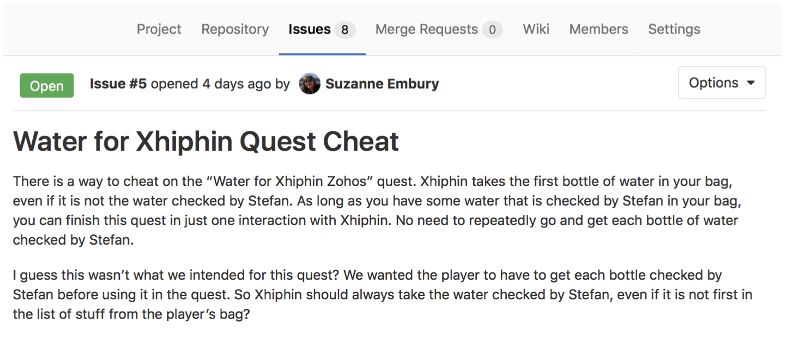

# Debugging {#debugging}

Much of your time as a software engineer will be spent debugging code, either other people's or your own. That code will often be unfamiliar to you so it is important to be able develop strategies for debugging an unfamiliar codebase. In this course we will use Stendhal as an example to help you develop better debugging skills, see figure \@ref(fig:xkcd-debugging-fig)


```{r xkcd-debugging-fig, echo = FALSE, fig.align = "center", out.width = "99%", fig.cap = "(ref:captionxkcddebugging)"}
knitr::include_graphics("images/debugging.png")
```

(ref:captionxkcddebugging) Debugging unfamiliar codebases is a routine part of software engineering. [Debugging (xkcd.com/1722)](https://xkcd.com/1722/) by [Randall Munroe](https://en.wikipedia.org/wiki/Randall_Munroe) is licensed under [CC BY-NC 2.5](https://creativecommons.org/licenses/by-nc/2.5/)

## Preparing for the workshop
Welcome to the (ref:coursecode) workshop on *Debugging an Unfamiliar Code Base*.

Today, after a short lecture introducing the core concepts, we'll be working through a number of activities in which you will be undertaking some debugging tasks.  Before the workshop begins, please follow the instructions below to prepare your machine for the activities we will do in the workshop today.

We are going to use the Stendhal code base to illustrate the topics under discussion.  This will involve you reading the Stendhal code, and making some small changes.  In order not to put your coursework at risk, we're going to use a slimmed down version of the Stendhal code repository containing the Stendhal code but without the extensive revision history.

To prepare for the workshop, you need to clone the repository and import it into your preferred IDE.

The HTTPS protocol URI of the repository is:


```` md
https://gitlab.cs.man.ac.uk/suzanne.m.embury/stendhal-playground-2019.git
````

If you are using Eclipse and need a reminder of what to do, you can follow the steps we took in the Week 1 workshops, when we cloned and imported the Marauroa code base.  The instructions are on Blackboard, under `course content` > `Week 1`.

::: {.rmdnote}
Eclipse users will need to create a new workspace to import this project into.  This is because Eclipse doesn't allow two projects with the same name in a single workspace.
:::


### Introduction to the Workshop Activity {#introw}

In this workshop, we will look at techniques for debugging unfamiliar codebases such as
those encountered throughout the (ref:coursecode) (`marauroa` and `stendhal`), when contributing
to open source projects or when working with other legacy codebases (e.g. as part of an industry
development role).

Note that unlike the other (ref:coursecode) workshops so far, this workshop will focus on debugging the `stendhal` codebase rather than `marauroa`.

**This workshop should have direct application in the first team coursework exercise.**

The workshop builds on techniques given in Workshop 2 for navigating large, unfamiliar codebases.
In this workshop you will:

* Systematically develop your understanding of a reported error in the Stendhal codebase through execution only.
* Develop test cases that verify the problem by closely replicating gameplay.
* Use code navigation skills developed in Workshop 2 to identify possible causes of the error.
* Use a range of debugging tactics to eliminate causes, such that a possible fix can be proposed.
* Use code navigation skills developed in Workshop 2 to identify other similar areas of code that may contain analogous flaws.

We'll be assuming that, after this workshop, you are capable of carrying out the following tasks for yourself, without needing much guidance:

* Develop understanding of a reported or observed fault in a large and/or unfamiliar codebase.
* Identify appropriate strategies and tactics to identify the likely location of a reported or observed fault in a large and/or unfamiliar codebase.
* Read and write test cases as part of a selected debugging strategy.

As in prior workshops, there will be scope to work through the task at your own pace.  This is an ambitious workshop task. However, you should aim to have completed steps 1-3 by the end of the workshop, or at least to have narrowed down the source of the problem considerably. Ideally, you would have a clear idea what fix should be applied. Implementing (and testing) the fix itself should add very little extra work after this, and is the only real way to prove that you've successfully completed step 3.


## Workshop Activity: Working Through a Bug Report

**Definition**: Debugging is the process of understanding and reducing the number of “bugs” (errors or defects) in a computer system (software, hardware or a combination of the two) such that the system behaves as expected.

We'll work through a systematic process to get from bug report to resolution as follows:

1. Start with a problem
1. Stabilise the problem
1. Isolate the source of the problem
1. Fix the problem
1. Test the fix
1. Look for similar errors

Note that although these are represented as six distinct steps, the reality is that there are times when some of the steps may overlap. For example, if you decide to add test cases to help you stabilise your understanding of the problem (\#2); this will probably require you to take some steps towards isolating the source of the problem (\#3) as you will need to decide which portions of the code should be subjected to the test cases you are going to write.

Figure \@ref(fig:issue5-fig) is an example bug report similar to those you should already have seen in your team coursework.


```{r issue5-fig, echo = FALSE, fig.align = "center", out.width = "100%", fig.cap = "(ref:captionissue5)"}

```

(ref:captionissue5) An example bug report as an issue in GitLab. GitLab issues are very similar to GitHub issues if you're familiar with those: [guides.github.com/features/issues/](https://guides.github.com/features/issues/)

In this workshop you'll be working systematically through the steps to confirm the reported error, to understand the cause and (if possible in the time available) implement changes to the `stendhal` codebase that address the issue.

### Start With a Problem {#wheretostart}

We'll begin this workshop by confirming that the reported bug is genuinely a problem, and understanding how to trigger it in regular gameplay.  We'll do all of this **without looking at any code**.

It should be relatively intuitive to figure out how this quest should work.  However, we want to avoid assumptions and so you are strongly encouraged to view the `stendhal` documentation for this quest: [stendhalgame.org/quest/water_for_xhiphin_zohos.html](https://stendhalgame.org/quest/water_for_xhiphin_zohos.html).


::: {.rmdnote}
💡 **Hint** 💡
Some useful `stendhal` commands (you'll need to make yourself an admin user to use these):


* `/summonat [player] bag [quantity] [item]` - Add some quantity of an item to a player's bag.
* `/teleportto  [player|NPC]` - Move your player to the location of another player or NPC.
* `/alterquest [player] [questslot]` - Sets the specified quest to `null` (not accepted, not completed) for a given player.
\end{smitemize}

For a full list of admin commands (and details of how to make a player an admin user) see: [stendhalgame.org/wiki/Stendhal:Administration](https://stendhalgame.org/wiki/Stendhal:Administration)

To replicate this bug, you'll want to teleport to the characters `Xhiphin Zohos` and **`Stefan`**. You'll want to summon the item **`water`**. You may also find it helpful to summon additional items to act as clear separators in your player's bag, e.g. **`chicken`** or **`potion`**. The name of the quest slot is **`water_for_xhiphin`**

To get the quest from Xhiphin, you'll need to engage him in conversation: *“hi”*, *“quest”*, and *“ok”* (in that order) should accept the quest. Likewise *“hi”* and *“water”* should result in Stefan checking the water for you.

The item at the top-left of your bag grid is the “first” item in your bag.

:::

::: {.rmdnote}
**WARNING: Problems Becoming an Admin User?**

Make sure to edit the `data/conf/admins.txt` file before running the Stendhal server.  The Server won't pick up changes to this file while it is running.
:::

**`[OUTPUT]`** To demonstrate completion of this step, write a statement that summarises your current understanding of the reported problem.


### Stabilise the Problem {#stabilise}

Following an initial confirmation that there is some odd behaviour with this quest, we now need to develop a more detailed understanding of the problem. What are the cases in which this quest behaves as expected? When does it not behave as expected?

**`[OUTPUT]`** Now that you have played the quest through a couple of times you should refine your original statement to something more precise that represents your new understanding of the problem.

You may find that your understanding hasn't changed much at all -- if this is the case, compare with others around you to be sure that this is simply because you had a really precise statement of the problem to start with. Note also that your problem statement will likely continue to be revised as you work through the rest of the process.

Since we don't want to have to repeatedly play the game every time we make a change to the code, we'll look to develop a set of test cases that demonstrate a variety of behaviours related to this error.  In this case, the problem relates to the quest *Water for Xhiphin Zohos*, so we should find the correct place to locate tests related to the behaviour of quests: `tests/games/stendhal/server/maps/quests`.

**`[OUTPUT]`** Write a set of test cases that demonstrate both correct and incorrect behaviour of the quest (some tests that succeed and some that fail).

<!--warningbox **Tests failing?** If you're seeing more tests fail than you expected, with an error that indicates that XML files have not been found e.g `quests.xml`, `items.xml`), then this is an indication that you have not set up the test suite correctly. Instructions for how to do this were in last week's team study instructions: ``Starting with Stendhal: Instructions for Getting Started on the Coursework''. In particular, you'll want to re-read and follow the instructions on page 4 about how to run the test suite using the Ant build file -- only when you've run all the tests through once with the build file will you be able to run individual tests or test files separately.-->


### Isolate the Source of the Problem {#isolation}

To locate the parts of the computer system (in this case software) that are causing the problem, we first need to select one or more strategies and tactics that we will use as tools in our investigation. For the purposes of debugging, you should think of a *strategy* as a broad approach, and *tactics* as the set of specific actions or equipment you will use to follow the strategy. Note that not all *strategy--tactic* pairs will make sense to use together.

For this workshop, we're going to suggest that you avoid the *brute force* strategy.  You can also rule out the *architectural* strategy (this error is definitely in the server, not the client). Tactics-wise, the *profiler* is definitely not appropriate here. **No matter what tactics you pick, you should ultimately aim to write tests on suspected method calls to demonstrate that you have correctly identified the source**.

To try and isolate the source of the problem you should work with at least one other person.  Check in regularly with your partner as you learn new things about the problem. A suggested approach is as follows:

1. Choose one strategy and tactic to isolate the source.
1. Compare with a partner -- find someone taking a different approach to you.
1. Work through the code for no more than 15 minutes.
1. Discuss with your partner -- what have you learned about the problem. If you've not made progress towards isolating the source, consider if you've picked good strategies/tactics.
1. Repeat as needed.
1. Try to keep brief notes as you go to record your progress.

**`[OUTPUT]`** Evidence of your developing knowledge about the source of the problem.

**`[OUTPUT]`** Once you are confident you have identified the source, if you have not already done so you must write test cases for the suspected method calls to demonstrate that you have correctly identified the source.


### Fix the Problem {#fixit}

Having accurately isolated the source of the problem, the fix is usually fairly straightforward. In this case, you should be able to figure out some relatively trivial modifications to the codebase that would allow you to ensure correct quest behaviour.

**`[OUTPUT]`** Modify the codebase to alter, replace, or add to the problematic method call associated with this problem.


### Test the Fix {#testfix}

Rerun the tests developed during Steps 2 (Stabilise the Problem) and 3 (Isolate the Source of the Problem). Do the tests now pass? If not, return to an earlier step in the process (usually Step 2 or Step 3) and try again.

**`[OUTPUT]`** You should be able to successfully demonstrate that both sets of tests complete without errors.

Play the game -- does the quest now behave as expected? If not, why did the tests not pick this up for you? Return to Step 2 to revise your understanding of the problem and be sure that your tests accurately reflect the correct and incorrect behaviour of the quest (NOT of some specific aspect of the code that the quest uses).

**`[OUTPUT]`** You should be able to successfully demonstrate that the quest behaves correctly in all cases.


### Look for Similar Errors {#similarity}

So far our debugging process has been *reactive* -- that is, someone has reported a problem and we've tried to respond to this by identifying and fixing the flaw in the computer system that was responsible.  We're now going to finish the debugging process with one final *proactive* step -- we're going to go and deliberately look through the codebase to see if there are other likely parts of the computer system with similar behaviour that may also be problematic.

Using the code navigation skills developed in Workshop 2, you should work through the `stendhal` codebase to find other places in which the original (unmodified) method implicated in the reported bug is called. For each of these calls, you should try and establish what the expected and actual behaviours are.

**`[OUTPUT]`** Your debugging log for this workshop should contain a list of candidate calls to the implicated method, your predictions about their expected behaviours and a comparison with the actual behaviour seen during execution.


### The 11 Truths of Debugging {#truths}

Nick Parlante at Stanford University ([cs.stanford.edu/people/nick](https://cs.stanford.edu/people/nick/)) has enumerated *eleven truths of debugging*, which encapsulate some of the strategies discussed above:

1. Intuition and hunches are great -- you just have to test them out. When a hunch and a fact collide, the fact wins. That's life in the city.
1. Don't look for complex explanations. Even the simplest omission or typo can lead to very weird behaviour. Everyone is capable of producing extremely simple and obvious errors from time to time. Look at code critically -- don't just sweep your eye over that series of simple statements assuming that they are too simple to be wrong.
1. The clue to what is wrong in your code is in the flow of control. Try to see what the facts are pointing to. The computer is not trying to mislead you. Work from the facts.
1. Be systematic and persistent. Don't panic. The bug is not moving around in your code, trying to trick or evade you. It is just sitting in one place, doing the wrong thing in the same way every time.
1. If you code was working a minute ago, but now it doesn't -- what was the last thing you changed? This incredibly reliable rule of thumb is the reason you should test your code as you go rather than all at once.
1. Do not change your code haphazardly trying to track down a bug. This is sort of like a scientist who changes more than one variable in an experiment at a time.
1. It makes the observed behaviour much more difficult to interpret, and you tend to introduce new bugs.
1. If you find some wrong code that does not seem to be related to the bug you were tracking, fix the wrong code anyway. Many times the wrong code was related to or obscured the bug in a way you had not imagined.
1. You should be able to explain in Sherlock Holmes style the series of facts, tests, and deductions that led you to find a bug. Alternately, if you have a bug but can't pinpoint it, then you should be able to give an argument to a critical third party detailing why each one of your methods cannot contain the bug. One of these arguments will contain a flaw since one of your methods does in fact contain a bug. Trying to construct the arguments may help you to see the flaw.
1. Be critical of your beliefs about your code. It's almost impossible to see a bug in a method when your instinct is that the method is innocent. Only when the facts have proven without question that the method is not the source of the problem should you assume it to be correct.
1. Although you need to be systematic, there is still an enormous amount of room for beliefs, hunches, guesses, etc. Use your intuition about where the bug probably is to direct the order that you check things in your systematic search. Check the methods you suspect the most first. Good instincts will come with experience.
1. Debugging depends on an objective and reasoned approach. It depends on overall perspective and understanding of the workings of your code. Debugging code is more mentally demanding than writing code. The longer you try to track down a bug without success, the less perspective you tend to have. Realise when you have lost the perspective on your code to debug. Take a break.
