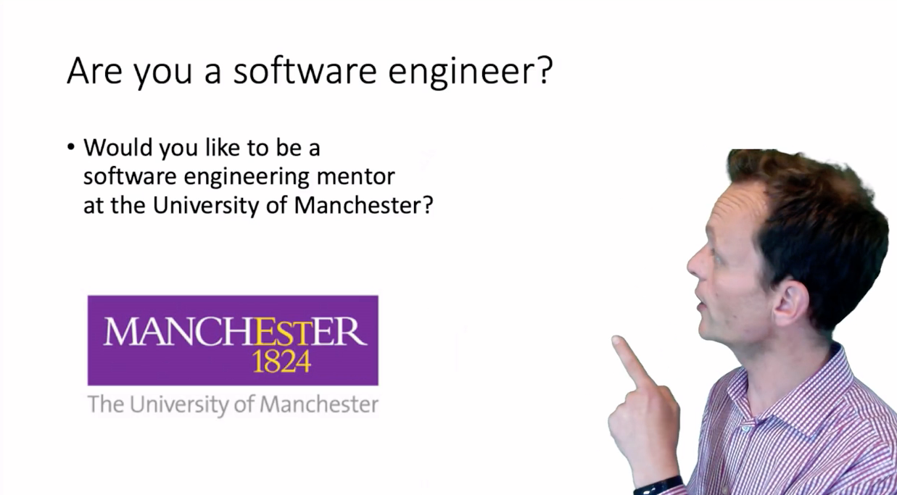

# Industrial mentoring {#mentoring}

For mentors, welcome and thanks for your interest in our software engineering mentoring program. This chapter is aimed primarily at **mentors not students** so if you're a student on this course you can go straight to chapter \@ref(ourmentor) to find out more about how mentoring works.

```{r mentoring-fig, echo = FALSE, fig.align = "center", out.width = "100%", fig.cap = "(ref:captionmentoring)"}

```

(ref:captionmentoring) An outline of software engineering mentoring at the University of Manchester. Watch the full 13 minute introduction at [youtu.be/H3rnYhd5hx8](https://youtu.be/H3rnYhd5hx8)

A short video explaining the scheme is shown in figure \@ref(fig:mentoring-fig) which describes:

* about the course and our students, see sections \@ref(aboutus) and \@ref(thecourse)
* who is currently involved, see section \@ref(thanks)
* what we ask of volunteer mentors, see \@ref(mentoringscheme)
* what you get in return, see \@ref(payback)
* how to sign up, see \@ref(registration)

## When are the mentoring sessions? {#when}

There are two one hour sessions timetabled, where you will meet with the same team. Please only register if you can make BOTH of the sessions in the alloted time:

1. **Thursday 21st October 2021 at 11am**
1. **Thursday 18th November 2021 at 11am**

These are the only times when we can guarantee that everyone in a given software engineering team will be available.

## I'm interested, how can I register? {#registration}

Register your interest via the zoom link below:

* [zoom.us/meeting/register/tJUrdO-rqDgiGtcKDTP_Zj_d_oWTPznHYl8t](https://zoom.us/meeting/register/tJUrdO-rqDgiGtcKDTP_Zj_d_oWTPznHYl8t)

We are looking for around 60 mentors in 2021, if we are oversubscribed we will giving higher priority to

* previous mentors, those employers who have already supported the scheme (see section \@ref(thanks))
* female mentors, because women are under-represented in our software engineering mentoring team
* alumni, especially former students who have done this course since 2016

## About the Department of Computer Science {#aboutus}
The Department of Computer Science at the University of Manchester [www.cs.manchester.ac.uk](https://www.cs.manchester.ac.uk) is one of the oldest and biggest in the UK. The [worlds first stored-program computer](http://www.computinghistory.org.uk/det/6013/The-Manchester-Baby-the-world-s-first-stored-program-computer-ran-its-first-program) (the [Manchester Baby](https://en.wikipedia.org/wiki/Manchester_Baby)) was developed here in 1948, by the engineers and scientists who would go on to found the Department. This was followed by the first floating point machine, the first transistor computer and the first computer to use virtual memory. This history of innovation continues today with cutting-edge research projects like SpiNNaker (part of the Billion Euro [Human Brain Project](https://www.humanbrainproject.eu/)) which has built a [million core ARM-powered neural High Performance Computer (HPC)](https://apt.cs.manchester.ac.uk/projects/SpiNNaker/project/).

In the most recent government ranking of all research across the UK, the School was ranked 4th in the UK (based on GPA), and was assessed as having the best environment in the UK for computer science and informatics research. Since awarding the first undergraduate degrees in Computer Science in 1965, the school has awarded 10,000 degrees in Computer Science at Bachelors, Masters and Doctoral level. Our students are sought after by employees, and are active (and successful) in taking part in major coding competitions and hackathons.

As of 2022, our [entry tariff is A* A* A*](https://www.manchester.ac.uk/study/undergraduate/courses/2022/00560/bsc-computer-science/) with an A * in Maths, and a minimum of one Science subject at A*. As this is a second year course, students already have some experience of programming in Python and Java from their first year undergraduate study, see section \@ref(prereq).

You can find out more about mentoring and other business engagement activities at [www.cs.manchester.ac.uk/connect/business-engagement/industrial-mentoring/](https://www.cs.manchester.ac.uk/connect/business-engagement/industrial-mentoring/)

## About the course {#thecourse}
If you volunteer, the course unit you will support is our second year compulsory course on [Software Engineering 1 (COMP23311)](https://studentnet.cs.manchester.ac.uk/ugt/COMP23311/syllabus/). This is a year-long course unit that is taken by students on all of our undergraduate programmes followed by [Software Engineering 2 (COMP23412)](https://studentnet.cs.manchester.ac.uk/ugt/COMP23412/syllabus/). The course focusses on the skills and expertise needed to be able to work with a large body of open source code. Students will gain experience of

* fixing bugs in code written by other people
* writing and automating tests using test first development
* adding new features to code without breaking the existing functionality
* making larger scale architectural changes to improve non-functional properties of the system

 ...all while keeping the system up and running for its users.

For the 2021/22 academic year, we have a cohort of more than 400 students taking Software Engineering. They have already worked on individual assignments in the first semester, but in this semester, they will be working in teams of around 8. They will undertake 2 team-based coursework assignments across the semester, as well as keeping an individual reflective journal focussed on developing their personal software process, and a final examination in the summer.

As well as learning about the academic discipline of software engineering, students take this course unit to gain key employability skills, to prepare them for interviews for industrial placements and graduate positions, and to allow them to hit the ground running when they do start work.

## About the Mentoring Scheme {#mentoringscheme}
As a mentor, you are asked to meet with your team of students twice, to work with a team of students for around an hour each time using Microsoft Teams. The visits take place in specific weeks, during time when the teams are scheduled to be working on their Software Engineering coursework. The dates/times for the visits are described in the eventbrite invitation you have received. Both sessions are one hour long.

## Meeting agenda {#agenda}
We suggest the following questions may be useful for

### Getting to know your team {#teambuilding}

Questions to get to know your team:

* What degree programme are you studying?
* What ideas do you have about your career?
* What interests you about computers/building software?
* Are you thinking of doing an industrial year, or a summer placement?
* What is the largest piece of software you have built/worked with so far?

### Challenging and guiding the team {#challenging}

Questions to challenge and guide your team:

* What are you working on at the moment?
* How are you coordinating work within your team?
* What sorts of challenges are you facing at the moment?
* What team working issues have you faced so far?
* How did you divide the work between the team members?
* How do you think your team is performing? How do you know?
* Are you on target to meet your next deadline? If yes, how do you know that?

### Questions the Students Might Ask Mentors {#studentqs}

*Questions about the mentor*:

* Can you give a brief overview of your career up to this point?
* How did you get into the job you are doing today?
* What do you enjoy about your current role?
* Was there anything that surprised you about working in industry compared to being a student?

*Questions about employability*:

* What skills do I need to be competitive in job applications?
* What skills do you look for when you are hiring people?
* What do you know now you wish you’d known as a student?
* What are the current trends in software development?
* What up-and-coming topics do you recommend we should know about?
* What can I do to make my CV stand out when applying for placements/jobs?

*Questions about team-work*:

* How do you resolve technical disagreements in development teams?
* How do you deal with personality clashes within your team?
* How do you encourage people to recommit to the team?
* One of our team members isn’t contributing. Would this happen in industry? How would you resolve these problems?

*Questions about the process of developing software*:

* What processes/methodologies do you use in your company?
* What software tools do you use and why?
* What process do you use to release software in your company?
* What code review practices do you use?
* What makes a good commit message?
* How big is the software system you are working on now?
* What techniques do you use when working with code written by other people?
* How can we avoid getting into a mess when using Git (or other version control systems)?
* We’re having a lot of trouble fixing this bug/making this change? Do you struggle with this too? How would you go about dealing with this sort of problem?

## What do you get in return? {#payback}
There are several benefits for mentors:

1. Increasing visibility of your employer as an organisation that makes good quality software
1. Share your knowledge and expertise: employers often complain that students could be taught better, this is your chance to improve the quality of teaching and prepare students for the workplace by making them aware of the realities of modern software engineering
1. Career development: its good for junior software engineers to demonstrate leadership and mentoring skills
1. Digital badge: we're offering signed digital badges as micro-credentials to thank our volunteer mentors
1. Fun: Many of our mentors enjoy the experience of working with young people as they take on a big software engineering project, often for the first time

## Who are the mentors? {#thanks}
We would like to thanks all of the employers who have helped us to date including:

(ref:mentors)

Thanks also to over 1,500 students who have taken the course since its inception in 2016 and given us feedback on how to improve it.
