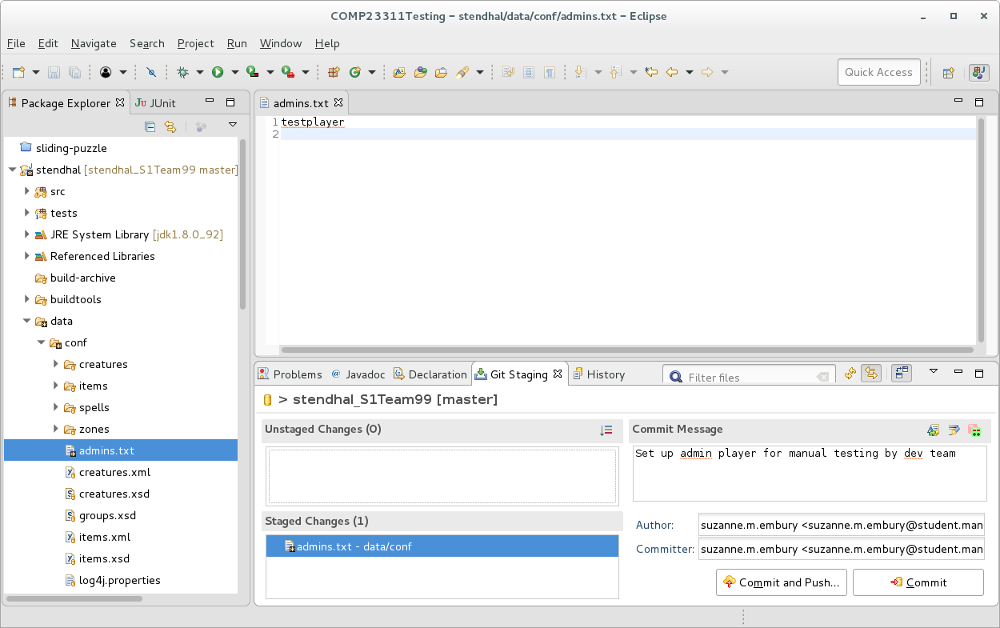
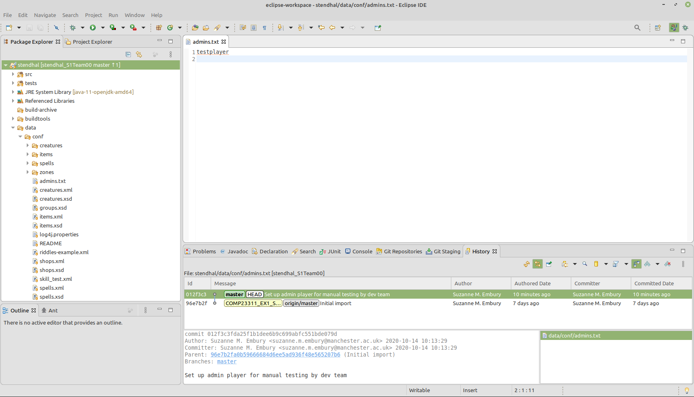

# Synchronising {#syncing}

When you're working in a team, you need to synchronise with your team repository.

## Introduction {#syncintro}

In this activity, we'll take you through the process of synchronising your local Git repositories when your fellow team members have pushed new commits to your remote.  This is a team activity, which you should work through together in the team study session.
<!--You don't all need to be in the same location to carry it out, but you do need to be in communication so you can coordinate the various stages.  Obviously, that will be easier if you are all close by.-->

In the activity:

* One team member will make a commit to their local repository.
* That team member will push the commit to the team repository.
* Everyone else will fetch the commit down into their own local repository.
* Everyone else will synchronise their local branches with the remote tracking branches.

This document will guide you through the steps needed to achieve all of these goals, explaining some of the core Git concepts as we go.

::: {.rmdnote}

These instructions assume that no one has yet pushed any commits to your team repository.  If that's not the case for your team, you'll need to carry out steps 3 and 4 before getting started on these instructions.  Check the `Commits` page for your GitLab project to find out if any commits have been made since your repository was created.

:::

## Making a Local Commit {#locommit}

Choose one team member who will make and push the commit.  That person will share their screen with their team members, who will observe and make notes of the process, giving feedback and suggestions where needed.

We're going to make a change to the following file:

````md
/data/conf/admins.txt
````

This file is empty at present, but it has an important function for us as developers of the code base.  If the username of a Stendhal player is added to this file, that player becomes an administrator for the game, with access to lots of capabilities that ordinary players don't have.  These capabilities will be very important for replicating issues and testing the changes you need to make to the game, without having to actually play the game for long periods.

The capabilities available to admin level players are described on the Stendhal wiki at [stendhalgame.org/wiki/Stendhal:Administration](https://stendhalgame.org/wiki/Stendhal:Administration)

You should familiarise yourself with the main ones, so you can use them in testing your code changes in game.

The first step when making any change to a code base under version control is to decide where the commit should be made.  The commit we are going to make is a small self-contained change that is needed by everyone in the team.  So, we are going to make the commit directly onto the main development branch.  Obviously, if the change had been more complicated or affected more files, we would want to first make the change on a feature branch.  But the simple Git workflow the Stendhal team use allows for commits to the development branch, and the commit is small and simple.  Most importantly, the change is not to the program code of the system; we can't introduce compile errors with this change and it seems unlikely that it would cause any existing tests to fail.  It is therefore probably safe to make directly onto the development branch, provided we check the effects of the change carefully before committing and pushing.

We begin by checking out the correct branch: the `master` branch.  If you have done this correctly, you should see the name of this branch next to your project name in the `Package Explorer` view.

<!--%screen{packageExplorerViewShowingMasterBranchCheckedOut}-->

Our commit will set up the admin level players that your team wants, by editing the `admins.txt` file.  In the `Git Staging View`^[Use menu option `Window` > `Open View` > `Other` > `Git` > `Git Staging View` to open this view.], enter a description of the commit we are about to make as the commit message:

````md
Set up admin player for manual testing by dev team
````
Now we'll prepare the code change that will become the commit.

Every team member will need access to an admin level player on their own test server, but you will all need to use the same `admins.txt` file that is checked into your team repository.  So you need to decide your strategy for this now.  You can do one of the following:

* Add one user name to the `admins.txt` file (such as 'testplayer').  Everyone must create a player with this username in their local server for their own testing.  Or,
* Everyone tells the person making the commit their preferred admin user name, and all those names are added to the `admins.txt` file now.  The file should be formatting with one name on each line, and no punctuation surrounding them.  Everyone creates a player with one of these names in their local game server for their own testing.

When you have created an `admins.txt` file that fits your team's requirements, save it.

The next step is to run the test suite, and the build process, to check that the change has not broken something unexpected.  If all tests pass (or, at least, no new failing tests have appeared) you can go ahead and make the commit.

The `admins.txt` file should now appear as an "unstaged change" in your `Git Staging View`. Drag it into the "staged changes" box (taking care to leave any other files you may have changed in the "unstaged changes" --- they are not related to this commit, and we don't want them to be included in it).  Make the commit (but *do not push* at this stage).

```{r fileStagedForCommit-fig, echo = FALSE, fig.align = "center", out.width = "100%", fig.cap = "Your main eclipse window should look something like this"}

```


::: {.rmdnote}

**WARNING**
Don't forget to check that the code compiles and the tests all pass before committing the code changes.  We haven't made any changes to Java source code in this commit, but we have made changes to configuration information that could potentially cause some part of the build process or some tests to fail.  So, it is still important to run through the build and test check before making the commit.

Remember that if you commit broken code to your team repository, all your team members will fetch the errors into their local repository, and their own build and test process will be affected for that branch too.  If this is the development branch, that can cause a lot of extra work for your whole team, and if done at the last minute before a release may even break the code that the customer sees (or, in our case, affect your team mark).  So, it is a good idea to get into the habit of checking the build and test results regularly, and *always* before making a commit.
:::

## Step 2: Pushing the Commit to the Team Repository {#pushing}

The next step is to check that the commit looks okay when viewed in the context of your project history.  Right click on the Stendhal project name in the `Package Explorer` view and select `Team` > `Show in History`.  You should see something like figure \@ref(fig:localCommitGraphBeforePushNoHistory-fig)

```{r localCommitGraphBeforePushNoHistory-fig, echo = FALSE, fig.align = "center", out.width = "100%", fig.cap = "Your setup should look something like this"}

```

Click on the commit you just created and check that the right files and changes have been included.  We should see a small commit on the `master` branch that changes only the `admins.txt` file.

Let's compare the state of this repository with that of the team's remote repository on GitLab at this stage.  In your web browser, view your team's GitLab project.  Use the `Repository` > `Graph` option from the menu on the left hand side to see the commit graph. It should look something like figure \@ref(fig:commitGraphInGitLabBeforePushNoHistory-fig)

```{r commitGraphInGitLabBeforePushNoHistory-fig, echo = FALSE, fig.align = "center", out.width = "100%", fig.cap = "(ref:captiongitlab)"}
knitr::include_graphics("images/commitGraphInGitLabBeforePushNoHistory.png")
```

(ref:captiongitlab) Your gitlab repository ([gitlab.cs.man.ac.uk](https://gitlab.cs.man.ac.uk)) should look something like this.


You can see that the team's project is now lagging behind the state of the local repository where the commit was made.  It doesn't yet have the new commit.  This is reflected in the `History` view in Eclipse, where the position of the `master` branch in the remote repository `origin/master` is shown as being at the parent commit of the one we have just made.

::: {.rmdnote}  
**Remote Tracking Branches**

The `origin/master` branch is a special kind of branch called a "remote tracking branch".  It is not a normal branch that we would use for development.  Instead, its role is to remember the positions of branches in the remote repository.  We have two `master` branches in play here: the `master` branch in the developer's local repository and the `master` branch in the remote repository.  Some of the time these branches will point to the same commit, but a lot of the time they will be pointing to different commits.  So we can't use one branch to represent them both; we need one branch for the local repository position and another to track the position of the branch in the remote repository.  Hence the name: remote tracking branch.

Remote tracking branches are easily identified in commit graphs because they have the name of the remote repository prepended to them.  In this case, our remote uses the default name `origin`, so the remote tracking branch for the `master` branch in our team repository is `origin/master`.

Eclipse colours these branches grey in the `History` view, to indicate that they are present for information but are not for us to actively work on.  If you check out a remote-tracking branch, you'll see that it is treated as a *Detached Head* checkout: you won't be able to move the position of the branch forward by making commits on it.
:::

When you are happy that the commit contents and location in the commit graph are correct, you can go ahead and push your code to the team remote repository.  Right click on your project name and select `Team` > `Push Branch 'master'...` from the menu.  Use the `Preview` to check that Git is going to do what you expect (push the one commit we just made), and then make the `Push`.  Eclipse will confirm the results of the operation, then you can `Close` the window.

If no commits have been made to your team repository since it was created, then this push should succeed.

It is a good habit to check that your changes have reached the team repository, and look as you expect.  Refresh the commit graph page of your team project in GitLab.  It should now look the same as the graph in the `History` view, shown in figure  \@ref(fig:commitGraphInGitLabAfterPushNoHistory-fig)

```{r commitGraphInGitLabAfterPushNoHistory-fig, echo = FALSE, fig.align = "center", out.width = "100%", fig.cap = "Your commit graph should look something like this"}
knitr::include_graphics("images/commitGraphInGitLabAfterPushNoHistory.png")
```

You can also check the `History` view in Eclipse, where you should see that the remote-tracking branch for `master` has now moved forward to match the position of your local `master` branch.  The tag that marks the starting point of the coursework (shown in yellow in the Eclipse History view) is unaffected by any of the changes we have made and remains at its original location.


## Step 3: Fetching the New Commit from the Team Repository {#fetching}

<!--% Redo screen shots with contents of admins.txt file showing.-->

The remaining steps are to be carried out by all other team members.  The person who made the commit that changed the `admins.txt` file should just observe from this point.  Perhaps one team member who is carrying out the steps could share their screen for this part of the activity.

At this stage, the commit exists in the team repository and in the local repository of the person who made the commit, but it is does not yet exist in the local repositories of the other team members.  We need to synchronise these local repositories with the team repository, so you can see and build on the work of other team members.

Synchronising your repository with a remote repository requires two basic steps:

1. First, we bring any commits and branches that have appeared or changed in the remote since we last synchronised with our local repository.
1. Then we integrate the work you have on your local repository with the work of your colleagues that you've just fetched down into your repository.

We'll carry out the first of these steps now.

Bring up the `History` view of your project in your IDE, and open the commit graph view of your project in GitLab.  (The GitLab commit graph should look the same as in the screenshot at the end of the instructions for Step 2.)  If you compare the two commit graphs, you should see that there is an additional commit in GitLab that you don't have in your repository --- the commit that adds the admin players.  You will see that your `master` branch is "behind" the position of the `master` branch on the remote repository shown in figure \@ref(fig:teamMatesLocalCommitGraphBeforeFetchNoHistory-fig).

```{r teamMatesLocalCommitGraphBeforeFetchNoHistory-fig, echo = FALSE, fig.align = "center", out.width = "100%", fig.cap = "Your commit graph should look something like this"}
knitr::include_graphics("images/teamMatesLocalCommitGraphBeforeFetchNoHistory.png")
```

In the `Package Explorer` view, find and open the `data/conf/admins.txt` file.  It should be empty.  The changes made by your team mate are not yet visible to you.

Now we're going to "fetch" any new commits and branch/tags down from the remote repository.  Start by checking out your `master` branch.  Then, right click on the Stendhal project name in the `Package Explorer` view, and select `Team` > `Fetch from origin`.  You should see a dialogue box summarising the commits that have been brought into your repository and confirming that the fetch operation succeeded like the one shown in figure \@ref(fig:fetchSucceededNoHistory-fig)


```{r fetchSucceededNoHistory-fig, echo = FALSE, fig.align = "center", out.width = "100%", fig.cap = "The fetch results dialog box"}
knitr::include_graphics("images/fetchSucceededNoHistory.png")
```

Your `History` view should also have updated to show the results of the fetch operation.  It should now look something like figure \@ref(fig:teamMatesLocalCommitGraphAfterFetchNoHistory-fig).

```{r teamMatesLocalCommitGraphAfterFetchNoHistory-fig, echo = FALSE, fig.align = "center", out.width = "100%", fig.cap = "An updated History view showing the results of the fetch operation"}
knitr::include_graphics("images/teamMatesLocalCommitGraphAfterFetchNoHistory.png")
```

If you don't see this same commit graph, make sure you have selected the option to "Show all branches and tags"^[It is the button to the right of the green "compare mode" button in the toolbar for the `History` view.  Its tool tip text begins "Change which commits to show.".].  If you don't select this option, you'll only see the history that is visible from your currently checked out branch (in this case, your `master` branch) and not any commits that happened after that.

Notice that the new commit is now present in your local commit graph.  But, your `master` branch has not moved to include it.  Instead, the remote tracking branch called `origin/master` has moved to point to the new commit, whereas previously it was at the same commit as your `master` branch.  The fetch operation gave Git the chance to update the position of the remote tracking branch, to match its current position in the remote repository.

::: {.rmdnote}
Note that the remote tracking branch only tracks the position of the branch in the remote repository at the time we last asked about the state of the remote: that is, at the time of the last fetch or push operation.  Remote tracking branches are not magic --- they don't always follow the position of the branch in the remote whenever any changes are made to it.  But whenever we synchronise our repository state with the remote, the remote tracking branch will be updated.

You should never try to check out and make changes to the position of a remote tracking branch.  When we make commits on a local branch, the position of the branch moves forward to point to the new commits without us having to ask.  But the position of a remote tracking branch should only move when changes have been made in the remote repository.  Similarly, you should not try to reset the position of a remote tracking branch, or to merge commits from other branches into it.  Leave Git to keep its position updated, and concentrate on controlling the position of your local branches.  They are the ones that record the state of work you are doing.
:::


## Step 4: Incorporating the Commit into Your Local Branch {#inc}

Now we need to integrate the changes we have just brought from the remote into our own local branches, so that we can build on top of the work of our team mates with our own code changes.

In this case, this means we need to get our local `master` branch to point to the same commit as the remote tracking branch, so that we can see the new commit and make our own changes on a code base that includes the change it makes (the specification of the new admin player).

Because we haven't yet added any commits ourself to the `master` branch, this process is easy^[It is a little trickier if you have made your own commits onto `master`.  In this case, you're advised to use rebase rather than merge.  See chapter \@ref(committing) "Integrating Your Commits with your Team's Commits"  for an explanation of how to do that.].  We can just use a merge operation.  Git merge is used to bring changes from one branch into another.  It always changes the branch that we have checked out.  We have the `master` branch checked out^[Checked out branches are shown in bold on the `History` view, and also have the symbolic branch `HEAD` next to it.  `HEAD` is not a real branch --- it is just some syntactic sugar that Git supports to give a really quick way to refer to the currently checked out branch.] so that's the branch that will change its position as a result of the merge.

Next we need to work out which branch contains the code changes (commits) that we want to include in the checked out branch.  In this case, we want to bring the changes from the `origin/master` branch into the local `master` branch.  So, we right click on the commit labelled with `origin/master` and select the `Merge` operation.

::: {.rmdnote}
If this sounds like a contradiction with our earlier instructions regarding merges and remote tracking branches, then it is worth noting that Git merge operations involve two branches, but *only one of the branches is changed by the merge*.  Here, we have the local `master` branch checked out, so this is the branch that will change.  The other branch involved in the merge is left unchanged by it.

So, suggesting that we merge a remote tracking branch *into* a local branch is completely consistent with our earlier advice not to try to change the position of remote tracking branches.  Only merges that change the position of a remote tracking branch are problematic.
:::

In this case, the merge operation is a simple one: Git just has to move the `master` branch forward along the chain of commits until it reaches the same place as the `origin/master`.  This kind of merge is called a "fast forward merge", because it is very quick for Git to do (it just changes the commit the `master` branch points to, rather than doing any actual mucking about with creating new versions of the code base) and because it involves moving the branch forward along the chain of commits.

Your `History` view should now look something like figure \@ref(fig:teamMatesLocalCommitGraphAfterFFMergeNoHistory-fig).

```{r teamMatesLocalCommitGraphAfterFFMergeNoHistory-fig, echo = FALSE, fig.align = "center", out.width = "100%", fig.cap = "Your commit graph should look something like this"}
knitr::include_graphics("images/teamMatesLocalCommitGraphAfterFFMergeNoHistory.png")
```

Notice how the two versions of the `master` branch are now at the same commit, which is also the checked out commit.  If you look again at the contents of the `data/conf/admins.txt` file, you should see that the changes made by your team mate are now included.  When you start work from this commit, you'll be building on top of the changes made by your colleague.

::: {.rmdnote}
At this point, before beginning to make changes yourself, you should check that the code can be built and that the tests all run.  If you find a problem, track down the author of the commit that introduced the error and work with them to correct it.  You'll need to run this whole process again, so that the fix can get copied into everyone's local repository.
:::

## A Final Word {#finalword}

This illustrates the basic workflow we will use in the project, except that you will be making most of your changes on feature branches rather than on the `master` branch.  The basic steps are the same.  Only the branch names change.

You will find the whole process of collaborative coding using Git goes more smoothly if you get into the habit of synchronising your code base with the team remote on a regular basis.  That means carrying out steps 3 and 4 described in this document.  You should synchronise your code base whenever you start work on the code for the day, whenever you are about to create a new feature branch, whenever you are about to push work to the remote and (most importantly) whenever you are about to integrate work on a feature branch into the development branch.

Of course, in this activity, we covered only a very simple synchronisation scenario.  As your team begins to push more code to your remote, you'll quickly encounter scenarios where the simple approach described in this document doesn't work.  These more involved scenarios (and how to handle them) are described chapter \@ref(committing) on "Integrating Your Commits with your Team's Commits".

Good luck!

Document version: `r format(Sys.time(), '%d %B, %Y')`
