# Welcome {.unnumbered #welcome}

Welcome to (ref:coursecode): [software engineering at the University of Manchester](https://studentnet.cs.manchester.ac.uk/ugt/COMP23311/syllabus/).

## Making better software {#better}

The development of software systems is a challenging process. Customers expect reliable and easy to use software to be developed within a set budget and to a tight deadline. As we come to depend upon software in so many aspects of our lives, its increasing size and complexity, together with more demanding users, means the consequences of failure are increasingly severe. The stakes for today’s software engineers are high!

```{r course-overview-fig, echo = FALSE, fig.align = "center", out.width = "100%", fig.cap = "(ref:openingcaption)"}
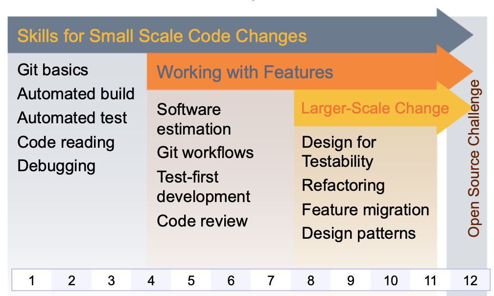
```

(ref:openingcaption) Course unit roadmap. This twelve week course will take you from small scale code changes (shown in grey), through to working with features (shown in orange) and on to larger-scale change (shown in yellow). We finish with an open source challenge in chapter \@ref(opening). The skills you will develop on this course are fundamental to modern software engineering.

Experience over the last few decades has taught us that software development failures are rarely caused by small scale coding problems. Instead, failures result from the difficulties of writing software that customers actually need, of keeping up with constantly changing requirements, of coping with the scale of large developments, of getting many different people with very different skill sets to work together, and of working with large bodies of existing code that no one on your team may fully understand. Being a good coder is an important part of being a good software engineer, but there are many other skills - including soft skills - that are needed too.

In this course unit, you will get the chance to expand and broaden the programming skills you gained in your first year course units by applying them in a more realistic context than is possible in a small scale lab, see figure \@ref(fig:course-overview-fig). Instead of coding from scratch, you will be working in a team to make changes to a large open source software system, consisting of thousands of classes and tens of thousands of files - and all without breaking the existing functionality.

You will fix bugs in the codebase and add new features, as well as performing larger scale refactorings to maintain or improve on non-functionality properties of the system. You will perform all this using an industry strength tool set. We will complement the hands-on experience-based learning with an understanding of the core concepts underlying current notions of software engineering best practice. Volunteer mentors from industry (see chapter \@ref(ourmentor)) will help you to put your learning into context, and to understand the key importance of being not just a good coder, but a good software engineer.

This course unit detail provides the framework for delivery in 20/21 and may be subject to change due to any additional Covid-19 impact. Please see Blackboard / course unit related emails for any further updates.

## Aims {#bilo}

This unit aims to help students appreciate the reality of team-based software development in an industrial environment, with customer needs, budget constraints and delivery schedules to be met. Through hands-on experience with an industry-strength development toolkit applied to a large open source software system, students will gain an appreciation of the challenges of green and brownfield software development, along with an understanding of the core software engineering concepts that underpin current best practice. Students will have the core skill set needed by a practicing software engineer, and will be ready to become productive and valuable members of any modern software team.

### Learning outcomes

On successful completion of this unit, a student will be able to:

* make use of industry standard tools for version management, issue tracking, automated build, unit testing, code quality management, code review and continuous integration.
* write unit tests to reveal a bug or describe a new feature to be added to a system, using a test-first coding approach.
* explain the value of code reviews, and to write constructive and helpful reviews of code written by others.
* make use of basic Git workflows to coordinate parallel development on a code base and to maintain the quality of code scheduled for release.
* explain the role of software patterns (design and architectural) in creating large code bases that will be maintainable over the long term.
* explain why code that is easy to test is easy to maintain, and make use of test code smells in identifying and correcting design flaws (design for testability)
* apply basic software refactorings to maintain or improve code quality
* explain the challenges inherent in cost estimation for software development, and create defensible estimates with the help of work breakdown structures

<!--codebase, documentbase, languagebase, wordbase-->

## Recommended reading {#recread}

The following books are recommended course texts, they are all available from the University of Manchester library if you clickthrough to the references:

1. [Pro Git](https://git-scm.com/book/en/v2) [@progit]
1. The pragmatic programmer : from journeyman to master [@pragmatic]
1. Effective unit testing : a guide for Java developers [@unittesting]
1. Clean code : a handbook of agile software craftsmanship [@cleancode]
1. The clean coder : a code of conduct for professional programmers [@cleancoder]
1. Beginning software engineering [@beginning]

These and any other references cited are listed in chapter \@ref(reading).

### Requirements {#prereq}

The compulsory pre-requisites for this course are the first year programming units:

1. [COMP16321: Programming 1](https://studentnet.cs.manchester.ac.uk/ugt/COMP16321/syllabus/)
1. [COMP16412: Programming 2](https://studentnet.cs.manchester.ac.uk/ugt/COMP16412/syllabus/)


### Overview of course {#courseo}

The following is an outline of the topics covered in COMP23111.

* Team software development
* Software project planning and issue tracking
* Greenfield vs brownfield software development
* Git best practices and common Git workflows
* Automated build tools and release management
* Automated unit, integration and acceptance testing
* Test code quality and test coverage tools
* Continuous integration and testing tools
* Best practices and tool support for code review, including source code quality tools
* Design patterns and common architectural patterns
* Design for testability
* Refactoring for code quality
* Safely migrating software functionality
* Basic risk management techniques
* Working with open source software systems

## Using the lab manual {#usingit}
We expect that the web-based version of this manual will be the one you'll use most at [software-eng.netlify.app](https://software-eng.netlify.app/). You can search, browse and link to anything in the manual. It was last updated on `r format(Sys.time(), '%d %B, %Y')`.

However, if you'd prefer, the manual is also available as a single pdf file [softeng.pdf](https://software-eng.netlify.app/softeng.pdf) and an epub as well [softeng.epub](https://software-eng.netlify.app/softeng.epub). Having said that, the content is optimised for viewing in a web browser, so while the pdf and epub are OK, the web version is the best.

## Contributing to this manual {#contributing}
If you'd like to contribute this laboratory manual, we welcome constructive feedback. Once you're familiar with git and markdown you can [github.com/join](https://github.com/join) and:

* Raise new issues at [github.com/dullhunk/softeng/issues/new](https://github.com/dullhunk/softeng/issues/new)
* Click on the `Edit this page` link, which appears on the bottom right hand side of every page published at [software-eng.netlify.app](https://software-eng.netlify.app) when viewed with a reasonably large screen (not a phone)
* Contribute at [github.com/dullhunk/softeng/contribute](https://github.com/dullhunk/softeng/contribute) and help with existing issues at [github.com/dullhunk/softeng/issues](https://github.com/dullhunk/softeng/issues)
* Fork the repository, make changes and submit a pull request [github.com/dullhunk/softeng/pulls](https://github.com/dullhunk/softeng/pulls). If you need to brush-up on your pulling skills see [makeapullrequest.com](http://makeapullrequest.com/)
* From the command line, clone the repository and submit pull requests from your own setup:
````md
git clone https://github.com/dullhunk/softeng.git
````
Most of the guidebook is generated from [RMarkdown](https://en.wikipedia.org/wiki/Markdown), that's [all the `*.Rmd` files](https://github.com/dullhunk/softeng/search?l=RMarkdown). So markdown files are the only ones you should need to edit because everything else is generated from them including the `*.html`, `*.tex`, `*.pdf` and `*.epub` files.

## Acknowledgements {#teambury}
This course has been designed, built and written by [Suzanne Embury](http://www.cs.man.ac.uk/~embury/) at the University of Manchester with support from a team of academics, industry club members, support staff, graduate teaching assistants (GTAs) and summer students including (in alphabetical order):

Muideen Ajagbe, Mohammed Alhamadi, Aitor Apaolaza, Gerard Capes,  Martina Catizone, Sarah Clinch, Peter Crowther,  Sukru Eraslan, Gareth Henshall, Duncan Hull, Caroline Jay, Nikolaos Konstantinou, Kamilla Kopec-Harding, Kaspar Matas, Chris Page, Dario Panada, Steve Pettifer, Liam Pringle, Julio Cesar Cortes Rios, Sara Padilla Romero, Viktor Schlegel, Stefan Strat, Jake Saunders, Federico Tavella, Mokanarangan Thayaparan, David Toluhi, Karl Tye and Markel Vigo.

Academic staff on the course for 2021/22 include:

* [Mercedes Argüello Casteleiro](https://scholar.google.com/citations?user=ci1ifBoAAAAJ&hl=en)
* [Thomas Carroll](https://personalpages.manchester.ac.uk/staff/thomas.carroll/)
* [Suzanne Embury](http://www.cs.man.ac.uk/~embury/)
* [Duncan Hull](http://www.cs.man.ac.uk/~hulld/)
* [Sandra Sampaio](https://www.research.manchester.ac.uk/portal/s.sampaio.html)
* [Anas Elhag](https://scholar.google.co.uk/citations?user=eY8KtX4AAAAJ&hl=en)

We'd also like to thank all the 1,500+ students who have done the course since its first iteration in 2016 and given us feedback on how to improve.

<!--2016, two cohorts of 250 = 500 plus 250 cohorts in 2017, 2018, 2019 and 2020-->

Thanks also to our [industrial mentors](https://www.cs.manchester.ac.uk/connect/business-engagement/industrial-mentoring/), the Institute of Coding (IoC) [instituteofcoding.org](https://instituteofcoding.org/) and the [Office for Students](https://www.officeforstudents.org.uk/) (OFS) for their ongoing support.

## Licensing {#license}
The *text* of this lab manual is published under the [Creative Commons Attribution-NonCommercial-NoDerivs 3.0 License](https://creativecommons.org/licenses/by-nc-nd/3.0/) (CC-BY-NC-ND) license see figure \@ref(fig:cc-by-nc-nd-fig)

```{r cc-by-nc-nd-fig, echo = FALSE, fig.align = "center", out.width = "100%", fig.cap = "(ref:captionccbyncnd)"}
knitr::include_graphics("images/by-nc-nd.png")
```
(ref:captionccbyncnd) The *text* of this guidebook is published under a [Creative Commons Attribution-NonCommercial-NoDerivs 3.0 License](https://creativecommons.org/licenses/by-nc-nd/3.0/) (CC-BY-NC-ND) license which means you can copy and redistribute the material provided that you provide full attribution, do not use the material for commercial purposes and you do not make any derivative works.

This license means you can copy and redistribute the written material provided that:

* You provide full attribution by linking directly to the original source
* You do not use the material for commercial purposes
* You do not make any derivative works

See the [full license](https://creativecommons.org/licenses/by-nc-nd/3.0/) (CC-BY-NC-ND) for details.

### Your privacy {#privacy}
This site is hosted on [netlify.com](https://www.netlify.com/), see the [netlify privacy policy](https://www.netlify.com/privacy/). This site also uses [Google Analytics](https://en.wikipedia.org/wiki/Google_Analytics) to understand our audience better which is compliant with the General Data Protection Regulation (GDPR). If you want to, you can opt out using the [Google Analytics Opt-out Browser Add-on](https://tools.google.com/dlpage/gaoptout/).

Some of these services use cookies. These can be disabled in your browser, see [allaboutcookies.org/manage-cookies](https://www.allaboutcookies.org/manage-cookies/)

So now that we've dispensed with the formalities, you can start using this laboratory manual.


<!--boilerplate text and constants that gets re-used throughout-->
(ref:ideversion) `2020-03`  

(ref:commit-were-using) `f30e098`  

(ref:repoURI) [https://gitlab.cs.man.ac.uk/COMP23311_2021/sliding_puzzle_&lt;your-username&gt;.git](https://gitlab.cs.man.ac.uk/COMP23311_2021/sliding_puzzle-your-username.git)

(ref:repo2URI) [https://gitlab.cs.man.ac.uk/COMP23311_2021/sliding_puzzle2_&lt;your-username&gt;.git](https://gitlab.cs.man.ac.uk/COMP23311_2021/sliding_puzzle2-your-username.git)

(ref:coursecode) COMP23311  


<!-- todo update hanbook urls e.g. UGHandbook21:Academic_Malpractice to UGHandbook22:Academic_Malpractice etc-->
<!--
23311-TeamCwk1-S-Fixing Bugs		120	40
23311-TeamCwk2-S-Adding Features		120	40
23311-IndCwk1-S-Basic Git		10	10
23311-IndCwk2-S-Conflicts in Git		10	10
-->

(ref:infobox) ℹ️ **Note** ℹ️   

(ref:cautionbox) ⚠️ **Caution** ⚠️  

(ref:commentbox) **`#Comment`**  

(ref:anotherref) here  

<!-- Configuration for the exercise -->
(ref:totalmark) 10  

(ref:percentage) 10  

(ref:deadline) 6.00pm, Friday 1st October 2021  

(ref:deadline2) 6.00pm, Friday 15th October 2021  

(ref:feedbackdateindicwk2) 6.00pm, Tuesday 12th October 2021

(ref:numsteps) 9  


(ref:piazzaforum) [piazza.com/class/ku382xdryxd644](https://piazza.com/class/ku382xdryxd644)

(ref:livehelpqueue) [gitlab.cs.man.ac.uk/comp23311_2021/COMP23311-Live-Help-Queue](https://gitlab.cs.man.ac.uk/comp23311_2021/COMP23311-Live-Help-Queue/)


(ref:mentors) Airbus, AND Digital, Apadmi, ARM, Auto Trader UK, Barclays, the BBC, Bet365, Beyond Trust, Biorelate, Blaize, Bloomberg, Booking.com, Brightec, CERN, CDL Software, CodeThink, Code Computer Love, Cubic Motion (now Epic Games), DAI, DataCentred, Digital Bridge Ltd, Disney Streaming, EGN Digital, Facebook, Farm Digital, Giant Digital, Goldman Sachs, Google, IBM, Interact Software, Ivanti, Koder.ly, Matillion, Microsoft, Morgan Stanley, NCC Group, On The Beach, Peak.ai, Rental Cars, Sainsburys, Sage Group plc, Shout Platform Limited, Siemens (Mentor Graphics), SKY, Slalom, Spotify, SteamaCo, The Startup Factory, THG, ThoughtWorks, Tranzfar, UK Parliament, UL, Unipart Digital and Zuhlke.

`Document version:` `r format(Sys.time(), '%d %B, %Y')`

<!--chapter:end:index.Rmd-->

# Expectations {.unnumbered #expectations}

While you are studying on this software engineering course, you are part of a team and a wider community:

* Your immediate team members
* The community of all second year students

Your learning community is supported by a group of graduate teaching assistants (GTAs), mentors and academic staff.

## Expectation engineering {#agile}
It's important that you know what we expect of you and what you'll get in return. That's what this page describes.

```{r xkcd-compiling-fig, echo = FALSE, fig.align = "center", out.width = "75%", fig.cap = "(ref:captionxkcdcompiling)"}
knitr::include_graphics("images/compiling.png")
```

(ref:captionxkcdcompiling) There are legitimate reasons for slacking off, such as compiling (and building) your code. Falling out with your team members, not returning their messages or just being busy doing other things are not legitimate reasons for letting your team down. [Compiling (xkcd.com/303)](https://xkcd.com/303/) by [Randall Munroe](https://en.wikipedia.org/wiki/Randall_Munroe) is licensed under [CC BY-NC 2.5](https://creativecommons.org/licenses/by-nc/2.5/)


### Our expectations of you {#rtfm}
We need you to read ALL of the messages we send you via GitLab, Jenkins, Microsoft Teams, the Piazza forum, emails and in this guidebook. Before you ask for help, make sure you have Read The Friendly Manual(s). [RTFM](https://en.wikipedia.org/wiki/RTFM).

#### Getting help {#helpme}

Regardless of if you are attending live (in person) or remotely (online, login to Teams) the mechanism for getting help is the same:

For live sessions (timetabled), team study and workshops you need to use the issue tracker:

* (ref:livehelpqueue)


*Outside* of live sessions use the piazza discussion board:

* (ref:piazzaforum)

Please note:

* During Team study sessions: we can discuss and help with coursework
* During Workshops: we will support workshop content only, **NO COURSEWORK** questions

Use the issue tracker in gitlab, rather than email, to manage communication in your team about your repository. 

You can use whatever combination of OS and IDE you like but we can **only provide support** for students using Eclipse (ref:ideversion) and the [CSImage Virtual Machine](https://wiki.cs.manchester.ac.uk/index.php/CSImage_VM) (or a Linux machine in the Kilburn building). We do not have the resources to test and support the myriad combinations of OS and IDE. Sorry!

#### Workshops vs. Team study {#workshops}
There are two main sessions:

1. Team study sessions
1. Workshops

Team study sessions are for you to get together as a team to work alongside each other. You can also get help from GTAs and staff on coursework. **Every team member** should be attending **every team study session**, you may also need to arrange to meet outside of the scheduled sessions so that you can collaborate together.

Each workshop has a specific theme that we need you to focus on. This means **we won't discuss coursework with you during the workshops**, otherwise we risk not getting through workshop material.

#### Physical vs online sessions {#online}
For the live (physical) sessions you'll need to be in the appropriate lab in the Kilburn building. For online sessions (e.g. some marking and mentoring) it is especially important that you turn up on time by being at a computer with access to:

* A working pair of headphones
* A working microphone that you can mute if you're somewhere noisy
* A webcam (ideally) but see section \@ref(cameras)

Please note, this may mean the best place to work is *not* necessarily the Kilburn building. Go and find a quiet spot, use your laptop (if you have one) or use your phone (there are [good mobile clients for Teams](https://www.microsoft.com/en-gb/microsoft-teams/download-app)) or work from home. It will really help if *at least* one of your team is at a desktop computer.

We have deliberately scheduled online activities so they aren't immediately after physical activities (like a lecture) so that you have time to get setup BEFORE the meeting starts.

### What your team expects of you {#urteam}

For this course to run smoothly your team will expect that you:

* Turn up to all the bi-weekly team study sessions, **especially the marking sessions**
* Participate in the all workshops
* Contribute to your team by:
    + Respecting your team members, no bullying. Assume good faith by default. It's your responsibility to make your team work. Team work makes the dream work.
    + Getting along with your team members. You may not like all of them (that's life) but your team members are crucial to your teams success. While you can get away with being a “lone wolf” coder on other course units, (see figure \@ref(fig:wolf-fig)), you are now expected to behave like a sociable engineer as part of a professional team
    + Encouraging people who might be slacking off to make contributions, see figure \@ref(fig:xkcd-compiling-fig)
    + Communicating with your team if you have difficulty contributing
    + Reporting issues where necessary, either to a GTA or academic member of staff

```{r wolf-fig, echo = FALSE, fig.align = "center", out.width = "99%", fig.cap = "(ref:captionlonewolf)"}

```

(ref:captionlonewolf) Normally a social pack animal, wolves sometimes act alone. While being a [lone wolf](https://en.wikipedia.org/wiki/Lone_wolf_(trait)) on other course units may be a reasonable strategy for studying, it won't work well for this one. Don't be a lone wolf because sociable teams usually make better software than loners. CC-BY-SA Image of Winter wolf by ForestWander.com on Wikimedia Commons [w.wiki/45Vj](https://w.wiki/45Vj)

What do you get in return for our expectations and those of your team?

### What to expect of GTAs {#gtas}
This course is supported by a team of Graduate Teaching Assistants (GTAs), they are here to help you. They have lots of other people to help too, so please treat them with respect. If you're waiting for support from a GTA, make sure you've Read The Friendly Manual, see section \@ref(rtfm).

Our GTAs have Read Their Friendly Manual to (the GTA wiki) so they will know how to help you, or can quickly find out how to. They won't give you the answer, but will be able to help you find your own way.

::: {.rmdcaution}

(ref:cautionbox)
The GTAs have scheduled marking sessions that we expect them to stick to. The second year timetable is incredibly crowded, and the team study sessions are the **ONLY TIMES IN THE WEEK** when we can guarantee that everyone in your team is available.

:::

### What to expect from mentors {#gomentors}
You have been assigned a mentor who will meet with you online for two one hour meetings, see chapter \@ref(mentoring). These meetings are a bit like code review meetings, they have access to your private code repository and can see what your team is up to.

Our mentors are all professional software engineers, who can give you advice on how to manage the process of making better software. so please treat them with the respect they deserve. They have volunteered to help by sharing their engineering wisdom with you and taken time out of their busy schedules to do so.

### What you can expect from academic staff {#academics}
The academic staff on this course include Suzanne Embury, Anas Elhag, Duncan Hull, Thomas Carroll and Sandra Sampaio. We're here to help but please remember, there are 400+ students on this course so we can't reply to every single personal email immediately.

::: {.rmdcaution}

(ref:cautionbox)

Please **don't email staff or GTAs** directly unless you have good reason too (e.g. personal issues).

Instead, please post issues on the forum at (ref:piazzaforum) where *everyone* can see the response or in the help queue (ref:livehelpqueue) within the workshop / team study sessions.
:::

Like you, we're often very busy and have other teaching (and research) commitments besides this course. We're here to ensure that the course runs smoothly and we aim to give feedback on coursework to you within the two week window.

### How your work gets assessed {#assessment}
The course is:

* 30% Written exam (in January)
* 70% Practical skills assessment (coursework)

The coursework is broken down as follows

1. 10%: Individual coursework 1, see chapter \@ref(gitting)
1. 10%: Individual coursework 2, see chapter \@ref(conflicting)
1. 40%: Team coursework 1, see chapter \@ref(dealing)
1. 40%: Team coursework 2, see chapter \@ref(working)

##  Your camera {#cameras}
We would normally expect participants in small meetings (not large ones like lectures) to turn their cameras on but we understand that there are good reasons why people may not be willing/able to and won’t explicitly ask you to.

### Camera on? {#on}
There has always been a question around whether to turn cameras on during online meetings but it is even more obvious with online meetings becoming the norm rather than the exception.  There is a direct benefit in using cameras in small, personal meetings where many of us make use of visual cues to aid the flow of conversation – at the very least it’s easier to identify who is talking. Additionally, it can help people get along – people might feel more ‘listened to’ if they can see somebody listening and your team will find it easier to remember names etc if they have a face to match the names to.

### Camera off? #{#off}
There are lots of legitimate reasons why you might turn your camera off. Most obviously, if you don’t have access to a camera. But you may also be in an environment which you prefer others not to see, you may have anxiety around the issue, or your connection might be too slow. There are many other perfectly reasonable reasons for you not to put your camera on and you should not feel pressured to do this. If you simply say “Sorry, I can’t turn my camera on today” then nobody will ask any further and they should never explicitly ask you to turn it on.

### Being appropriate {#being}
You should already be treating online meetings like physical ones e.g. turning up on time, being prepared, listening, engaging etc. Similarly, if people can see you then you should ensure you are wearing appropriate clothes (wearing clothes is the absolute minimum here!) and in an appropriate place (the bathroom is probably not appropriate) as you would for a physical meeting.

### Respecting others {#respecting}
If other people have decided to turn their cameras on then we ask that you show them respect by not recording anything without their explicit permission. We won’t touch on the legality of this as we believe that basic respect for each other should be enough to prevent any issues. You will take part in larger meetings where recording may be standard and in such cases this should be made explicit.

(Thanks to Giles Reger and Sarah Clinch for the text above)


`Document version:` `r format(Sys.time(), '%d %B, %Y')`

<!--chapter:end:001-expectations.Rmd-->

# Weekly timetable {.unnumbered #timetabling}

The weekly schedule for autumn 2021 is shown in table \@ref(tab:schedtable), based on [timetables.manchester.ac.uk](https://timetables.manchester.ac.uk/), see also [manchester.ac.uk/discover/key-dates](https://www.manchester.ac.uk/discover/key-dates/) key dates.

* Other than the introductory lecture in week 1, there are no lectures. Instead we have workshops which are more like labs and may contain mini-lectures
* Workshops are on Tuesday or Friday afternoon depending on your lab group
    * [bit.ly/Tuesday-3pm-workshop](http://bit.ly/Tuesday-3pm-workshop)
    * [bit.ly/Tuesday-4pm-workshop](http://bit.ly/Tuesday-4pm-workshop)
    * [bit.ly/friday-1pm-workshop](http://bit.ly/friday-1pm-workshop)
* Team study sessions are on Tuesdays at 10am and Thursday at 11am.

For online activities, everything is on Microsoft Teams. Because of constraints on the number of private channels in Teams, the year is arbitrarily split into two spaces:

1. [bit.ly/software-engineering-A](https://bit.ly/software-engineering-A)
1. [bit.ly/software-engineering-b](https://bit.ly/software-engineering-b)

Microsoft Teams is, as the name suggests, where you'll meet your team.

## Where should I go if I'm on campus? {#campus}
Most teams will have a mixture of online and on campus students. If you're on campus go to the rooms below and contact any remote members of our team via Teams:

* **Teams 1-30**: 1.8 & 1.10
* **Teams 31-44**: LF31
* **Teams 44-56**: Tootill

The weekly schedule is shown in \@ref(tab:schedtable).

```{r schedtable, echo = FALSE}
io_table <- tibble::tribble(
    ~ "Week no."       , ~ "Subject",      ~ "Deadlines",
  "~~**1**: 27th Sept~~"            , "~~Automated build and test, see (ref:weekone)~~",  "~~IndCwk2, Fri 1st Oct, 6pm~~",
  "~~**2**: 4th Oct~~"              , "~~Reading large codebases, see (ref:weektwo)~~",  "",
  "~~**3**: 11th Oct~~"             , "~~Debugging, see (ref:weekthree)~~", "~~IndCwk2, Fri 15th Oct, 6pm~~",
  "~~**4**: 18th Oct~~"             , "~~Cost estimation, see (ref:weekfour)~~",  "~~Mentoring week 1~~",
  "~~**5**: 25th Oct~~"             , "~~Test first development, see (ref:weekfive)~~", "~~TeamCwk1, 29th Oct, 6pm~~",
  "~~**6**: 1st Nov~~"              , "~~Reading week see (ref:weeksix)~~", "",
  "~~**7**: 8th Nov~~"              , "~~Git workflows, see (ref:weekseven)~~",  "",
  "~~**8**: 15th Nov~~"             , "~~Software refactoring, see (ref:weekeight)~~", "~~Mentoring week 2~~",
  "~~**9**: 22nd Nov~~"            , "~~Design for testability, see (ref:weeknine)~~  ", "",
  "~~**10**: 29th Nov~~"            , "~~Design patterns, see (ref:weekten)~~", "~~TeamCwk2, Fri 3rd Dec, 6pm~~",
  "~~**11**: 6th Dec~~"             , "~~Risk management and practice exam, see (ref:weekeleven)~~", "",
  "~~**12**: 13th Dec~~"            , "~~Open source challenge, see (ref:weektwelve)~~", "",

)
knitr::kable(io_table, caption = "The weekly schedule for this twelve week course, please note we are using the week numbering from the [timetables.manchester.ac.uk](https://timetables.manchester.ac.uk/) where week zero is welcome week, and week one is the first teaching week", booktabs = TRUE)
```


## Automating {#week1}

Events in the week starting 27th September:

1. **Team Study Tuesday**: Work on individual coursework 1 described in chapter \@ref(gitting)
1. **One off lecture** to introduce the course unit at 9am on Wednesday 29th September, Simon Engineering building check [timetables.manchester.ac.uk](https://timetables.manchester.ac.uk/)
1. **Workshop**: Automated build and test with Duncan Hull
1. **Team Study Thursday** Work on individual coursework 1 described in chapter \@ref(gitting)
1. **Coursework deadlines**: Individual individual coursework 1 can be pre-marked (automatically) if you submit by **6pm Tuesday 28th September** and finally marked when submitted by **6pm on Friday 1st October**


## Reading {#week2}
Events in the week starting 4th October:

1. **Team Study Tuesday**: Individual coursework 2 starts, see chapter \@ref(conflicting). Meet your team on Teams
1. **Workshop**: Reading large code bases with Anas Elhag
1. **Team Study Thursday** Working on coursework

## Debugging {#week3}
Events in the week starting 11th October:

1. **Team Study Tuesday**: Working on team coursework
1. **Workshop**: Debugging codebases with Anas Elhag
1. **Team Study Thursday** Working on team coursework
1. **Coursework deadlines**: Individual individual coursework 2 can be pre-marked (automatically) if you submit by **6pm Tuesday 13th October** and finally marked when submitted by **6pm on Friday 15th October**


## Estimating {#week4}
Events in the week starting 18th October:

1. **Team Study Tuesday**: Working on team coursework
1. **Workshop**: Cost estimation with Duncan Hull
1. **Team Study Thursday** Meet your team mentor on Teams


## Testing {#week5}
Events in the week starting 25th October:

1. **Team Study Tuesday**: Working on team coursework
1. **Workshop**: Test first development with Anas Elhag
1. **Team Study Thursday** Working on team coursework
1. **Coursework deadlines**: TeamCwk1 due, 29th October at 6pm


## Pausing {#week6}
Events in the week starting 1st November (reading week). Take a break if you're ahead, or catchup if you've fallen behind.

1. There are no activities in reading week

## Workflowing {#week7}
Events in the week starting 8th November:

1. **Team Study Tuesday**: Marking interviews part 1 of 3, see \@ref(mint)
1. **Workshop**: Git workflows with Suzanne Embury
1. **Team Study Thursday** Marking interviews part 2 of 3, see \@ref(mint)


## Refactoring {#week8}
Events in the week starting 15th November:

1. **Team Study Tuesday**: Marking interviews part 3 of 3, see \@ref(mint)
1. **Workshop**: Refactoring with Anas Elhag
1. **Team Study Thursday** Second mentoring session


## Testing {#week9}
Events in the week starting 22nd November:

1. **Team Study Tuesday**: Working on team coursework
1. **Workshop**: Design for testability Anas Elhag
1. **Team Study Thursday** Working on team coursework


## Patterning {#week10}
Events in the week starting 29th November:

1. **Team Study Tuesday**: Working on team coursework
1. **Workshop**: Design patterns with Sandra Sampaio
1. **Team Study Thursday** Working on team coursework
1. **Coursework deadlines**: TeamCwk2 due, Friday 3rd December at 6pm


## Managing {#week11}
Events in the week starting 6th December:

1. **Team Study Tuesday**:  Marking sessions
1. **Workshop**: Risk management and practice exam with Sandra Sampaio
1. **Team Study Thursday**  Marking sessions


## Challenging {#week12}
Events in the week starting 13th December:

1. **Team Study Tuesday**: Marking sessions
1. **Workshop**: Open source challenge with Sandra Sampaio
1. **Team Study Thursday**
1. **Coursework deadlines**:

## Marking interview schedule {#mint}

The schedule for marking interviews for team coursework 2 is shown below:

| Interviewer | 7 Dec, 10.00am | 7 Dec, 10.30am | 9 Dec, 11.00am |9 Dec, 11.30am | 14 Dec, 10.00am |  14 Dec, 10.30am
|-----------------------|--------------------|--------------------|--------------------|--------------------------|--------------------------|--------------------------|
| Hugo Lefeuvre       | Team01           | Team11            | Team21            | Team31            | Team41  |    Team51 |
| Dominic Duxbury     | Team02           | Team12            | Team22            | Team32            | Team42  |    Team52 |
| Dario Panada        | Team03           | Team13            | Team23            | Team33            | Team43  |    Team53 |
| Muideen             | Team04           | Team14            | Team24            | Team34            | Team44  |    Team54 |
| Huw Jones           | Team05           | Team15            | Team25            | Team35            | Team45  |    Team55 |
| Jules Irenge        | Team06           | Team16            | Team26            | Team36            | Team46  |    Team56 |
| He Yu / David*      | Team07           | Team17            | Team27*           | Team37*           | Team47  |           |
| Ahmad Bilal         | Team08           | Team18            | Team28            | Team38            | Team48  |           |
| Zhongyan Chen       | Team09           | Team19            | Team29            | Team39            | Team49  |           |
| Thomas Carroll      | Team10           | Team20            | Team30            | Team40            | Team50  |           |


## Tools {#tooling}

We'll be using the following tools:

### Microsoft Teams {#msfteams}

* Team study sessions take place on Microsoft Teams, login using your `@student.manchester.ac.uk` email address at [teams.microsoft.com](https://teams.microsoft.com/) or [download a native teams client](https://www.microsoft.com/en-gb/microsoft-teams/download-app) everthing else is in the guidebook at [software-eng.netlify.app/](https://software-eng.netlify.app/)
* Teams is also the place to go for livestream if you're following the workshops online


### Blackboard {#blackboard}

* Other course materials (slides and videos) can be found on at [online.manchester.ac.uk](https://online.manchester.ac.uk/)

### GitLab {#gitlab}

* GitLab issue tracker [gitlab.cs.man.ac.uk](https://gitlab.cs.man.ac.uk/)


<!--hacky way to get chapter references in tables-->

(ref:weekone) see section \@ref(week1)  

(ref:weektwo) see section \@ref(week2)  

(ref:weekthree) see section \@ref(week3)  

(ref:weekfour) see section \@ref(week4)  

(ref:weekfive) see section \@ref(week5)  

(ref:weeksix) see section \@ref(week6)  

(ref:weekseven) see section \@ref(week7)  

(ref:weekeight) see section \@ref(week8)  

(ref:weeknine) see section \@ref(week9)  

(ref:weekten) see section \@ref(week10)  

(ref:weekeleven) see section \@ref(week11)  

(ref:weektwelve) see section \@ref(week12)  


`Document version:` `r format(Sys.time(), '%d %B, %Y')`

<!--chapter:end:002-timetabling.Rmd-->

# (PART) Weekly Workshops {-}

# Building and testing {#building}

## Introduction {#Introduction}

In this workshop, we will be building and testing a system called Marauroa. We will look at some essential processes for working on an existing team-developed software system. We'll be assuming that, after this workshop, you are capable of carrying out the following tasks for yourself, without needing much guidance:


* Acquire the right version of the source code on which to work.
* Create an executable version of the source code using an automated build tool.
* Test the system, prior to making changes.
* Use a test suite to find functional regression in the system.    
* Run a piece of software consisting of multiple distributed subsystems.

In this, and some later workshops, we'll be working with the code of the *Marauroa games engine* for constructing on-line multi-player games.

Marauroa is an open source *framework* and engine to develop games. It provides a simple way of creating games on a portable and robust server architecture. Marauroa manages the client server communication and provides an object orientated view of the world for game developers. It further handles database access in a transparent way to store player accounts, character progress and the state of the world.

You should already have begun to practice some of these skills, through the GitLab Access Check activity.
In this workshop, we will build on that activity to carry out these basic skills on a large open source software system.  During the workshop, you will:

1. Use an IDE to clone a local copy of the Marauroa repository.
1. Build executable versions of the client and server components, using the Ant build tool.
1. Run the test suite provided for Marauroa
1. Use a code coverage tool to assess the strength of the test suite.
1. See how the test suite can help us pinpoint errors in the code.

You may work at your own pace, but you should try to complete step 4 by the end of the workshop if you can.  You will need to finish the exercise in your own time if you don't manage it in the workshop, as you'll need to use these techniques for the team coursework. **If you are not up-to-speed with them, then you could slow your team down.**

## Acquiring Marauroa {#acquiring}

First, you'll need to acquiring a local copy of the Marauroa Project.

### Run the IDE {#runide}

The Department provides a range of Integrated Development Environments (IDEs) for use by students. You are welcome to use any of these IDEs to carry out the work for this workshop. However, we are only able to provide technical support for Eclipse, specifically (ref:ideversion). If you do want to use one of the other IDEs, we will do our best to help should you get stuck, but we can't guarantee to be able to fix all problems.  At the bare minimum, you should feel confident that you can do all the tasks listed in the introduction in your chosen IDE, before you finalise the decision.

The instructions that follow assume you are using (ref:ideversion) on the Department of Computer Science Linux image or on the Linux Mint VM provided by the Department.

You can start Eclipse from the Applications menu (under Programming) or from the command line, by issuing the command:

````md
/opt/eclipse-2020-03/eclipse &
````


### Select the Workspace {#selectw}

Eclipse calls a folder containing one or more Eclipse projects a `workspace`.  On start-up, Eclipse will ask you which workspace you want to use for the session.  You can either accept the default location or use the File Browser to locate or create a different one.  (Depending on when you do this workshop, you may already have created a workspace for the GitLab Access Check activity.  You can either choose to use the same workspace for this activity, or create a new one.

If you choose to create a new workspace, Eclipse will show the Welcome View when it loads.  Uncheck the box at the bottom right of the window (labelled `Always show Welcome on start up`) and close it down, as we do not need this view for this workshop.  (You can get it back whenever you want by selecting the `Welcome` option from the `Help` menu.)

### Organise Workspace  {#organisew}

You'll need to organise your main Eclipse workspace window and you should now see a window that looks something like figure \@ref(fig:firstview-fig).

```{r firstview-fig, echo = FALSE, fig.align = "center", out.width = "100%", fig.cap = "Your main eclipse window should look something like this"}
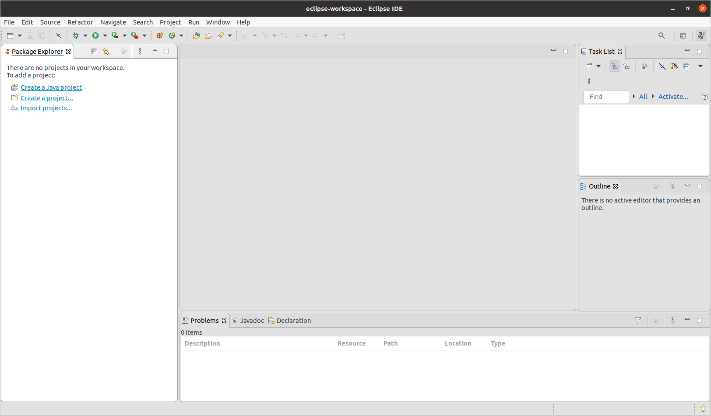
```

If you used the same workspace you created for the individual coursework exercises, you'll see the project for that in the Package Explorer view.  If you used a new workspace, it will be empty like the one shown above.

This is the standard layout for working on Java projects.  The central empty space is where we will use the various Eclipse editor tools and views to work on individual files.  It is empty at the moment, as we are not working on any specific file.  Around it are a number of other views.  We'll talk about the main ones and what they tell us later.

I find this screen rather cluttered, and would immediately delete all the views I don't need regularly, to free up space for the ones I do, and move the views I do use to more convenient locations. You might want to do the same.  You can experiment with moving the views around by clicking and dragging on their tabs.  Delete any views you don't think you'll need, but **make sure you keep the Package Explorer view, the Outline view and the Problems view open**, as we'll be making use of those very soon.

Note that you can always get any views you delete back again, using the `Window` > `Show View` menu option.


### Create a New Project by Cloning {#newproj}

Next, we're going to pull down (git clone) the public Marauroa source code into a local repository where we can work on it.  You've already had experience of working with Git from the command line.  In this course unit, we ask you to use your IDE for (at least) your basic interactions with Git and GitLab.  This will help you to understand the strengths and weaknesses of both approaches, if you are not already familiar with them.

The first step is to ask Eclipse to import the Marauroa project for us, from a public Git repository.

Select the `File` > `Import` menu option.  Then choose `Git` >  `ImportFromGit` shown in figure \@ref(fig:eclipseImportProjectFromGit-fig)

```{r eclipseImportProjectFromGit-fig, echo = FALSE, fig.align = "center", out.width = "100%", fig.cap = "Your main eclipse window should look something like this"}
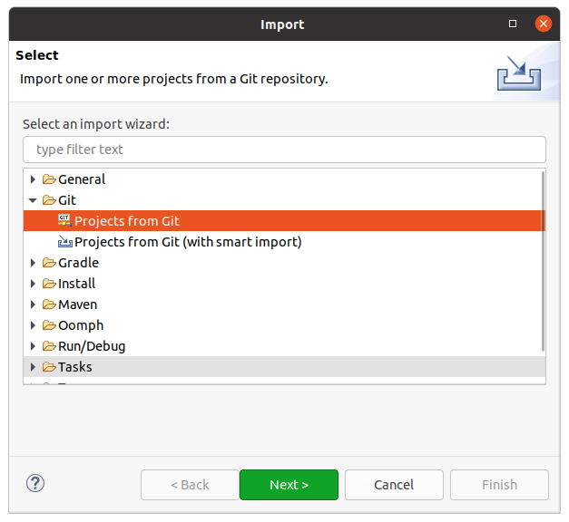
```
You can either double-click on `Projects from Git`, or single-click on it and press `Next`.

A dialogue box appears showing the two ways in which you can import a project from Git.  We're going to **clone a project from a URI**, so select that option shown in figure \@ref(fig:eclipseCloneFromURI-fig)

```{r eclipseCloneFromURI-fig, echo = FALSE, fig.align = "center", out.width = "100%", fig.cap = "Your main eclipse window should look something like this"}
knitr::include_graphics("images/1.4.eclipseCloneFromURI.png")
```

Next, we need to tell Eclipse which URI to clone from.  The team behind Marauroa have set up their own Git server, which we'll connect to anonymously.  Enter the following into the URI field:

````md
git://git.code.sf.net/p/arianne/marauroa
````

Eclipse **Should fill in the rest of the fields automatically**. If it doesn't, it's likely that something went wrong when copying the link from this PDF: try typing it instead. Check that your dialogue looks like figure \@ref(fig:enterMarauroaURI-fig) before proceeding.

```{r enterMarauroaURI-fig, echo = FALSE, fig.align = "center", out.width = "100%", fig.cap = "Your Import Projects from Git dialogue box should look like this"}
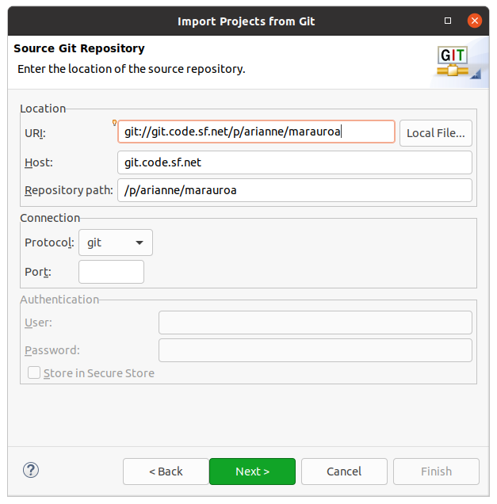
```

If everything looks okay then select `Next`.

::: {.rmdnote}
**Does your Clone Attempt Fail With An Error?**

If so, the Arianne project Git server may be temporarily down.  If you can't clone using the URI given above, you can try using this GitHub repository URI instead:
````md
https://github.com/arianne/marauroa.git
````
:::

Eclipse will now communicate with the remote Git repository specified in the URI. It will ask us which branches we want to work with locally, that is, which branches we want to create local remote tracking branches for.  Note that this is not the same as asking us which commits we want to include in our clone.  A standard Git clone will always include all the commits in the cloned repository, regardless of which branches we select here.  And it is not asking us which remote branches we want to have in the repository.  Again, a standard Git clone will include all the remote branches by default.  The question Eclipse is asking here applies only to the question of which tracking branches should be created in the clone.

We're not going to be making any serious changes to the Marauroa code base in this workshop, so we will just ask for a remote tracking branch to be created for the `master` branch of the repository, see figure \@ref(fig:selectMarauroaBranches-fig). If you need to remind yourself how branching works, you might like to visit (or revisit) [learngitbranching.js.org](https://learngitbranching.js.org/).

```{r selectMarauroaBranches-fig, echo = FALSE, fig.align = "center", out.width = "100%", fig.cap = "Take a look at the list of branches contained in the project, by scrolling up and down the list. You'll see that the Marauroa project uses separate branches to describe specific releases, as well as other development branches. Another common approach is to have a single release branch and to use tags to distinguish specific releases on that branch."}
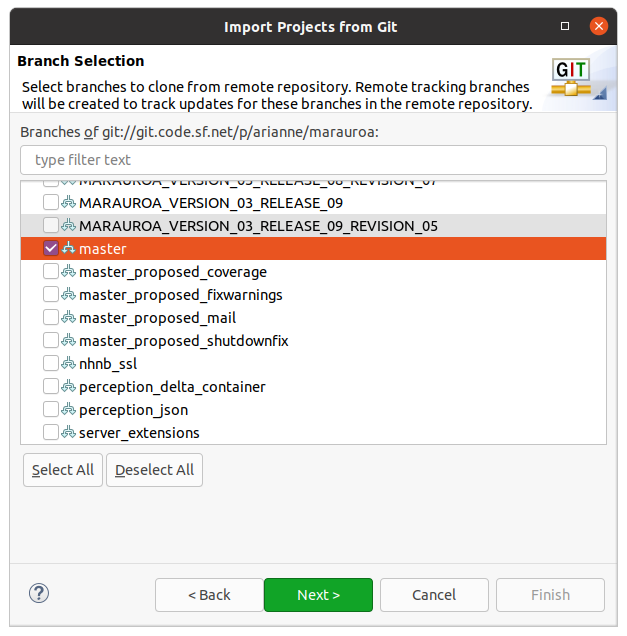
```


Make sure that the `master` branch is selected, and press `Next`.

::: {.rmdcaution}
(ref:cautionbox)
**Master or Main?**

Historically, the default name for initial branch in a git repository was `master`. The initial branch was called "master repository" with other copies serving as "slave repositories".

Note that as of 2021, the use of `master` has now been deprecated. We're using it in this course unit, but by default, new projects using git will call the initial branch `main` not `master` to avoid problemantic [master/slave terminology](https://en.wikipedia.org/wiki/Master/slave_(technology)).

See [about.gitlab.com/blog/2021/03/10/new-git-default-branch-name/](https://about.gitlab.com/blog/2021/03/10/new-git-default-branch-name/) for more details on the switch.
:::


As in the GitLab Access Check activity, we need to tell Eclipse where we want the cloned repository to be stored before it can issue the Git command to create it see figure \@ref(fig:configureLocalStorageMarauroa-fig)

```{r configureLocalStorageMarauroa-fig, echo = FALSE, fig.align = "center", out.width = "100%", fig.cap = "Cloning from git dialog box"}
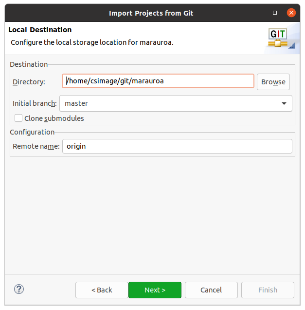
```
You can use the default location suggested, or you can use the Browse button to use the file selector to create a new directory in a different location.  Here, I've followed the standard convention of putting the repository inside my personal `git` folder.

When you have selected your preferred location, select `Next`.

Eclipse now issues the commands to clone the project.

The next step is to import the Marauroa project from your local Git repository into Eclipse, so you can start to work on it.

::: {.rmdnote}
**What is a project in this context?**

One of the confusing things about IDEs when we first start to use them is the notion of a `project`.  When we code from the command line, we tend to organise our work in directories.  Sometimes these directories relate to specific tasks we are carrying out (like coding up the solution to a lab exercise) and sometimes they relate to the structure of the code we are creating (like different directories for source code and object code, or for libraries or documentation).

We use directories for all these purposes when we code in an IDE as well, but in order to be able to support us well, the IDE needs to know the *root* directory of a piece of software that we are building.  That way, it can perform useful tasks for us, like automatically setting the `classpath` for us, and automatically compiling code and reporting on errors while we type.  This root directory is typically referred to as a *project*. IDEs use the concept of a project as a means of recording metadata about the project.  For example, Eclipse will remember that a specific project is a Java project, and will then know to apply the set of tools appropriate to Java projects, and not (for example) tools relating to Ruby or Python.
:::

As in the GitLab Access Check activity, we have to tell Eclipse which wizard to use to import the project for us. Since the Marauroa team uses Eclipse, we can use the wizard that looks for existing Eclipse projects in the repository, see figure \@ref(fig:wizardImport-fig) If we were loading a project built in another IDE, we would need to use one of the other wizards.

```{r wizardImport-fig, echo = FALSE, fig.align = "center", out.width = "100%", fig.cap = "Cloning from git dialog box"}
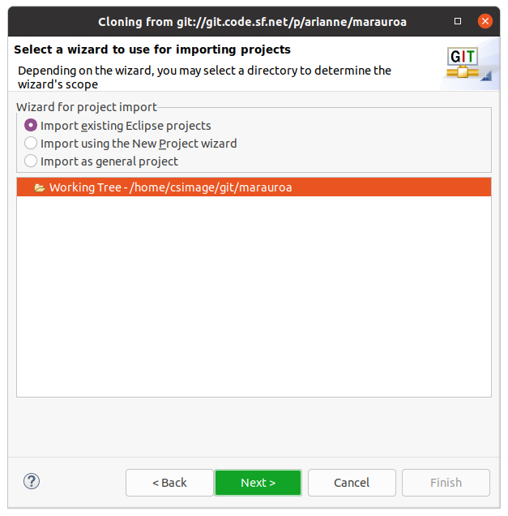
```

Click on `Next` when the correct wizard has been chosen.

Eclipse will now scan the local Git repository looking for anything that it recognises as an Eclipse project. It looks through all the folders, searching for the metadata files that Eclipse creates and stores in the root directory of a project.  In this case, it finds just one (called `newmarauroa`) see figure \@ref(fig:eclipseSelectProjectsToImport-fig)

```{r eclipseSelectProjectsToImport-fig, echo = FALSE, fig.align = "center", out.width = "100%", fig.cap = "Import projects from a git repository and the newmarauroa project"}
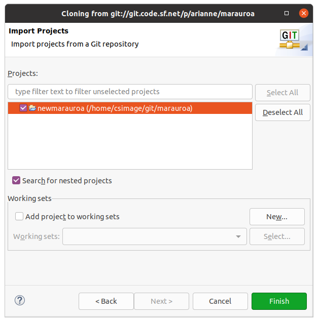
```


Since there is just one project in the repository, we have an easy decision here.  Click on the `newmarauroa` project to select it, and then click on `Finish` (finally!).

Eclipse can now import the project into your workspace.  When that is done, you'll be taken back to the main Eclipse work screen (strictly speaking, we're taken back to what Eclipse calls the 'Java Perspective').  You should see that a project has appeared in the Package Explorer view, and that the Problems view has now been populated with information see figure \@ref(fig:finallyImportedProject-fig)


```{r finallyImportedProject-fig, echo = FALSE, fig.align = "center", out.width = "100%", fig.cap = "Import projects from a git repository and the newmarauroa project"}
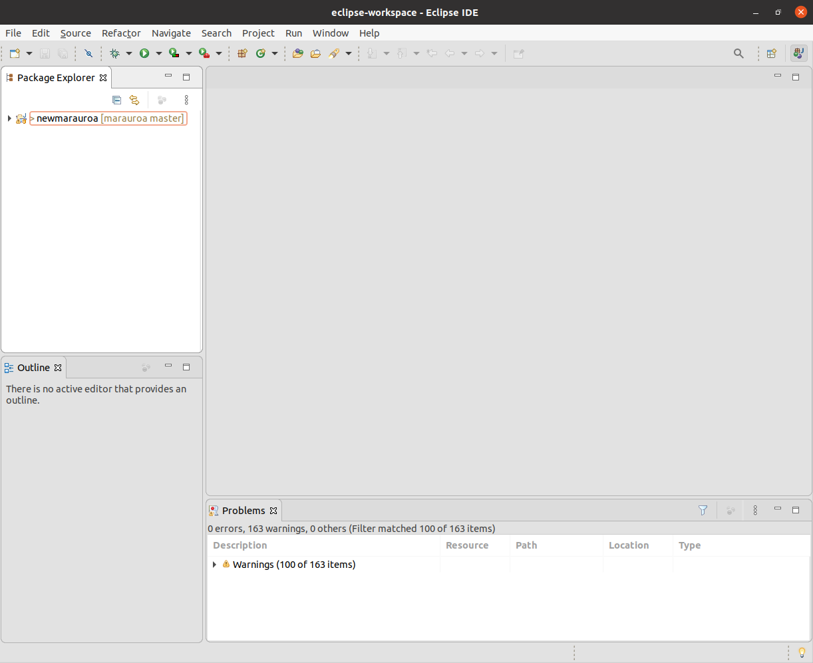
```


### Checkout a Specific Commit

Although we asked for the `master` branch to be checked out locally when we cloned the repository, we are actually going to be working with a different commit, one that is not pointed to by `master`.  This is partly to make sure everyone in the workshop uses the same commit for the exercise, even if `master` gets updated between the creation of these notes and the running of the workshops.  But it is also to give you confidence in working with non-head commits (that is, commits that are not pointed to by a branch or tag).

For this activity, we are going to work with the commit with the short SHA of (ref:commit-were-using).

The easiest way to check out a commit, branch or tag from within Eclipse is to use the History View.  To open it, right click on the `newmarauroa` project name in the Package Explorer view.  Select `Team` > `Show in History` from the menu that appears.  The History View shown in figure \@ref(fig:historyTab-fig), should now be visible in the bottom panel of your Eclipse window.  You may wish to double click on the view tab to expand it, so that the contents are more easily seen.

```{r historyTab-fig, echo = FALSE, fig.align = "center", out.width = "100%", fig.cap = "In this view, you should now see the most recent part of the network of the Marauroa project repository. You can scroll down to see the full commit log. As you can see, the history is significantly more complex than the simple repository we looked at in the GitLab Access Check. Marauroa has been under development since 2003, and its history reflects its age.  Note that your view of the repository may be a little different than that shown in the screen shot.  We are working with a live repository, and new commits are being made on a regular basis."}
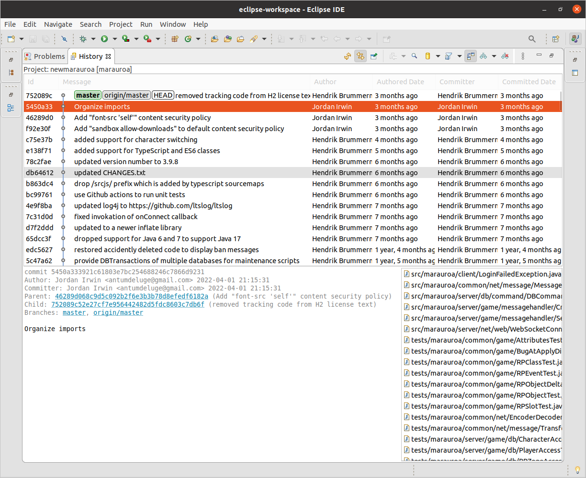
```

Look for the commit with SHA (ref:commit-were-using).  It should have the (not terribly helpful) commit message `code cleanup`.  Right click on it, and select `Checkout` from the menu that appears.

At this point, Eclipse will warn you that you are in a `detached HEAD` state shown in figure \@ref(fig:detachedHEAD-fig)

```{r detachedHEAD-fig, echo = FALSE, fig.align = "center", out.width = "100%", fig.cap = "(ref:captiondetach)"}

```

(ref:captiondetach)  A warning of the detached HEAD state which reads:  “You are in the `detached HEAD` state. This means you don't have a local branch checked out. You can look around but it's not recommended to commit changes. The reason is that these commits would not be on any branch and would not be visible after checking out another branch.”


This just means that we have checked out a commit that is not pointed to by any current branch or tag.  The `HEAD` in Git is the currently checked out commit.  Eclipse (and Git) are warning us about this because any changes we make and commit from this point will also not be pointed to by any branch or tag (unless we create one specifically).  In fact, they will be unreachable from any branch or tag, and so will be treated by Git as if they had been deleted. They will be scheduled for garbage collection, the next time that takes place. We're not going to commit any changes for this exercise, so we don't care whether the `HEAD` commit is detached or not. We can safely ignore this warning for now.

::: {.rmdnote}
**Checkout and Detached Heads**

If you're interested to learn more about checking out a detached head, you could read this article: [What's a "detached HEAD" in the Git FAQ](https://www.git-tower.com/learn/git/faq/detached-head-when-checkout-commit)
:::

Press `OK` and double-click on the History View tab, to shrink the view back to its original size and location, now that we have finished working with it.


### Explore your Project {#explore}

You now have your own copy of the Marauroa project source to play with and look around a little. Take a few minutes to look around and explore what is inside it before moving on to the next step.  Look at the way the contents of the project are organised into folders.  Can you guess at the contents of each folder from its name?

Explore around some of the folders.  Can you find some Java class files?  What clues did you use to track them down?

Notice the icon that Eclipse has placed next to the project name. Quite a lot of information is packed into this small symbol. The folder symbol indicates that this is a project.  The small J just above it indicates that this is a Java project.  The small orange drum under the J indicates that this project is under version control.  Eclipse also tells us the name of the Git repository the project is stored under, and which branch or commit of the project we current have checked out, in the text following the project name: `[marauroa f30e098]` (or similar).  Finally, the small yellow road sign with the exclamation mark in the middle tells us that when Eclipse used its internal builder on the Java code in the project, it encountered some compiler warnings.

You might be surprised to see that the Marauroa team have released code that produces compiler warnings.  Let's take a look at what the warnings are, using the Problems view.  You'll notice that this view has already been populated with some information about the project, without us having to ask for it to be generated.  IDEs will commonly provide services like this, performing key analyses of the project source and letting you know about problems without you having to explicitly request it.  After all, if we have introduced a compilation error, we want to know about it as soon as it happens, and not much later when we finally remember to ask Eclipse to compile the code.

Because the Marauroa team have configured this project as a Java project, Eclipse already knows how to find the Java source files, and it uses its internal Java build tool to compile them.  In fact, it will recompile every time we make even a small change to the code, as well as when we import new code. From the Problems view, we can see that this automatic compilation produced no compiler errors (good!) but 158 compiler warnings (eek!).

If you have time, you can take a few minutes to explore the compiler warnings generated, by clicking on the small triangle beside the warn `Warnings` in the Problem view.   Take a look and see if you think these are serious problems or whether the Marauroa creators were making a reasonable decision not to fix them.

**STEP 1 of 4 COMPLETED**

You've now completed the first step, and have a code base to explore.  But, that is only the beginning.  Please proceed to the next step, where we'll look at how to **use the automated build scripts** provided by the Marauroa team to build an executable version of the Marauroa engine.


## Building the Marauroa Engine

If we are going to make changes to an existing body of code, we have to be able to create an executable version of it.  There is no point in making changes to source code if we can't actually run the new version of the code.

In this step, you're going to be introduced to the Apache Ant automated build tool, which is the tool chosen by the Marauroa team for use on their project.  You'll learn how to use it to create executable code from the source we've just downloaded.

::: {.rmdnote}
**Note:** we will not cover a full tutorial on the use of the Ant tool in this workshop --- nor indeed in any workshop to follow in the semester.  One of the key skills we need when working with large existing software systems is *the ability to keep moving forward* even when we don't have much of a clue about what is going on.  We have to accept that we will never know everything there is to know about the tools used by the system, or the source code of the system, or any other aspect of the system.
:::

For our purposes today, you just need to know how to run an Ant script to create an executable project. We'll take a look at the build script, to get an idea of how it works, but there will be a lot that we ignore or skip over very briefly.  Becoming comfortable with this approach is one of the skills you need to develop over the course of this semester.  (Many of you will already possess this skill, of course!)


### Locate and Examine the Build Script

Open up the `newmarauroa` project in the Package Explorer (if you have not already done so), and scroll down until you see a file called `build.xml`. This is the default name for Ant build scripts.  Double click on it, to get Eclipse to load the file into an Editor view, so that we can see its contents shown in figure \@ref(fig:buildfile-fig)

```{r buildfile-fig, echo = FALSE, fig.align = "center", out.width = "100%", fig.cap = "An XML build file"}
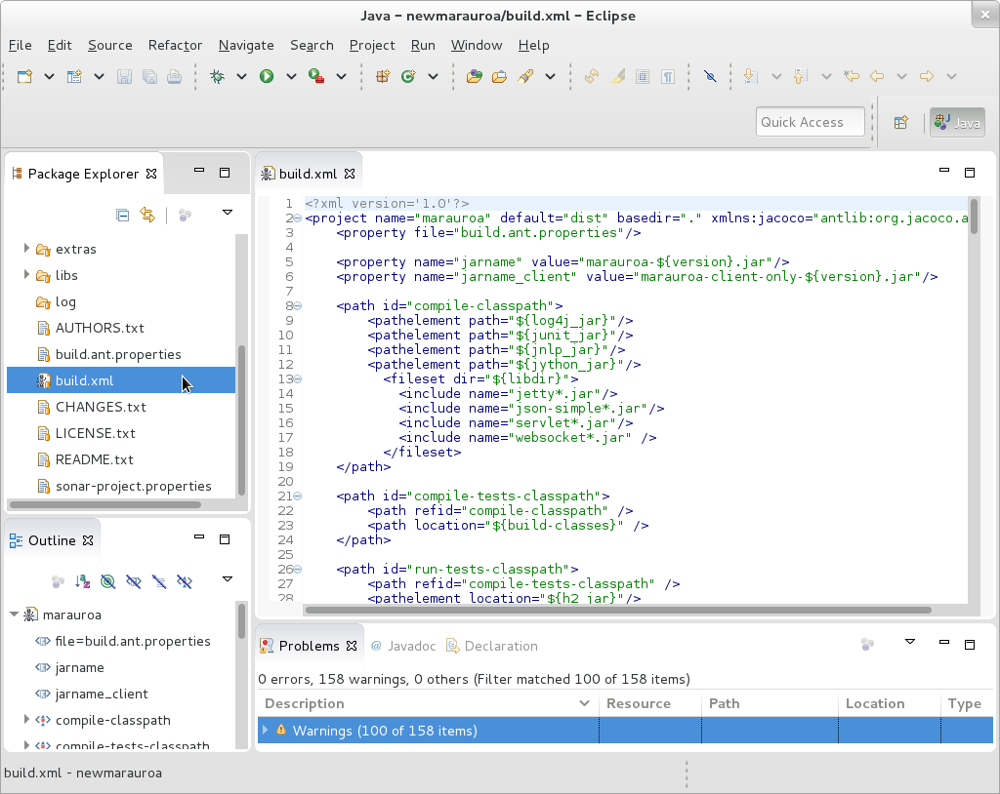
```

If the filename wasn't already enough of a clue, you'll see from this that Ant build scripts are XML files.  XML tags are used to define the things that the file knows how to build, and the steps involved in building them, as well as key configuration information, such as class paths (show in the screen shot above).

Notice that the Outline view has also now been populated.  This very useful view gives a high-level summary of the contents of a file, by listing its main components as a tree view.  In the case of a Java file, the Outline view shows the classes defined by the file, and their members (fields and methods).  In the case of XML files, like our build file, the Outline view shows the hierarchy of tags defined by the files.

We can use the Outline view to run Ant builds, by right clicking on the XML tags that represent descriptions of how to build things.  But an even more useful view is the **Ant View**.  This is a view that has been created with knowledge of how the Ant build tool works, and added in to Eclipse as a plugin.  Open it by selecting `Window` > `Show View` > `Ant` from the top level menus.

Now open `build.xml` from the view by clicking on the `Add Buildfiles` icon in the view toolbar.  It looks like an ant with a green plus on its left shown in figure \@ref(fig:antAddBuildfile-fig)

```{r antAddBuildfile-fig, echo = FALSE, fig.align = "center", out.width = "100%", fig.cap = "An XML build file"}
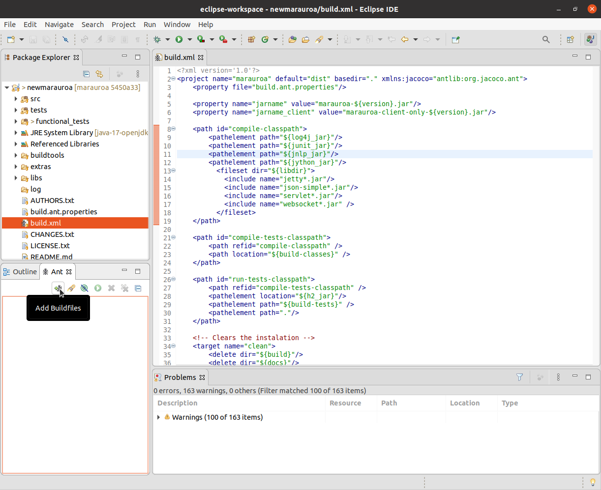
```

This will open a new dialogue that allows you to select a Buildfile. Select `build.xml` and click `OK` shown in figure \@ref(fig:selectBuildfile-fig)

```{r selectBuildfile-fig, echo = FALSE, fig.align = "center", out.width = "100%", fig.cap = "Buildfile Selection"}
knitr::include_graphics("images/2.1selectBuildfile.png")
```

Notice that the Ant view has been populated.  Instead of listing all the top-level XML tags, this view knows just to list the  **build targets**.  These are the things the Ant script knows how to build.  The user of the script can request which target she or he wishes to build.

Scan down the targets and see if you can guess from the name what each one builds. Hint: `dist` here stands for `distribution`.

Let's take a look at the definitions of some of the targets.  Right click on the name of any of the targets, and select `Open In` > `Ant Editor` from the context menu that appears.  You will see that the contents of the `build.xml` editor window are changed, so that the definition of the target we have clicked on is displayed.  For example, in figure \@ref(fig:jarallTarget-fig), we've clicked look at the `jar-all` target and take a look.

<!--Redo in Ant View-->
```{r jarallTarget-fig, echo = FALSE, fig.align = "center", out.width = "100%", fig.cap = "The jar-all target"}
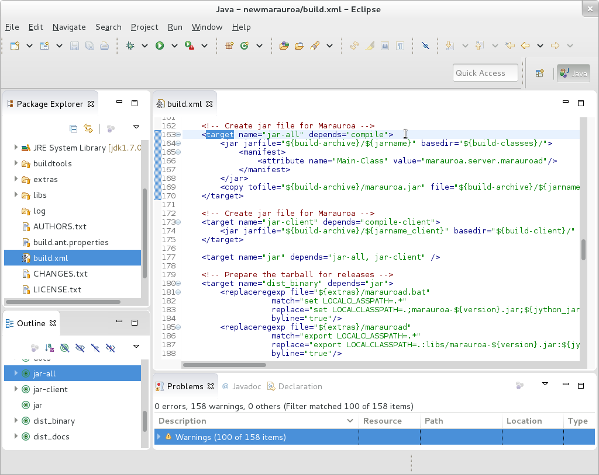
```

We can get a rough idea of what this definition is telling us.  First, note the `depends` attribute in the target tag.  This states that before we can build the jar file for the project, we must have built the `compile` target.  This makes sense as we need to have compiled Java code before we can create a Jar file.

These dependencies between targets are one of the key strengths of build tools such as Ant.  We can describe individual steps in the build process, and state the other steps that they depend on.  At build time, Ant will examine all the targets and their dependencies and find an order of execution that means that no target is built before the targets it depends on.

It's important to note, again, that you don't need to understand everything about the Ant build file to be able to make some educated guesses about what it is doing.  We don't need a detailed understanding just now.  We are just looking for easy-to-absorb clues as to what the various targets do.

::: {.rmdnote}

**A Note on Automated Build**

At this point, you might be wondering why we are bothering with this complicated build script when the Eclipse internal Java builder already seems to be doing a good job of compiling all the Java classes for us, without us needing to do anything at all.

The answer is that there is typically more to turning source code for a non-trivial system into deployable software than just compiling the Java code.  The Eclipse internal builder creates class files for all the Java files.  But when was the last time you downloaded an app or application and what you got was a folder full of class files?  

Quite what *deployment* means differs from application to application. Simple Java applications may simply be wrapped up into a jar file, but even then we often need to supply a shell script for setting the class path and executing the main method of the entry point class.  If we are building a Web application then deployment typically means packaging up the components of the application in a `*.war` file (web archive file) and copying it into a particular directory (the one used by the container manager our web server provides).  Or, we might need to prepare a zip archive of files, or to package up the files ready for use by an install tool.

As these examples show, the steps needed to deploy a system are often very simple, but they are also quite fiddly and fussy.  One wrong key stroke and we end up with something unusable.  Explicitly documenting the deployment steps in an automated build script make the deployment process quick, easy and reliable for anyone on the development team to carry out, even the newest team member.  That is very important, as it means that tests can be run on the deployable form of the system (even if it is not, at that point, deployed in the live environment).  As we have seen, the closer our test environment can be to the live environment, the more chance there is that we'll find errors before they reach the customer rather than afterwards.
:::


### Build the System Using the Build Script {#buildscript}

Now that we have seen something of the build script, we are going to use it to build the whole Marauroa distribution.  That is, **we are going to ask Ant to build the "dist" target**.

Right click on the target we want to build and select *RunAs* from the menu.  You'll see that the IDE recognises the file we have clicked on as an Ant Build target and offers the option of running it as an Ant build.

::: {.rmdnote}

**Note**: you can build a target from both the Outline view and the Ant view in the same way

:::

Select the first of the two Ant Build options. The second takes you to a wizard, but we don't need that at this stage.

A Console tab will appear (figure \@ref(fig:consoleOut-fig)) in the bottom section of the Eclipse window, showing the output that Ant is sending to the standard output and standard error streams while it works. Double click on the tab of the Console view, and take a look at what Ant is doing.


```{r consoleOut-fig, echo = FALSE, fig.align = "center", out.width = "100%", fig.cap = "Console output"}
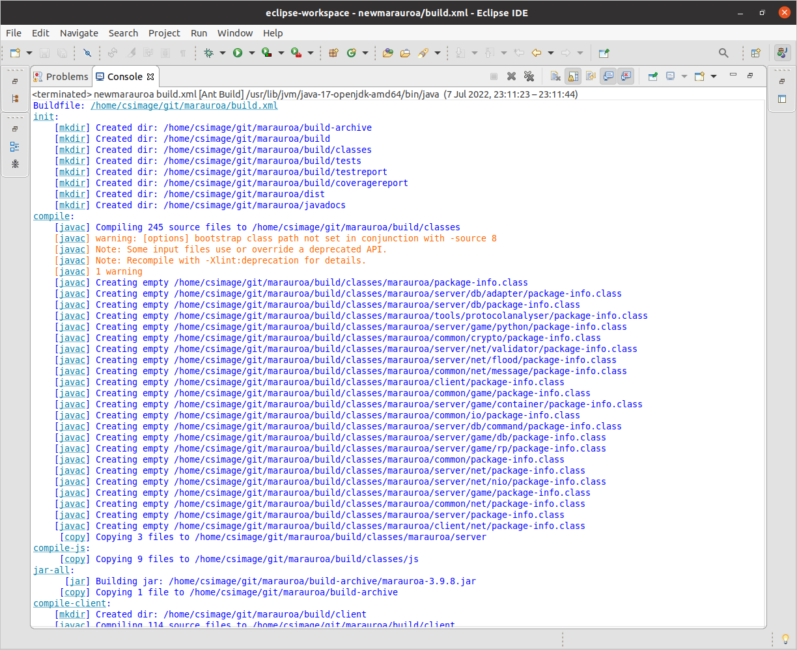
```

The console output shows the various targets that Ant creates, as it works through the dependencies specified in the build script.  The targets are shown at the left of the window, followed by a colon (init and compile, in the above screenshot).

Beneath the target, the names of the tasks invoked are shown, in square brackets.

The most important part of the output, of course, is shown at the end, when the process finishes:

```{r endconsoleOut-fig, echo = FALSE, fig.align = "center", out.width = "100%", fig.cap = "Console output"}
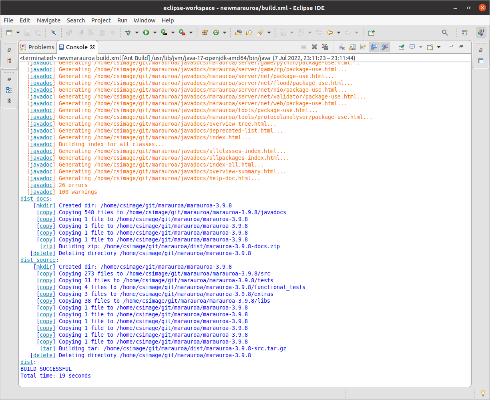
```

We can see here that the build was successful.  We have built the executable version of the code, just by right clicking on a target!  Building Marauroa would be a lot more work if we had to carry out all these steps ourselves, manually, every time the code changes, and the chances of getting a step wrong would have been much higher.  This shows one of the strengths of automated build tools.  The Marauroa team have encapsulated their expertise in building their games engine into this build script file.  It now becomes possible for anyone, with or without expertise in Ant, or Marauroa, to build the system in the same way.

In other words, the build tool has made the build process *repeatable*.  A source of potential error in working with the code (and in deploying to the user) has been removed.

Take a moment to look through the full console output from the build command we have just run.  Look for the actions the build script is taking that are vital to creating a deployable product, but which are not about compiling individual class files.


### Examining the Results of the Build {#examining}

We'll finish this step by taking a brief look at what the build process has achieved.

Right click on the `newmarauroa` project name and select Refresh from the drop-down menu.  Eclipse know about any file changes you make using Eclipse tools (such as the Java editor or the internal Java builder) and can update the view of the project you see through its GUI automatically for you.  But Ant is not part of Eclipse.  It is a separate tool that Eclipse is running for us.  When an Ant script creates new files and folders, or moves things about, Eclipse doesn't know anything about it, and so the view of the project it shows to us can get out of date.  The Refresh menu option tells Eclipse to go and look at the directory structure and files in the project directory, and to update the GUI to show the effects of any changes.

When you refresh, several new folders should appear: build, build-archive, dist and javadocs.

Take a few moments to look at the contents of these folders, and see if you can form any hypotheses as to their role in the deployment process.  If we were going to share the Marauroa engine we have just built with a friend, what would we need to do?

**STEP 2 of 4 COMPLETED**

You have now completed the build step of the process.  Now we need to find out whether the engine we have built does what we expect it to.  Next, we will learn how to run the automated test suite that the Marauroa team have created.


## Testing the Marauroa Engine

Having created an executable version of the system, the next step is to check whether it is working correctly. In this part of the activity, we'll take you through the process of running the automated test suites created by the Marauroa team. You saw one way to run JUnit tests in Eclipse in the GitLab Access Check activity.  But there we just had one test class with just a few test methods to worry about.  The Marauroa test suite is much larger than this, and we need a different approach.

We'll take a first look at how these suites are organised and implemented in this step, though this is a topic we'll be coming back to in future workshops, too.


### Finding Out What Tests There Are to Run

Before we run the tests, it is helpful first to take a high level look at the test suites provided by the developers of the system we are working with.  One way to do this is to look at the source folders in the project.  The source code for any large project, nowadays, is typically split into two halves: the production code (the part that the user will use and the customer will pay for) and the test code (the part that the development team use to work out whether they are delivering the right thing).  It's important not to get these two parts of the code mixed up, and therefore it is common practice to split test code off into its own folders (and sometimes its own packages).

Another source of useful information about the test suites is the Ant build script.  Although called a ``build`` script, we have seen that these scripts do a lot more than just compiling code.  Their task is not just to create an executable version of the system, but to create a verified executable that is ready for the user to take away and use.  Therefore, these scripts more normally follow a three step process:

1. build
1. test
1. deploy

The Marauroa build script is unusual in that the target that produces the distribution doesn't also run the tests.  But it (the build script) does contain instructions for running the test suites.

Take a look at the targets in the build script.  We can see that there is one called `test`.  That sounds promising.  Let's take a look at figure \@ref(fig:showTestTargetInBuildScript-fig)

```{r showTestTargetInBuildScript-fig, echo = FALSE, fig.align = "center", out.width = "100%", fig.cap = "(ref:captionshowtestcaption)"}
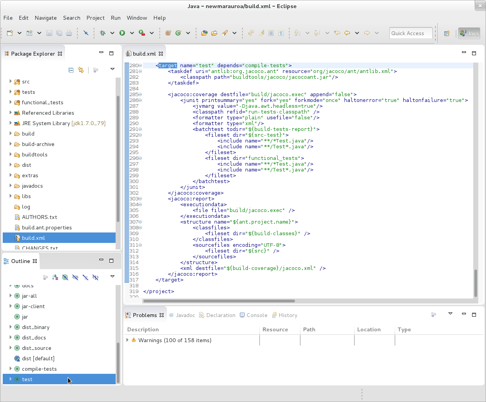
```

(ref:captionshowtestcaption) We can see that this target is dependent on another target, called `compile-tests`.  That makes sense as we would expect to have to compile the test (and production) code before we can run the tests.  

Let's take a quick look at that target before we look at the rest of the `test` target shown in figure \@ref(fig:compileTestsTargetJustCode-fig)

```{r compileTestsTargetJustCode-fig, echo = FALSE, fig.align = "center", out.width = "100%", fig.cap = "Testing targets"}
knitr::include_graphics("images/3.1compileTestsTargetJustCode.png")
```

The target in figure \@ref(fig:compileTestsTargetJustCode-fig) depends on the `compile` target.  In other words, the Marauroa team are saying here that if you want to compile the test code, then you have first to compile the production code that it tests (which makes sense, because the test code will make use of lots of classes and methods from the production code).

In the description of the `compile-tests` target, we can see two calls to `javac`, and a couple of file copy commands.  The `javac` commands are compiling code in the folder specified by the ``$\{src-test\}`` property and the ``functional_tests`` folder.

A string of the form ``\$\{something\}`` in an Ant script is a reference to the value the property called ``something``.  They can be defined in the Ant script itself (using the `property tag`), but the `src-test` property has its value set in the ``build.ant.properties`` file, which the build script imports.  If we look in that file, we can see that this property is set to the path to the ``tests`` folder.

So, we can see from this small section of the build file (without bothering to look any further) that there are two kinds of test in the Marauroa system: functional tests and another kind of test.  It is a fairly safe bet that this other kind of test are unit tests.

::: {.rmdnote}
**Forgotten what unit tests and functional tests are?**

This was covered in COMP16412.  Unit tests are short snappy tests that (strictly speaking) just test the behaviour of a single code unit. In Java, we normally think of individual classes as the units for unit testing.  Functional tests are tests of the major functions that the system offers, and will typically involve the execution of many classes working together.

In practice, it's quite hard to write true unit tests, and many of the tests in the `test` folder will in fact be *integration tests*, i.e., tests that assess the behaviour of a small number of units, working together.

:::

Now that we understand something of what is happening in the dependent tasks, we can go back to the `tests` target.  Its body contains a couple of tasks that appear to be calling a tool called `jacoco`.

[JaCoCo](https://www.eclemma.org/jacoco/) is a test coverage tool.  We'll look at what it does in more detail later in this activity, but for now all you need to know is that it is a tool that runs the tests, and works out what proportion of the production code statements are executed by the tests.

We can also see a call to a `junit` Ant task embedded in the `jacoco` task definition.  That must be where the tests are actually run.  It is run inside a `jacoco:coverage` task, suggesting that JaCoCo will be collecting the coverage information while JUnit is running the test suite.

The other target is called `jacoco:report`. The name suggests that it has the job of taking all the coverage logs gathered from running the tests, and producing a coverage report from that information.


### Run the Tests

Now that we know a little about what is happening inside the test-related targets, we'll run them.  Just as we did with the `dist` target when building the code, we're going to right click on the `test` target, and select `Run As` > `Ant Build`.

Please try that now.

<!--image but with ANT VIEW-->

As before, you should see a log of what Ant is doing appearing in the Console view.(Note that this time, the compile target and its predecessor targets are run but seem to do nothing.  This is because Ant knows that the production code source hasn't changed since these targets were last built.  So, there is no point wasting any time recompiling them, when we can just use the object files that were created the last time.)

<!--The final part of the console output should look like this:

\includegraphics[width=\textwidth]{{{3.2.2consoleOutputFromTestTargetEnd}}}

From the output, the target seems to have run to completion.  The build was successful so no tests seem to %have failed.   The whole process (the console output informs us) takes 32 seconds.  (The elapsed time, of %course, was almost certainly a little longer than this.)-->

The build should succeed as before, indicating that all tests pass successfully.

<!--This time, you should see a failed build.  This is because one of the tests has failed.  A little later, we'll look at some tools for working with test results, so we can examine just why the build failed.  For now, we note only that the failing test caused the process of executing the test suite to come to a full stop.  This is because the Marauroa build script tells JUnit to stop as soon as a failing test is encountered.  In some situations this is useful (it leaves the details of the failing test clearly visible in the console window), but in other situations we want to see the results of the whole test suite, whether there are failures or not.-->

<!--To allow this, open up the `build.xml` file, and go to line 292.  On this line, change the values of the `haltonerror` and `haltonfailure` parameters to both be `false`.  Then run the tests again, from the Ant View.  You should now see a much larger number of test results scrolling by in the Console View.-->


<!--infobox
INFO ABOUT THE FAILING TEST

A failing test should mean there's an error in the program, but this failing test was caused by an inaccurately written test.  When IT Services updated the School teaching machines to Scientific Linux 7.3 at the very end of the summer vacation, they installed a new version of the library that Marauroa uses to write JSON files.


Further Explanation for Those Interested

The test in question checks the ability of the code to serialise information about a Marauroa game to JSON.  The specification for the JSON API used states that a particular method does not guarantee the ordering of its results, but the test is written assuming that the results *will* come back in a particular order.

When ITServices upgraded the School's teaching machines to Scientific Linux 7.3, at the very end of the summer vacation, they also seem to have changed the version of the library that Marauroa is using to serialise to JSON.  Both old and new versions of the library meet the API specification, but they return their results in different orders.  Because the test assumes a specific order, it now fails, even though the Marauroa code itself has not changed.

This is an excellent example of a *brittle* test.  Ideally, we want our tests to fail *only* when the code we are writing has changed in some way that breaks the requirements.  Test failures that occur for other reasons mean we place less trust in the tests, and get less value out of the effort we put into writing them.-->


### Examining the Test Results

<!--%It's useful to know that some of the tests failed, but the summary output we get on the console from the build is not very helpful when we want to know which tests exactly failed, and why.  We need some way to get more detail on the results of running the test suite.-->

It's useful to find out more details about the results of running the test suite, but the summary output we get on the console from the build is not very helpful. We need a better way to get more details about the results of running the test suite. But where are the results stored?

Line 37 of the `build.ant.properties` file tells us that the `build-test-reports` are in the `build/testreport` folder.  We'll need to refresh the project to allow Eclipse to show us these new folders and files, so right click on the project name in the Package Explorer View and select `Refresh`.

You should now be able to examine the contents of the `build/testreport` folder shown in figure \@ref(fig:showJUnitTestResultsInXMLFormat-fig)

```{r showJUnitTestResultsInXMLFormat-fig, echo = FALSE, fig.align = "center", out.width = "100%", fig.cap = "The testreport"}
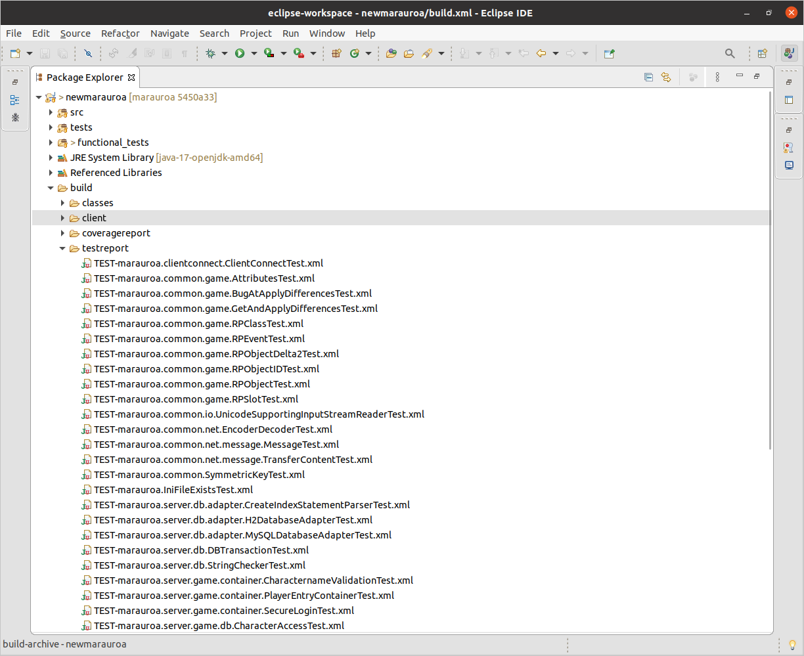
```

The icon next to these test result files tells us that they are JUnit test results, and the suffix tells us that they are XML files. You can double-click on any of these XML files, and Eclipse will open them in the special JUnit viewer.  For example, if you select the file:

``TEST-marauroa.clientconnect.ClientConnectTest.xml``

you'll see the JUnit view shown in figure \@ref(fig:showTestResultsForClientCoverage-fig).

```{r showTestResultsForClientCoverage-fig, echo = FALSE, fig.align = "center", out.width = "100%", fig.cap = "The JUnit view"}
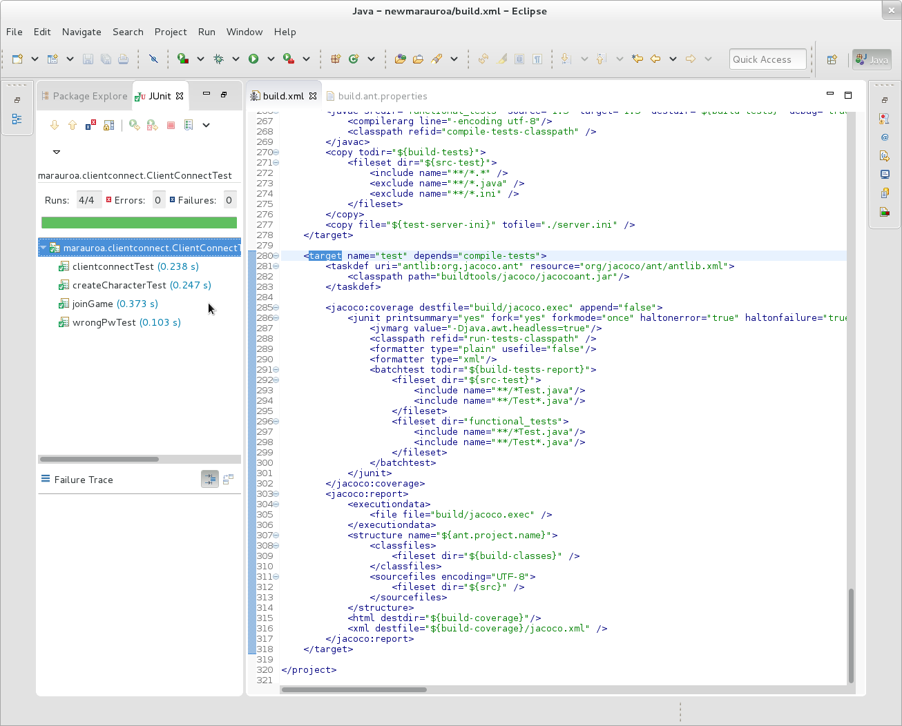
```

We can see that there were four test cases in this class:

1. ``clientconnectTest``
1. ``createCharacterTest``
1. ``joinGame``
1. ``wrongPwTest``

All are shown with a small green tick next to them, indicating that they passed.  The numbers in brackets after the test name indicate the execution time of the test.  (You can see that they are all running in a fraction of a second, which is what we need for tests of this kind, as we would expect to be running them very regularly as a developer - after every small code change, in fact.)

The green bar at the top of the JUnit view also indicates that all the tests in this test class passed.

We can double click on any of the tests to find out more about them.  Try this with the first test: `clientconnectTest`.  You should see the source of the test case, loaded in the Editor view shown in figure \@ref(fig:showSourceOfTestFromTestReport-fig)

```{r showSourceOfTestFromTestReport-fig, echo = FALSE, fig.align = "center", out.width = "100%", fig.cap = "The Editor view"}
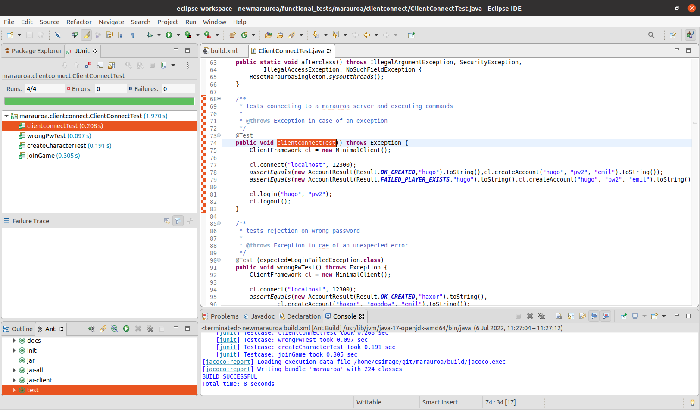
```

You can see that the test in \@ref(fig:showSourceOfTestFromTestReport-fig) is short, and quite descriptive. This is typical of unit test code. Did you also notice that this is the first time we have looked at Java code in our exploration of the Marauroa system.  Test cases make a great starting point for understanding what an unfamiliar code base does, as we shall see in another (ref:coursecode) workshop.

If you have time, you can explore some of the other test results, and the test cases associated with them.  Try not to get too bogged down in the details, though.  We're just trying to get an overview of what the system is doing here, rather than drilling down into the details of any one feature.


### Examining the Test Coverage Results

We can now see the results of the JUnit tests.  But what about the code coverage results produced by JaCoCo?  How do we get to see those?  The results are stored in two places: a file called `build/jacoco.exec` and another called `build/coveragereport/jacoco.xml`.

::: {.rmdnote}
⚠️ **IMPORTANT NOTE** ⚠️
Don't try to open the jacoco.xml file in Eclipse!  It is huge and Eclipse will spend a lot of time trying (and probably failing) to grab enough memory for it. If you want to see what it contains, then use a lightweight text editor or a command like ``head -c`` from the command line.
:::

It's not clear what use the Marauroa team make of these results, but we would normally prefer to have the results of the code coverage in a more human-friendly format than a giant XML file.  Jacoco provides the facility to create a report as a web page, as well as in XML form.  So, we're going to modify the build.xml file, to create this more useful form for us.

All we need to do is add one extra line to the test target in the build file, just after line 320:

````md
<html destdir="${build-coverage}" />
````

Note that the parameter is `destdir`, not `destfile`, like in the line that follows.  Figure \@ref(fig:addHTMLreportRequestToBuildFile-fig) below shows how the edited build file should look, with the new line highlighted.


```{r addHTMLreportRequestToBuildFile-fig, echo = FALSE, fig.align = "center", out.width = "100%", fig.cap = "The JUnit view"}
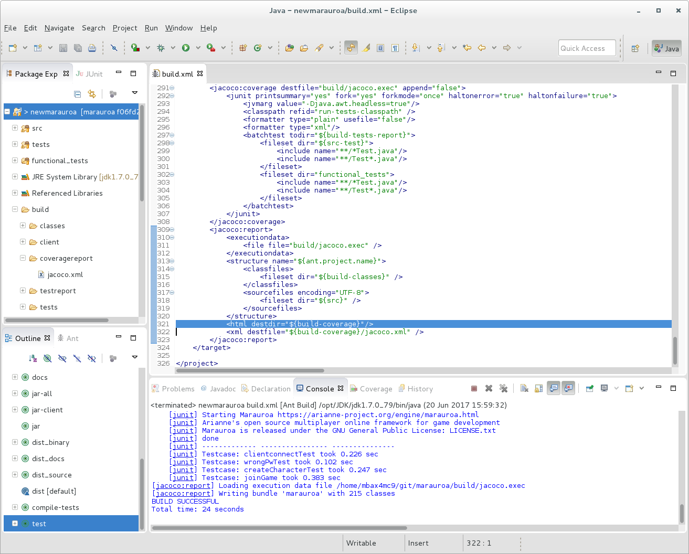
```

The line to add has been highlighted in the editor window in figure \@ref(fig:addHTMLreportRequestToBuildFile-fig).  When you have added it and saved the file (Control-S is the keyboard short cut, or you can click on the small floppy disk in the tool bar), run the Ant test target again. When this completes, **refresh** the project to pull in the extra report files we have asked JaCoCo to create.

Expand the `build/coveragereport` folder. You should see lots of extra folders inside it, with names that look like they could be Java packages.  You should also find a file called `index.html` down towards the bottom.  This is the root file of the HTML report that JaCoCo has created for us.

Eclipse has a Web browser plug-in that you can use to look at this report (by double-clicking on the `index.html` file).  This plug-in was pretty buggy in previous releases.  If you find this to be the case under Eclipse 2020-03 too, you can open your preferred Web browser and look at the files in that.  (You'll need to use a file browser to locate the file in your file space.  Searching for the directory called `coveragereport` is a quick way to do this.)

```{r showCoverageReport-fig, echo = FALSE, fig.align = "center", out.width = "100%", fig.cap = "A test report"}
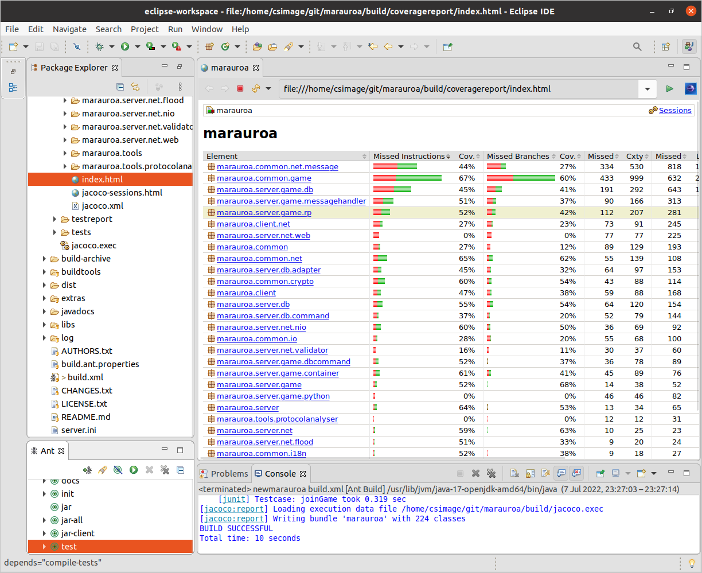
```

The report in figure \@ref(fig:showCoverageReport-fig) shows, for each package, the degree to which the test suite exercised the source code.  For now, we'll just focus on the first four result columns.  For the second package, `marauroa.common.game`, we can see from the report that the test suite executed 68% of the instructions in the package.  (An instruction, here, is a single Java byte code instruction.)  But, 32% (around a third) were not executed at all by the test suite.  Any bugs in instructions not covered by the test suite will not be caught by it.

The next two columns show how many “branches” in the code were covered by the test suite.  A “branch” in this context means a conditional point in the code, where execution could follow one of two paths based on the value of the condition.  JaCoCo currently computes branch coverage only for `if` and `switch` statements, though theoretically loops also introduce branches into code.  We would like our test suite to exercise all exits from all branches.  That is, if there is an if-statement, we would like our test suite to execute the if-statement with a true condition (so that the then-body is executed) and with a false condition (so that the else-body is executed).  These columns assess how far the test suite has met this goal.  In the case of our example, just 60% of the branches in this package are exercised by the test.


::: {.rmdnote}
**Aside: Coverage by Instrumentation**

Code coverage tools like JaCoCo need to find out which source code statements were executed when a test (or suite of tests) are run.  They typically do that by “instrumenting” the code.  That is, they convert the code of the system so that every statement is accompanied by a second statement that logs the occurrence of the first statement in some file somewhere.  For example, the code fragment:

```java
int x = Math.random();
System.out.println(x);
```

would be converted into:

```java
int x = Math.random();
coverage_log("int x = Math.random();");
System.out.println(x);
coverage_log("System.out.println(x);");
```

(Obviously, this is a simplified picture of what is actually going on.)  When the instrumented code is run, as well as executing the main code, a log is gradually built up of which statements were executed and when.

:::

You can drill down further by clicking on the package names to see code coverage reports for each class.  If you click on the classes, you'll get a breakdown of the coverage per method.  You can even get reports on the coverage of individual lines of code (by clicking on the methods in the coverage report).  For example, figure \@ref(fig:showDetailedMethodCoverageReportMac-fig) shows the detailed coverage report for the method `marauroa.common.game.RPObject.size()`.

<!--%%% REDO - small code change means change to line numbers-->

```{r showDetailedMethodCoverageReportMac-fig, echo = FALSE, fig.align = "center", out.width = "100%", fig.cap = "A more detailed coverage report"}
knitr::include_graphics("images/3.3.8showDetailedMethodCoverageReportMac.png")
```

In figure \@ref(fig:showDetailedMethodCoverageReportMac-fig) the green lines were executed by the test suite.  We can see that the beginning of the method has been covered well by the tests.  All the early instructions were executed, and the two if-statements have been executed with both a true and a false condition in different test cases.

Towards the end of the method, the coverage looks less good.  The yellow colouring of the if statement on line 1408 indicates that only one of the two exits from it were exercised by the test case.  Since the body of the if-statement is coloured red, it seems that the code has only been executed in scenarios where the `links` variable is set to null.  We can also see that the exception handling code has not been tested.

Hopefully, it is now obvious how useful this kind of tool is.  If we see that important and complex parts of the code are not covered by the test suite, we can write test cases that explicitly target the missed branches and instructions (using white-box testing design techniques).  In this way, we can gradually build up a test suite that covers all the important cases, while not wasting time on covering parts of the code that are seldom executed or of little importance.


**STEP 3 of 4 COMPLETED**

You have now run the test suite for the Marauroa engine, and have begun the process of understanding how it works.  We'll be coming back to look at the tests in more detail in a future workshop.  For now, we're going to spend whatever is left of the workshop looking at how the test suite can help us to detect when bugs are introduced into the code.


### Using the Test Suite to Find Bugs

We're going to end the workshop by making a quick experiment to show the power of this kind of automated test suite. We're going to make a change to the code, and then we'll see if the tests can indicate that something has been broken. For example, let's make a small change to the method:

````java
marauroa.common.game.RPSlot.setDeletedRPObject()
````
First, we need to get the source of this method loaded into the Editor view. You can do that by expanding the src folder tree in the Package Explorer, or by using the Search facility from the main menu bar. (File search is the easiest to use, but Java search would be a sensible way to run this search, too.)

Double click on the class or method to load it into the Editor window.  You can use the Outline View to locate the method quickly once you have the class loaded into the Editor. Now we can make the change. Comment out line 649, as shown in figure \@ref(fig:commentOutALineOfCode-fig)

```{r commentOutALineOfCode-fig, echo = FALSE, fig.align = "center", out.width = "100%", fig.cap = "A more detailed coverage report"}
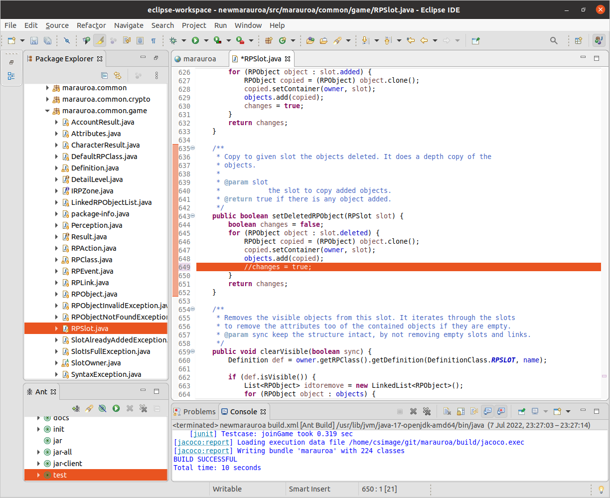
```

Save the file and run the build test target.

This time, you should see a failed build like the one shown in figure \@ref(fig:resultsOfRunningTheTestsOnTheModifiedCode-fig). This is because one (or more) of the tests has failed, because of the change we introduced. The failing test(s) caused the process of executing the test suite to come to a full stop.  This is because the Marauroa build script tells JUnit to stop as soon as a failing test is encountered.  

```{r resultsOfRunningTheTestsOnTheModifiedCode-fig, echo = FALSE, fig.align = "center", out.width = "100%", fig.cap = "A more detailed coverage report"}
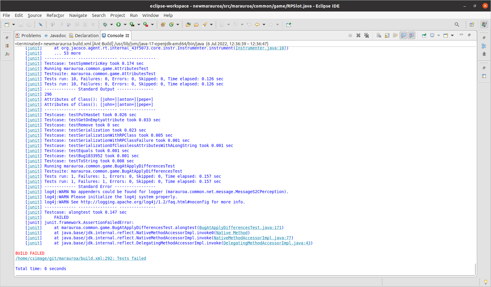
```

In some situations this is useful (it leaves the details of the failing test clearly visible in the console window), but in other situations we want to see the results of the whole test suite, whether there are failures or not. In other words, we want the build process to carry on despite the failing tests.

To allow this, open up the `build.xml` file, and go to line 292.  On this line, change the values of the `haltonerror` and `haltonfailure` parameters to both be `false`.  Then run the tests again, from the Ant View.  You should now see a much larger number of test results scrolling by in the Console View.

Then run the test build target again. You should see output similar to figure \@ref(fig:resultsOfRunningTheTestsOnTheModifiedCodeCompleteBuild-fig).


```{r resultsOfRunningTheTestsOnTheModifiedCodeCompleteBuild-fig, echo = FALSE, fig.align = "center", out.width = "100%", fig.cap = "Tests FAILED"}
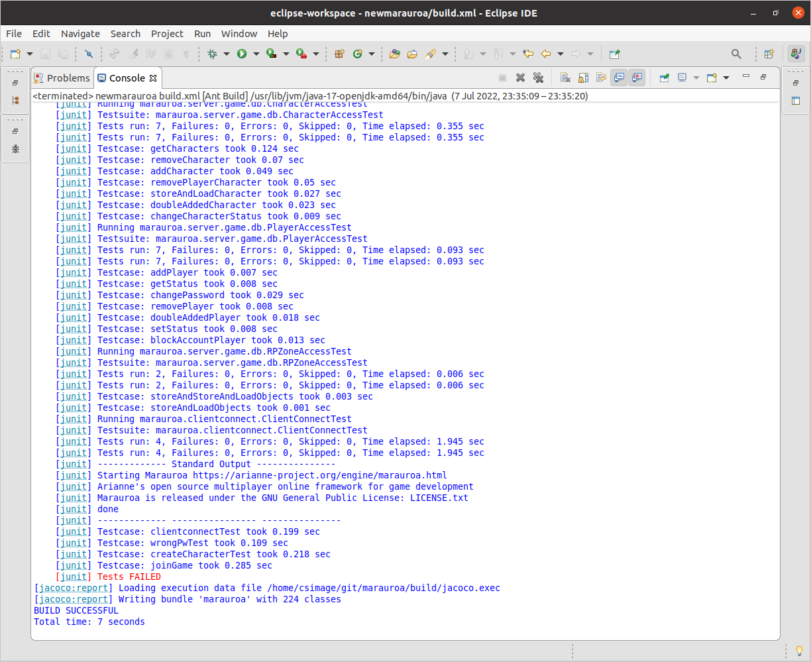
```

Notice the important line at the bottom in red. One or more of the tests failed. To see the details, open up the JUnit results file:

````md
build/testreport/TEST-marauroa.common.game.RPObjectDelta2Test.xml
````

Double click on the names of the test cases that failed in the JUnit View.  You will see that the test class is automatically loaded into the Editor window, with the cursor placed at the assertion that failed.

This shows that the error we introduced in this case was spotted by the tests.

You may be thinking at this point that I must have spent ages looking for a line of code that I could comment out and that would cause a test to fail. In fact, this line was the first one I tried --- honest! I did cheat a little bit, as I made sure to look for a line to change that was in code that was well covered by the test suite. If I'd made a change in code that was less well covered, then I'd probably have had to look harder to find a change that the tests could spot.

::: {.rmdnote}
**Aside: Writing Tests to Trap Bugs**

You may notice that the name of the test that failed here contains the word “bug”. Even with a fairly comprehensive test suite, it is still possible for bugs to slip through. When this happens, it is good practice to write a new test that fails due to the bug. That is, the test describes what the correct behaviour of the system should be, and its failure tells the developers that the bug is still in the system. Then, when the developer thinks she has fixed the bug, she can run the bug test and find out whether she has or not.

When the bug is fixed, the test we wrote to make it visible can enter the normal pool of tests that we run regularly over the system. That way, if any future code change causes the bug to reappear, we'll have a test that will catch it.
:::

In whatever time is left, try making your own changes to the code. Run the tests, and see if they were able to detect the error you had introduced. Try making changes in code that is well covered by the tests and in code that is less well covered. How did the test suite do?

You won't have to try this for long before you start to want a better way of looking at the test results than scanning through the build output on the console.  It is usual to set up the build script so that it creates a summary report of all the test results for the project, so that you can see at a glance which tests are failing. The Marauroa team have not done this (perhaps because they prefer to look at test results through their continuous integration and test system---we will look at these tools, and use them for the coursework, later in the course unit).

If you want to get a summary of all the test failures, you can add the following target to the end of the build script (before the closing "project" tab):

```` XML
    <target name="all-tests-report" depends="test">
        <property name="test-summary-report" value="${build-tests-report}/summary"/>
        <mkdir dir="${test-summary-report}"/>
        <junitreport todir="${test-summary-report}">
            <fileset dir="${build-tests-report}">
                <include name="TEST-*.xml"/>
            </fileset>
            <report format="frames" todir="${test-summary-report}"/>
        </junitreport>
    </target>
````

You'll now see a new target appearing in the Ant View for the `build.xml` file. Run this target to generate the summary report in your test reports folder. Once built, the file to look at is: `build/testreport/summary/index.html`.

When you have injected some bugs that your test suite catches, why not challenge your colleagues to see if they can use the information provided by the failed tests to work out which line you changed. (Don't forget to make a note of the class file and line you changed.)

**STEP 4 of 4 COMPLETED**

All done with the activity and nowhere to go?

If you have raced through all the above, and still have time left in the workshop, you could try to run the code we have built so far. Marauroa is a game engine rather than a game itself. It provides functionality to be used by other software (a game), and so if we run it by itself, there isn't much to see. We need to have a game of some sort to run, and then we can see the engine at work.

The Marauroa team provide a tutorial describing how to use Marauroa to create a simple “chat” game using the engine, which does allow us to run the engine we have built. Head over to the Marauroa wiki and follow the tutorial instructions if you want to try this out (it's an optional exercise, and is not important for the coursework or the remainder of the workshops).  It is very short, and just involves the creation of 5 classes in total.  All code for the classes is provided, but there are a couple of tricky elements to making it all fit together in Eclipse.

You should start by making a new Java project in Eclipse, with a `lib` folder (an ordinary folder, not a source folder). Import the Marauroa jar file that you built in the previous steps into this directory, and add it to the build path for your project. This is done by right clicking on the imported jar, and selecting `Build Path` > `Add to Build Path`. You can then add the files from the tutorial to the `src` folder.

You'll need to add a couple of other libraries to the `lib` folder as you progress. They can all be imported/copied from the `newmarauroa` project.

When you are ready to run, you'll need to create a new Run Configuration. The drop down menu associated with the small green circle and white triangle in the task bar (i.e. the run button) will take you to the screen for this.

Do not hesitate to ask if you are stuck!


`Document version:` `r format(Sys.time(), '%d %B, %Y')`

<!--chapter:end:01-building.Rmd-->

# Large systems {#understanding}

During your summer internship, year-long placement or after you leave University, chances are you will work on LARGE software systems. So it is crucial to be able to understand large software systems. You need to develop strategies for working with unfamiliar and large codebases. The codebase you're working on here is probably much larger than things you've worked with previously, though its relatively small compared to larger well known software projects, see figure \@ref(fig:xkcd-large-fig).


```{r xkcd-large-fig, echo = FALSE, fig.align = "center", out.width = "75%", fig.cap = "(ref:captionxkcdlarge)"}
knitr::include_graphics("images/telescope_names.png")
```

(ref:captionxkcdlarge) Like telescopes, software projects can get quite large, so you'll need to develop strategies for working with large codebases. [Telescope Names (xkcd.com/1294)](https://xkcd.com/1294/) by [Randall Munroe](https://en.wikipedia.org/wiki/Randall_Munroe) is licensed under [CC BY-NC 2.5](https://creativecommons.org/licenses/by-nc/2.5/)


## Purposes of the workshop  {#purposes}
In this workshop, we will look at strategies you can use to better comprehend unfamiliar large codebases. These strategies are supported by code reading techniques [@codereading] and the functionalities offered by your Integrated Development Environment (IDE). We'll be assuming that, after this workshop, you will be capable of carrying out the following tasks for yourself, without needing much guidance:

* Navigate large codebases using the most effective strategy for comprehending the code.
* Use the views and functionalities provided by the Eclipse IDE to acquire a better understanding of the code.   
* Read and write unit tests to understand the codebase.

In this workshop, you will:

* Use Eclipse to explore the codebase of Marauroa.
* Use the functionalities of Eclipse to carry out top-down reading strategies.
* Build a simple calculator to remove the fear to unit testing.
* Write unit tests to understand different components of Marauroa.


## Learning Large Codebases {#largecode}

<!--This part of the workshops will be interactive. The slides for this workshop already provide the guidance for how to proceed.-->

### What activity takes most of a maintenance programmer's time? {#timesink}

Having to work with a large unfamiliar codebase is a very common challenge that you will have to face at some points during your career. Hence, developing the required skills to deal with this challenge is imperative. In this course unit so far, you have already faced this challenge (twice!).

Large codebases keep changing all the time. Normally, there are a handful of people working on the same project at the same time. Hence, it's very difficult for anyone to claim that they have full knowledge of all parts of the codebase. What really matters is to learn how to *build a mental model of the large codebase that helps you navigate* and find your way around the large codebase you are trying to work with whenever you need.

```{r marauroa-fig, echo = FALSE, fig.align = "center", out.width = "100%", fig.cap = "marauroa is a large codbase, how can you find your way around it?"}
knitr::include_graphics("images/marauroa.png")
```

#### Tips for learning large codebases {#tips}

It can be challenging finding your way around a large codebase that you are new to. Here are some strategies you can apply:

##### Tip 1: Develop general knowledge {#tip1}

Develop your general programming knowledge. Most of the large codebases follow similar well-known design patterns. The more you know about these, the easier things will be for you. Does the codebase you are trying to debug use an MVC pattern for instance? if you already know the MVC pattern, your life will be much easier dealing with that codebase.

##### Tip 2: Develop domain knowledge {#tip2}

Develop you application domain knowledge. The more you know and understand about the application domain, the better your understanding of the codebase will be.

##### Tip 3: Be systematic {#tip3}

Packages and classes are hierarchical! Use systematic reading strategies such as top-down and bottom-up strategies. In top-down, you use the context of the application together with some previous assumptions in order to gain an overall understanding of the codebase. In the bottom-up strategy, you start with individual statements and build up picture incrementally.

##### Tip 4: use your IDE {#tip4}

Use the functionalities of the IDE. Different IDEs (such as Eclipse) offer different options that can be very helpful in learning large codebases. On your Eclipse IDE, select an attribute, function or object and with a right mouse click, explore the options you have on the resulting menu.


##### Tip 5 {#tip5}

Always assume that previous coders were sensible and honest. Every part of the code was written to serve a purpose and it was written in a very logical and methodical way. If you do not understand something, don't just dismiss it. Of course, there is always the chance that someone made a mistake, but do not rely on that.

##### Tip 6: read the tests {#tip6}

Read the Tests! Every large codebase comes with a large test suite that contains hundreds or even thousands of tests. These tests are usually organised in a structure that mimics the source code. These tests are typically a very important resource for learning what various parts of the code are meant to do. Reading through the tests gives you a very good opportunity to understand the expected behaviour of a specific part of the source code, and then try to match that  with what the actual code. Even better, if you go ahead and modify some of the tests or even write your own! This will dramatically increase your understanding of the codebase.


##### Tip 7: Take your time {#tip7}

Take your time, and don't hesitate to ask. As we discussed above, large codebases keep changing all the time. Even the most experienced software engineers can't claim they have detailed knowledge of every single part of the codebase all the time. So, take your time and don't put a lot of pressure on yourself. Take a breath and work in a logical and a methodical manner. If you ever get stuck, always feel free to ask a more experienced member of your team.


#### Comprehending Marauroa {#comprehension}

```{r marauroa2-fig, echo = FALSE, fig.align = "center", out.width = "100%", fig.cap = "A screenshot from marauroa"}
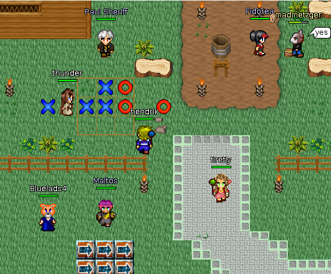
```

Now, using the tips outlined in section \@ref(tips), try to apply them to improve your understanding of the Marauroa codebase.

Let's start with the application domain. What do you know about Marauroa's application domain? By this point you should already know that it is a game engine that is used to develop Massive Multiplayer Online Role-Playing Videogames [MMORPGs](https://en.wikipedia.org/wiki/Massively_multiplayer_online_role-playing_game). How does/did this piece of information helped your understanding of the codebase?

Secondly, in the IDE, follow the gradual expansion of the hierarchy and read package and class names shown in figure \@ref(fig:marauroa-fig). This gives you a bird's eye view of the general structure of the codebase. Do you think the names are meaningful? Did that contribute to your understanding of the codebase?

Now try to identify the classes that play a central role. Once you identify a few of those, try to do more digging. Open these classes and skim through them. Check the import clause to see their dependencies. Do you notice anything in common? (Use the Outline view of Eclipse). For instance, check the class ``marauroad.java`` within the ``marauroa.server`` package. How do you think this approach helps you improve your understanding of the codebase?


Classes can also be read gradually using a top-down strategy. Look at the icons provided by the environment. Do you know what each icon means? Skim through the comments inside the class – use Javadoc. Do you think the comments were useful? Or are they just adding more chaos?

Skim the attributes and methods of the class. You don’t need to understand every word to understand overall meaning. Can you establish any hypotheses about the "marauroad.java" class? which one of the following statements do you agree with:

* It’s a daemon running on the server side.
* It’s a thread that throws 12 threads.
* It follows a singleton pattern.

## Unit Testing Overview

### Definition

A unit test is an automated test that quickly verifies a small piece (unit) of code in an isolated manner.

*  What is **a small piece of code**? The convention is that the piece of code under test should be a single class, or a single method inside that class. A common beginner’s mistake is to try to test more than one class at once. In general, you should always strive to keep the guideline of unit testing one class at a time.
* **Quickly** refers to any amount of time that is acceptable within a given domain (but normally, it should only be fractions of a second). However, as long as the execution time of your complete test suite is good enough for you, it means that your tests are quick enough.
* **Isolated manner** refers to the fact that unit tests should be written such that they can be run in isolation from each other. This way, unit tests are not dependant on each other, and they can be run in any order at any time.


### The AAA pattern: Arrange-Act-Assert {#aaa}

The AAA pattern is a simple and intuitive approach that provides an elegant structure for unit tests. It helps reading and writing unit tests that are easily understandable and maintainable.


* **Arrange**: in this section, we set up the objects to be tested (these are usually referred to as the `System Under Test` – or `SUT`). The `SUT` is configured to take a specific state, along with any other variables that are required for the test.
* **Act**: this is where you invoke the code (unit) you would like to test. The SUT that has been prepared in the previous section is used to call one of its methods. The output of the method is captured and saved.
* **Assert**: this is where the output of the action is verified. Based on the arrangement in the first section, the action that was invoked in the second section is expected to produce a specific result or manipulate the state of the SUT in a specific way. In this section, you assert that the result(s) of the action meet the expectation(s).

### A simple example
Assume that we have a class called `StringUtils` which includes a method called `reverse` that return the reverse of an input string. For instance, if this method receives a string `xyz`, it should return a string `zyx`. Now, without knowing the exact implementation of that method, we can write the following unit test using the AAA pattern:

```` Java
@Test
public void testReverse () {
	// Arrange
	String input = "abc";
	StringUtils sut = new StringUtils(); // sut = system under test

	// Act
	String result = sut.reverse(input);

	// Assert
	assertEquals("cba", result);

}
````

It is important to note that you do not need to know the implementation of the method being tested in order to write the required unit tests. As in the example above, all you need to know is the signature (inputs and outputs) of the method and what it is expected to do. In fact, it is encouraged that you write unit tests for methods before you implement them. This way, your tests will not be written for a specific implementation, but rather they will be written based on what the method is supposed to do. This is a common practice referred to as Test-Driven-Development (TDD). [@unittesting]

###  Tips and tricks {#tricks}

Some tips and tricks for test-driven development.

#### Tip 1: Arrange section is largest

The `Arrange` section should always be the largest of the 3. In this section, all the required variables and objects are created and given the desired state required for the test. Sometimes multiple tests require the same `Arrange` section. Hence, it’s a common practice to extract the arrange section into a private method(s) inside the test class and then simply call these methods from the arrange section of any test that require them.

````Java
String input;
StringUtils sut; // sut = system under test

// this method will be used in the arrange section of the tests
private void initialize(){
	input = "abc";
	sut = new StringUtils();

}

@Test
public void testReverse () {

	// Arrange
	initialize(); // everything we need is arranged using this single line

	// Act
	String result = sut.reverse(input);

	// Assert
	assertEquals("cba", result);

}
````

#### Tip 2: Act is usually a single line {#singleline}

The Act section should normally be a single line of code that invokes the method being tested. In most cases, if the Act section is more than one line of code, you should immediately think about refactoring the unit test (breaking it down into smaller unit tests). The main reason for this is that, if the test fails, it is usually difficult to tell which part of the act section is responsible for the failure of the test.

#### Tip 3: Order is important {#ordering}

When using the AAA pattern, you do not have to start writing your test code at the beginning: the 3A sections should always come in that order; `Arrange` > `Act` > `Assert`. However, you do not have to start writing them in that order. Sometimes, it makes more sense to start either from the act or the assert section, based on the system and unit you are testing and the way you understand it.

#### Tip 4: Avoid multiple AAA {#multipleaaa}

Avoid multiple Arrange-Act-Assert sections in a single test. In some cases you find a test that repeats each section more than one time. It could look something like this:

`Arrange` > `Act` > `Assert` > `ActAgain` > `AssertSomethingElse` > `ArrangeAgain` > `ActOnceMore` > `Assert`

If you are struggling to understand the previous line, imagine trying to understand the code in the test that actually follows that pattern! If a test contains more than one Act sections mixed with multiple `Assert` and/or `Arrange` sections, it means that the test is trying to verify more than one unit of code. This indicates that the test is no longer a unit test, but rather an integration test, since it tries to verify the interaction of more than one units of code.

If you ever come across a test that contains multiple `Act-Assert` sections, it is always a good idea to think about refactoring it by breaking it into more than one test, each with one Act and Assert sections.

#### Tip 5: Avoid if statements in tests {#avoidif}

Avoid using `if` statements in unit tests. Unit test with conditional statements are difficult to read and understand. A unit test is supposed to be a simple sequence of instructions that contains no branching. if statements in unit tests should also make you think about refactoring, i.e breaking the test into more than one test each of which verifies the outcomes of one of the branches in the original test.

#### Tip 6:  Annotate {#annotate}

It’s a common practice to annotate each section with it’s name as a comment, as shown in the example above. Annotated tests are much easier to read and maintain.


### Building a simple application with simple tests {#simples}

Let's put the knowledge you have gained so far into practice. you will build a class with two methods and then write some unit tests to check that all is working as expected. Follow these steps:

1. Create a new project: `File` > `New` > `Java Project` (in our example, we have called the project `COMP23311`)
1. The `src` source folder has been created by default. Create another source folder by right-clicking on the root element of the hierarchy:  `New` > `Source Folder`.
1. One of the folders will contain the code under test, while the other one while have the tests.
1. On the code under test folder, create a class `New` > `Class` (our example calles this class `Acme`) with two methods:
	+ One which returns the sum of two integers. `IN: 5,3; OUT: 8`
	+ One which takes two strings and returns a string which is the product of concatenating them. `IN: aab, bbc; OUT: aabbbc`; `IN: abc, xyz; OUT: abcxyz`
1. Create the Test case by *right clicking* on the project, `New` and then select `JUnit Test Case`.
1. Now we are going to fill out some fields of the *New JUnit Test Case* dialogue menu.
    + **Name**. As a convention for naming test classes, you have to append *Test* to the code under test class name, see figure \@ref(fig:junit-name-fig)
    + **Class under test**. You can specify which is the class under test in the last field of the dialogue menu. Click `Browse...` see figure \@ref(fig:junit-classundertest-fig)
    + A dialogue will ask about whether you want to include the JUnit libraries. Say `Yes` to this.
    + Click on *Finish*.
1. You now need to create methods which test the code you have written. You ultimately have to think to yourself "How can I know that this code is functioning correctly? What behaviour will I look for to tell me this? Can I trip-up the code in any way, therefore telling me that it isnt working properly?"
1. You could test many things:
    + On the sum method, check whether the output is `8` when the inputs are `3` and `5`
    + On the string concatenation method, check the output is `aabbbc` when the inputs are `aab` and `bbc`
    + On the string concatenation method, check the output is `35` when the inputs are `3` and `5`
    + etc.
1. Some hints to create the tests:
    +  Use `@Test` to indicate a method is a test
    + `assertEquals(String message, expected, actual)` tests if two values are equal.


```{r junit-name-fig, echo = FALSE, fig.align = "center", out.width = "100%", fig.cap = "JUnit Test Case, with Test appended to the Acme class"}
knitr::include_graphics("images/junit-name.png")
```

```{r junit-classundertest-fig, echo = FALSE, fig.align = "center", out.width = "100%", fig.cap = "The Class Under Test in this example is Acme"}
knitr::include_graphics("images/junit-classundertest.png")
```


::: {.rmdnote}
A possible solution to the above exercise will be discussed during the workshop and it will be published in Blackboard by the end of week 2.
:::


## Unit Testing Reading and Writing in Marauroa and Stendhal {#unittestingr}
Here are four exercises to understand Marauroa better through the use of tests. Worlds, zones and objects are fundamental concepts in many videogames. Therefore, Marauroa provides some classes to facilitate the development of such concepts. The classes we are going to deal with can be found in:

* Object:	`Java marauroa.common.game.RPObject`
* Zone: `marauroa.server.game.rp.MarauroaRPZone`
* World: `marauroa.server.game.rp.RPWorld`

We will create a new JUnit Test Case for the following four exercises. Based on what we discussed today think about what would be its best location under the `tests` package.

###  Exercise 1: There is only one instance of World
The strategy here should be to:

*  Get two instances of the `World` class
* Use a JUnit a statement to compare whether the two variables refer to the same object.


### Exercise 2: Zones are actually added to Worlds

* Get an instance of the `World`
* Create a new `Zone`
* Add the new `Zone` to the `World`
* Use a method from the `World` class to check if our `Zone` belongs to the `World`
* Use a JUnit a statement to check the above

### Exercise 3: Objects are actually added to Zones


1. Create a `Zone` and create and `Object`
1. Set an identifier to the `Object`. Tip: the `Zones` class has a method for that.
1. Add the object to `Zone`
1. Use a method from the `Zone` class to check if our `Object` belongs to the `Zone`.
1. Use a JUnit a statement to check the above\

### Exercise 4: Objects are destroyed when removed from Zones
1.  Same as in Exercise 3 until step 3.
1. Remove the object from zone
1. Use a method from the `Zone` class to check if our `Object` belongs to the `Zone`. Use a JUnit statement.


### Exercise 5: Reading and refactoring Stendhal tests
Note: this task is not part of your team coursework and you are not expected to commit or push the results of this task as part of your current coursework.

1. In Stendhal codebase, use the tips from the previous section to find tests for Quests.
1. Skim the tests to identify those that follow the AAA pattern and and those that do not.
1. Find and skim the largest test method in this class. What do you think of the approach used to write this test. How many act sections are there in this test.
1. Try to refactor this test to make it more readable and understandable?

::: {.rmdnote}
Solutions to the above exercises will be discussed during the workshop and will be published on Blackboard by the end of week 2.
:::


## JUnit Cheatsheet
A cheatsheet for JUnit:

### JUnit annotations

```java
@Test
````

Identifies a method as a test method.

````java
@Test(expected = Exception.class)
````
Fails if the method does not throw the named exception.

````java
@Test(timeout=100)
````
Fails if the method takes longer than 100 milliseconds.

````java
@Before
````
This method is executed before each test. It is used to prepare the test environment (e.g., read input data, initialize the class).

````java
@After
````
This method is executed after each test. It is used to cleanup the test environment (e.g., delete temporary data, restore defaults). It can also save memory by cleaning up expensive memory structures.

````java
@BeforeClass
````
This method is executed once, before all tests start. It is used to perform time intensive activities, for example, to connect to a database.

````java
@AfterClass
````
This method is executed once, after all tests have finished. It is used to perform clean-up activities, for example, to disconnect from a database.

### JUnit statements


````java
fail(String message)
````
Let the method fail. Might be used to check that a certain part of the code is not reached or to have a failing test before the test code is implemented.

````java
assertTrue(String message, boolean condition)
````
Checks that the boolean condition is true.

````java
assertFalse(String message, boolean condition)
````
Checks that the boolean condition is false.

````java
assertEquals(String message, expected, actual)
````
Tests that two values are the same. Note: for arrays the reference is checked not the content of the arrays.

````java
assertEquals(String message, expected, actual, tolerance)
````
Test that float or double values match. The tolerance is the number of decimals that must be the same.


````java
assertNull(String message, object)
````
Checks that the object is null.

````java
assertNotNull(String message, object)
````
Checks that the object is not null.

````java
assertSame(String message, expected, actual)
````
Checks that both variables refer to the same object.

````java
assertNotSame(String message, expected, actual)
````
Checks that both variables refer to different objects.


`Document version:` `r format(Sys.time(), '%d %B, %Y')`

<!--chapter:end:02-understanding.Rmd-->

# Debugging {#debugging}

Much of your time as a software engineer will be spent debugging code, either other people's or your own. That code will often be unfamiliar to you so it is important to be able develop strategies for debugging an unfamiliar codebase. In this course we will use Stendhal as an example to help you develop better debugging skills, see figure \@ref(fig:xkcd-debugging-fig)


```{r xkcd-debugging-fig, echo = FALSE, fig.align = "center", out.width = "99%", fig.cap = "(ref:captionxkcddebugging)"}
knitr::include_graphics("images/debugging.png")
```

(ref:captionxkcddebugging) Debugging unfamiliar codebases is a routine part of software engineering. [Debugging (xkcd.com/1722)](https://xkcd.com/1722/) by [Randall Munroe](https://en.wikipedia.org/wiki/Randall_Munroe) is licensed under [CC BY-NC 2.5](https://creativecommons.org/licenses/by-nc/2.5/)

## Preparing for the workshop
Welcome to the (ref:coursecode) workshop on *Debugging an Unfamiliar Code Base*.

Today, after a short lecture introducing the core concepts, we'll be working through a number of activities in which you will be undertaking some debugging tasks.  Before the workshop begins, please follow the instructions below to prepare your machine for the activities we will do in the workshop today.

We are going to use the Stendhal code base to illustrate the topics under discussion.  This will involve you reading the Stendhal code, and making some small changes.  In order not to put your coursework at risk, we're going to use a slimmed down version of the Stendhal code repository containing the Stendhal code but without the extensive revision history.

To prepare for the workshop, you need to clone the repository and import it into your preferred IDE.

The HTTPS protocol URI of the repository is:


```` md
https://gitlab.cs.man.ac.uk/suzanne.m.embury/stendhal-playground-2019.git
````

If you are using Eclipse and need a reminder of what to do, you can follow the steps we took in the Week 1 workshops, when we cloned and imported the Marauroa code base.  The instructions are on Blackboard, under `course content` > `Week 1`.

::: {.rmdnote}
Eclipse users will need to create a new workspace to import this project into.  This is because Eclipse doesn't allow two projects with the same name in a single workspace.
:::


### Introduction to the Workshop Activity {#introw}

In this workshop, we will look at techniques for debugging unfamiliar codebases such as
those encountered throughout the (ref:coursecode) (`marauroa` and `stendhal`), when contributing
to open source projects or when working with other legacy codebases (e.g. as part of an industry
development role).

Note that unlike the other (ref:coursecode) workshops so far, this workshop will focus on debugging the `stendhal` codebase rather than `marauroa`.

**This workshop should have direct application in the first team coursework exercise.**

The workshop builds on techniques given in Workshop 2 for navigating large, unfamiliar codebases.
In this workshop you will:

* Systematically develop your understanding of a reported error in the Stendhal codebase through execution only.
* Develop test cases that verify the problem by closely replicating gameplay.
* Use code navigation skills developed in Workshop 2 to identify possible causes of the error.
* Use a range of debugging tactics to eliminate causes, such that a possible fix can be proposed.
* Use code navigation skills developed in Workshop 2 to identify other similar areas of code that may contain analogous flaws.

We'll be assuming that, after this workshop, you are capable of carrying out the following tasks for yourself, without needing much guidance:

* Develop understanding of a reported or observed fault in a large and/or unfamiliar codebase.
* Identify appropriate strategies and tactics to identify the likely location of a reported or observed fault in a large and/or unfamiliar codebase.
* Read and write test cases as part of a selected debugging strategy.

As in prior workshops, there will be scope to work through the task at your own pace.  This is an ambitious workshop task. However, you should aim to have completed steps 1-3 by the end of the workshop, or at least to have narrowed down the source of the problem considerably. Ideally, you would have a clear idea what fix should be applied. Implementing (and testing) the fix itself should add very little extra work after this, and is the only real way to prove that you've successfully completed step 3.


## Workshop Activity: Working Through a Bug Report

**Definition**: Debugging is the process of understanding and reducing the number of “bugs” (errors or defects) in a computer system (software, hardware or a combination of the two) such that the system behaves as expected.

We'll work through a systematic process to get from bug report to resolution as follows:

1. Start with a problem
1. Stabilise the problem
1. Isolate the source of the problem
1. Fix the problem
1. Test the fix
1. Look for similar errors

Note that although these are represented as six distinct steps, the reality is that there are times when some of the steps may overlap. For example, if you decide to add test cases to help you stabilise your understanding of the problem (\#2); this will probably require you to take some steps towards isolating the source of the problem (\#3) as you will need to decide which portions of the code should be subjected to the test cases you are going to write.

Figure \@ref(fig:issue5-fig) is an example bug report similar to those you should already have seen in your team coursework.


```{r issue5-fig, echo = FALSE, fig.align = "center", out.width = "100%", fig.cap = "(ref:captionissue5)"}
knitr::include_graphics("images/issue5.png")
```

(ref:captionissue5) An example bug report as an issue in GitLab. GitLab issues are very similar to GitHub issues if you're familiar with those: [guides.github.com/features/issues/](https://guides.github.com/features/issues/)

In this workshop you'll be working systematically through the steps to confirm the reported error, to understand the cause and (if possible in the time available) implement changes to the `stendhal` codebase that address the issue.

### Start With a Problem {#wheretostart}

We'll begin this workshop by confirming that the reported bug is genuinely a problem, and understanding how to trigger it in regular gameplay.  We'll do all of this **without looking at any code**.

It should be relatively intuitive to figure out how this quest should work.  However, we want to avoid assumptions and so you are strongly encouraged to view the `stendhal` documentation for this quest: [stendhalgame.org/quest/water_for_xhiphin_zohos.html](https://stendhalgame.org/quest/water_for_xhiphin_zohos.html).


::: {.rmdnote}
💡 **Hint** 💡
Some useful `stendhal` commands (you'll need to make yourself an admin user to use these):


* `/summonat [player] bag [quantity] [item]` - Add some quantity of an item to a player's bag.
* `/teleportto  [player|NPC]` - Move your player to the location of another player or NPC.
* `/alterquest [player] [questslot]` - Sets the specified quest to `null` (not accepted, not completed) for a given player.
\end{smitemize}

For a full list of admin commands (and details of how to make a player an admin user) see: [stendhalgame.org/wiki/Stendhal:Administration](https://stendhalgame.org/wiki/Stendhal:Administration)

To replicate this bug, you'll want to teleport to the characters `Xhiphin Zohos` and **`Stefan`**. You'll want to summon the item **`water`**. You may also find it helpful to summon additional items to act as clear separators in your player's bag, e.g. **`chicken`** or **`potion`**. The name of the quest slot is **`water_for_xhiphin`**

To get the quest from Xhiphin, you'll need to engage him in conversation: *“hi”*, *“quest”*, and *“ok”* (in that order) should accept the quest. Likewise *“hi”* and *“water”* should result in Stefan checking the water for you.

The item at the top-left of your bag grid is the “first” item in your bag.

:::

::: {.rmdnote}
**WARNING: Problems Becoming an Admin User?**

Make sure to edit the `data/conf/admins.txt` file before running the Stendhal server.  The Server won't pick up changes to this file while it is running.
:::

**`[OUTPUT]`** To demonstrate completion of this step, write a statement that summarises your current understanding of the reported problem.


### Stabilise the Problem {#stabilise}

Following an initial confirmation that there is some odd behaviour with this quest, we now need to develop a more detailed understanding of the problem. What are the cases in which this quest behaves as expected? When does it not behave as expected?

**`[OUTPUT]`** Now that you have played the quest through a couple of times you should refine your original statement to something more precise that represents your new understanding of the problem.

You may find that your understanding hasn't changed much at all -- if this is the case, compare with others around you to be sure that this is simply because you had a really precise statement of the problem to start with. Note also that your problem statement will likely continue to be revised as you work through the rest of the process.

Since we don't want to have to repeatedly play the game every time we make a change to the code, we'll look to develop a set of test cases that demonstrate a variety of behaviours related to this error.  In this case, the problem relates to the quest *Water for Xhiphin Zohos*, so we should find the correct place to locate tests related to the behaviour of quests: `tests/games/stendhal/server/maps/quests`.

**`[OUTPUT]`** Write a set of test cases that demonstrate both correct and incorrect behaviour of the quest (some tests that succeed and some that fail).

<!--warningbox **Tests failing?** If you're seeing more tests fail than you expected, with an error that indicates that XML files have not been found e.g `quests.xml`, `items.xml`), then this is an indication that you have not set up the test suite correctly. Instructions for how to do this were in last week's team study instructions: ``Starting with Stendhal: Instructions for Getting Started on the Coursework''. In particular, you'll want to re-read and follow the instructions on page 4 about how to run the test suite using the Ant build file -- only when you've run all the tests through once with the build file will you be able to run individual tests or test files separately.-->


### Isolate the Source of the Problem {#isolation}

To locate the parts of the computer system (in this case software) that are causing the problem, we first need to select one or more strategies and tactics that we will use as tools in our investigation. For the purposes of debugging, you should think of a *strategy* as a broad approach, and *tactics* as the set of specific actions or equipment you will use to follow the strategy. Note that not all *strategy--tactic* pairs will make sense to use together.

For this workshop, we're going to suggest that you avoid the *brute force* strategy.  You can also rule out the *architectural* strategy (this error is definitely in the server, not the client). Tactics-wise, the *profiler* is definitely not appropriate here. **No matter what tactics you pick, you should ultimately aim to write tests on suspected method calls to demonstrate that you have correctly identified the source**.

To try and isolate the source of the problem you should work with at least one other person.  Check in regularly with your partner as you learn new things about the problem. A suggested approach is as follows:

1. Choose one strategy and tactic to isolate the source.
1. Compare with a partner -- find someone taking a different approach to you.
1. Work through the code for no more than 15 minutes.
1. Discuss with your partner -- what have you learned about the problem. If you've not made progress towards isolating the source, consider if you've picked good strategies/tactics.
1. Repeat as needed.
1. Try to keep brief notes as you go to record your progress.

**`[OUTPUT]`** Evidence of your developing knowledge about the source of the problem.

**`[OUTPUT]`** Once you are confident you have identified the source, if you have not already done so you must write test cases for the suspected method calls to demonstrate that you have correctly identified the source.


### Fix the Problem {#fixit}

Having accurately isolated the source of the problem, the fix is usually fairly straightforward. In this case, you should be able to figure out some relatively trivial modifications to the codebase that would allow you to ensure correct quest behaviour.

**`[OUTPUT]`** Modify the codebase to alter, replace, or add to the problematic method call associated with this problem.


### Test the Fix {#testfix}

Rerun the tests developed during Steps 2 (Stabilise the Problem) and 3 (Isolate the Source of the Problem). Do the tests now pass? If not, return to an earlier step in the process (usually Step 2 or Step 3) and try again.

**`[OUTPUT]`** You should be able to successfully demonstrate that both sets of tests complete without errors.

Play the game -- does the quest now behave as expected? If not, why did the tests not pick this up for you? Return to Step 2 to revise your understanding of the problem and be sure that your tests accurately reflect the correct and incorrect behaviour of the quest (NOT of some specific aspect of the code that the quest uses).

**`[OUTPUT]`** You should be able to successfully demonstrate that the quest behaves correctly in all cases.


### Look for Similar Errors {#similarity}

So far our debugging process has been *reactive* -- that is, someone has reported a problem and we've tried to respond to this by identifying and fixing the flaw in the computer system that was responsible.  We're now going to finish the debugging process with one final *proactive* step -- we're going to go and deliberately look through the codebase to see if there are other likely parts of the computer system with similar behaviour that may also be problematic.

Using the code navigation skills developed in Workshop 2, you should work through the `stendhal` codebase to find other places in which the original (unmodified) method implicated in the reported bug is called. For each of these calls, you should try and establish what the expected and actual behaviours are.

**`[OUTPUT]`** Your debugging log for this workshop should contain a list of candidate calls to the implicated method, your predictions about their expected behaviours and a comparison with the actual behaviour seen during execution.


### The 11 Truths of Debugging {#truths}

Nick Parlante at Stanford University ([cs.stanford.edu/people/nick](https://cs.stanford.edu/people/nick/)) has enumerated *eleven truths of debugging*, which encapsulate some of the strategies discussed above:

1. Intuition and hunches are great -- you just have to test them out. When a hunch and a fact collide, the fact wins. That's life in the city.
1. Don't look for complex explanations. Even the simplest omission or typo can lead to very weird behaviour. Everyone is capable of producing extremely simple and obvious errors from time to time. Look at code critically -- don't just sweep your eye over that series of simple statements assuming that they are too simple to be wrong.
1. The clue to what is wrong in your code is in the flow of control. Try to see what the facts are pointing to. The computer is not trying to mislead you. Work from the facts.
1. Be systematic and persistent. Don't panic. The bug is not moving around in your code, trying to trick or evade you. It is just sitting in one place, doing the wrong thing in the same way every time.
1. If you code was working a minute ago, but now it doesn't -- what was the last thing you changed? This incredibly reliable rule of thumb is the reason you should test your code as you go rather than all at once.
1. Do not change your code haphazardly trying to track down a bug. This is sort of like a scientist who changes more than one variable in an experiment at a time.
1. It makes the observed behaviour much more difficult to interpret, and you tend to introduce new bugs.
1. If you find some wrong code that does not seem to be related to the bug you were tracking, fix the wrong code anyway. Many times the wrong code was related to or obscured the bug in a way you had not imagined.
1. You should be able to explain in Sherlock Holmes style the series of facts, tests, and deductions that led you to find a bug. Alternately, if you have a bug but can't pinpoint it, then you should be able to give an argument to a critical third party detailing why each one of your methods cannot contain the bug. One of these arguments will contain a flaw since one of your methods does in fact contain a bug. Trying to construct the arguments may help you to see the flaw.
1. Be critical of your beliefs about your code. It's almost impossible to see a bug in a method when your instinct is that the method is innocent. Only when the facts have proven without question that the method is not the source of the problem should you assume it to be correct.
1. Although you need to be systematic, there is still an enormous amount of room for beliefs, hunches, guesses, etc. Use your intuition about where the bug probably is to direct the order that you check things in your systematic search. Check the methods you suspect the most first. Good instincts will come with experience.
1. Debugging depends on an objective and reasoned approach. It depends on overall perspective and understanding of the workings of your code. Debugging code is more mentally demanding than writing code. The longer you try to track down a bug without success, the less perspective you tend to have. Realise when you have lost the perspective on your code to debug. Take a break.


`Document version:` `r format(Sys.time(), '%d %B, %Y')`

<!--chapter:end:03-debugging.Rmd-->

# Cost estimation {#estimating}

Cost estimation, see figure \@ref(fig:xkcd-estimation-fig). Course material for this chapter is on blackboard [online.manchester.ac.uk](https://online.manchester.ac.uk)

```{r xkcd-estimation-fig, echo = FALSE, fig.align = "center", out.width = "75%", fig.cap = "(ref:captionxkcdestimation)"}
knitr::include_graphics("images/xkcd-estimation.png")
```

(ref:captionxkcdestimation) Accurately estimating how long things will take can be hard. The author of the windows file copy dialog visits some friends: “I'm just outside town, so I should be there in fifteen minutes” ... “Actually, it's looking more like six days” ... “No Wait, thirty seconds”. [Estimation (xkcd.com/612)](https://xkcd.com/612/) by [Randall Munroe](https://en.wikipedia.org/wiki/Randall_Munroe) is licensed under [CC BY-NC 2.5](https://creativecommons.org/licenses/by-nc/2.5/)

## Work Breakdown Structures {#wbs}

Estimating how long something will take is often a challenging task and why many estimates like the one in figure \@ref(fig:xkcd-estimation-fig) are not accurate. Its important to be able to justify any estimates you make, rather than just making a vague guess.

One technique for improving the accuracy (and justifiably) of your estimates is called Work Breakdown Structures (WBS) which is explained in the video in figure \@ref(fig:wbs-video-fig).

```{r wbs-video-fig, echo = FALSE, fig.align = "center", out.width = "100%", fig.cap = "(ref:captionestimationvid)"}
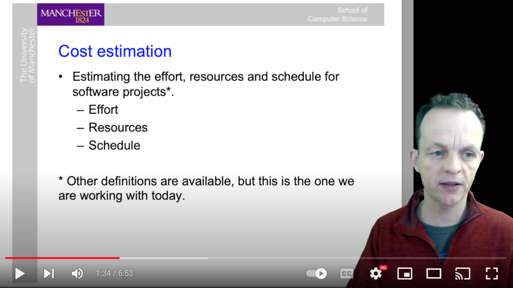
```

(ref:captionestimationvid) Work Breakdown Structures (WBS) will help to improve the accuracy and justifiability of your cost estimations in software engineering. The image in the picture is a screenshot, to watch the full seven minute video at [youtu.be/tKCfnF-z2hY](https://youtu.be/tKCfnF-z2hY)

For example, in stendhal, lets say you needed to estimate the cost if fixing a bug about players losing health points between 5.00am and 7.00am in the morning. This is `100%` of your task that you could break this down into several sub-tasks follows:

1. Replicate the bug (`20%`)
1. Fix the bug (`20%`)
1. Check that the bug is really fixed (`20%`)
1. Push the bug fix to the repository (`20%`)
1. Make sure the same bug doesn’t exist elsewhere (`20%`)

You could break each step down further into sub-sub-tasks

1. Replicate the bug  (`20%`)
    1. Replicate the bug manually (`5%`)
    1. Gather missing info from reporter (`5%`)
    1. Find tests for this or similar functionality  (`5%`)
    1. Write test that reveals the bug (`5%`)

We've split the tasks evenly here, though in practice you would probably give them different percentages depending on the size and difficulty of the tasks.

<!--### Breaking things down {#btd} -->


`Document version:` `r format(Sys.time(), '%d %B, %Y')`

<!--chapter:end:04-estimating.Rmd-->

# Test first development {#testing}

Course material for this chapter is on blackboard [online.manchester.ac.uk](https://online.manchester.ac.uk)

## Course content


`Document version:` `r format(Sys.time(), '%d %B, %Y')`

<!--chapter:end:05-testing.Rmd-->

# Git workflows {#flowing}

There are several workflows you can use in git, figure \@ref(fig:xkcd-git-fig) should not be one of them.

```{r xkcd-git-fig, echo = FALSE, fig.align = "center", out.width = "55%", fig.cap = "(ref:captionxkcdgit)"}
knitr::include_graphics("images/git.png")
```

(ref:captionxkcdgit) Deleting your project and downloading a fresh copy is not the best workflow. [Git (xkcd.com/1597)](https://xkcd.com/1597/) by [Randall Munroe](https://en.wikipedia.org/wiki/Randall_Munroe) is licensed under [CC BY-NC 2.5](https://creativecommons.org/licenses/by-nc/2.5/)

This workshop will look at different workflows you can use. Course material for this chapter is on blackboard [online.manchester.ac.uk](https://online.manchester.ac.uk) and delivered by live sessions.


`Document version:` `r format(Sys.time(), '%d %B, %Y')`

<!--chapter:end:06-workflowing.Rmd-->

# Software Refactoring {#refactoring}

Software refactoring and migration

## Preparing for the workshop {#gitprep}

Welcome to the (ref:coursecode) workshop on *software refactoring and migration*.

Today, after a short lecture introducing the core concepts, we'll be working through a number of activities in which you will be undertaking some refactoring and migration tasks.  Before the workshop begins, please follow the instructions below to prepare your machine for the activities we will do in the workshop today.


### Prepare your IDE {#prepide}

We are going to use the Stendhal Playground code base in today's workshop. so you can make changes without putting your coursework at risk.  To prepare for the workshop, please run your IDE and load this project.

If you did not attend the earlier workshops where we used the Stendhal Playground codebase, you'll need to look at the workshop instructions in chapter \@ref(refactoring), to see how to acquire it.


### Run the Regression Test Suite {#testsuite}

You can't do effective refactoring without running the regression test suite frequently.  Make sure you can run the test suite in this project, using the run configuration that comes with the Stendhal Playground project.

If your run configuration does not work, and you can't find and fix the problems yourself, get the help of a TA promptly, so you can get on with the activity.

## Activity: Literals and Magic Numbers {#magic}

First, we're going to look at a very basic code smell: the presence of literals in production code.  Literal values in production code are problematic because they tend to be duplicated throughout code, and when they need to be changed it can be difficult and time consuming to identify all the places in the code that need to be updated.  Literal values can also make code harder to read, as we have to guess at the special meaning of the literal.

Of course, test code is different.  Literal values are expected in test code (though we should still take steps to avoid duplication of literals in test code).

To see an example of this code smell in action, search for and open the following file:

````md
src/games/stendhal/server/maps/quests/revivalweeks/FoundGirl.java
````

Look at the literal values in this class.  There are many, and several are repeated in a number of places.  

Choose one literal (repeated or not) that you think would benefit from being represented as a constant, rather than being repeated throughout the file.

Double click on one example of your selected constant (so that the whole literal is highlighted).

Right click on the highlighted constant and select `Refactor` > `Extract Constant` from the menu that appears.

A dialogue box will pop up, asking you what name the new constant should have.  The convention in Java is that constants have names in upper case, with underscores to separate words.  Like this:

````java
A_CONSTANT_IN_JAVA
````

Type your name for the constant in that form in the dialogue box.  You also need to specify the access modifier (private will be fine for now), but you can accept the other defaults.

You should now see that the literal you had selected has been removed from this code, and replaced with a constant, defined towards the top of the class definition.

Use the undo option in your IDE and run the refactoring again, this time requesting that duplicate literals all be replaced by the new constant.

Hopefully, you can see how this refactoring has improved the design of the code, and so removed some technical debt (if you chose your literal well).  Can you see how making this change could mean that some future changes will be easier because of it?

**Don't forget to run the test suite after making the change, to make sure you haven't caused more problems than you have fixed by it.**


A variant on this smell is the "magic number".  This is a number that has a meaning that is important for the code, which which is hard to infer just by looking at the number itself.  You can find several examples of the magic number code smell in the following class:

````java
tests/games/stendhal/client/sound/system/ToneGeneratorTest.java
````

On the other hand, this next class has an example of a magic number that has been neatly turned into a constant, greatly improving the readability of the code it is involved in.  Can you find the magic number:

````java
src/games/stendhal/client/sound/system/processors/ToneGenerator.java
````

Can you find any other magic numbers in the Stendhal code?  Or magic strings?


## Activity: Long Methods {#longmethods}

This code smell is based around a simple but surprisingly powerful idea: short methods are easier to understand than long ones.  Take a look at the following classes to see this point in action.

First, look at:

````java
src/games/stendhal/server/actions/pet/OwnAction.java
````

See if you can figure out what the methods here do. By contrast, look at:

````java
src/games/stendhal/server/actions/pet/NameAction.java
````

How did the experience of trying to figure out what the `NameAction.onAction()` method does compare with the experience of reading the much shorter methods in `OwnAction`?

A good rule of thumb is that your method bodies should be no longer than a single screen's worth of text.  If you can keep your methods that short, then you should be able to easily digest them.  It is also a good discipline for the developer, as it forces us to think in terms of small, self-contained chunks of logic, rather than long rambling sequences of code.

So how can we shorten the `NameAction.onAction()` method?  We can't take any of the functionality out.  It is all needed.  So what are our options?

Once all unnecessary and duplicated code has been removed, the most useful tool we have is the refactoring called `Extract Method`.  We can use this to take some of the lines of code out of this method, and put them into a smaller method.  This simple change can have a dramatic effect on readability.

An opportunity in `NameAction.onAction()` is on lines 62--65.  We could wrap these lines up in a method called `removeQuotes()` (or something similar).  We could do the work of converting these lines into a method, but our IDE can do this job for us almost automatically, including working out what the parameters are and what the result type should be.  Let's try it.

Select lines 62-65 (from beginning to end) and right click on the highlighted code.  Select `Refactor` > `Extract Method` from the menu that appears.  In the dialogue box, give the name you want the extracted method to have.  The name `removeQuotes` seems okay to me.  We can always rename it later, if we need to.  We will make a private method, and will accept all the default parameters the dialogue gives us.  So we can select `OK`.

Look at the code of the class after the refactoring.  The IDE has created a new method, at the bottom of the class, with the name we specified.  It has worked out that we need to pass the name to be processed as a parameter, and has declared the method with the appropriate signature.  The ` onAction()` method is now slightly shorter, and the name of the method tells the code reader exactly what the intent of the code we have extracted into it is.  This makes for a double readability improvement in one simple step.

::: {.rmdnote}
**Helper Methods**

Methods like this one (private methods, called perhaps just once within a class) are sometimes referred to as *helper methods*.  They are there to help us write readable clear code.  In the early days of computing, it would have been considered ridiculous to define a function or method that was called just once.  Methods, by definition, were used to group together code statements that would be called many times.  With older compilers, method calls incurred a performance overhead: the variables of the calling scope had to be put onto the heap, to be preserved while the method was called, and restored afterwards.

Modern compilers, however, cope easily with methods that are called in just one place.  We no longer have to worry about the performance aspects of creating new methods, and can make as many as we need to create readable clear code.
:::

The next essential task is to run the tests.  If we have broken something, we want to find out now, while the refactoring is still in our IDE's undo buffer and while the changes we have made are still fresh in our mind.

Can you see any more opportunities to shorten this method by extracting shorter helper methods?  Experiment with the `Extract Method` refactoring and see if you can reduce the size of this method even further.

A hint is given is commented out `<!-- hint -->` below, if you get stuck you can `view the source`: either the `*.html` or `*.Rmd` to see the hint.

<!--Lines 76 to 85 seem to be telling the player that a name change has occurred.-->


`Extract Method` is a really powerful tool, and it is worth learning the keyboard short cuts for it, along with the short cuts for *Rename*, so you can apply it quickly and easily when opportunities for code improvements present themselves.  Often, when we extract a method, a useful domain concept is showing itself that the developers had not identified before.   The private helper methods we create with this refactoring can sometimes prove so useful that they become public methods, or even get grouped to form their own class (using the *Extract Class* refactoring).


## Activity: Excessive Comments {#excessive}

Another code quality issue that can be effectively dealt with by `Extract Method` is the smell of excessive comments.  While a few judicious comments, well placed, can be extremely useful in helping developers to read code accurately and quickly, anything more than this is now viewed as an indication that the code itself may not be of the highest quality.  Rather than fixing the quality problems, and making the code self-documenting, the developer has felt it necessary to include lots of explanatory comments.  This is a quicker solution for the developer in the short term, but leads to technical debt in the long term, as the comments age and grow out of step with the changing code.

You can see an example of this code smell in the `execute()` method of the following class:

````java
src/games/stendhal/server/actions/equip/EquipAction.java
````


There are comments spread throughout this method, and they don't always seem to add very much value.  Some of them seem to be duplicated by the calls to the logger.  Others seem like they could be conveyed more effectively through extracted methods (which would also deal with the fact that this method is too long).

Can you see any chances to extract methods from this class?

The comments here help us see where we might add in helper methods, but the situation is complication by the structure of the code.  We have a number of if statements, which look like they could make good methods, but they have a ``return`` statement in their body, which only makes sense when executed in the current method.  We can't pull that statement into a helper method, and expect it to work.

In this case, you need to do a little manual refactoring first.  Can you see how to move the return statement outside the body of the if-statement, but still have its execution dependent on the value of the condition in the if-statement?

A hint is given is commented out `<!-- hint -->` below, if you get stuck you can `view the source`: either the `*.html` or `*.Rmd` to see the hint.

<!--
Create a local boolean variable which will store the result of evaluating the condition.  You can use a second if-statement, on this new variable, to execute the return value outside of the original if-statement, freeing it up to be turned into an extracted helper method.
-->

Once you've refactored the return statements out of the if-statements, can you see any opportunities for removing the need for comments by extracting code into well-named helper methods?  The goal is to produce code that reads as clearly as natural language, and that explains what the code is doing in as plain and obvious a way as possible.


When you reach this point, if you want help, let the lecturer know.  She or he will demonstrate this technique on the screen share.


## Activity: Applying the Refactorings Together {#refactorings}

If you finish all the other activities before we move on to the topic of migration, you can have a try at this last activity.

In this activity, you are asked to refactor some test code.  People who are learning to refactor often forget to apply it to their test code as well as their production code.  But readability and ease of modification are just as important for test code as for production code - maybe even more important, because the test code is an essential tool that guides us in changing the production code.  We don't have that safety net for the test code, so it is vitally important that it is clear and simple and can be seen to be correct.

Take a look at the code that tests the Ice Cream for Annie test:

````java
tests/games/stendhal/server/maps/quests/IcecreamForAnnieTest.java
````

You should see a couple of the code smells we have been looking at in this code.  And should hopefully have some idea of the refactorings you can use to help you improve it.

By way of contrast, take a look at this test code:

````java
/stendhal/tests/games/stendhal/server/maps/quests/FindRatChildrenTest.java
````

This shows the kind of organisation we want to get the `IceCreamForAnnie` tests to follow.  In the `RatChildren` test, each part of the quest is tested in a separate test case method.  This means that if one fails, the other tests will still be run, and we'll get to see which parts of the whole quest are working and which are not.

In the `IceCreamForAnnie` test, on the other hand, everything is written in one long test case.  JUnit will stop at the first failing assertion in each test case, so if an assertion fails in this test somewhere near the beginning, the rest of the assertions won't get run, and we won't get the diagnostic information we need from them.

See if you can use the three refactorings we have used in this workshop to improve the diagnostic capabilities of the `IceCreamForAnnie` test, without changing its meaning.

::: {.rmdnote}
**Question** if we refactor test code, what tells us when we have made a mistake and changed the behaviour of the system?
:::

Good luck!

`Document version:` `r format(Sys.time(), '%d %B, %Y')`

<!--chapter:end:07-refactoring.Rmd-->

# Design for Testability {#designing}

Software refactoring and migration

## Preparing for the Workshop

Welcome to the (ref:coursecode) workshop on *design for testability*.

Today, after a short lecture introducing the core concepts, we'll be working through a number of activities in which you will be using the Stendhal code base to learn some basic design for testability concepts.

We are going to use the Stendhal Playground code base in today's workshop. so you can make changes without putting your coursework at risk.  To prepare for the workshop, please run your IDE and load this project.

If you did not attend the earlier workshops where we used the Stendhal Playground code base, you'll need to look at the workshop instructions for week 3, to see how to acquire it.


## Understanding Test Doubles: Dummies {#dummies}

The simplest kind of test double is a *dummy*.

We use a dummy when the code under test is required to pass an object to some part of the fixture, but we know that the object itself will not be used during test execution.  In this case, we just need a test double object that has the same interface as the required fixture object.  We don't care what the dummy does, because it will never be used.

This is easiest to see by looking at some examples.


#### Example Dummy No. 1 {#dummy1}

In your IDE, find the code for the following method:

````java
games.stendhal.server.core.config.zone.NoTeleportInTest.testConfigureZone()}
````

The test class and method name and the comments make it clear that this test case is checking that whole zones can be correctly configured to disallow teleporting in.  The test checks that teleporting in is not allowed at two locations in the zone (top left and bottom right edge squares) but that teleporting out is still allowed.

The fixture for this test is a zone that is configured to disallow inwards teleports.  We don't care about the other attributes of the zone.  But the signature of the method for adding a configuration to a zone requires two arguments: the zone to be configured *and* a map containing attributes to be used in guiding the configuration.  (Hover over the call to the `configureZone()` method to see it's JavaDoc.)  The `NoTeleportIn` configuration does not need any special attributes to be set, but the method signature is inherited and the attributes must be provided whether they are needed or not.

There's no point wasting time and resources (and lines of code) setting up some fake attributes for this configuration if the test isn't going to use them.  So, the coder of this test has sensibly chosen the simplest possible object compatible with the method signature: a `null` value.

In Java, as in many object oriented languages, `null` is an instance of the class `Object`, the class which is at the root of the object inheritance hierarchy and which all other classes are a sub-class of.  An instance of `Object` can be used anywhere an instance of any other class is needed.  This means that `null` is a match for the required data type (`Map<String, String>`) and can be given as the simplest possible attribute map to satisfy Java's strong typing requirements.


### Example Dummy No. 2 {#dummy2}

Let's look at another example, this time in the client code.  Search for the method:

````java
games.stendhal.client.gui.ItemPanelTest.testCursors()
````

The very first line of this method contains an example of a `null` value being used as a dummy.  The `itemPanel()` constructor takes two arguments: a slot name and a placeholder sprite.  We don't care much about either value in this test, but need the `ItemPanel` instance as part of the fixture.  The name is easy enough, we can give any value.  (Note the carefully chosen value used in the test, which clearly indicates to the reader of the code that the name is not important.)  But we also don't care about the sprite.  So the coder has used the simplest possible `Sprite` instance to fulfil the fixture requirements: a `null` value.


### Example Dummy No. 3 {#dummy3}

Staying with the `testCursors()` test case from the previous example, can you see another dummy being used in this test---one that is not just a `null` value this time?

See if you can find it, then check your answer with a staff member or a graduate teaching assistant (GTA).  Remember that a dummy is a test double that represents the simplest possible, most vanilla object that can allow the necessary fixture to be found.


## Understanding Test Doubles: Stubs {#stubs}

What do we do when our fixture needs to be more complex than the simple dummy objects we have looked at so far?  Most test doubles need to behave more like the production objects that they mimic, and have real behaviour that is invoked in the test.

Sometimes, we need to be able to control the values returned from method calls.  When we can hard code a simple return value into the object, then we call the test double a `stub` object.

A stub is a version of the desired fixture class that has the same interface as that class, but returns simple, hard-coded values from its methods, rather than doing any actual game processing.  This removes randomness and unpredictability from our fixture, while also giving the results we need for the test.

In older languages, stub classes have to be defined in full, just as ordinary production classes are, and we need to include some mechanism in the code to say when to use the stub class (when testing) and when to use the production class (when in production use).  But OO languages, with sub-classing and inheritance, give us a more convenient way of defining stubs, right inside the test code itself.


### Example Stub No. 1 {#stubby1}

Look at the test case methods in:

````java
games.stendhal.client.entity.EntityTest
````

The methods create an instance of a class called `MockEntity`.  But if you look for this class in the code base, you will not find it, and no import pulls a class with this name into the class we are defining.

Instead, this class is defined at the end of the `EntityTest` class, as a private class (lines 156--176).

This new class inherits from the `Entity` class, and so has all the same behaviour as this production code class, apart from where the behaviour is overridden and added to in this definition.  The changes define the extra control we need over `Entity` instances in order to write this test effectively.

In this case, the changes are:

* Adding a new private field called `count`.
* Overriding the superclass constructor behaviour to create a Marauroa RPObject instance and give it a type.
* stubbing the method that returns the area of the entity so that all `MockEntity` instances will return a null `RectangularArea` (an example of a dummy used inside a stub).
* Overriding the `onPosition()` method so that as well as doing everything the production superclass does when this method is called, we also increment the `count` variable.

For each of these, look at the test methods on this test class, and see if you can work out roughly why the stub class is designed to have these behaviours.

Notice that this stub class both controls the state (returning a hard-coded value when the area of an entity is requested) *and* adds special control behaviour needed by the test code but not the production code (counts the number of times the `onPosition()` method is called).


### Example Stub No. 2 {#stubby2}

Another useful Java mechanism for creating stub classes is the anonymous sub-class.  This is used widely throughout the Stendhal test suite for creating test doubles, and is a popular technique in general for getting code under test.

To see an example of this in the Stendhal code base, find the method:

````java
games.stendhal.server.actions.admin.SummonActionTest.setUP()
````


Make sure you find the server version of this test class.  There is another class with the same name in the client code, which does not contain an obvious stub.

Take a look at this simple method and see if you can work out what it does.  (Anonymous sub-classes are a feature of Java that you were not taught in our first year programming course units.  You can either ask a member of staff or a GTA to explain, or you can research for yourself how this Java feature works.  But don't leave the workshop without understanding this language construct and how it can be used to create test doubles.)

The `SummonActionTest.setUP()` method creates an anonymous sub-class of the `StendhalRPZone` class, and overrides one of the methods on that class: the `collides()` method that we have met in previous workshops.  Instead of using the collision layer to decide whether the player or objects can be placed at the location given, this over-ridden version of the method just always returns `false`.  It does not matter which location in this zone you give as parameters, this method will always say there is no collision at that point, and the object can be placed there.

Hopefully, you can see that this is a much quicker and more elegant way of ensuring we have no collisions in our zone than having to setup and configure an actual collision layer for our test zone.  The stub object is created at the time the test is run, and has exactly the same behaviour as the `StendhalRPZone` class, except that it will never report any collisions for any zone created with it.

Take a look at how the `zone` instance created from the anonymous sub-class is used, and how this stub test double allows us to write the test more simply.


## Test Doubles Scavenger Hunt {#scavenger}

Work in pairs or small groups to find more examples of the different types of test double in Stendhal.  Some guidance on how to do this is given below. Can you find at least:

* One additional example of a dummy
* One additional example of a stub

Write the name of the class, and the line where the test double occurs, on a sheet of paper or in a file.

When you have found an example of each type of test double (or given up) check your answers with staff or a TA, and share examples with neighbouring students.


### Finding Dummies {#findum}

To find some candidate code to examine, you can use File Search in your IDE to search for the string `null` in test code.  (A good shorthand way to search through only the test classes is to use the regular expression `*Test.java` in the file name section of the search dialogue box.)

You are looking for places in the fixture setup part of a test case where a null is passed as a parameter when preparing the class under test for test execution, or when preparing a dependent object.

For other dummies, look for the use of no argument constructors, where simple instances are created and passed as parameters to the class under test, or when setting up a dependent class.


A good sign that you have found a dummy is that you could replace it with another more complex object, and the test behaviour would not change.


### Finding Stubs {#findstubs}

Stubs will also normally be found in test classes.  Look for anonymous subclasses created during the set-up stages of a test case, where literal values are used to specify return values from methods.

Stubs can also be implemented as named private classes.  This normally happens when we need to create several instances of the same stub, for use across multiple test cases, perhaps.  If we only need one instance of the stub, we don't need to refer to it in other parts of the code, and it is fine for it to be anonymous.

Sometimes stubs need to be used by several classes under test.  In this case, they can't be declared as private classes, and must be declared in their own file.  Look for such classes wherever test classes are declared, but also in places where test helper code is located.

Can you find the packages containing test helper code in Stendhal?


Look at the names used for the non-anonymous stubs you find.  Have the authors of the code made the role of these classes as test doubles clear from the name?


## Understanding Test Doubles: First Experiments with Mock Objects {#mockobjects}

For this short activity, you are asked to look through the test code for the HandToHand class:

````java
games.stendhal.server.entity.creature.impl.attack.HandToHandTest.java
````

Below is a list of the names of each of the test case methods in this class.  Take a sheet of paper and draw a line down the middle.  On one side, write the names of the methods that are using mocks, and on the other side write the names of the test methods not using the mock objects framework.


* `testAttack()`
* `testCanAttackNow()`
* `testCanAttackNowBigCreature()`
* `testFindNewTarget()`
* `testHasValidTarget()`
* `testHasValidTargetDifferentZones()`
* `testHasValidTargetInvisibleVictim()`
* `testHasValidTargetNonAttacker()`
* `testHasValidTargetvisibleVictim()`
* `testNotAttackTurnAttack()`

What do the methods that use mocks have in common, compared with the methods that don't use mocks?

Next, we're going to look at what happens when tests using mock objects fail.

Starting from the first test method, testAttack(), use your IDE's navigation facilities to jump to the definition for the method that that test case is checking.  (Hint: double click on the method name and press Function key 3 (F3) in Eclipse, or right click on the method name and select `Open Declaration`.)

Comment out line 26, like this:

````java
public void attack(final Creature creature) {
    if (creature.isAttackTurn(SingletonRepository.getRuleProcessor().getTurn())){
        //creature.attack();
    }
}
````

Now run the tests.

Take a look at the error message you get.  Can you tell what it means?


## All Finished and Nowhere to Go? {#next}

If you have finished the other activities, you can try this more challenging exercise.

The Daily Item Quest contains an annoying bug.  This quest asks you to find an item set for you by the Mayor of Ados.  If you can't find the item, after a week, the Mayor will allow you to request a different item.  But, the bug in the code allows the quest class the possibility of giving you the same impossible-to-find item again.

Work in pairs or small groups to make the Daily Item Quest functionality testable, using the test double techniques we have covered in the class, so that this bug can be made visible.

You do not have to create a complete implementation.  Just sketch out the changes you would make, in sufficient detail to understand the costs and benefits.

There is no single right answer to this.  Several approaches could work.  If you are unsure, just try one and see how it looks when it is sketched out.  Discuss your answer with staff if unsure.

`Document version:` `r format(Sys.time(), '%d %B, %Y')`

<!--chapter:end:08-designing.Rmd-->

# Software design patterns {#patterning}

## Introduction


In this workshop, we will look at design patterns, and their application in refactoring. A software design pattern describes a general, reusable solution to a commonly occurring problem in a specific design context. They're often useful when designing new pieces of software as they both allow us to reuse best practice from prior experience, and provide a means to discuss the design with others (a shared vocabulary). However, design patterns can be equally useful when refactoring existing codebases.

The workshop builds on techniques given in previous workshops for working with large codebases, in particular extending those in Workshop 8 for refactoring existing code. In this workshop you will:

* Be introduced to 6 of the 23 [Gang of Four (GoF) Design Patterns](https://en.wikipedia.org/wiki/Design_Patterns) [@GoF]
* Refactor a small existing code base to apply Behavioural, Structural and Creational patterns

We'll be assuming that, after this workshop, you are capable of carrying out the following tasks for yourself, without needing much guidance:

* Identify portions of existing codebases that could be improved through the application of Design Patterns
* Describe a refactoring using a design pattern vocabulary and, where appropriate, supporting UML
* Apply design patterns to an existing codebase

As in prior workshops, there will be scope to work through the tasks at your own pace -- in particular, each of the three workshop exercises is divided into multiple stages that address first one design pattern, and then a second.  You should (at a minimum) aim to have completed all tasks related to the first design pattern of each exercise.

## Workshop Exercise 1 - Behavioural Patterns {#behave}
This first section of the workshop focuses on applying the two Behavioural patterns introduced: Strategy, and State.

For this exercise, you'll be working with a small-scale Java codebase that's loosely inspired by some classes in the Stendhal codebase.  For this first exercise you'll be focussing on a set of classes that represent pets.  The main classes and their members can be represented in a UML class diagram shown in figure \@ref(fig:basicpets-fig)

```{r basicpets-fig, echo = FALSE, fig.align = "center", out.width = "100%", fig.cap = "Pets, Cats, Goats and Magic Dragons"}
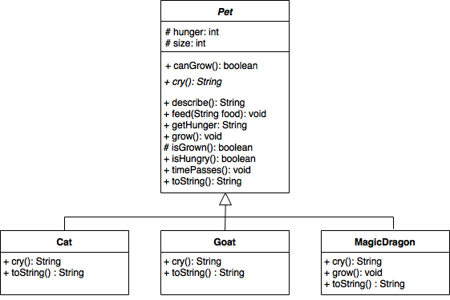
```

In this workshop you'll be extending and then refactoring the codebase to explore how behavioural patterns can simplify the process of adding new functionality, and can remove the need for duplicate code.

### Exercise 1a - The Strategy Pattern {#strategy}

In this part of the exercise we'll be focusing on the Strategy pattern.  You will modify the code in five stages:

* Add a new `Pet` class `CuddlyToy` that requires new algorithms for the growth, feeding, hunger, and crying.
* Consider how one might use sub-class/super-class relationships to avoid duplicate code.
* Implement an abstract `GrowthStrategy` that provides method signatures for growth-related algorithms.
* Implement the three concrete implementations of `GrowthStrategy` encountered so far.
* Modify the existing `Pet` classes to use the newly created strategy classes.


#### Stage 1 - Add a new Pet class {#pet}

You've been asked to add a new Pet, `CuddlyToy`, for players that (for example) have allergies or just don't want the effort of looking after a real-life creature. The requirements for `CuddlyToy` are as follows:

* A `CuddlyToy` should not grow, they are `ADULT_SIZE` at instantiation.
* A `CuddlyToy` does not eat, and should not get hungry.
* A `CuddlyToy` squeaks, its cry is generated by a plastic squeaker

**`[ACTION]`** Implement a new `Pet` subclass that complies with the above requirements, and modify `PetDriver.java` to demonstrate your new Pet subtype.

#### Stage 2 - Design sub-class/super-class relationships to avoid duplicated code
It's clear that many of our Pets have quite different algorithms for growth. Some, like `Goats` and `Cats` grow steadily, increasing by a fixed amount over a constant time interval. Others, like `MagicDragons`, increase by a fixed amount but at irregular intervals -- their growth stagnates for a while and then they undergo a growth spurt. Some `Pets`, like `CuddlyToys`, don't grow at all.

If we wanted to introduce more `Pet` types, we could quickly end up having to duplicate the code for steady, irregular or no growth across multiple `Pet` subclases. Alternatively, we could add layers of subclassing shown in figure \@ref(fig:petsubclasses-fig)

```{r petsubclasses-fig, echo = FALSE, fig.align = "center", out.width = "100%", fig.cap = "Possible subclasses of Pet"}
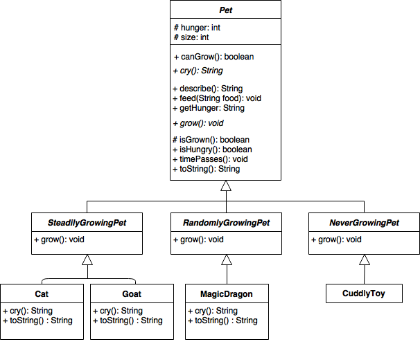
```

However, this could quickly become difficult to manage, and doesn't always avoid duplicate. For example, suppose you're now asked to add a new `Bird` subtype. Birds can fly (like `Dragons`) but grow steadily (like `Cats` and `Goats`). The resulting class structure might look something like that shown in figure \@ref(fig:petsubclasses2-fig)

```{r petsubclasses2-fig, echo = FALSE, fig.align = "center", out.width = "100%", fig.cap = "A badly designed hierarchy"}
knitr::include_graphics("images/GrowthSubclasses2.png")
```

So, we've now potentially duplicated our steady growth code in two superclasses `SteadilyGrowingGroundPet` and `SteadilyGrowingFlyingPet`, and some new code for flying behaviours in two superclasses `SteadilyGrowingFlyingPet` and `RandomlyGrowingFlyingPet`. This definitely isn't great design.

#### Stage 3 - Introduce a GrowthStrategy {#growthstrategy}

A Strategy pattern defines a encapsulates a family of interchangeable algorithms -- here, our interchangeable algorithms describe different patterns of growth.

The first step in refactoring to a Strategy will be to create an abstract class `GrowthStrategy`.

**`[ACTION]`** \color{black} Create a new `GrowthStrategy` class, with abstract method signatures for `canGrow()` and `Grow()`.

#### Stage 4 - Implement concrete growth strategies {#growthstrategies}

You now need to create concrete implementations of your `GrowthStrategy` class, each representing a different growth algorithm.  So far, we've encountered three growth algorithms:

* Steady growth -- Grows by a fixed amount every time the grow method is called.
* Random growth -- Grows by a fixed amount some random subset of times that the grow method is called.
* No growth -- Does not grow, even when the grow method is called.

**`[ACTION]`** Create three subclass implementations of `GrowthStrategy`, one for each of the growth algorithms encountered so far.

#### Stage 5 - Modify the codebase to use our GrowthStrategy {#modifys}

Now we have a selection of implemented `GrowthStrategy` classes, we need to modify the `Pet` subclass to utilise these new classes.  To do this, we'll add an attribute `growthStrategy` of type `GrowthStrategy` to the `Pet` class.  We'll also need to add a set method for the new attribute, and modify the existing `canGrow()` and `grow()` method in `Pet` and it's subclasses to make calls to the new strategies.

**`[ACTION]`** Make the remaining code changes needed to have `Pet` and its subclasses use `GrowthStrategy`. This should now mean that there is no special-case `grow()` implementation in `MagicDragon` and `CuddlyToy`. Verify that `PetDriver.java` still behaves as expected.

The UML diagram in figure \@ref(fig:petstrategy-fig) should be a good representation of your codebase at the end of this migration task.

```{r petstrategy-fig, echo = FALSE, fig.align = "center", out.width = "100%", fig.cap = "Your codebase should look something like this at the end of this migration task"}
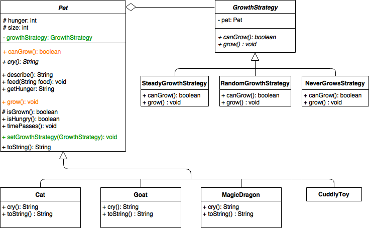
```


### Exercise 1b - The State Pattern {#state}
In this part of the exercise we'll be focusing on the State pattern. You will continue to modify the `Pet` codebase.

In this task, you should look to apply the State pattern to store attributes related to hunger, and algorithms that depend on those attribute values.

Note that this is the extension/secondary task for "Exercise 1 - Behavioural Patterns". Detailed instructions are therefore not provided, but a suggested approach might break the modification down into the following four further stages:

1. Identify hunger states and their dependant behaviours.
1. Implement an abstract `HungerState` that provides method signatures for dependant behaviours.
1. Implement a concrete implementations for each of the hunger states identified previously.
1. Modify the existing `Pet` classes to use the newly created state classes

<!--%Note that this is the extension/secondary task for ``Exercise 1 - Behavioural Patterns'' and as such, the descriptions are briefer with limited UML support.-->  
You may find it helpful to make brief UML sketches as needed as you refactor the code towards the State pattern.

<!--
%\subsubsection{Stage 6 - Identify hunger states and dependant behaviours}
%\subsubsection{Stage 7 - Introduce a HungerState}
%\subsubsection{Stage 8 - Implement concrete hunger states}
%\subsubsection{Stage 9 - Modify the codebase to use our HungerState}-->


## Workshop Exercise 2 - Structural Patterns {#structural}

This first section of the workshop focuses on applying the two Structural patterns introduced: Composite, and Adapter.

For this exercise, you'll be working with a set of classes that represent habitats -- places that pets might want to live.  The main classes and their members can be represented in a UML class diagram in figure \@ref(fig:habitat-fig)

```{r habitat-fig, echo = FALSE, fig.align = "center", out.width = "100%", fig.cap = "Subclasses of Habitat"}
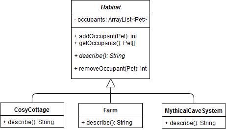
```

In this workshop you'll be extending and then refactoring the codebase to explore how structural patterns can simplify the process of adding new functionality, and can remove the need for duplicate code.


### Exercise 2a - The Composite Pattern {#composite}

In this part of the exercise we'll be focusing on the Composite pattern.  You will modify the code in 3 stages:

1. Add new `Habitat` classes, `Cave`, `Field`, and `MuddyPuddle`
<!--%\item Consider how one might use sub-class/super-class relationships to avoid duplicate code.-->
1. Modify `Habitat` such that it can (optionally) contain a number of child `Habitat` objects.
1. Modify the `describe()` and `getOccupants()` methods to include the values of child objects.


#### Stage 1 - Add new Habitat classes {#habitats}

You've been asked to add some new `Habitat` classes to represent more specific places that Pets might choose to spend time.
The current description for `MythicalCaveSystem` already indicates that the cave system is actually composed of three separate `Caves`.
Likewise, the `Farm` is described as containing multiple fields and a barn.

You've been asked to add three specific new Habitat classes:

* `Cave` - A single cave for dragons to hide in.
* `Field` - A field with grass that goats might eat.
* `MuddyPuddle` - A patch of muddy water -- goats love splashing in puddles.

**`[ACTION]`** Implement three new `Habitat` subclass as above, and modify `HabitatDriver.java` to demonstrate your new `Habitat` subtypes.


#### Stage 2 - Modify Habitat to contain child Habitat objects {#children}

We already know that `MythicalCaveSystem` contains three `Caves`, and that `Farm` contains a `Field`.  We're going to use the Composite pattern to make this relationship an integral part of our class structure.

To start this refactoring, you'll need to modify `Habitat` to have a list of children; children should be of type `Habitat`.

**`[ACTION]`** Modify the `Habitat` class to add the new element.

**`[ACTION]`** Create new methods to add, remove and get children to a `Habitat`.

**`[ACTION]`** Modify `HabitatDriver` to demonstrate that multiple `Caves` objects can be added as a child of a `MythicalCaveSystem`, and that a `Field` can be added as the child of a `Farm`.

**`[ACTION]`** Modify `HabitatDriver` to demonstrate that an instance of `MuddyPuddle` can be added as a child of the `Field` (which is itself a child of `Farm`).


#### Stage 3 - Modify Habitat to call child methods {#childmethods}

The final stage of our refactoring is to make sure that the descriptions of each `Habitat` are as complete as possible, and that the occupancy counts are correct (i.e. they include occupants in any part of the `Habitat`). To do this, we need to make sure that the `describe()` and `getOccupants()` of `Habitat` recursively call the same methods on any children.

**`[ACTION]`** Modify `describe()` to recursively call `childHabitat.describe()` for every `childHabitat` in the list of children for this habitat. You will need to store the result and build a new formatted description string in the parent.

**`[ACTION]`** Modify `getOccupants()` to recursively call `childHabitat.getOccupants()` for every `childHabitat` in the list of children for this habitat. You will need to store the result to build one complete list of every `Pet` in parts of the top-level `Habitat`.

**`[ACTION]`** Modify `HabitatDriver` to demonstrate that your new `describe()` and `getOccupants()` methods work as expected. In particular you should confirm that:

* A call to `aMuddyPuddle.describe()` shows only the description for the `MuddyPuddle`.
* A call to `aField.describe()` shows the description for the `Field` and the `MuddyPuddle`.
* A call to `theFarm.describe()` shows the description for the `Farm`, the `Field` and the `MuddyPuddle`.

Likewise, you should check calls to `getOccupants()` for each of the above, and check both `describe()` and `getOccupants()` for `theCaves` and `aCave`.

**`[OPTIONAL EXTRA]`** Modify `removeOccupant()` to remove an Occupant from this child `Habitats` if they aren't found in the parent.

The UML diagram in figure \@ref(fig:composite-fig) should be a good representation of your codebase at the end of this migration task.

```{r composite-fig, echo = FALSE, fig.align = "center", out.width = "100%", fig.cap = "Your codebase should look something like this at the end of this migration task"}
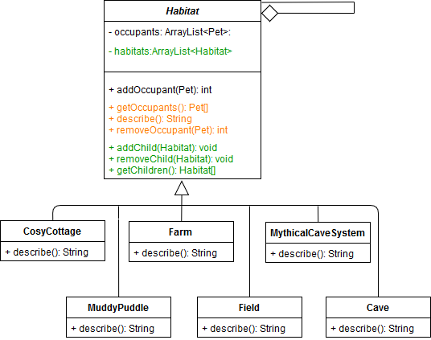
```


### Exercise 2b - The Adapter Pattern {#adapter}
In this part of the exercise we'll be focusing on the Adapter pattern. You will continue to modify the `Habitat` codebase.

In this task, you should look to apply the Adapter pattern to make a legacy class `FieryMountains.java` available as a possible `Habitat`.
`FieryMountains` was implemented many years ago for a previous game but has lots of neat graphics that the team want to reuse. You should use the Adapter pattern to `FieryMountains` to be used as is, as a new `Habitat`. You absolutely must not modify `FieryMountains.java`, and it must be used in your final solution (i.e. you can't just copy and paste a few values out and then just ignore it).

Note that this is the extension/secondary task for "Exercise 2 - Structural Patterns". Detailed instructions are therefore not provided, but a suggested approach might break the modification down into the following four further stages:

1. Create a new Java stub `FieryMountainsAdapter` that extends Habitat and stores a new `FieryMountains` instance as one of its attributes.
1. Write a new implementation for `FieryMountainsAdapter.describe()`, that complies with the signature provided for this method in `Habitat` and calls relevant functionality from `FieryMountains`.
1. Modify `HabitatDriver` to demonstrate that fiery mountains can be added to the `ArrayList` of Habitats, and that `Pet` instances (maybe a `Dragon`?) can be added as an occupant of `FieryMountains`.

You may find it helpful to make brief UML sketches as needed as you refactor the code towards the Adapter pattern.

<!--
%\subsubsection{Stage 4 - Add a new FieryMountainsAdapter class}
%\subsubsection{Stage 5 - Implement describe}
%\subsubsection{Stage 6 - Modify the driver}-->


## Workshop Exercise 3 - Creational Patterns {#creational}

This first section of the workshop focuses on applying the two Creational patterns introduced: Factory Method, and Singleton.

These two patterns should be more familiar to you, from your experiences in this and other courses. For example, you've previously looked at Stendhal's own `Singleton` class `RPWorld` in one of the early workshops.

For this exercise, you'll be working with the `Pet` and `Habitat` classes you've already seen.  This time we're using these classes together as part of a `Tamagotchi` application -- a simple text based application that lets users look after a virtual pet for a while.

In this workshop you'll be extending and then refactoring the codebase to explore how creational patterns can allow users to control instantiation of `Pets` and `Habitats`.


### Exercise 3a - The Factory Method {#factory}

In this part of the exercise we'll be refactoring \textbf{towards} the Factory Method to instantiate different `Pet` and `Habitat` classes at runtime^[Note that it would also be possible to achieve this using Reflection, but in this case we'll be demonstrating how a Factory Method might be applied.]

This is a much simpler change than previous changes, and can most likely be achieved in 3 stages:

1. Add a new `PetCreator` class that creates `Pet` objects in response to a `String` parameter.
1. Add a new `HabitatCreator` class that creates `Habitat` objects in response to a `String` parameter.
1. Modify the `Tamagotchi` class to use the new classes, passing user input in as the `String` parameters.

You should now be able to carry out these changes without the more detailed instructions of previous exercises.


### Exercise 3b - The Singleton Pattern {#singleton}
In this final part of the exercise you should consider if there is a sensible application of the Singleton pattern in any of the application code you have worked with in today's exercises.

`Document version:` `r format(Sys.time(), '%d %B, %Y')`

<!--chapter:end:09-patterning.Rmd-->

# Risk management  {#risking}

```{r xkcd-risk-fig, echo = FALSE, fig.align = "center", out.width = "99%", fig.cap = "(ref:captionxkcdrisk)"}
knitr::include_graphics("images/covid_risk_chart.png")
```

(ref:captionxkcdrisk) Just like life, software engineering is inherently risky. [COVID Risk Chart (xkcd.com/2333)](https://xkcd.com/2333/) by [Randall Munroe](https://en.wikipedia.org/wiki/Randall_Munroe) is licensed under [CC BY-NC 2.5](https://creativecommons.org/licenses/by-nc/2.5/)


## Course content

Course material for this chapter is on blackboard [online.manchester.ac.uk](https://online.manchester.ac.uk)


`Document version:` `r format(Sys.time(), '%d %B, %Y')`

<!--chapter:end:10-risking.Rmd-->

# Open source challenge  {#opening}

## Introduction

Contributing to open source software is a great way to get experience, it looks great on your CV (so will improve your chances of being invited to job interviews) and also helps you to develop your skills and knowledge. [@experiencing; @spinellis]

In this workshop, you can work alone, in pairs or in small groups to put everything you have learnt this semester into practice, aiming to fix an issue (and create a pull request) for an open source system of your choice.

The workshop builds on all the techniques given in previous workshops for working with large and/or unfamiliar codebases.
Hopefully any pull request you put together today will be the [first of many](http://firstpr.me) ...


## The challenge {#challenge}

Working alone, in pairs, or in small groups... **find and fix an issue for an open source system of your choice**.
You may work on a project in any programming language you feel comfortable coding in.

## Identify an appropriate project {#projecti}

Make sure you have a project that:

* accepts new contributions
* has a license / contribution policy that you're happy with.
    + Do you need to complete a contributors agreement?
    + Is there a specific programming style you need to stick to?
* you can easily download, build and run
* you can run relevant tests for
* is in a programming language you're familiar with
* uses a toolchain that you're (mostly) familiar with
* has an issue tracker with open issues

Some Java projects that might work for you:

* [jitsi.org](https://jitsi.org) - A Java audio/video/chat client. Uses Ant and JUnit, hosted at [github.com/jitsi/jitsi](https://github.com/jitsi/jitsi). As of July 2021 there are [46 open issues tagged with help-wanted](https://github.com/jitsi/jitsi/labels/help-wanted).
* [junit.org](http://junit.org/junit5) - The next generation of JUnit (Java testing). Hosted at [github.com/junit-team/junit5](https://github.com/junit-team/junit5), as of July 2021  there are [14 open issues tagged with up-for-grabs](https://github.com/junit-team/junit5/labels/up-for-grabs).

You'll also find Java projects listed on [up-for-grabs.net](http://up-for-grabs.net). You may also find ideas on at [twitter.com/yourfirstpr](https://twitter.com/yourfirstpr). Some [more suggestions for open source projects](https://www.cdyf.me/experiencing.html#opensource), including many in Python and other languages see *Coding Your Future*. [@experiencing]

### Find an interesting issue to work on {#findanissue}
You'll need to identify an issue for your group to tackle. You should check that:

* Your issue is one that you can replicate (i.e. you should be able demonstrate to yourselves that there really is a problem).
* Your issue is one that the project team are open to contributions for.
    + Some issues may have been addressed but not released yet
    + Other issues may already be in progress
    + Some may be issues that the project team are choosing not to address (e.g. for backward compatibility reasons, or because they consider the issue to be a feature, not a bug).

* Your group agree that your chosen issue is something that you have the skills to address.

### Fork and clone the repository {#forklone}
You'll need a copy of the codebase to work on. Exactly how to achieve this may vary based on how the project is hosted.

For GitHub hosted projects you'll usually fork a repository, and then clone your forked version.

See [help.github.com/articles/fork-a-repo](https://help.github.com/articles/fork-a-repo/)

### Branch, change and push {#bcp}
Work on the issue as a team. Once you're happy that you've addressed the issue, run any relevant tests again. If all the tests pass and you're confident that you've met all the requirements for contributors, then now's the time to push changes up to your forked repository.

### Notify the repository creator (make a pull request) {#pullrequest}
Once everything is complete, you'll want to feed your work back to the original codebase.

For Github-hosted projects you do this by making a pull request: [help.github.com/articles/creating-a-pull-request](https://help.github.com/articles/creating-a-pull-request). You may also want to: post to relevant mailing lists/forums, contact the project owner on twitter.

`Document version:` `r format(Sys.time(), '%d %B, %Y')`

<!--chapter:end:11-opening.Rmd-->

# (PART) Team study materials {-}

# Starting Stendhal {#starting}

## Introduction

At the start of the first team coursework exercise, a GitLab repository will have been created for your team, containing the code base that you will work with across the semester.  This repository contains a version of the source code for Stendhal: a multi-player online adventure game.  It is built on top of the Marauroa game engine that we work with in the early workshops for the course unit.  Although it is a game, Stendhal functions much like the kinds of software systems that keep industry, governments and the non-profit sector functioning.  It is a multi-user, multi-threaded, client-server system that uses secure sockets to communicate over the Web.  It also implements many business rules, and must manage stored data using a database.  It therefore provides us with a good training base for learning modern software engineering skills.

<!--\infobox: This year, to help us all adjust to remote working, we are making the repositories for the team coursework available ahead of the start of the exercise, to allow more time for us to troubleshoot any technical problems you may have with obtaining the code base. \medskip

So this document covers two team study sessions: the one on 7th October and the one on 12th October.
}-->

In the first team study Sessions, you'll meet your team and get your first look at the code base we're going to be working with.  After spending some time getting to know your fellow team members, please work through sections 1--3 of this document.  By the end of this, you should all have a clone of the repository on your VM.

If that all works smoothly for you all, you can start working through sections 4--8 together.  Those sections show you how to build the system when you make changes, how to run the server and client for the game, and how to run the tests.  But some of you may have technical difficulties that will take a few days to sort out.  So don't worry if you don't get very far through those sections on the first day.

In the second team study session, you can get started on the coursework.  Instructions for that will be made available on that day and the issues your team will need to solve will be copied to your repositories ahead of that team study session.

So, in the team study session, you should finish working through steps 4--8 of this document, and should look at the coursework instructions to begin planning how you will work together to complete the tasks by the deadline.

After completing the steps in this document, every team member should be able to achieve the following core tasks Within the IDE selected by your team:

* Acquire a local copy of the code (by cloning your team's Stendhal repository from GitLab).
* Figure out how to build the Stendhal components (both client and server).
* Figure out how to run the tests for Stendhal, and how to see the results.
* Figure out how to run the code for Stendhal on your local machine, so you can see the effects of your changes in the game.

This document will guide you through the steps needed to achieve this goal.  You should meet online with your team, using your preferred online meeting tool, and work through the document together.  For this activity, everyone in the team should carry out the steps on their own machine.  You might choose to have one team member share their screen while everyone carries out the steps at the same time, so everyone can see what the outcome of each step should be.  (But be aware that step 3, cloning the code base, may take some time, especially if many students are accessing the GitLab server at the same time.)

::: {.rmdnote}
(ref:infobox)

**Working As a Remote Team**

For this first activity together as a team, you'll need to experiment with some ways of organising yourselves so that you can collaborate effectively on the project together, while some of you may be located remotely.  Fully or partially remote software development teams are now commonplace in industry.  This coursework gives you a chance to experience some of the challenges and opportunities of this way of working.  How will you communicate with each other?  How will you know who is working on what?  What will you do if a team member gets stuck?  How will you give and ask for help? How can you prevent people online feeling like second-class citizens?

Remember that everyone will be working on different equipment and in different environments.  Be patient if someone seems to be falling behind.  They may be working on a slow machine, or over a low bandwidth connection.  Be kind if someone seems to be struggling.  They may not have a quiet place to work, or may be worried about their health or the health of family members.

Everyone in the team needs to feel comfortable about reporting difficulties with carrying out any part of the work to the team, so that you can support one another.  Think now about how you personally can create a culture of trust and respect within your team. Think about your tone of voice and choice of words when speaking.  Think about how you can listen actively and productively when other people speak.  How can you make sure that everyone's voice is heard and everyone's talents are recognised?

:::

You can find lots more information about the code and the game on the main Stendhal website at:


[stendhalgame.org](https://stendhalgame.org/)

On this website, you'll find a development guide plus lots of end-user documentation and a wiki describing the world in which the game is set.


## Choosing an IDE {#idelike}

Probably the first thing your team needs to do is agree what IDE you will use.
<!--%  Within the School, we have access to versions of IntelliJ IDEA, NetBeans and Eclipse.-->
You are welcome to use any Java IDE for your team, but you must use a proper IDE.  Glorified text editors are not accepted for this coursework.  This is not because IDEs are always better for all tasks.  The aim is to ensure that you all have experience of working in depth with at least one IDE, so that you can understand the strengths and weaknesses, compared to other, simpler development environments.

It is recommended that you choose a single IDE that the whole team uses.  It is perfectly possible for different team members to use different IDEs, and we don't disallow this.  But it adds an extra layer of complexity to the process of shared coding, and requires a certain level of confidence with Git and the IDEs in question to work.  (For example, you'll need to decide whether to put the configuration files for all IDEs used under version control, and to make sure that none of these share the same name.)  Since you'll be facing plenty of other technical and team work challenges in this coursework, you may wish to avoid adding extra, unnecessary complications to your team's workflow.  All agreeing to use the same IDE is one way to do this.

As mentioned elsewhere, although teams are welcome to choose any of the standard Java IDEs, we are only able to provide technical support for (ref:ideversion) on the Linux VM provided by the Department for this coursework exercise.  The Stendhal team use Eclipse, and so the code is already set up as an Eclipse project.  If you use this IDE, the project will come all ready set up for you.  If you choose another IDE, you'll have some set up work to do for yourselves, to get the project into the right configuration.

<!--%We'll do our best to help teams using other IDEs, but can't guarantee we'll be able to fix the problems in the timescales needed by the coursework deadlines.-->


## Acquiring the Code {#acoding}

We have set up a repository for each team on the school's GitLab server.  This contains a close copy of the actual Stendhal code base.  We've make some changes to make the code base more suitable for the work you are going to be doing with it.  The extent and nature of the changes will be different every year.  For this year, with students working remotely on their own machines, we've had to take the drastic action of removing all the commit history, to convert the repository from it's usual 1.5Gb size to something more manageable.  We've also removed some large binary files that were not needed for the coursework you will be doing.

You will have been e-mailed with a link to your team's repository when it was created.  The first step is for each team member to make a local clone of this repository in their own account (preferably in the VM supplied by the Department). You might want to do this as a team exercise, initially, with team members grouped around a single machine.  *But all of you will eventually need to carry out these steps in your own filespace before you can get started on the coursework.*

To make a local clone, you should follow the same set of steps we used in the first individual coursework (and in the workshops in week 1, for those of you who will have completed the workshop by the time of this team study session).  Check back to the coursework instructions if you can't remember the details or if you have not yet completed it or the week 1 workshops.

You can get the URI for your team's repository by logging onto GitLab, finding the Stendhal project in your Projects list and navigating to its main page.  You'll be able to copy the URI onto your clipboard from here, using the blue `Clone` button.  You can use either protocol^[The SSH protocol is faster, but requires you to have set up a PGP key on the machine or VM you are working on and registered it with your GitLab account before reaching this stage.]

You will need to select a branch to checkout when you create the clone.  The Stendhal team use the `master` branch as their main development branch.  We'll choose that as our starting point, too.

<!--%The Stendhal project is a large code base, and may take some time to clone---especially if many other students are trying to clone at the same time.-->

If you have difficulties in creating the clone, see the trouble shooting guide in our online Lab Help wiki:

* Index for trouble-shooting from error messages: [wiki.cs.manchester.ac.uk/index.php/LabHelp:Errors](https://wiki.cs.manchester.ac.uk/index.php/LabHelp:Errors)
* Index for trouble-shooting from more general symptoms: [wiki.cs.manchester.ac.uk/index.php/LabHelp:Symptoms](https://wiki.cs.manchester.ac.uk/index.php/LabHelp:Symptoms)


## Building the Code {#bcode}

Since the version of Stendhal we are working with uses Java as the main implementation technology, the built-in Eclipse Java compiler will be able to compile the source files for you, without your needing to request it.  (In fact, like most IDEs, Eclipse will automatically recompile source files after each small code change, so that errors can be highlighted in the source, while you are typing --- a very useful facility.)

But, as we saw in the workshops in week 1, there is more to building a system than just compiling the Java classes.  The Stendhal team use an Ant script to describe how to build their system.  We showed you how to do this for the Marauroa code base in the workshops in week 1  see *Building and Testing Marauroa* in chapter \@ref(building).  You should apply the same approach to invoke Ant to build the Stendhal code base.


## Running the Test Suite {#testsuites}

There are two ways to run the test suite for Stendhal, and you should become familiar with both of them.


### Running the Test Suite Through Ant {#antrunning}

First, run the test suite using the Ant build file.  This will set up everything needed to run the test suite (including the necessary database configuration files).

To do this, follow the same procedures we used in the week 1 workshop to run the Maraurao tests, using the Ant view within Eclipse.  Open the Ant view and add the Stendhal project build file to the view.  Open up the list of targets and look over them quickly.  There are several targets that appear to be related to tests in the Stendhal Ant build file.  The target you should use is the one called `test`.  All other targets containing the word “test” are intermediate targets and you should not run them directly.

Notice that the process of compiling the code and running the full test suite takes a little while (as did cloning the repository).  Depending on the load on the network, this can take anything between 3 and 10 minutes to run.  With such a large code base and test suite, we have to factor compilation and test running times into the way we work, since they introduce a noticeable delay.


### Run the Tests Using the Eclipse JUnit Plugin {#junitplugin}

<!--%NEED TO ADD A SECTION ON SETTING UP JUNIT RUN CONFIGS TO RUN SINGLE TESTS!
%EXPLAIN ABOUT THE DATABASE AND CONFIG FILES.  WHY DOES THE root folder HAVE TO BE ON THE CLASSPATH
%WHY DOES THE JUNIT CONFIG NEED THE JARS SPECIFIED WHEN THE OTHER RUN CONFIGS DON'T?-->

The second approach is to run the tests within Eclipse using the JUnit plug-in and a Run Configuration.  This is a little more complicated than running the tests through JUnit in the first individual coursework, because we need to configure the class path and the database.  Instructions on how to do this can be found on the Stendhal wiki at:

[stendhalgame.org/wiki/Stendhal_on_Eclipse#Running_JUnit_Tests_in_Eclipse](https://stendhalgame.org/wiki/Stendhal_on_Eclipse#Running_JUnit_Tests_in_Eclipse)


These instructions are mostly correct, but you'll notice some slight changes when working in the newer version of Eclipse that we are using.  See the box below for details.

::: {.rmdnote}
(ref:infobox)

The version of Eclipse we are using already puts all the Jars on the classpath for your JUnit configuration.  You can skip that step.

However, you still need to add the root folder, as described.  On some operating systems, you won't find a tab labelled "Classpath" in your Eclipse run configuration wizard.  Instead, it is called "Dependencies".

On these same platforms, you should click on "Classpath Entries" instead of "User Entries" to add the root folder.

:::


Be sure to follow the instructions carefully, or you may find that the test suite does not run.  It is especially important that you set the class path correctly, and include the project root folder on the class path.  As well as allowing classes to be found and run, this allows the Stendhal server to locate the XML configuration files that contain important details of the game world, including items, creatures, zones and locations.

Check the Department's [Lab Help Wiki](https://wiki.cs.manchester.ac.uk/index.php/LabHelp:Errors)if you have problems.  There are several pages there for help specifically with working with the Stendhal code base.

::: {.rmdcaution}

(ref:cautionbox)


**Run the Tests Using Ant First**

If you decided to run the tests through the JUnit plugin before running them through Ant, you may have been surprised to notice a significant number of errors cropping up, causing many of the tests to fail or be blocked.  This is because you do not have the correct configuration files set up to be able to access the database that forms the back-end storage of the game.  The Ant build script includes instructions to check whether the required configuration file exists, and to create it if it does not.  This shows a advantage of an automated build tool like Ant, over a simple test harness like JUnit.


:::

You should immediately notice some benefits to running the test suite through Eclipse with a Run Configuration, compared to running the tests from Ant.  On the console window, you will see the logger output from running the tests, which can be very helpful in tracking down the cause of failing tests.  And the results of *all* the tests will be visible in the JUnit window, in a way that allows easy navigation between the test case failure and the code under test.

Take a look at the results from executing the test suite through the Eclipse JUnit plugin.  We've set up the repository so that all the tests should pass, so you should see a green bar in JUnit.  However, as is not unusual in large complex code bases, there is one test that seems to be failing intermittently on some platforms.  If this happens with your team, please report it to Anas.  We'll supply you with a fix.

<!--You will see that there are lots of tests, and that most of them pass successfully.  But you will also see that some tests are failing.  To get more information about these, press the ``Show Failures Only'' button on the JUnit toolbar.  It's the button with a small red cross and a small blue cross, three icons from the left:
%
%\dialogue{JUnitToolBar}
%
%\noindent
%This toggle switches the JUnit View between showing all test results and showing just the failed test %results.
%
%\infobox{
%{\bf Failing Tests in a Public Repository?} \medskip
%
%Although in an ideal world, no code versions would be committed to a public repository with failing tests, in practice this can be hard to achieve.  It is actually very common for real test suites to contain a few tests that don't pass.  This is because writing tests for some kinds of functionality can be tricky and expensive.  Sometimes, the cheapest and easiest way to write a unit test isn't always the most reliable.  Tests can be {\em unreliable}; that is, they can sometimes pass and sometimes fail, even when no changes have been made to the code under test.  Tests can also be {\em brittle}.  This means that they are highly sensitive to small changes in the environment in which the code runs.  Dependencies of this kind can mean that failing tests sometimes indicate a problem with the way the test is written, rather than a problem with the production code being tested. \medskip
%
%Brittle and unreliable tests are a problem because they mean that developers stop interpreting a red bar from a test suite execution as a problem they need to fix now.  Ideally, we need to keep the test suite status green most of the time, so that we sit up and take notice whenever it turns red.  If JUnit always (or often) gives a red bar, because of the brittle tests, then we lose this useful early warning signal when bugs enter the code.  Later in the course unit, we'll look at ways to minimise the kinds of dependencies that cause problems of this kind.
%}
%
%Take a few minutes to look over the failing tests as a team.  Looking only at high-level features of the test and production code, can you decide whether the cause of the failure lies in the production code (i.e., the failing test is revealing a bug) or in the way the test is written (i.e., the failure reveals a problem with the test suite).  Or maybe you can't decide in the time available.-->


### Running Individual Tests Using the Eclipse JUnit Plugin {#eclipsej}

The run configuration we've just set up allows us to execute the complete Stendhal test suite.  Often, when developing, we want to execute the tests within a single Java test class, to avoid the delay involved in waiting for the whole test suite to execute.

As mentioned, with a larger, more complex software system, we can't just right click on individual tests in Stendhal and expect to be able to run them “As JUnit Tests”, as we did in the individual coursework.  Any test case that needs access to the game data that is configured through the XML files, or that is stored in the game database, needs to have the class path set up with the root folder of the project on the path, for example.

Therefore, if you want to run the tests in an individual Java test class, you have to create a run configuration for that class, just as you did for the whole test suite.  Remember to add the Jar files to the class path (if your IDE doesn't already do that), and the project root, to allow the test cases access to the data they need to do their job.


## Running the Code {#coderunning}

The final step is to run the code on your local machine.  Note that **you should not run the public version of the Stendhal game**.  Instead, you must run the version that is built from your local copy of the code, and that connects to your local copy of the game database.  Otherwise, any changes you make to the code will not be visible in the code that we run.

<!--% TODO architecture diagram for Stendhal?-->

To run your local Stendhal, you'll need to set up two new run configurations in Eclipse, in addition to the run configuration you set up for the JUnit tests earlier.  One of these run configurations will start a Stendhal server running on your local machine, and the other will run a client on your local machine.

Help with doing both these things in Eclipse is available from the Stendhal wiki, at:

[stendhalgame.org/wiki/Stendhal_on_Eclipse#Start_StendhalServer](https://stendhalgame.org/wiki/Stendhal_on_Eclipse#Start_StendhalServer)

[stendhalgame.org/wiki/Stendhal_on_Eclipse#Start_Stendhal_Client](https://stendhalgame.org/wiki/Stendhal_on_Eclipse#Start_Stendhal_Client)

The process is straightforward if you follow the instructions carefully, bearing in mind the slight changes to the Eclipse interface mentioned when we set up the testing configuration.  You can also check the Department's [Lab Help Wiki](https://wiki.cs.manchester.ac.uk/index.php/LabHelp:Errors), if you have problems.  We've put pages there to help with the most common errors students make while carrying out this process.

::: {.rmdnote}
(ref:infobox)


**Run Configurations vs Debug Configurations**

The instructions from the Stendhal team suggest you create Debug Configurations.  Instead, we suggest for now you create Run Configurations.  The only difference is that when we run the code using debug configuration, Eclipse will stop and launch the built-in debugger whenever a breakpoint is reached, while with a run configuration breakpoints are ignored.  You shouldn't need to use the debugger for most of the work you do with Stendhal, so run configurations are the most appropriate.  And you can always run the configurations you create as debug configurations later, should you need to.

:::


## Creating a Local Stendhal Account {#saccount}

When you have run both the server and the client, you will need to create an account on your server to use in manual testing.  Use `localhost` as the name of the server to connect to (since you want to connect to the server running on the machine you are using, and not the public Stendhal game server).  Keep the default port number that is already filled in on the form.  You can choose your own username and password.  These will be stored in the local database for your server, so you won't need to re-enter them next time you log in.  (Obviously, you should **not**} use your university username and password for this purpose.)

```{r createLocalStendhalAccount-fig, echo = FALSE, fig.align = "center", out.width = "75%", fig.cap = "Create local Stendhal account"}
knitr::include_graphics("images/createLocalStendhalAccount.png")
```

When you login with this account, be sure to use `localhost` as the server address:

```{r loginToLocalStendhalAccount-fig, echo = FALSE, fig.align = "center", out.width = "75%", fig.cap = "Login to local Stendhal account"}
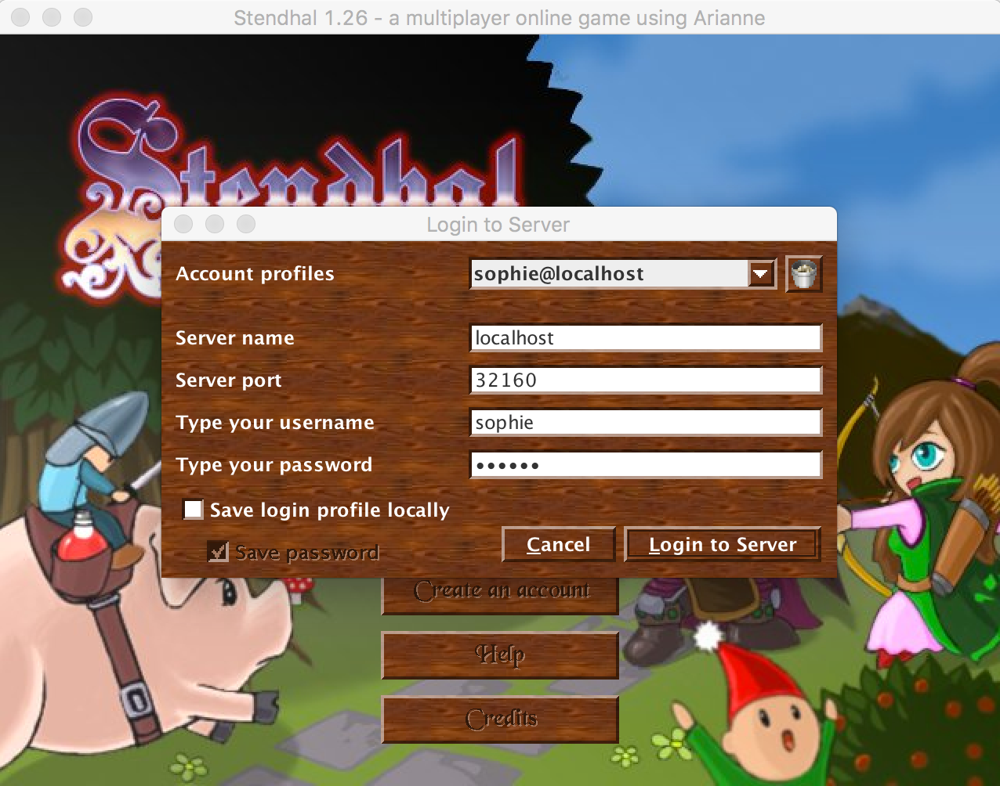
```

If you use the main Stendhal game server address, you will be connecting your local client to the public version of the server, running on a machine outside the University, and you won't see the effects of any changes you have made to your copy of the code.


::: {.rmdnote}
(ref:infobox)

**Important Note about Running Stendhal**

It is not necessary for this coursework to run Stendhal in true multiplayer mode, on a public server.  Nor is it necessary for you to set up and host your own public server.  You should run a local server on your machine and connect to that for all manual testing needed in this coursework.  If you need to test a feature that requires the interaction between two players, you can run two copies of your client on your local machine, connecting both to your local server.  (The good news about this is that you won't use a network at all, so you can run the game, and test your changes, regardless of any network downtime or overloading.)

Finally, it is not necessary to play the Stendhal game to complete this coursework, any more than it would be necessary to take out house insurance when maintaining software for an insurance company, or to be x-rayed when working on software that controls medical scanning equipment.  You'll need to run the game, and try out specific features, but later we'll look at special testing features embedded in the game to allow you to bypass the need for anything but the shortest trial sessions with the game.

:::


## Getting to Know the Code {#knowcode}

When you can run the version of Stendhal that is in your repository, you can try out some code changes and see if you can see their effects when you run the code.  Here are some examples you can try.

Can you work out how to make Hayunn Naratha, the first non-player character you meet in the game, give lots of experience points and/or money when you talk to him?  Can you change his greeting?

How about changing the prices of the items being sold in Semos city---by Carmen, Margaret (in the Inn) and Xoderos (in the Blacksmiths near to Carmen), so everything is really cheap?  To get to Semos from the game starting point, leave the guard house and follow the path down and left.

Can you change how many health points you get from eating or drinking the items sold by Margaret?  Or make the player receive the health points faster?

A suggested approach to making these changes is:


1. Run the game to see how the component you are trying to change works.  All the suggested changes are based around items and characters that you will encounter within the first few minutes of playing the game.  Don't try to complete any quests or interactions with the other non-player characters.  Just focus on seeing the specific functionality you are trying to change in action.
1. While interacting with the game, note down keywords that can help you locate the code you are looking for.  Character names, item names and location names are all useful pointers.
1. Use the keyword search facility in your IDE to locate candidate files/lines to examine.  In Eclipse, use the *Search* > *File Search* menu command to search for keywords occurring anywhere within your repository. Hint: remember to look at configuration files as well as program code.  Not all of the game's functionality is described in Java code.
1. Make the changes to the code, save and rebuild.  Don't commit, and certainly don't push your changes, as we are just experimenting at this stage.
1. Run the tests to make sure you haven't broken anything that used to work.
1. Shutdown and restart your local Stendhal server, so that the version you are running definitely contains the changes you made.
1. Shutdown and restart your local Stendhal client, so that the version you are running definitely contains any changes you made.  Make sure you connect to your local server when you next log in.
1. Go to the place in the game where you made the change, and see if the new behaviour is as you expect.

When you’ve worked through these exercises as a team, you are ready to get working on the coursework.  Don't forget to undo any changes you've made while experimenting, so that you can start the coursework from a clean version of the code.  (The quickest way to do this is to checkout any files you have changed, so that they are overwritten with the version from the `master` branch.  In Eclipse, this can be done by right-clicking on your project name in the `Package Explorer` view, and selecting the `Replace with` > `HEAD revision` option.)

::: {.rmdnote}

(ref:infobox)

**Important Note for Open Source Coders**

The code base that we have provided you with for this coursework is *not* the same as the public Stendhal project code base.  Each year, we make some changes to suit the purposes of the coursework.  This year, we have made quite drastic changes, to cope with the change to remote learning.

All this means that, if you are interested in contributing some code to the Stendhal project, you should first get a clean and up-to-date copy of their actual code base to work from.  The bulk of the code base we are working from is the same, but there are just enough differences to mean that any patch/pull request you create might not be usable (or even recognisable as useful) by the Stendhal team.

The Stendhal dev team are very welcoming, and say they will be very happy to receive contributions from any student taking (ref:coursecode).  Information about how to contribute can be found on the Stendhal Game website.
:::

Good luck!

`Document version:` `r format(Sys.time(), '%d %B, %Y')`

<!--chapter:end:12-starting.Rmd-->

# Industrial mentoring {#mentoring}

Hello, welcome and thanks for your interest in our software engineering mentoring program. This chapter is aimed primarily at **mentors not students** so if you're a student on this course you can go ignore this bit and go straight to chapter \@ref(ourmentor) to find out more about how mentoring works.

If you're a mentor (or a potential mentor) read on...

```{r mentoring-fig, echo = FALSE, fig.align = "center", out.width = "100%", fig.cap = "(ref:captionmentoring)"}
knitr::include_url('https://youtube.com/embed/H3rnYhd5hx8')
```

(ref:captionmentoring) An outline of software engineering mentoring at the University of Manchester. You can also watch the 13 minute introductory video for mentors at [youtu.be/H3rnYhd5hx8](https://youtu.be/H3rnYhd5hx8)

A short video explaining our software engineering scheme is shown in figure \@ref(fig:mentoring-fig) which describes:

* the course and our students, see sections \@ref(thecourse) and \@ref(aboutus)
* employers who are currently involved, see section \@ref(thanks)
* what we ask of volunteer mentors, see \@ref(mentoringscheme)
* what mentors get in return for volunteering, see \@ref(payback)
* how to sign up, see \@ref(registration)

## When are the mentoring sessions? {#when}

There are two one hour sessions timetabled, where you will meet with the same team. Please only register if you can make BOTH of the sessions in the Allotted time:

1. **Thursday 21st October 2021 at 11am** BST (GMT+1) London (on Zoom)
1. **Thursday 18th November 2021 at 11am** GMT London (on Zoom)

These are the only times when we can guarantee that everyone in a given software engineering team will be available. Timetabling 400+ students is complicated as they are all on different degree programs with different options selected. This is why the mentoring sessions are rigidly fixed.

## I'm interested, how can I register? {#registration}

We are looking for around 60 mentors in September 2022, a registration link will appear here closer to the time. When we are oversubscribed we will give higher priority to:

* returning mentors, those employers who have already supported the scheme (see section \@ref(thanks))
* female mentors, because women are under-represented in our community
* BAME and other minority group mentors
* alumni, especially former students who have done this course since 2016
* local employers, as part of the University's commitment to [civic engagement and social responsibility](https://www.manchester.ac.uk/discover/vision/#panel-civic-engagement)

<!--
registration link was
* [zoom.us/meeting/register/tJUrdO-rqDgiGtcKDTP_Zj_d_oWTPznHYl8t](https://zoom.us/meeting/register/tJUrdO-rqDgiGtcKDTP_Zj_d_oWTPznHYl8t)-->


## About us {#aboutus}
The Department of Computer Science at the University of Manchester [www.cs.manchester.ac.uk](https://www.cs.manchester.ac.uk) is one of the oldest and biggest in the UK. The [world's first stored-program computer](http://www.computinghistory.org.uk/det/6013/The-Manchester-Baby-the-world-s-first-stored-program-computer-ran-its-first-program) (the “[Manchester Baby](https://en.wikipedia.org/wiki/Manchester_Baby)”) was developed here in 1948, by the engineers and scientists who would go on to found the Department. This was followed by:

* the first floating point machine
* the first transistor computer
* the first computer to use virtual memory

This history of innovation continues today with cutting-edge research projects like SpiNNaker (part of the Billion Euro [Human Brain Project](https://www.humanbrainproject.eu/)) which has built a [million core ARM-powered neural High Performance Computer (HPC)](https://apt.cs.manchester.ac.uk/projects/SpiNNaker/project/). This is the world’s largest neuromorphic supercomputer.

In the most recent government ranking of all research across the UK, the School was ranked 4th in the UK (based on GPA), and was assessed as having the best environment in the UK for computer science and informatics research. Since awarding the first undergraduate degrees in Computer Science in 1965, the school has awarded 10,000 degrees in Computer Science at Bachelors, Masters and Doctoral level. Our students are sought after by employees, and are active (and successful) in taking part in major coding competitions and hackathons.

As of 2022, our [entry tariff is A* A* A*](https://www.manchester.ac.uk/study/undergraduate/courses/2022/00560/bsc-computer-science/) with an A* in Maths, and a minimum of one Science subject at A*. As this is a second year course, students already have some experience of programming in Python and Java from their first year undergraduate study, see section \@ref(prereq).

You can find out more about mentoring and other business engagement activities at [www.cs.manchester.ac.uk/connect/business-engagement/industrial-mentoring/](https://www.cs.manchester.ac.uk/connect/business-engagement/industrial-mentoring/)

## About the course {#thecourse}
If you volunteer, the course unit you will support is our second year compulsory course on [Software Engineering 1 (COMP23311)](https://studentnet.cs.manchester.ac.uk/ugt/COMP23311/syllabus/). This is a year-long course unit that is taken by students on all of our undergraduate programmes followed by [Software Engineering 2 (COMP23412)](https://studentnet.cs.manchester.ac.uk/ugt/COMP23412/syllabus/). The course focusses on the skills and expertise needed to be able to work with a large body of open source code. Students will gain experience of

* fixing bugs in code written by other people
* writing and automating tests using test first development
* adding new features to code without breaking the existing functionality
* making larger scale architectural changes to improve non-functional properties of the system

 ...all while keeping the system up and running for its users.

For the 2021/22 academic year, we have a cohort of more than 400 students taking Software Engineering. They will be working in small teams of around 7 students to undertake team-based coursework assignments across the semester, and a final examination in the summer.

As well as learning about the academic discipline of software engineering, students take this course unit to gain key employability skills, to prepare them for interviews for industrial placements and graduate positions, and to allow them to hit the ground running when they do start work.

## About the Mentoring Scheme {#mentoringscheme}
As a mentor, you are asked to meet with your team of students twice, to work with a team of students for around an hour each time using Teams/Zoom. The visits take place in specific weeks, during time when the teams are scheduled to be working on their Software Engineering coursework, see section \@ref(dealing). The dates/times for the visits are described in section \@ref(when). Both sessions are fifty minutes long.

## Meeting agenda {#agenda}
After a quick round of introductions, we suggest the following questions may be useful for structuring your meeting:

### Getting to know your team {#teambuilding}

Questions to get to know your team:

* What degree programme are you studying?
* What ideas do you have about your career?
* What interests you about computers/building software?
* Are you thinking of doing an industrial year, or a summer placement?
* What is the largest piece of software you have built/worked with so far?

### Challenging and guiding the team {#challenging}

Questions to challenge and guide your team:

* What are you working on at the moment?
* How are you coordinating work within your team?
* What sorts of challenges are you facing at the moment?
* What team working issues have you faced so far?
* How did you divide the work between the team members?
* How do you think your team is performing? How do you know?
* Are you on target to meet your next deadline? If yes, how do you know that?

### Questions the Students Might Ask Mentors {#studentqs}

*Questions about the mentor*:

* Can you give a brief overview of your career up to this point?
* How did you get into the job you are doing today?
* What do you enjoy about your current role?
* Was there anything that surprised you about working in industry compared to being a student?

*Questions about team-work*:

* How do you resolve technical disagreements in development teams?
* How do you deal with personality clashes within your team?
* How do you encourage people to recommit to the team?
* One of our team members isn’t contributing. Would this happen in industry? How would you resolve these problems?

*Questions about the process of developing software*:

* What processes/methodologies do you use in your company?
* What software tools do you use and why?
* What process do you use to release software in your company?
* What code review practices do you use?
* What makes a good commit message?
* What does a good test look like?
* How big is the software system you are working on now?
* What techniques do you use when working with code written by other people?
* How can we avoid getting into a mess when using Git (or other version control systems)?
* We’re having a lot of trouble fixing this bug/making this change? Do you struggle with this too? How would you go about dealing with this sort of problem?

*Questions about employability*:

* What skills do I need to be competitive in job applications?
* What skills do you look for when you are hiring people?
* What do you know now you wish you’d known as a student?
* What are the current trends in software development?
* What up-and-coming topics do you recommend we should know about?
* What can I do to make my CV stand out when applying for placements/jobs?

## What do mentors get in return? {#payback}
There are several benefits for you and your employer as a mentor:

1. Increasing visibility of your employer as an organisation that makes high quality software
1. Share your knowledge and expertise: employers often complain that students could be taught better, this is your chance to improve the quality of teaching and prepare students for the workplace by making them aware of the realities of modern software engineering
1. Career development: this is an opportunity for junior software engineers to demonstrate leadership and mentoring skills
1. Digital badge: we're offering signed digital badges as micro-credentials to thank our volunteer mentors
1. Fun: Many of our mentors enjoy the experience of working with young people as they take on a big software engineering project, often for the first time

## Who are the mentors? {#thanks}
We would like to thank all of our collaborators, partners and industry club members who have helped us to date including:

(ref:mentors)

Thanks also to over 1,500 students who have taken the course since its inception in 2016 and given us feedback on how to improve it.

`Document version:` `r format(Sys.time(), '%d %B, %Y')`

<!--chapter:end:13-mentoring.Rmd-->

# Your mentor {#ourmentor}

Your mentor is a professional software engineer from one of the employers listed here: (ref:mentors)

Your mentor will meet your team twice on Zoom during the mentoring sessions on Thursdays. They can help you understand how what you're learning on this course relates to software engineering in the real world. They can guide you on the *process* and the *politics* of your software engineering project.

Mentors have volunteered their time to help you, so make sure you ask them lots of questions, some suggested questions are shown in section \@ref(studentqs) if you need some inspiration.

It makes your mentors job a lot easier if you turn your camera on, see section \@ref(cameras)

## Introducing your team {#hellomentor}

Both you and your mentor will get more out of your meeting if you introduce yourselves as a team beforehand. This requires that one of you collates team information and emails the mentor *before* the meeting. We suggest the following as an example and template:


```md
from: flo.ting-point@student.manchester.ac.uk
to: $mentors-email
cc: neil; pen; peter; marge; polly; etc
subject:  Hello from Team X at the University of Manchester


Dear $mentors-name (or $mentors-names)

We'd like to introduce ourselves before our team meeting.

We are team $team-number

Our team members (modify as needed) include:

* neil.pointer@student.manchester.ac.uk
* pen.tester@student.manchester.ac.uk
* peter.byte@student.manchester
* marge.conlict@student.manchester.ac.uk
* rick.urshion@student.manchester.ac.uk
* polly.morphism@student.manchester.ac.uk
* etc

We look forward to meeting you on $date at $time on Zoom.

Best wishes

Florence Ting-Point
(On behalf of team X)
University of Manchester
```

You could (optionally) add more information about yourselves to help your mentor get to know you:

```md

Our team members (modify as needed) include:

* neil.pointer@student.manchester.ac.uk likes C
* pen.tester@student.manchester.ac.uk likes cybersecurity
* peter.byte@student.manchester likes big data
* marge.conlict@student.manchester.ac.uk likes version control
* rick.urshion@student.manchester.ac.uk likes functional programming
* polly.morphism@student.manchester.ac.uk likes O.O.P.
* etc
```


## But I'm not interested in employer x? {#dontcare}

If you are lucky, your mentor from employer $x$ will just happen to be working in a role or a sector that you are interested in.

If they're not, you can still learn lots from them. Software engineering is converging on standard practices which means you can learn a huge amount from our mentors, even if you're not especially interested in the employer they work for.

The way that high quality software is built in different industries is remarkably similar, from banks to technology companies and from e-commerce companies to consumer electronics.

`Document version:` `r format(Sys.time(), '%d %B, %Y')`

<!--chapter:end:13.5-experiencing.Rmd-->

# Synchronising {#syncing}

When you're working in a team, you need to synchronise with your team repository.

## Introduction {#syncintro}

In this activity, we'll take you through the process of synchronising your local Git repositories when your fellow team members have pushed new commits to your remote.  This is a team activity, which you should work through together in the team study session.
<!--You don't all need to be in the same location to carry it out, but you do need to be in communication so you can coordinate the various stages.  Obviously, that will be easier if you are all close by.-->

In the activity:

* One team member will make a commit to their local repository.
* That team member will push the commit to the team repository.
* Everyone else will fetch the commit down into their own local repository.
* Everyone else will synchronise their local branches with the remote tracking branches.

This document will guide you through the steps needed to achieve all of these goals, explaining some of the core Git concepts as we go.

::: {.rmdnote}

These instructions assume that no one has yet pushed any commits to your team repository.  If that's not the case for your team, you'll need to carry out steps 3 and 4 before getting started on these instructions.  Check the `Commits` page for your GitLab project to find out if any commits have been made since your repository was created.

:::

## Making a Local Commit {#locommit}

Choose one team member who will make and push the commit.  That person will share their screen with their team members, who will observe and make notes of the process, giving feedback and suggestions where needed.

We're going to make a change to the following file:

````md
/data/conf/admins.txt
````

This file is empty at present, but it has an important function for us as developers of the code base.  If the username of a Stendhal player is added to this file, that player becomes an administrator for the game, with access to lots of capabilities that ordinary players don't have.  These capabilities will be very important for replicating issues and testing the changes you need to make to the game, without having to actually play the game for long periods.

The capabilities available to admin level players are described on the Stendhal wiki at [stendhalgame.org/wiki/Stendhal:Administration](https://stendhalgame.org/wiki/Stendhal:Administration)

You should familiarise yourself with the main ones, so you can use them in testing your code changes in game.

The first step when making any change to a code base under version control is to decide where the commit should be made.  The commit we are going to make is a small self-contained change that is needed by everyone in the team.  So, we are going to make the commit directly onto the main development branch.  Obviously, if the change had been more complicated or affected more files, we would want to first make the change on a feature branch.  But the simple Git workflow the Stendhal team use allows for commits to the development branch, and the commit is small and simple.  Most importantly, the change is not to the program code of the system; we can't introduce compile errors with this change and it seems unlikely that it would cause any existing tests to fail.  It is therefore probably safe to make directly onto the development branch, provided we check the effects of the change carefully before committing and pushing.

We begin by checking out the correct branch: the `master` branch.  If you have done this correctly, you should see the name of this branch next to your project name in the `Package Explorer` view.

<!--%screen{packageExplorerViewShowingMasterBranchCheckedOut}-->

Our commit will set up the admin level players that your team wants, by editing the `admins.txt` file.  In the `Git Staging View`^[Use menu option `Window` > `Open View` > `Other` > `Git` > `Git Staging View` to open this view.], enter a description of the commit we are about to make as the commit message:

````md
Set up admin player for manual testing by dev team
````
Now we'll prepare the code change that will become the commit.

Every team member will need access to an admin level player on their own test server, but you will all need to use the same `admins.txt` file that is checked into your team repository.  So you need to decide your strategy for this now.  You can do one of the following:

* Add one user name to the `admins.txt` file (such as 'testplayer').  Everyone must create a player with this username in their local server for their own testing.  Or,
* Everyone tells the person making the commit their preferred admin user name, and all those names are added to the `admins.txt` file now.  The file should be formatting with one name on each line, and no punctuation surrounding them.  Everyone creates a player with one of these names in their local game server for their own testing.

When you have created an `admins.txt` file that fits your team's requirements, save it.

The next step is to run the test suite, and the build process, to check that the change has not broken something unexpected.  If all tests pass (or, at least, no new failing tests have appeared) you can go ahead and make the commit.

The `admins.txt` file should now appear as an "unstaged change" in your `Git Staging View`. Drag it into the "staged changes" box (taking care to leave any other files you may have changed in the "unstaged changes" --- they are not related to this commit, and we don't want them to be included in it).  Make the commit (but *do not push* at this stage).

```{r fileStagedForCommit-fig, echo = FALSE, fig.align = "center", out.width = "100%", fig.cap = "Your main eclipse window should look something like this"}
knitr::include_graphics("images/fileStagedForCommit.png")
```


::: {.rmdnote}

**WARNING**
Don't forget to check that the code compiles and the tests all pass before committing the code changes.  We haven't made any changes to Java source code in this commit, but we have made changes to configuration information that could potentially cause some part of the build process or some tests to fail.  So, it is still important to run through the build and test check before making the commit.

Remember that if you commit broken code to your team repository, all your team members will fetch the errors into their local repository, and their own build and test process will be affected for that branch too.  If this is the development branch, that can cause a lot of extra work for your whole team, and if done at the last minute before a release may even break the code that the customer sees (or, in our case, affect your team mark).  So, it is a good idea to get into the habit of checking the build and test results regularly, and *always* before making a commit.
:::

## Step 2: Pushing the Commit to the Team Repository {#pushing}

The next step is to check that the commit looks okay when viewed in the context of your project history.  Right click on the Stendhal project name in the `Package Explorer` view and select `Team` > `Show in History`.  You should see something like figure \@ref(fig:localCommitGraphBeforePushNoHistory-fig)

```{r localCommitGraphBeforePushNoHistory-fig, echo = FALSE, fig.align = "center", out.width = "100%", fig.cap = "Your setup should look something like this"}
knitr::include_graphics("images/localCommitGraphBeforePushNoHistory.png")
```

Click on the commit you just created and check that the right files and changes have been included.  We should see a small commit on the `master` branch that changes only the `admins.txt` file.

Let's compare the state of this repository with that of the team's remote repository on GitLab at this stage.  In your web browser, view your team's GitLab project.  Use the `Repository` > `Graph` option from the menu on the left hand side to see the commit graph. It should look something like figure \@ref(fig:commitGraphInGitLabBeforePushNoHistory-fig)

```{r commitGraphInGitLabBeforePushNoHistory-fig, echo = FALSE, fig.align = "center", out.width = "100%", fig.cap = "(ref:captiongitlab)"}
knitr::include_graphics("images/commitGraphInGitLabBeforePushNoHistory.png")
```

(ref:captiongitlab) Your gitlab repository ([gitlab.cs.man.ac.uk](https://gitlab.cs.man.ac.uk)) should look something like this.


You can see that the team's project is now lagging behind the state of the local repository where the commit was made.  It doesn't yet have the new commit.  This is reflected in the `History` view in Eclipse, where the position of the `master` branch in the remote repository `origin/master` is shown as being at the parent commit of the one we have just made.

::: {.rmdnote}  
**Remote Tracking Branches**

The `origin/master` branch is a special kind of branch called a "remote tracking branch".  It is not a normal branch that we would use for development.  Instead, its role is to remember the positions of branches in the remote repository.  We have two `master` branches in play here: the `master` branch in the developer's local repository and the `master` branch in the remote repository.  Some of the time these branches will point to the same commit, but a lot of the time they will be pointing to different commits.  So we can't use one branch to represent them both; we need one branch for the local repository position and another to track the position of the branch in the remote repository.  Hence the name: remote tracking branch.

Remote tracking branches are easily identified in commit graphs because they have the name of the remote repository prepended to them.  In this case, our remote uses the default name `origin`, so the remote tracking branch for the `master` branch in our team repository is `origin/master`.

Eclipse colours these branches grey in the `History` view, to indicate that they are present for information but are not for us to actively work on.  If you check out a remote-tracking branch, you'll see that it is treated as a *Detached Head* checkout: you won't be able to move the position of the branch forward by making commits on it.
:::

When you are happy that the commit contents and location in the commit graph are correct, you can go ahead and push your code to the team remote repository.  Right click on your project name and select `Team` > `Push Branch 'master'...` from the menu.  Use the `Preview` to check that Git is going to do what you expect (push the one commit we just made), and then make the `Push`.  Eclipse will confirm the results of the operation, then you can `Close` the window.

If no commits have been made to your team repository since it was created, then this push should succeed.

It is a good habit to check that your changes have reached the team repository, and look as you expect.  Refresh the commit graph page of your team project in GitLab.  It should now look the same as the graph in the `History` view, shown in figure  \@ref(fig:commitGraphInGitLabAfterPushNoHistory-fig)

```{r commitGraphInGitLabAfterPushNoHistory-fig, echo = FALSE, fig.align = "center", out.width = "100%", fig.cap = "Your commit graph should look something like this"}
knitr::include_graphics("images/commitGraphInGitLabAfterPushNoHistory.png")
```

You can also check the `History` view in Eclipse, where you should see that the remote-tracking branch for `master` has now moved forward to match the position of your local `master` branch.  The tag that marks the starting point of the coursework (shown in yellow in the Eclipse History view) is unaffected by any of the changes we have made and remains at its original location.


## Step 3: Fetching the New Commit from the Team Repository {#fetching}

<!--% Redo screen shots with contents of admins.txt file showing.-->

The remaining steps are to be carried out by all other team members.  The person who made the commit that changed the `admins.txt` file should just observe from this point.  Perhaps one team member who is carrying out the steps could share their screen for this part of the activity.

At this stage, the commit exists in the team repository and in the local repository of the person who made the commit, but it is does not yet exist in the local repositories of the other team members.  We need to synchronise these local repositories with the team repository, so you can see and build on the work of other team members.

Synchronising your repository with a remote repository requires two basic steps:

1. First, we bring any commits and branches that have appeared or changed in the remote since we last synchronised with our local repository.
1. Then we integrate the work you have on your local repository with the work of your colleagues that you've just fetched down into your repository.

We'll carry out the first of these steps now.

Bring up the `History` view of your project in your IDE, and open the commit graph view of your project in GitLab.  (The GitLab commit graph should look the same as in the screenshot at the end of the instructions for Step 2.)  If you compare the two commit graphs, you should see that there is an additional commit in GitLab that you don't have in your repository --- the commit that adds the admin players.  You will see that your `master` branch is "behind" the position of the `master` branch on the remote repository shown in figure \@ref(fig:teamMatesLocalCommitGraphBeforeFetchNoHistory-fig).

```{r teamMatesLocalCommitGraphBeforeFetchNoHistory-fig, echo = FALSE, fig.align = "center", out.width = "100%", fig.cap = "Your commit graph should look something like this"}
knitr::include_graphics("images/teamMatesLocalCommitGraphBeforeFetchNoHistory.png")
```

In the `Package Explorer` view, find and open the `data/conf/admins.txt` file.  It should be empty.  The changes made by your team mate are not yet visible to you.

Now we're going to "fetch" any new commits and branch/tags down from the remote repository.  Start by checking out your `master` branch.  Then, right click on the Stendhal project name in the `Package Explorer` view, and select `Team` > `Fetch from origin`.  You should see a dialogue box summarising the commits that have been brought into your repository and confirming that the fetch operation succeeded like the one shown in figure \@ref(fig:fetchSucceededNoHistory-fig)


```{r fetchSucceededNoHistory-fig, echo = FALSE, fig.align = "center", out.width = "100%", fig.cap = "The fetch results dialog box"}
knitr::include_graphics("images/fetchSucceededNoHistory.png")
```

Your `History` view should also have updated to show the results of the fetch operation.  It should now look something like figure \@ref(fig:teamMatesLocalCommitGraphAfterFetchNoHistory-fig).

```{r teamMatesLocalCommitGraphAfterFetchNoHistory-fig, echo = FALSE, fig.align = "center", out.width = "100%", fig.cap = "An updated History view showing the results of the fetch operation"}
knitr::include_graphics("images/teamMatesLocalCommitGraphAfterFetchNoHistory.png")
```

If you don't see this same commit graph, make sure you have selected the option to "Show all branches and tags"^[It is the button to the right of the green "compare mode" button in the toolbar for the `History` view.  Its tool tip text begins "Change which commits to show.".].  If you don't select this option, you'll only see the history that is visible from your currently checked out branch (in this case, your `master` branch) and not any commits that happened after that.

Notice that the new commit is now present in your local commit graph.  But, your `master` branch has not moved to include it.  Instead, the remote tracking branch called `origin/master` has moved to point to the new commit, whereas previously it was at the same commit as your `master` branch.  The fetch operation gave Git the chance to update the position of the remote tracking branch, to match its current position in the remote repository.

::: {.rmdnote}
Note that the remote tracking branch only tracks the position of the branch in the remote repository at the time we last asked about the state of the remote: that is, at the time of the last fetch or push operation.  Remote tracking branches are not magic --- they don't always follow the position of the branch in the remote whenever any changes are made to it.  But whenever we synchronise our repository state with the remote, the remote tracking branch will be updated.

You should never try to check out and make changes to the position of a remote tracking branch.  When we make commits on a local branch, the position of the branch moves forward to point to the new commits without us having to ask.  But the position of a remote tracking branch should only move when changes have been made in the remote repository.  Similarly, you should not try to reset the position of a remote tracking branch, or to merge commits from other branches into it.  Leave Git to keep its position updated, and concentrate on controlling the position of your local branches.  They are the ones that record the state of work you are doing.
:::


## Step 4: Incorporating the Commit into Your Local Branch {#inc}

Now we need to integrate the changes we have just brought from the remote into our own local branches, so that we can build on top of the work of our team mates with our own code changes.

In this case, this means we need to get our local `master` branch to point to the same commit as the remote tracking branch, so that we can see the new commit and make our own changes on a code base that includes the change it makes (the specification of the new admin player).

Because we haven't yet added any commits ourself to the `master` branch, this process is easy^[It is a little trickier if you have made your own commits onto `master`.  In this case, you're advised to use rebase rather than merge.  See chapter \@ref(committing) "Integrating Your Commits with your Team's Commits"  for an explanation of how to do that.].  We can just use a merge operation.  Git merge is used to bring changes from one branch into another.  It always changes the branch that we have checked out.  We have the `master` branch checked out^[Checked out branches are shown in bold on the `History` view, and also have the symbolic branch `HEAD` next to it.  `HEAD` is not a real branch --- it is just some syntactic sugar that Git supports to give a really quick way to refer to the currently checked out branch.] so that's the branch that will change its position as a result of the merge.

Next we need to work out which branch contains the code changes (commits) that we want to include in the checked out branch.  In this case, we want to bring the changes from the `origin/master` branch into the local `master` branch.  So, we right click on the commit labelled with `origin/master` and select the `Merge` operation.

::: {.rmdnote}
If this sounds like a contradiction with our earlier instructions regarding merges and remote tracking branches, then it is worth noting that Git merge operations involve two branches, but *only one of the branches is changed by the merge*.  Here, we have the local `master` branch checked out, so this is the branch that will change.  The other branch involved in the merge is left unchanged by it.

So, suggesting that we merge a remote tracking branch *into* a local branch is completely consistent with our earlier advice not to try to change the position of remote tracking branches.  Only merges that change the position of a remote tracking branch are problematic.
:::

In this case, the merge operation is a simple one: Git just has to move the `master` branch forward along the chain of commits until it reaches the same place as the `origin/master`.  This kind of merge is called a "fast forward merge", because it is very quick for Git to do (it just changes the commit the `master` branch points to, rather than doing any actual mucking about with creating new versions of the code base) and because it involves moving the branch forward along the chain of commits.

Your `History` view should now look something like figure \@ref(fig:teamMatesLocalCommitGraphAfterFFMergeNoHistory-fig).

```{r teamMatesLocalCommitGraphAfterFFMergeNoHistory-fig, echo = FALSE, fig.align = "center", out.width = "100%", fig.cap = "Your commit graph should look something like this"}
knitr::include_graphics("images/teamMatesLocalCommitGraphAfterFFMergeNoHistory.png")
```

Notice how the two versions of the `master` branch are now at the same commit, which is also the checked out commit.  If you look again at the contents of the `data/conf/admins.txt` file, you should see that the changes made by your team mate are now included.  When you start work from this commit, you'll be building on top of the changes made by your colleague.

::: {.rmdnote}
At this point, before beginning to make changes yourself, you should check that the code can be built and that the tests all run.  If you find a problem, track down the author of the commit that introduced the error and work with them to correct it.  You'll need to run this whole process again, so that the fix can get copied into everyone's local repository.
:::

## A Final Word {#finalword}

This illustrates the basic workflow we will use in the project, except that you will be making most of your changes on feature branches rather than on the `master` branch.  The basic steps are the same.  Only the branch names change.

You will find the whole process of collaborative coding using Git goes more smoothly if you get into the habit of synchronising your code base with the team remote on a regular basis.  That means carrying out steps 3 and 4 described in this document.  You should synchronise your code base whenever you start work on the code for the day, whenever you are about to create a new feature branch, whenever you are about to push work to the remote and (most importantly) whenever you are about to integrate work on a feature branch into the development branch.

Of course, in this activity, we covered only a very simple synchronisation scenario.  As your team begins to push more code to your remote, you'll quickly encounter scenarios where the simple approach described in this document doesn't work.  These more involved scenarios (and how to handle them) are described chapter \@ref(committing) on "Integrating Your Commits with your Team's Commits".

Good luck!

`Document version:` `r format(Sys.time(), '%d %B, %Y')`

<!--chapter:end:14-synchronising.Rmd-->

# (PART) Coursework {-}

# Individual Coursework 1 {#gitting}

<!-- Changes for 2021/2022 -->

<!-- Get students to push the feature branch before they do the merge.  I know it's a bit pointless, because the CI system isn't linked up to this project, but it fits the workflow we want them to use for the team coursework better.  This change will prevent some errors from students in the team coursework.-->

<!-- Strengthen the explanation of how to request marking, and make sure it is clear that work won't get marked (and 0 marks will be awarded) if this is not done.  Make it clear that the time of submission is taken from when this is done.  (Some people this year created a separate issue with "Project ready for marking" as the issue title, and one person even created a commit with this as the commit message, adding this text to a CHANGES.txt file.) -->

<!-- Make it clear that students cannot request remarking once their work has been marked, even if their personal deadline has not yet passed.  Copy ex 2 wording for this.-->

## Introduction {#introcw1}

The first piece of coursework for (ref:coursecode) is an individual exercise designed to help you warm up your Git and Java skills after the long summer holidays, so that you are ready to collaborate with your team on the team-based coursework.  It takes you through the simple Git workflow we'll be using in the team coursework later in the semester and introduces some basic Java testing and debugging concepts.  You'll carry out the following steps:

* Clone a GitLab repository.
* Compile the code and run it.
* Test the code using an automated test suite to reveal a bug.
* Make a new branch in the repository.
* Fix the bug and see the tests pass.
* Commit the fix to the repository.
* Merge your branch with the development branch.
* Push your changes to your remote repository.
* Update the issue tracker to record the project status.

Detailed instructions for carrying these tasks out from within the Eclipse IDE are given in this document.  We focus on Eclipse as that is the IDE used for the team coursework.  You are free to use any IDE that you wish to carry out this individual coursework exercise, but we can currently only provide instructions and technical support for Eclipse.

Once the exercise is completed, you should be ready to use the same workflow on your team's repository in the first team coursework exercise.

::: {.rmdnote}
**Trouble-shooting**: If you experience problems when completing this exercise, you can find a trouble-shooting guide on the Department's wiki at:

[wiki.cs.manchester.ac.uk/index.php/LabHelp:Main_Page](https://wiki.cs.manchester.ac.uk/index.php/LabHelp:Main_Page)

We've provided two indexes into the trouble shooter, to help you find your way around. One is an index of error messages:  

[wiki.cs.manchester.ac.uk/index.php/LabHelp:Errors](https://wiki.cs.manchester.ac.uk/index.php/LabHelp:Errors)

If a specific error message is being reported alongside the problem you are experiencing, then you can look for it in this index, and find suggested solutions that have worked for students with this problem in the past.

The second index contains descriptions of more general symptoms:  

[wiki.cs.manchester.ac.uk/index.php/LabHelp:Symptoms](https://wiki.cs.manchester.ac.uk/index.php/LabHelp:Symptoms)

Use this index when something is going wrong but you do not have a specific error message to help you track down the cause of the problem.  

Please report any problems you encounter that are not covered in the troubleshooter, giving details of specific error messages and screenshots where appropriate. You can report problems on the course unit forum (Piazza) or through the [Live Help Queue](https://gitlab.cs.man.ac.uk/comp23311_2021/COMP23311-Live-Help-Queue) in Team Study Sessions. We'll do our best to help!  

:::

## About the Coursework {#about}

### Key Information {#key}

The exercise will be marked out of (ref:totalmark), and will count towards (ref:percentage) percent of your total mark for the course unit.

The deadline for the exercise is (ref:deadline)

You'll submit your work through your own private GitLab repository.  This is created for you, and should be visible in your personal project list through the GitLab web interface at

::: {.rmdnote}
[gitlab.cs.man.ac.uk](https://gitlab.cs.man.ac.uk)
:::

At the deadline, we'll make a clone of your repository and run the automated marking code.  You just have to make sure you have pushed your Git branches and commits to your GitLab repository by then, and make a comment in your issue tracker to let us know the work is ready to mark.  There are no additional submission steps.


### Submission Procedure {#submission}

To submit your work for marking, you must add a comment to the coursework issue in the issue tracker of your project, saying:

::: {.rmdnote}
Project ready for marking.
:::

The time of submission will be the time at which this comment was added to the repository.

If this exact phrase is not present as a comment on the coursework issue at the deadline, we will assume that you were not ready to submit the work and you'll get a mark of 0.

You may delete and re-add the comment as many times as you like up until the formal deadline for the coursework.  Once your work has been marked, we will ignore any further changes to your issue tracker; it will not be possible to request marking for a second time once marking for your project is complete and the feedback has been uploaded to your issue tracker, even if the deadline has not yet passed.

Any changes to your repository made after the final eligible marking request comment will be ignored by the marking process.  So make sure you have definitely finished all your work, before you add the comment, especially if you are submitting after the deadline.


### Marking Scheme {#markingscheme}

This coursework exercise consists of (ref:numsteps) steps.  If you complete them all correctly, then you should earn full marks against the marking scheme shown in table \@ref(tab:marktable).


```{r marktable, echo = FALSE}
mark_table <- tibble::tribble(
    ~ "Criterion"                        , ~ "Marks",   
    "At least one new commit has been made by the student and pushed to the GitLab repository", "1",
    "The new commits have the author and committer e-mails set to the student's University e-mail address", "2",
    "A feature branch with the correct name has been created and pushed to GitLab", "1",
    "The feature branch appears to have been merged with the development branch", "2",
    "The tests all pass on the development branch", "2",
    "The tests all pass on the feature branch","1",
    "The issue has been closed if the bug fix has been merged into the development branch and the tests all pass, and has been left open otherwise", "1",
    "**Total**", "**10**",    
)
knitr::kable(mark_table, caption = "The Mark scheme for the first piece of individual coursework", booktabs = TRUE)
```

Note that we can only mark work that is present in your GitLab repository, while the earlier steps involve doing work in your local Git repository.  We won't be able to see that work until you get to the final step, and push your commits and branches to your GitLab repository.  If you reach the deadline with some of the steps incomplete, and want us to mark what work you have done, you'll need to jump forward to step 7 and work through as much of it as you can before the deadline to allow this.


### Pre-Deadline Feedback {#prov}

To give you a chance to see how well you have understood and applied the principles underlying this coursework exercise, we will run the marking code a little ahead of the deadline, to generate provisional marks and feedback on the work completed by that time.  The feedback and a provisional mark will appear on the GitLab issue tracker for the coursework repository.

The provisional marking will take place on **Tuesday 28th September 2021, after 6.00pm**

You will then have 3 days to make corrections before the final marking process takes place, shortly after the coursework deadline on the Friday.

You don't have to do anything specific to request this provisional marking.  We will mark all the repositories at this time, and provide what feedback we can based on whatever work you have done at that point.


### Late Submissions {#late}

This coursework uses the University's standard policy on marking work that has been submitted late.

A penalty of 1 mark will be applied for each 24 hour period following the deadline that the work is late, up a total of 10 such periods.  Note that for the purposes of this calculation, weekends and evenings are counted.  This means that, since this coursework's deadline is on a Friday, a submission on the following Monday morning will receive a penalty of 3 marks.

These penalties will be applied until all marks earned by the student have been removed.  Marks will not go below zero.

Work which is submitted more than 10 calendar days after the deadline will be considered a non-submission and will be given an automatic mark of 0.  At the discretion of the course leader and the Department, we may be able to give the mark the work would have achieved if not submitted late, along with feedback explaining it.  Contact the course team leader if you want to discuss the possibility of doing this.

For this coursework, the submission time will be the date and time at which you place the comment saying the work is ready for marking on the issue for the exercise.  All work that has been pushed to GitLab by that date will be marked.  Any commits or references that are not pushed to GitLab until after marking is requested will not be considered during marking, even if they were created or modified in your local Git repository before this.

Once the initial deadline has passed, we'll only be running the automated marking software every couple of weeks.  So, there may be a delay in receiving your mark and feedback for a late submission.


### Plagiarism {#plagiarism}

This coursework is subject to the University's standard policy on plagiarism:

::: {.rmdnote}
[wiki.cs.manchester.ac.uk/index.php/UGHandbook21:Academic_Malpractice](https://wiki.cs.manchester.ac.uk/index.php/UGHandbook21:Academic_Malpractice)
:::


### How to Get Help {#help}

Help with this exercise will be available in the two team study sessions in the week before the deadline for submission.  Team study sessions are scheduled on Tuesdays at 10.00am and on Thursdays at 11.00am.  Since the team coursework has not yet started, these sessions are run on a clinic basis: you only need to turn up if you need help with the individual coursework.  GTAs and academic staff will be available to provide help and advice.

See Blackboard [online.manchester.ac.uk](https://online.manchester.ac.uk) for details of how to access these sessions if you are joining them online.

Help is also available through the Piazza discussion forum (ref:piazzaforum)


## The Coursework Instructions {#instructions}

### Step One: Start Eclipse {#starteclipse}

First we need to run Eclipse (or the IDE you have chosen to use for this activity, if using a different one).  If working from home, you should use the VM provided by the department.

Start (ref:ideversion).  From the command line, this is done by typing:

````md
/opt/eclipse-2020-03/eclipse
````

You can also find it in the `Applications` menu, under `Programming`.


If it is the first time you have run this version of Eclipse, you will be prompted to create or select a *workspace*.  This is just a folder where your Eclipse projects will live.  Choose the default offered, or use the file browser to choose a location that you prefer and make a folder with an appropriate name (such as `EclipseProjects`).  Or you can make a workspace that will contain only projects relating to (ref:coursecode), such as `COMP23311Workspace`

Once you have told Eclipse which workspace you want to use, Eclipse will load.

If this is the first time you have accessed this workspace, then you will see a Welcome view, giving links to tutorials on using Eclipse.  Click the cross on the tab to remove it.  You should now see the basic Eclipse window, with default code views opened and ready to be used.


### Step Two: Clone a GitLab Repository in Eclipse {#clone}

The next step in the activity is to ask Eclipse to clone the required GitLab repository, and import its contents as a Java project.

Choose the `File` > `Import` menu option.

In the wizard that appears, select the `Git` > `Projects from Git` option and click `Next`.

There are two ways to import a project from Git.  You can import from a local Git repository or clone a remote repository.  We're going to work with a project that is currently stored remotely in GitLab, so select `Clone URI` from the list of options and click `Next`.

In the form that appears, you need enter only the URI of the remote repository that you want Eclipse to clone.  Eclipse will fill in the other fields, using the components of the URI.  For this activity, you should clone the repository with the URI:

::: {.rmdnote}
(ref:repoURI)
:::

where `<your-username>` is replaced by your University username.  This is a personal repository that has been set up just for use by yourself, for this activity.  No other students can see its contents (though the course team and GTAs can see it).

::: {.rmdcaution}
(ref:cautionbox)
Note that the URI you need to give when cloning a remote Git project is *not* the same as the URL of the GitLab page describing the project, even when using the HTTPS protocol.  Make sure you have the right URI by checking against the one given on your project's main GitLab page, via the `Clone` button.  It should end in the string `.git`.
:::

<!--%%% TODO: Add screen shot?  Is it needed?-->

Once the URI is entered, Eclipse will fill the other fields for you.  (If this doesn't happen, it's likely that something went wrong when copying the link text from this pdf.  Try copying it directly from values given with the `Clone` button on the GitLab page for the project, instead.  If you are still getting an error, get help in one of the team study sessions.)

Click `Next`.  Eclipse will connect to GitLab to authenticate your connection.  Since we are using the HTTPS access protocol here, you will need to enter your University username and password at this point.  (You will also be given an option to save the details, so you don't need to enter them again.)

::: {.rmdnote}
**An Aside on Protocols:** GitLab can authenticate through two protocols, HTTPS and SSH.  In previous academic years, we've found the HTTPS protocol to be most stable on our lab machines, but at present we expect both protocols to work well for our students on the VM you are asked to use for coursework, or from your own machine directly, in Eclipse or with other IDEs.

If you have set up an SSH key for the machine you are using and have uploaded it to your GitLab account, and want to use the SSH protocol for this coursework, just copy and paste the SSH URI for your repository into the `Repository URI` field in place of the HTTPS URI.  Note that you *must* also tick the checkbox labelled `Accept and store this key, and continue connecting?` for the SSH connection to work.

Information about GitLab SSH setup within the Department, including how to create and register a PGP key with our GitLab server, can be found on the Department wiki pages:

[wiki.cs.manchester.ac.uk/index.php/Gitlab/Git_Setup](https://wiki.cs.manchester.ac.uk/index.php/Gitlab/Git_Setup)
:::

After you have entered correct login details, Eclipse will fetch some information about the remote repository.  It will then ask you which branches you might want to work with in the cloned repository.  In fact, all branches will be included in the clone regardless of what you select here.  But Eclipse will create local versions of the branches you select (so-called `remote tracking branches`), in addition to the branches already present in the remote.

There is only one branch in this repository (the `master` branch) and that is the one we will be working with.  So ensure that that branch is selected, as in figure \@ref(fig:selectLocalBranchesForClone-fig), and click `Next`.


```{r selectLocalBranchesForClone-fig, echo = FALSE, fig.align = "center", out.width = "80%", fig.cap = "Selecting a branch"}
knitr::include_graphics("images/selectLocalBranchesForClone.png")
```

Eclipse will now ask where you want the clone of the repository to be located (i.e., which folder in your file space you want it to be put in).  This can be located anywhere you like in your file space.  A common convention is to have a folder in your home directory, called `git`, in which all your local Git repositories live.  If you have such a folder, you'll need to create a folder inside it, to hold the repository itself.  So, you might request the clone to be placed somewhere like this:

````md
/git/sliding-puzzle-activity
````

After choosing or creating a suitable location for the clone, click `Next`.

At this point, Eclipse issues the commands to create the local clone of the remote repository in the folder you selected above.  (You will need to enter your login details again at this point, if you did not save them earlier, so that Eclipse can send another request to the GitLab system.)  Eclipse also checks out the branch you selected, into the folder you selected, so you should also see a `src` folder, a `test` folder and some configuration files for Eclipse in the folder you created, when viewed through a file browser or at the command line.

The next step is for Eclipse to import the checked-out files (and repository) as an Eclipse project that you can work with in the IDE.  Ensure 'Import existing projects' is selected as shown in figure \@ref(fig:importExistingEclipseProjects-fig), then press `Next`.

```{r importExistingEclipseProjects-fig, echo = FALSE, fig.align = "center", out.width = "80%", fig.cap = "Import existing Eclipse projects "}
knitr::include_graphics("images/importExistingEclipseProjects.png")
```

This wizard looks for existing Eclipse projects in the cloned repository.  It finds just one project (hopefully, because that is how many we put in there) so all we need to do is make sure it is selected, and then press `Finish`.

```{r selectEclipseProjectToImport-fig, echo = FALSE, fig.align = "center", out.width = "80%", fig.cap = "Selecting Eclipse Project to import"}
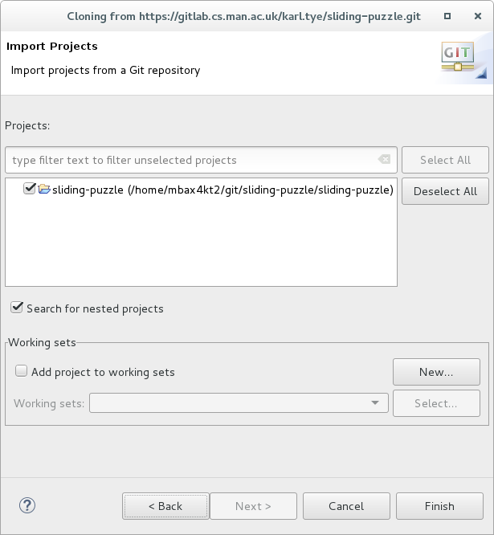
```

The project should now have been imported, and should be visible in the Package Explorer View (on the left in figure \@ref(fig:eclipseProjectLoadedAndVisibleInPackageExplorer-fig) along with any other projects you may have created in this workspace.  You can double-click on the project to see the contents.

```{r eclipseProjectLoadedAndVisibleInPackageExplorer-fig, echo = FALSE, fig.align = "center", out.width = "100%", fig.cap = "An Eclipse project loaded and visible in package explorer"}
knitr::include_graphics("images/eclipseProjectLoadedAndVisibleInPackageExplorer.png")
```

### Step Three: Identify the Bug {#bugid}

In your web browser, open the GitLab page for the repository created for you for this exercise and go to the issue tracker (using the menu on the left).  You should see a single open issue.  This issue describes a bug within the program which you are going to fix.

Your first task is to see if you can replicate this issue within the program itself. To launch the puzzle, find the `Puzzle` class in the `Package Explorer` view: it is located in the:

````md
uk.ac.man.cs.puzzle
````
package within the `src` folder.  Right click on it, and choose `Run As` > `Java Application`.  The game should now appear in a window on your screen.

The game is a simple 8-tile sliding puzzle where the goal is to get the tiles in ascending order, left to right, top to bottom.  Tiles can only be moved if they are adjacent to the free space.  Players click on the tiles to move them into the space.  The game changes the outlines of the tiles to bright green when the game is finished.

Play around with the puzzle for a while and see if you can replicate the bug which the issue describes. After you are done, close the program and return to Eclipse to continue the bug fixing process.

The code base we are working with follows a common (and useful) convention of making a clear separation between test code and production code (that is, the code that actually implements the functionality needed by the client).  It contains two source folders.  The one called `src` contains the production code, while the `test` source folder contains the test code.

::: {.rmdnote}
(ref:infobox)
A `source folder` in Eclipse is simply a folder that is on the build path for the project.  In the case of a Java project, like this one, that means that the folder is on the Java class path.  Java classes and methods stored within folders that are not on the build path will not be found by the Eclipse Java compiler and will not be executed when the code is run.  Eclipse uses a special folder icon with a small package symbol overlaid on it, to distinguish source folders from ordinary folders.

The orange drum symbol indicates that the file or folder is under version control
:::

If you double-click on the `test` folder, it will open up to show you its contents: two packages.  The packages themselves contain a single class each.

Double-click on the `MouseInteractionTest` class to open it in the Editor.  You should see something like figure \@ref(fig:viewingtheTestCode-fig):

```{r viewingtheTestCode-fig, echo = FALSE, fig.align = "center", out.width = "100%", fig.cap = "Viewing the test code"}
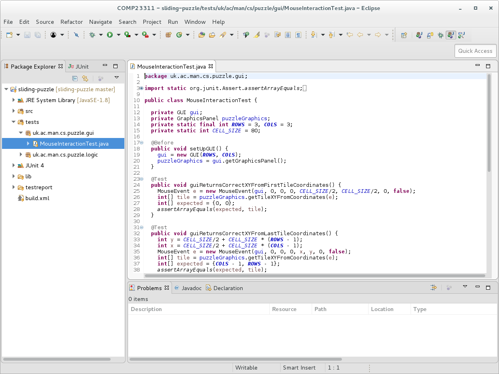
```

This class contains 5 JUnit test case methods, each testing a slightly different aspect of the program. A separate document, available on Blackboard, explains how test cases are written in JUnit.  You should work through that document before starting your team coursework, but for now, we are just going to see how to run these tests in Eclipse.

There are several ways to run a JUnit test suite in Eclipse, depending on the complexity of the program you are working with.  This is a very simple project, so we can just right click on the name of the test class in the Package Explorer view, and choose `Run As` > `JUnit Test` from the menu that appears.  A new view containing the test results should appear, alongside your Package Explorer.  It's a bit cramped there, and we can't see much of what it is telling us.  Double-click on the tab of the JUnit view to expand it to fill the Eclipse window.  You should see something like figure \@ref(fig:runTheTestsAndSeeSomeFail-fig)


```{r runTheTestsAndSeeSomeFail-fig, echo = FALSE, fig.align = "center", out.width = "100%", fig.cap = "After running the tests you should see some that fail"}
knitr::include_graphics("images/runTheTestsAndSeeSomeFail.png")
```

On my system, three of the tests passed (labelled with a green tick) and two failed (labelled with a blue cross). These tests give an indication as to which classes could be responsible for the bug. The bar at the top of the view is red, showing that some tests failed.  It is good practice to keep all tests passing, if possible, so our next step will be to make changes to the code, to make the tests pass.  Hopefully, this will also fix the bug in the game.

Double-click on the tab of the JUnit view once more, to restore it to its earlier position and allow us to see the other Eclipse views again.


### Step four: Create a Branch for Your Own Changes {#createbranch}

We're going to make a simple change to this project, and commit it to the Git repository.  In this course unit, we ask you to use a very simple Git workflow, called *Feature Branches*.  This workflow uses separate Git branches to hold your changes initially, so multiple developers can work on the code at the same time without interfering with one another and so that changes from one developer can be checked for correctness before they are merged into the main development branch.  So, before we make any changes, we have to create a feature branch in our local Git repository.

To do this in Eclipse, right click on the name of the `sliding-puzzle` project in the `Package Explorer` view.  From the menu that appears, select `Team` > `SwitchTo` > `New Branch`. Eclipse then asks you to give the branch a name.

Branch names should describe the functional change that the branch will contain.  We're going to make a change that will fix the failing tests related to the mouse interaction, so we will call the new branch `mouse-interaction-fix`.

Enter this exact name (without the quotes) into the dialogue box as the branch name.  Make sure the `Check out new branch` option is selected and press `Finish`.

::: {.rmdcaution}
(ref:cautionbox)
We will use an automated process to mark this exercise, in order to provide feedback on any errors quickly before you start work on your team coursework.  So, it is important that you use the exact text given for the name of this branch, to ensure the automated process can find and mark your work.
:::

Eclipse will now ask Git to make a new branch in your local Git repository, with the name you have given.  This command creates the new branch at whatever commit was previously checked out.  In this case, we had checked out the `master` branch, so the new branch will be created at the same commit as `master`.

Once the branch is created, Eclipse checks out the contents, which become visible in the package explorer.  Since the new branch is at the same commit we were already at the contents of the project should look exactly the same as before.  The important difference, though, is that any changes you now make to these files and folders will appear on the branch you have just created.  The contents of the \texttt{master} branch will remain in their original state.

One difference you should see, however, is that your new feature branch now appears in the annotation next to the project name in the Package Explorer view.  The annotation (in square brackets) shows the repository name and the branch that is currently checked out.

```{r afterCreateBranchSeeTheAnnotationChangeInPackageExplorer-fig, echo = FALSE, fig.align = "center", out.width = "100%", fig.cap = "After creating branch note the annotation change in the package explorer"}
knitr::include_graphics("images/afterCreateBranchSeeTheAnnotationChangeInPackageExplorer.png")
```

If you don't see this, then something has gone wrong.  If you can't work out what it is, then you can get help from staff or a GTA in one of the team study sessions for this exercise.

::: {.rmdnote}
(ref:infobox)
*The Team Menu*

Most of the Eclipse commands for interacting with Git come under the Team menu we used here to create a new branch.  You can explore around the various options to see what Eclipse allows you to do with your Git repository.
:::


### Step five: Commit a Change to the New Branch {#commitnew}

Next, we're going to make a change to one of the files in the project, and commit it to our new branch. Eclipse provides a number of views and commands to help with making commits to a Git repository. One of the most useful of these is the Git Staging view. To open this, select the following option from the menus at the top of the Eclipse window:

*Window > Show View > Other > Git > Git Staging*

A new view with this name should now appear. Notice that there is a box on the right for the message you will associate with the commit you are about to make.  It is good practice to write this commit message before you begin to make any code changes. This helps us think about the change we are about to make, and helps to keep our commits small and focussed.  In this case, please add the following text to the `Commit Message` box in the Git Staging view:

```md
Fix bug with wrong tiles sliding on mouse click
```

Your view should look like figure \@ref(fig:gitStagingViewBeforeChangesWithComment-fig).

```{r gitStagingViewBeforeChangesWithComment-fig, echo = FALSE, fig.align = "center", out.width = "100%", fig.cap = "Git staging view before changes with comment"}
knitr::include_graphics("images/gitStagingViewBeforeChangesWithComment.png")
```

Note that, at present, the “Unstaged changes” and “Staged changes” boxes are empty.  This is because (as yet) no changes have been made.

You're going to do something about that now!

For the next part of the exercise, you need to identify the bug in the production code: that is, in the files under the `src` folder. Use the information provided by the failing tests to point you in the right direction. JUnit also gives a trace of why the tests fail.  These can be viewed by clicking on any of the tests labelled with a blue cross in the JUnit view. You can double click on any test, and you'll be taken directly to the point where the test failed in the Editor view.

When you think you have identified the part of the code that is causing the bug, correct it and save the file (using the floppy disk icon on the toolbar or with the standard Ctrl-S shortcut). You will notice that as soon as the changes are saved, the file appears in the Git Staging view as an unstaged change.

Figure \@ref(fig:unstagedChangesShowingInStagingView-fig) illustrates a file appearing as an unstaged change for a different issue than the one you are working on.  (Obviously, we can't show screenshots of the change that fixes the bug you are working on, as that would give the answer to the exercise away.)


```{r unstagedChangesShowingInStagingView-fig, echo = FALSE, fig.align = "center", out.width = "100%", fig.cap = "Some unstaged changes showing in staging view"}
knitr::include_graphics("images/unstagedChangesShowingInStagingView.png")
```

Before committing the change, it is important to check that the tests now pass.  Run the tests again to check that have fixed the bug, and haven't introduced any other problems.  When you have correctly fixed the bug, all the tests should pass, in both test packages, and you should see a green bar in your JUnit window shown in figure \@ref(fig:runTestsAfterMakingTheChangeAndAllPass-fig)


```{r runTestsAfterMakingTheChangeAndAllPass-fig, echo = FALSE, fig.align = "center", out.width = "50%", fig.cap = "The JUnit view"}
knitr::include_graphics("images/runTestsAfterMakingTheChangeAndAllPass.png")
```

If the tests do pass, **run the puzzle and check that it now behaves as intended**.  If your tests keep failing, or the puzzle still isn't working as it should, and you can't find the problem, you'll need to come to one of the team study sessions to get help from staff or GTAs.

Once the code compiles, passes all the tests, and the puzzle runs as expected we can commit our changes to our *local* Git repository. To tell Eclipse that the change we've made should be included in this commit, drag the file from the 'Unstaged Changes' box to the 'Staged Changes' box in the Git Staging view.  Figure \@ref(fig:stageTheChangesNowTheTestsPass-fig) illustrates how this should look for a different change than the one you are making.

```{r stageTheChangesNowTheTestsPass-fig, echo = FALSE, fig.align = "center", out.width = "100%", fig.cap = "Stage the changes now that the tests pass"}
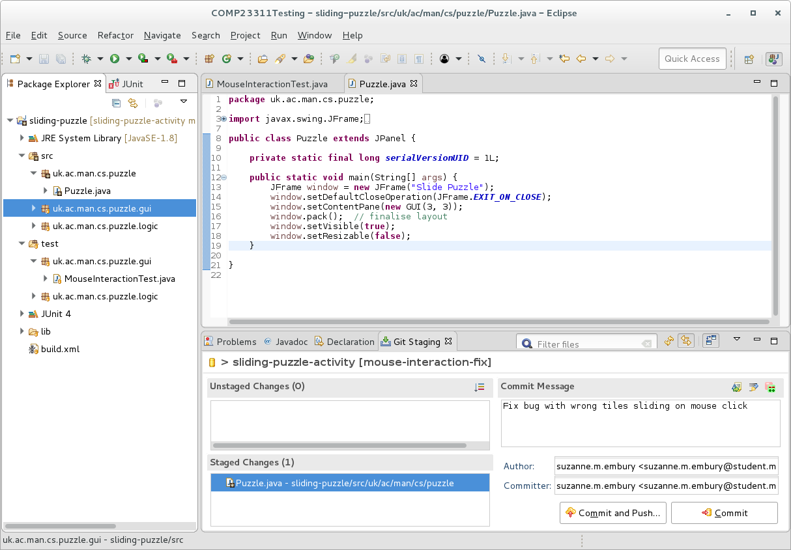
```
**Before making the commit, you need to check that Git is configured correctly on the machine you are working on**, so that it assigns the correct author and committer information to all your commits.  We make use of a lot of automated marking code in this course unit.  Our code will not be able to find your commits if you have not configured Git correctly.

Git will use the values you set for the `user.name` and `user.email` parameters to set the author/committer details for your commits.  When the commits are pushed to GitLab, the GitLab server tries to guess which project member made the commits, using this information.  If it cannot, the commits will still exist but they will not be linked to your GitLab user.  This will make it much harder for our automated marking tools to find your work.  To make sure you get credit for all the work you do, please take care in configuring Git on *all* the machines you code on.

To check that Git is configured correctly on your machine, look at the Author and Committer information in the Git Staging view.  If these show your correct name and (most importantly) your University e-mail (ending in the domain `student.manchester.ac.uk`, with no brackets or quotation marks) then everything is okay.  If they do not, then **you will need to exit Eclipse** and reconfigure Git using the information on the Department wiki:

::: {.rmdnote}
[wiki.cs.manchester.ac.uk/index.php/Gitlab/Git_Setup](https://wiki.cs.manchester.ac.uk/index.php/Gitlab/Git_Setup)
:::

When you re-enter Eclipse, the correct author and committer details should be shown.

::: {.rmdcaution}
(ref:cautionbox)
If your name and e-mail are not shown correctly in the Author and Committer fields, you may be tempted to edit them directly in Eclipse, rather than fixing your Git configuration.  That will fix the problem as far as this one commit is concerned, but you'll need to remember to make the same change for every commit you make for this course unit.

This is a particular problem for the team-based coursework, where the only way our marking systems know if you have made any commits is if we can find ones linked with your GitLab account.  GitLab uses the author e-mail address of commits to link them to the account with the same e-mail address.  Students with no commits linked to their GitLab account for each exercise will automatically receive a mark of 0.  Therefore, it's really important that you take the time now to configure your local Git installation correctly now, to avoid losing marks in the future.
:::


Now you can press the `Commit` button. **Important: do not push your commit at this time.  Just make the commit.**

Why are we asking you not to push the commit at this stage?  It is a good idea, especially when new to Git, to commit all your changes locally first, so you can check them out before you push them to the remote Git repository.  In general, it is easy to fix Git errors in your own local repository.  But it is much harder to fix problems once they have been pushed to a public or team repository, and pulled into your team mates' local repositories.  Getting into the habit of checking your commits before pushing them can save you a lot of time, frustration and embarrassment in the future, as well as sparing your team mates from losing marks due to your error.

So, before we do anything else, we're going to check that the commit went through as we expected.  This is quick and easy to do using the `Git History` view.  To bring this up, right click on the project name in the `Package Explorer`, and select `Team` > `Show in History`. You should see a new view appear next to the Staging view. It's a bit small, so figure \@ref(fig:checkCommitInHistoryView-fig) shows the effect of double-clicking on the view tab, to make it fill the screen.

```{r checkCommitInHistoryView-fig, echo = FALSE, fig.align = "center", out.width = "100%", fig.cap = "check commit in history view"}
knitr::include_graphics("images/checkCommitInHistoryView.png")
```

This view shows the history of commits that are visible from the currently checked out commit.  It shows that the branch we are on is one commit ahead of the local `master`, as well as the `master` branch in the remote repository (called `origin/master` because `origin` is the default name for the remote repository).  The history view also tells us which branch is currently checked out, by bolding the name of the branch (and also putting the label `HEAD` next to it).

This looks okay, so we will go ahead and push the changes to the remote.  Before doing this, take a look at the network for your remote repository on GitLab shown in figure \@ref(fig:checkGitLabRemoteBeforePush-fig)

```{r checkGitLabRemoteBeforePush-fig, echo = FALSE, fig.align = "center", out.width = "100%", fig.cap = "Screenshot showing gitlab before pushing"}
knitr::include_graphics("images/checkGitLabRemoteBeforePush.png")
```

You should see only the `master` branch and the original lone commit. The changes you have made in your local repository are, as yet, not present in your remote (and therefore not visible to any collaborators you may have on the project).

Now push the changes, by right clicking on the project name, and selecting `Team` > `Push to origin` from the menu that appears. If this is not available, then you may also do `Team` > `Remote` > `Push` , then ensure the details are correct on the dialogue box, and then click `Next`.  Whenever you perform remote operations, like push, Eclipse will need your GitLab credentials.  If you didn't save them earlier, you'll be asked to provide them again at this point.

At this point, you may be asked to configure your repository for pushing. This sounds complicated but in fact is simple.  Git is just asking you to tell it how it can map local branches to remote branches.  Click on `Advanced`. You should see the dialogue appear in figure \@ref(fig:configurePushRefSpecs-fig)

```{r configurePushRefSpecs-fig, echo = FALSE, fig.align = "center", out.width = "100%", fig.cap = "Configure push dialog"}
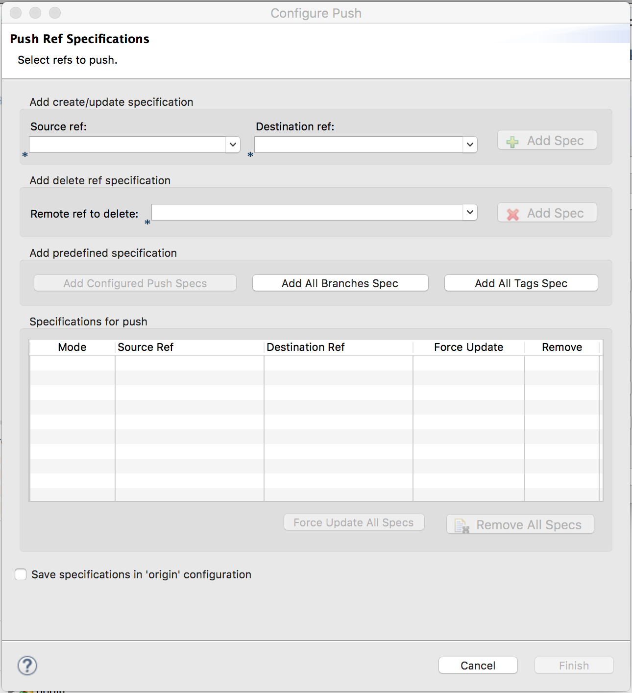
```
Press the “Add All Branches Spec button in the middle of this dialogue.  This will add the default *ref specs* (reference specifications) to your repository.  Select “Finish”.  Your repository should now be configured for push.

Before it asks Git to push, Eclipse will give you a summary of what the push will do and ask you to confirm that you want to go ahead, looking something like the dialogue shown in figure \@ref(fig:confirmationOfPushToRemote-fig)

<!-- TODO: update this figure to show push of the commit, not the merge -->

```{r confirmationOfPushToRemote-fig, echo = FALSE, fig.align = "center", out.width = "100%", fig.cap = "Confirmation of push to remote dialog"}
knitr::include_graphics("images/confirmationOfPushToRemote.png")
```

Press `OK` to initiate the push.

When the push is successfully completed, look at the contents of the History View.  Can you see what has changed, as a result of the push?

You should also look at the commit graph in your remote repository.  How has that changed since we looked at it before the push operation?

<!-- TODO: add screen shots for these two commit graph views?  Or is it useful for students to work it out for themselves? -->

<!--\screen{checkGitLabNetworkAfterPush}-->

::: {.rmdnote}
(ref:infobox)

As a rule of thumb, you should only commit working code.  This means: code that compiles and passes the tests.  It is especially embarrassing to push code with compile errors to your team's repository.  Remember to check *before* you push!
:::


### Step six: Merge your Changes {#mergechanges}

In the Git workflow we use for this exercise, the development branch is called `master`.

Once a change to the code base has been tried out in a feature branch (and passes the tests), we can incorporate it into the main development branch, so that (when pushed) other team members can see it and build on top of it.

This is called *merging*.

In this case, we want to merge the changes in our feature branch *into* our `master` branch. The Git merge commands works by bringing the changes *into* the currently checked out branch. So we need to start by checking out `master`.

You can switch branches very easily from the History view.  Just right click on the commit you want to check out (the one labelled with the `master` branch in our case), and select `Checkout`.

Eclipse will notice that there are two branches at the commit you want to check out.  It will ask you which one you want to check out.  In our case, that will be the local version of the `master` branch and not `origin/master`, the branch that is tracking the contents of the `master` branch on the GitLab remote.  (Broadly speaking, you should *never* check out a remote-tracking branch.)

Select the local branch (`refs/heads/master`) and click `OK`.

<!--\dialogue{checkoutLocalMasterWithSelection}-->
When the checkout completes, the contents of the History view will change.  It will look now as if the commit on the `mouse-interaction-fix` branch has been deleted, along with the branch it was on.  Don't worry---the commit is still there.  By default, the History View shows only commits reachable from the checked out branch, which is now `master`---a parent of the commit we just made.  Note also that `master` is now shown in bold text, and the `HEAD` label has also moved to this commit: both signs that this is the checked out commit.

Now we can go ahead and make the merge.  Merging is a tricky part of Git, and it is easy to make mistakes.  We're going to do the merge in our local repository first, without pushing any of the commits, so we can check out the result and fix things before anyone else in our team pulls our mistakes into their local repository.  This is a really good habit to get into.

To request the merge, right click on the project name in the Package Explorer, and choose the `Team` > `Merge...` option.  (If you expanded the History View, as we did, you'll need to double-click on its tab to get back to the normal Eclipse view layout before doing this.)

This will bring up a dialogue box giving you a choice of branches to merge with shown in figure \@ref(fig:requestTheMergeIntoMasterAndSelectbranchToMergeIn-fig)

```{r requestTheMergeIntoMasterAndSelectbranchToMergeIn-fig, echo = FALSE, fig.align = "center", out.width = "100%", fig.cap = "Request theM merge into master and select branch to merge in dialog"}
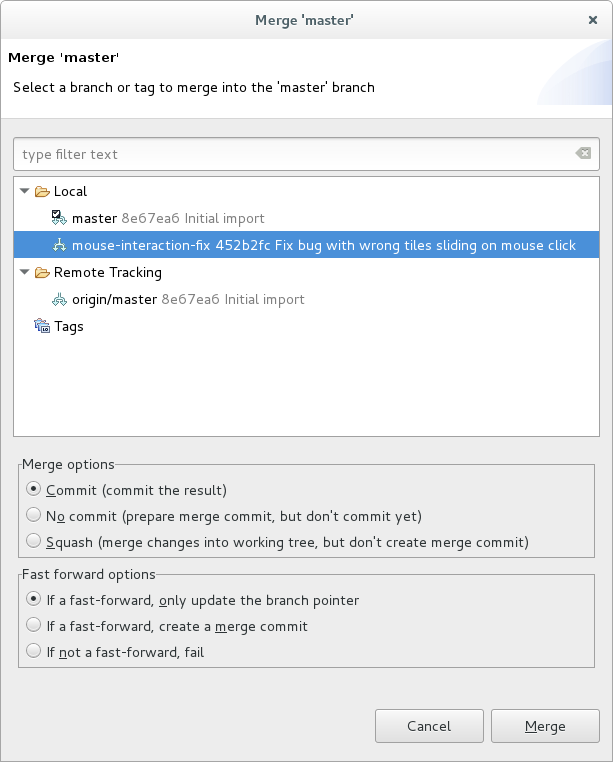
```

Select the feature branch we have been working on. Leave the other options with their default settings and click on `Merge`.


::: {.rmdnote}
(ref:infobox)
When learning Git, it can be tricky to remember which branch merges into which, when using the merge command.

The key thing to remember is that, unless you've said otherwise, Git will make changes to the checked out branch.  When merging, start by checking out the branch that does not yet have the new changes in it.  The branch specified in the merge command is the branch that contains the changes we want to pull in to the checked out branch.

After the merge is complete, the checked out branch will change, but the branch given in the merge command will be unaffected by the merge.

Remember: try your merges out locally and check them before pushing them.  It is easy to fix merge problems locally, by using the Git reset command.  Merge errors that have been pushed to a remote repository are much harder to correct.

:::

When the merge is finished, Eclipse will show a summary of the results shown in figure \@ref(fig:mergeResultShowingSuccessFastForward-fig).

```{r mergeResultShowingSuccessFastForward-fig, echo = FALSE, fig.align = "center", out.width = "100%", fig.cap = "Screenshot showing merge results"}
knitr::include_graphics("images/mergeResultShowingSuccessFastForward.png")
```

In this case, the merge was successful. Git had only to perform a *fast forward merge8. That is, it just had to push the `master` branch forward by one commit to bring in all the changes made in the `mouse-interaction-fix` branch.  It did not need to create a merge commit, and there are no merge conflicts to resolve.

The next step is to check that the tests still pass in the merged code.  This is not so important after a fast-forward merge, if you have checked that the tests pass on the feature branch before merging.  But merging is not always straightforward, and it is good to get into the habit of checking that tests pass after merging as well as before.

The History View (visible in the above screenshot) shows the new Git network after the merge.  Now `master` and `mouse-interaction-fix` are at the same commit, with `master` still checked out. The remote tracking branch for the `master` branch in your remote repository, however, is still at the commit it was at when we first imported. This will change once we push the changes to the remote repository.


### Step seven: Push the Changes to the Remote Repository {#pushingchange}

If the merge looks okay in your History view, and the tests all still pass, we can push the changes to the remote repository.  

As before, we do this by right clicking on the project name, and selecting `Team` > `Push to origin` from the menu that appears.  Again, if you haven't saved your GitLab credentials in Eclipse, you'll need to supply them again for this operation to complete.   

Press `OK` to initiate the push.

When the push is successfully completed, look at the contents of the History View.  Can you see what has changed, as a result of this second push?

<!--\screen{checkGitLabNetworkAfterPush}-->

If you have merged and pushed correctly, you should see both branches pointing to the same commit on GitLab as shown in figure \@ref(fig:checkGitLabNetworkAfterFeatureBranchIsPushed-fig)

```{r checkGitLabNetworkAfterFeatureBranchIsPushed-fig, echo = FALSE, fig.align = "center", out.width = "100%", fig.cap = "Screenshot showing check gitlab network after feature branch is pushed"}
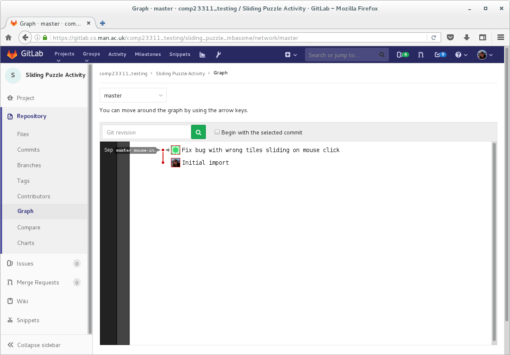
```


### Step 8: Record the Project Status in the Issue Tracker {#issuetracker}

Once the bug fix has been merged into the development branch, and the tests all still pass, we can close the issue. Open the `Wrong Tiles Sliding` issue in the issue tracker and click on the `Close issue` button.  (Of course, if the feature branch hasn't been merged into the development branch and the tests still fail, then we can't close the issue, as the bug wouldn't be properly fixed yet.)


When you are ready for your work to be marked, add a comment to the issue, to let the automated marking system know.  The comment should contain the following text:

````md
Project ready for marking.
````

This comment will be detected by the automated marking code, and your work will be scheduled for marking at the next automated marking point.  Because of this, it's important that you use this exact text string in your issue comment.  You can delete and re-add the comment at any time before the coursework deadline, if you want to make further changes.  It's also important that you add the comment to the correct issue.  In the past, students have created new issues for this marking-request comment and even, in a few cases, have made dummy commits with this string as the commit message.  None of these actions will be picked up by the automated marking system, so it's important to check that the comment is appearing on the issue we created for you and that all your changes are visible at your remote *before* the deadline.


::: {.rmdcaution}
(ref:cautionbox)
It is your responsibility to check that your work has been successfully pushed to the GitLab project repository *before* the deadline for coursework submission.  We will not mark your local repository contents, only the contents of your GitLab repository.  Therefore, make sure you check that the full set of commits and branches you expect to see are visible in your GitLab repository, and report any problems to the course team *before* the deadline.
:::

If you submit your work late for whatever reason, add this comment to your issue to let us know that you are ready for the work to be marked.  Late marking will be rerun every couple of weeks, so you won't receive feedback immediately.


### Coursework Complete {#gameover}

This completes the instructions for the first individual coursework exercise for (ref:coursecode). If you managed to complete it in full, then you can be confident that your Git/GitLab set up is as needed on this machine for the workshops and the coursework.  Perhaps even more importantly, you have gone through the basic cycle of steps we'll expect you to follow when carrying out the team coursework for this unit.  If you were unfamiliar with this approach to coding, then it might have felt long-winded and complicated.  But with a little practice, this pattern of work will become easier and more natural.  And, with this experience under your belt, you'll find it much easier to adapt to variants of it, if you join a software engineering team on placement or in employment outside University.

In the next individual coursework, we'll look at a more complicated merge case, when Git can't handle the merge by itself and needs help from you to intervene.

`Document version:` `r format(Sys.time(), '%d %B, %Y')`

<!--chapter:end:15-courseworking.Rmd-->

# Individual Coursework 2 {#conflicting}

Exercise 2: Test-First Development and Managing Conflicts in Git

## Introduction {#introt}

This second individual coursework exercise for (ref:coursecode) is designed to help you develop two new skills that professional software engineers need, and that will be essential for the second team coursework exercise:

* Test-first development, and
* Handling conflicts during integration of separate lines of development with Git.

Test-first development (TFD) is an approach to developing software in which we first write the test cases describing the functionality we need to implement, and then write the production code that will cause them to change from failing tests to passing tests.  The tests provide the specification for what needs to be built.  You are getting a taste of TFD in writing the tests to make your bugs visible in the code base in the first team coursework exercise, but you'll be required to apply it more extensively in the second team coursework exercise.  This individual coursework exercise gives you a chance to practice the basic skills in private, before you have to use them in front of your team and mentor.  It does this by giving you a set of test cases describing the behaviour needed of a new feature for the Sliding Puzzle game you worked on in the first individual coursework exercise.  Your task is to make these failing tests pass, by implementing the feature as the tests (and the issue text) describe it.

When you've implemented the feature, you'll need to integrate it with your development branch (in this repository, the `main` branch).  But, another member of the Sliding Puzzle team has also made commits on the development branch since work on your feature began, implementing another feature.  You'll need to merge the two lines of development together.  Since both features touch much the same parts of the code, a number of conflicts will be discovered when you try to merge.  Your task will  be to remove the conflicts from the code base, so that the merge can go ahead.  You'll finish by creating a commit that contains both new features, co-existing together, and passing all the tests.

You'll practice these skills by carrying out the following steps:

1. Clone the coursework repository and import it into your IDE.
1. Read the tests describing the new feature you must implement, on the feature branch provided.
1. Make changes to the production code, to implement the feature and cause the tests to pass.
1. Commit the code to the feature branch.
<!--%  \item Synchronise your local repository to bring in changes made by your team mate.-->
1. Merge your branch with the development branch.
1. Deal with the conflicts that the attempt to merge makes visible, and complete the merge.
1. Push the completed merge to your remote repository for marking.
1. Update the issue tracker to record the project status, and request marking.

Instructions for carrying these tasks out from within the Eclipse IDE are given in this document.  We focus on Eclipse as that is the IDE used for the team coursework.  You are free to use any IDE that you wish to carry out this individual coursework exercise, but we can currently only provide instructions and technical support for Eclipse, run on the VM provided by the Department or the machines in labs in the Kilburn building.

Once the exercise is completed, you should be ready to use the same skills on your team's repository in the remaining team coursework exercises.

::: {.rmdnote}
(ref:infobox)


**Trouble-shooting** If you experience problems when completing this exercise, you can find a trouble-shooting guide on the School's wiki at:  

[wiki.cs.manchester.ac.uk/index.php/LabHelp:Main_Page](https://wiki.cs.manchester.ac.uk/index.php/LabHelp:Main_Page)

We've provided two indexes into the trouble shooter, to help you find your way around. One is an index of error messages:  

[wiki.cs.manchester.ac.uk/index.php/LabHelp:Errors](https://wiki.cs.manchester.ac.uk/index.php/LabHelp:Errors)

If a specific error message is being reported alongside the problem you are experiencing, then you can look for it in this index, and find suggested solutions that have worked for students with this problem in the past.

The second index contains descriptions of more general symptoms:  

[wiki.cs.manchester.ac.uk/index.php/LabHelp:Symptoms](https://wiki.cs.manchester.ac.uk/index.php/LabHelp:Symptoms)

Use this index when something is going wrong but you do not have any specific error message to help you track down the cause of the problem.  

:::

Please report any problems you encounter that are not covered in the troubleshooter as soon as possible, including full details of specific error messages and screenshots where appropriate. You can report problems on the course unit piazza forum at (ref:piazzaforum), or by e-mail to the course team. We'll do our best to help!


## About the Coursework {#aboutcwk2}

### Key Information {#keyinfo}

The exercise will be marked out of (ref:totalmark), and will count towards (ref:percentage)% of your total mark for the course unit.

The deadline for submitting the exercise is: (ref:deadline2)

You'll submit your work through a GitLab repository that will be created for you when the exercise begins.  Once created, this should be visible in your personal project list through the GitLab web interface at:

[gitlab.cs.man.ac.uk](https://gitlab.cs.man.ac.uk)

At the deadline, we'll make a clone of your repository and run the automated marking code.  You just have to make sure you have pushed your Git branches and commits to your GitLab repository by then, and make a comment in your issue tracker to let us know the work is ready to mark.  There are no additional submission steps.

Feedback on your work will be uploaded to the issue tracker of the GitLab project, when the marking code is run.


### Marking Scheme {#markingscheme2}
<!--TODO: check that the number of steps referred to below is correct.-->
<!--TODO: check that the push step mentioned at the end of the paragraph is the correct one-->

This coursework exercise consists of 8 steps.  If you complete them all correctly, then you should earn full marks against the marking scheme shown in table \@ref(tab:marktable2).  But note that we can only mark work that is present in your GitLab repository, and the earlier steps involve doing work in your local Git repository.  We won't be able to see that work until you get to the final step, and push your commits and branches to your GitLab repository.  If you reach the deadline with some of the steps incomplete, and want us to mark what work you have done, you'll need to jump forward to step 7 and complete as much of it as you can before the deadline to allow this.

```{r marktable2, echo = FALSE}
mark_table2 <- tibble::tribble(
    ~ "Criterion"                        , ~ "Marks",   
    "The `move-counter` branch passes the tests supplied in commit `e751f062`. ", "2",
    "The `main` branch passes the tests supplied in both feature branches (commits `e751f062` and `1a2923aa`).", "2",
    "The `main` branch is located at a merge commit, with one parent being commit `1a2923aa` (pointed to by the `game-timer` branch) and the other parent being the commit pointed to by the `move-counter` branch at the time the merge is made.", "1",
    "No other merge commits appear in the commit graph.", "1",
    "The code version represented by the commit on the `move-counter` branch contains conflicting code elements when compared with the code at the original location of the `main` branch (commit `1a2923aa`)", "2",
    "No conflict markers exist in the merged code.  (If the `move-counter` branch has not been merged with `main` in the submitted repository, the mark for this criterion will be 0.)","2",
    "**Total**", "**10**",
)
knitr::kable(mark_table2, caption = "The marking scheme for the 2nd individual coursework exercise", booktabs = TRUE)
```

::: {.rmdcaution}

(ref:cautionbox)

Note that the coursework must be carried out without the use of merge requests.  The point of the exercise is to carry out these operations for yourself, in your local repository, and to gain an understanding of exactly what Git is doing when tools such as pull/merge requests are used.

**Any use of merge requests, even if they are subsequently deleted, will incur a 50% mark penalty.**
:::

### Pre-Deadline Feedback {#predead}


To give you a chance to check your work and make corrections in advance of the deadline, we will run the automated marking code on all student repositories shortly after:


(ref:feedbackdateindicwk2)

This will add provisional feedback and a provisional mark to the issue tracker for your repository, covering the part of the work you have completed and pushed to GitLab by that date.  You will then have until the deadline to make corrections.  The automated marking code will mark only your latest commits, and will ignore earlier incorrect commits or merge attempts.  This means you can commit fixes to your feature branch and attempt the merge again, to try to catch up on any marks you may have missed in your first attempt.

All repositories where any changes have been made by students by the deadline will be provisionally marked.  You don't need to request it.

We guarantee to provide provisional marks for everyone who has started the work by the provisional marking deadline.  Students who start the work after this may receive some provisional marking or they may not, depending on whether their repository is processed by the marking code in time.


### Submission Procedure {#subproc}

To submit your work for marking, you must add a comment to the coursework issue in the issue tracker of your project, saying:

``` md
Project ready for marking.
```

The time of submission will be the time at which this comment was added to the repository.

If this comment is not present on the coursework issue, we will assume that you are not ready to submit the work.

You may delete and re-add the comment as many times as you like up until the formal deadline for the coursework.  Once your work has been marked, we will ignore any further changes to your issue tracker; it will not be possible to request marking for a second time once marking for your project is complete and the feedback has been uploaded to your issue tracker.

Any changes to your repository made after the final eligible marking request has been made will be ignored by the marking process.  So make sure you have definitely finished all your work, before you add the comment, especially if you are submitting after the deadline.

When you have added the request for marking comment to the issue, your development access to the repository will be removed, to preserve the state of the repository for marking.


### Late Submissions {#lateness}

This coursework follows the University's standard policy on marking work that has been submitted late.

A penalty of 1 mark will be applied for each 24 hour period following the deadline that the work is late, up a total of 9 such periods.  Note that for the purposes of this calculation, weekends and evenings are counted.  This means that, since this coursework's deadline is on a Friday, a submission on Monday morning will receive a penalty of 3 marks.

These penalties will be applied until all marks earned by the student have been removed.  Marks will not go below zero.

Work which is submitted more than 10 calendar days after the deadline will be considered a non-submission and will be given an automatic mark of 0.  It is at the discretion of the course leader and the Department as to whether the work is marked sufficiently for feedback to be provided.

For this coursework, the submission time will be the date and time at which you place the comment saying the work is ready for marking on the issue for the exercise.  All work that has been pushed to GitLab by that date will be marked.  Any commits or references that are not pushed to GitLab until after marking is requested will not be considered during marking, even if they were created or modified in your local Git repository before this.


### Plagiarism {#dontcopy}

This coursework is subject to the University's standard policy on plagiarism:

[wiki.cs.manchester.ac.uk/index.php/UGHandbook19:Academic_Malpractice](https://wiki.cs.manchester.ac.uk/index.php/UGHandbook19:Academic_Malpractice)


### How to Get Help {#gettinghelp}

Help with this exercise will be available in the team study sessions (when your team is not being marked).  Sign up on the live help queue (ref:livehelpqueue) during the sessions, using the `Individual Coursework Ex 2` label and issue template. A member of staff or a GTA will speak to you in person or call you directly on Microsoft Teams when we are ready to provide help.


## The Coursework Instructions {#indycwk2in}

### Step one: Clone and Import the Project into Eclipse {#cloneandimport}

In Eclipse (or whatever IDE you have chosen to do the coursework on), import the project for the coursework by cloning from this URI:

(ref:repo2URI)


where `<your-username>` is replaced by your University username.  This is a personal repository that has been set up just for use by yourself, for this activity.  No other students can see its contents (though the course team and GTAs can see it).

This should cause a new Java project to appear in your IDE, ready for use.  This is a version of the sliding puzzle game we used in individual coursework 1.  Take a look at the History view of the project, to see the commit graph.  You should see the development branch (called `main` in this coursework) and two feature branches.  One of the feature branches has been fast-forward merged into the development branch and the other is still on-going and hasn't yet been merged in.

::: {.rmdnote}

(ref:infobox)
If you are unsure of how to complete this step, refer back to steps 1 and 2 in the instructions for the 1st individual coursework exercise for this course unit (chapter \@ref(gitting)), for detailed instructions.
:::

### Step two: Run and Understand the Test Cases for the Feature {#runderstand}

An issue has been placed in the issue tracker for the project, describing the new feature you are asked to implement for this coursework.  Work was already begun on the issue, and a feature branch already exists in the repository.  Some test cases describing the feature have been committed to the branch, along with the bare minimum of changes to the production code needed to make the test code compile.

The branch is called: `move-counter`

You must check out this feature branch, and use the tests to guide the implementation of the new feature.  The first step is to read the test code, to understand what each one is saying about the functionality that you must implement.

You should practice the techniques for test reading that were presented in the workshops, and consider each test case in terms of the “Act, Arrange, Assert” model (see chapter \@ref(understanding)).

The next step is to run the tests.  Since the default project classpath is sufficient for this simple project, we can do this by right clicking on the `test` folder and selecting `Run As` > `JUnit Test`.  You'll see that a couple of the new test cases pass, but most of them fail.

::: {.rmdnote}
(ref:infobox)

**Test-First Development**

Test-first development (TFD) is a style of software development in which we begin by writing a collection of tests that describe the new functionality to be added to the system.  When we run these tests, they will (mostly) fail, because the feature they describe is not yet implemented.  The next step is to make changes to the production code to implement the required feature, and thus make the test cases pass.

In this approach to development, the tests change their function.  Instead of aiming to detect errors *after* they have been introduced into the code base, the tests take on the role of the specification: an executable specification that we can run repeatedly, as the feature implementation moves forward.  The tests also therefore function as a kind of progress report, telling us how much work remains to be done before we can consider the feature finished.

But writing the test code before the production code also has a profound effect on how we design our code.  When we write the production code before the tests, we often make design errors, because we are thinking too much about the code from the point of view of the implementer of the class we are working on.  This makes it hard to make good decisions about what parts of the behaviour should be exposed through the class's interface, and what should be hidden behind it.

When we write the test code first, we are forced to think about the classes we are testing from the point of view of a user of the class, rather than an implementer of the class.  The process of writing the tests helps us see what information and services the class must provide through its public interface, and how they should be designed to ensure clarity and ease of use.  We can then implement the feature in a way that corresponds to this design, and can concentrate on making the internals of the class clear and efficient.  Implementation is often quicker and easier in TFD, because many of the hard design choices have already been made for us.

:::

### Step three: Implement the Feature/Make the Tests Pass {#testsipass}
When you have a good grasp on the functionality that the tests describe, you should start implementing that functionality and making the tests pass.

Make sure you have the `move-counter` branch checked out before you make any changes to the code.

The usual approach in TFD is to take each failing test in turn, and to make the changes needed to make the test pass.  In doing so, you should treat each test case as an example of a more general set of tests, and write the code to work for all those tests, not just the single test you are starting from.

::: {.rmdnote}
(ref:infobox)

**Alternative Approaches to Testing and Development**
Broadly speaking, there are three main alternatives to TFD in common use.  They are described below.

*Manual-Test Development (MTD)*

In this, the oldest form of development, no (or very little) automated test code is written for the system, and any testing that is performed is done manually.  This form of development is still common in open source projects, and in code written by smaller consultancies.  And even projects with excellent automated test coverage may have some tests that need to be run manually, if they depend on complex fixture set-up steps (such as hardware configuration) or have complex outcomes.

<!-- Add exploratory testing-->


*Test-After Development (TAD)*

In this form of development, features are implemented in the production code, and once they are finished a number of test cases are written to check the correctness of the implementation.  The tests are sometimes written by the same people who implemented the feature, sometimes by an independent development team, and sometimes (though now more rarely) by a dedicated independent test team who write test cases from the specification document.  We've included this last case under TAD, because in practice the test cases aren't fully implemented or run until after the implementation has reached a certain level of maturity.


*Test-Driven Development (TDD)*

In this, the most modern of the forms of development listed here, the implementation of the feature and the set of test cases that describe it are implemented together, in small steps, interleaving the writing of test code with the writing of production code.  In TDD, production code can only be written in response to a failing unit test, and only the minimal production code changes needed to cause the test to pass should be made.  After each new test case passes, the design of the code base is reviewed, to look for improvement opportunities, and ways to generalise the implementation to cover more test cases of the same group.

TDD is similar to TFD, but has some important differences. In TFD, we grow the implementation of a feature to closely match the requirements described by the test cases.  In TDD, we grow both the implementation *and* the test suite to fit the requirements, aiming to create only the tests and production code needed to deliver value to the client.  It results in code with a high test coverage, strong correctness, and a lean implementation focused on the requirements.  But it can be challenging to apply, requiring (at least when being learnt) both discipline and creativity.

TDD will be covered again briefly in [Software Engineering 2: COMP23412](https://studentnet.cs.manchester.ac.uk/ugt/COMP23412/syllabus/)
and in more depth in [Agile Software Pipelines: COMP33312](https://studentnet.cs.manchester.ac.uk/ugt/COMP33312/syllabus/) (along with the related technique of Behaviour Driven Development, BDD).
<!--Add pointer to the Software Testing Landscape MOOC once it goes live-->
:::


The implementation task for this feature is neither large nor complicated.  You should not need to write many lines of code to reach a solution.  You can look at the code written for the Game Timer feature, in the commits on the development branch, to get inspiration for how to handle most of the behaviour required to implement the Move Counter feature.  Just follow the tests, and try to write the smallest amount of code needed to make them pass.  If you don't write enough code, the tests will tell you, by failing.  If you write code that isn't needed, the tests won't tell you that, but you'll have added unnecessarily to the maintenance costs of the system for the remainder of the lifetime of your code.

There are a couple of slightly tricky aspects to the implementation that do not have equivalents in the Game Timer feature.  Since this is not an exercise in general Java coding, some hints are given below to help you with them, but you are free to implement the feature in any way that is compatible with the tests as given, and the description in the issue.

::: {.rmdnote}

**Hint: Switching off move counting while shuffling the puzzle**

View source of this page if you want to see the hint  
<!--A simple solution is to record the value of the move counter at the start of the shuffle in a variable, and to use this to replace the move counter's value at the end of the shuffle routine.-->
:::

::: {.rmdnote}

**Hint: Refreshing the Move Counter from GraphicsPanel**

View source of this page if you want to see the hint

<!--Since the `GraphicsPanel` handles the processing of user moves in the GUI, this instance also needs to be able to trigger a refresh of the displayed move counter in the game.  The `GUI` instance controls the display of the move counter. It knows about the `GraphicsPanel` instance, but the `GraphicsPanel` instance doesn't know about the `GUI` instance, and so can't request a refresh.

An easy solution is to pass the `GUI` instance to the `GraphicsPanel` in its constructor, so that it can call the `refresh` method directly.  However, this creates a circular dependency between `GraphicsPanel` and `GUI` that may block future reuse of these components.

More elegantly, but slightly trickier, is to set up an `ActionListener` instance for `GUI`, that can be passed to `GraphicsPanel`, so it can raise a refresh notification whenever needed.

There are no marks for how you implement this part of the functionality, provided the tests pass, so there is no problem with adopting either of these approaches.  Or, you can come up with your own solution.-->
:::


When all the tests on the `move-counter` branch pass, and you have observed the correct behaviour for several cases when running the game, this step is completed.

::: {.rmdnote}
(ref:infobox)
The Sliding Puzzle code base we are working from has some limitations.  In particular, the testing of some aspects of the GUI does not follow best practice.  However, providing better quality tests for these aspects would have required the whole system to be much larger, and for us to use advanced Java elements that we have not taught you yet.  We therefore decided to keep the example small and simple, for this exercise, at the expense of strict adherence to good practice.
:::

### Step four: Commit and Push the Feature Implementation {#featimp}

You can now make a commit containing the details of your implementation.  If you want to make multiple commits, that's fine, too.  But the commits *must* appear on the `move-counter` branch (and, at this stage, *only* on the `move-counter` branch).

When you have finished committing your code changes, push the `move-counter` branch to the remote repository (`origin`).  It is important you push the branch at this stage, so that the automated marking system can pick up your code changes accurately.

Depending on the IDE version you are using, you may need to set up the *push ref specs* for this repository.  Information on how to do that is given in the instructions for the 1st individual coursework, step 7 in section \@ref(pushingchange).

This step is complete when you can see all your changes and commits on GitLab, and when the `move-counter` branch on GitLab is pointing to the same commit as the end point of your local feature branch.


### Step five: Merge your Code into the Development Branch {#mergedev}

Now that the feature implementation is complete, we can merge the changes into the development branch.

Start by checking out the branch that you want to include the new feature on: in this case, `main`.

In the `History` view of your project, right click on the commit that the `move-counter` branch is pointing at (that is, the commit that contains the changes you want to merge into the checked out branch), and select `Merge`.

```{r mergeFBtoMasterMenu-fig, echo = FALSE, fig.align = "center", out.width = "100%", fig.cap = "Merge to Main Menu"}
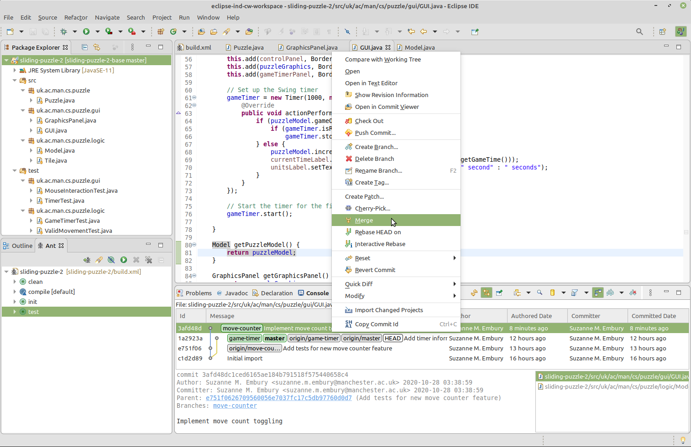
```

::: {.rmdcaution}

(ref:cautionbox)
This screenshot is shown for illustration of the steps needed in Eclipse only.  The code changes shown are not part of the solution for the coursework.  This applies to all screen shots in these coursework instructions.  They don't give away any part of the code solution.

Note also that in the screenshots, the development branch is called `master`, not `main`.  Both branches play the same role.  (Thanks for bearing with us as we work through the removal of problematic terminology from our course materials.)

:::

**Note** This exercise is set up so that the merge you are asked to attempt here will be paused, because conflicts will be found.

```{r mergeResultShowingConflicts-fig, echo = FALSE, fig.align = "center", out.width = "50%", fig.cap = "Merge results showing conflicts"}
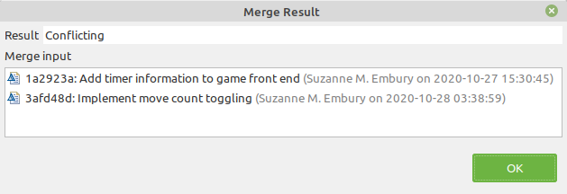
```

When you see this conflicting merge result, the step is completed.

::: {.rmdcaution}

(ref:cautionbox)
The point of this exercise is to walk through the experience of detecting and resolving conflicts between two independent lines of development, and to understand how Git helps us to manage those conflicts.  If you followed the natural conventions and approaches when implementing the Move Counter feature, you will discover conflicts when you try to merge.  If you have found some clever way to implement the feature that avoids conflicts at this merge (e.g. by rebasing the feature branch onto `main` before starting the implementation of the feature), you'll need to think again.  You can't get full marks for this exercise unless you implement the feature in a way that causes conflicts.
:::

### Step six: Resolve the Conflicts and Complete the Merge {#resolveconfcomp}

If you look at the `History` view after the merge attempt of the previous step, you will notice that no merge commit was created, and the `move-counter` branch is still shown as being separate from and unconnected with the `main` branch.

When Git discovers that conflicts are present, it will refuse to make the merge.  But, the merge operation doesn't just fail.  Instead, Git suspends the merge operation, allowing us to resolve the conflicts and then to continue with the merge.  In this step, we'll carry out both these actions.


#### Walkthrough of the Conflict Resolution Process {#walkthrough}

We'll now walk through an example conflict resolution, to show the procedure you should use in your own coursework.  The code changes mentioned here are just for illustration, and are not part of the solution to the coursework.

Our first task is to understand what conflicts are present.  Git does the work of detecting these for us, and annotates the source files with special mark-up, showing the scope of the conflicts.  Modern IDEs can understand this mark-up, and use it to present different visualisations of the conflict to us.  The following screen shot shows both these visualisations in action: the Git conflict mark-up in the editor window and an IDE specific conflict markup in the `Package Explorer` view.

```{r conflictsShownAfterMergePaused-fig, echo = FALSE, fig.align = "center", out.width = "100%", fig.cap = "Conflicts shown after merge paused"}
knitr::include_graphics("images/conflictsShownAfterMergePaused.png")
```


::: {.rmdnote}
(ref:infobox)


**What Are Integration Conflicts?**

Conflicts occur when the same line of code is changed in different ways in the two lines of development that we are trying to integrate.  Git can't work out automatically what the final integrated code should be---that requires a detailed understanding of the purpose of the code that Git cannot have.  A human developer must take the time to work out what the integrated form of the two code versions should be, and to rewrite the code until it takes the desired form.

If a line of code is the same in both versions of the code, then the situation is easy.  Git will adopt that as the form of the line in the integrated version of the code.

If a line of code changes in only one of the versions, Git will take the changed form as the integrated version of the code.  Git assumes that the newer version of the line takes precedence, and carries it forward into the integrated version of the code.

If the line of code changes in both versions, but changes in the same way, this is also easy to handle.  Git will take either version of the line of code (since both versions are the same) and use that in the merged view of the code.

The problem arises when both versions of the code have made different changes to the same line of code.  This is when conflicts occur, and when Git needs help from a human developer.
:::


Eclipse marks files that contain conflicts with a special red, double-arrow decorator.  The files also have a “does not compile” decorator on them.  This is because the conflict markers introduced into the files by Git are not part of legal Java syntax.

The editor window shows this Git markup.  It consists of three horizontal lines, separating the different versions of the code.  In this case, between the top and middle bars we see the code as it is in the currently-checked-out (unmerged) `main` branch.  (You will recall that `HEAD` is a shorthand branch name, referring to the currently checked out branch.)  Between the middle bar and the bottom bar we see the version of this line of code as it presently is in the `move-counter` branch in the Git repository.

There are two ways to remove these conflicts. One is to edit the files directly, to remove the conflict markers and replace the separate code versions with a single integrated version.  In the example shown, for example, we might decide that both variables declared in the conflict need to be present in the final merged code version.  In that case, we edit the file to make that happen showin in figure \@ref(fig:manuallyEditOutConflict-fig)

```{r manuallyEditOutConflict-fig, echo = FALSE, fig.align = "center", out.width = "100%", fig.cap = "Manually edit out conflict"}
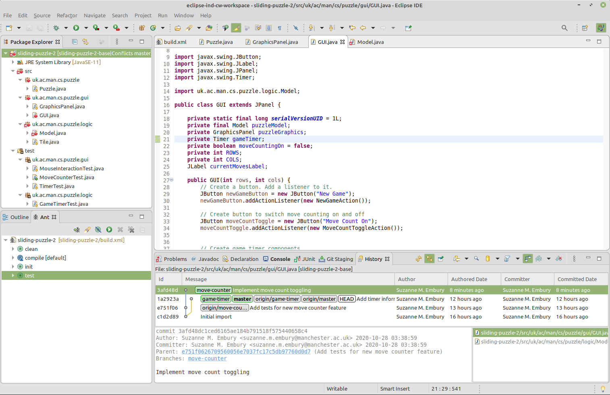
```

This has removed the conflict from the `GUI` class.  

The alternative way to handle the conflicts is to use Eclipse's Merge Tool.  Right click in the editor window, and select `Team` > `Merge Tool` from the context menu that appears.

```{r invokingTheMergeTool-fig, echo = FALSE, fig.align = "center", out.width = "100%", fig.cap = "Invoking the merge tool"}
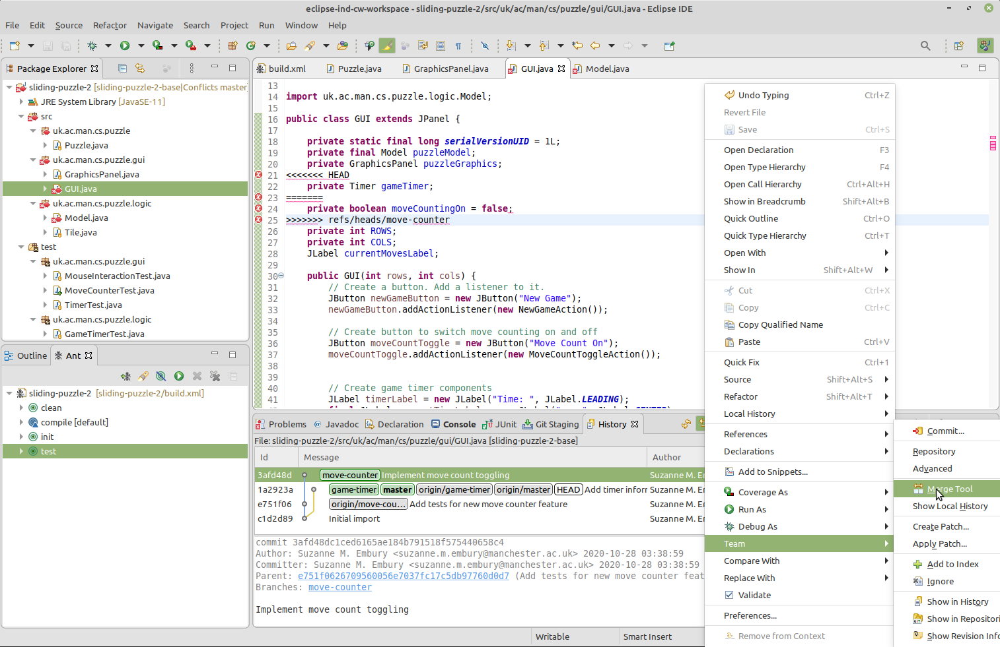
```
The Merge Tool shows both versions of the code, side-by-side, with the changed lines colour coded for easy detection of places where attention is needed.  The left hand window shows the version of the code in `main`, while the right hand window shows the version of the code in `move-counter`.  The coloured bars between the windows show the changes: grey lines are present in `main` but are not in `move-counter`, purple lines are present in `move-counter` but are not in `main`, while red lines are present in both versions and are in conflict.

```{r mergeToolShowingConflicts-fig, echo = FALSE, fig.align = "center", out.width = "100%", fig.cap = "Merge tool showing conflicts"}
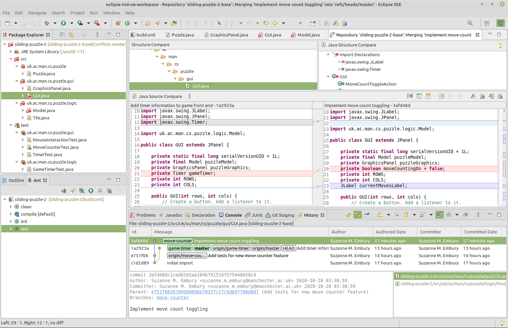
```


Our task is to edit the file in the left hand window, so that it contains the desired integration of the changes in both files.  in this case, it's an easy change: we need to include both lines unchanged, so we copy and paste the line from the `move-counter` window into the `main` window.  Then we save the file.

```{r editsInMergeTool-fig, echo = FALSE, fig.align = "center", out.width = "100%", fig.cap = "Edits in merge tool"}
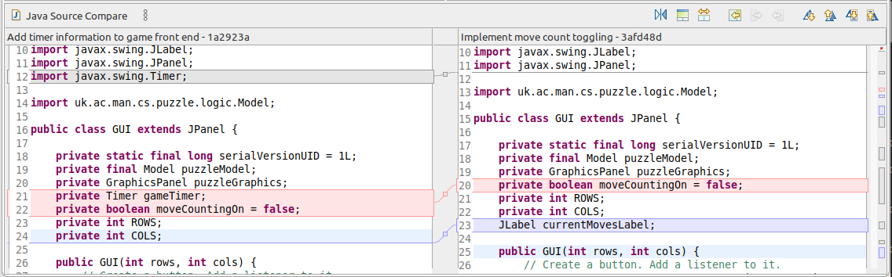
```

Both ways of removing the conflict also remove the compilation error from the file.  You should see this decorator being removed from the file in the `Package Explorer` view.  The conflict marker remains on the file, however, as we have not yet told Git that we believe the conflicts have been removed.

To do this, right click anywhere in the Eclipse windows/views, and select `Team` > `Commit`.  This will bring up a special version of the Git Staging view, tailored for resolving commits.

```{r specialCommitView-fig, echo = FALSE, fig.align = "center", out.width = "100%", fig.cap = "Special commit view"}
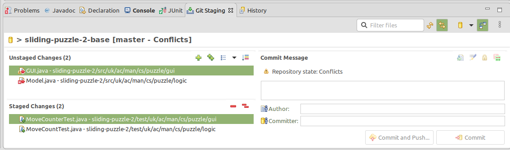
```
If we now stage the changes we've made to the `GUI` class, the conflicts decorator is removed:

```{r commitViewAfterGuiStaged-fig, echo = FALSE, fig.align = "center", out.width = "100%", fig.cap = "Commit view after GUI staged"}
knitr::include_graphics("images/commitViewAfterGuiStaged.png")
```

If we repeat the conflict removal process with the `Model` class, and also stage it for changes, the commit view changes to the following:

```{r commitViewWhenAllConflictsRemoved-fig, echo = FALSE, fig.align = "center", out.width = "100%", fig.cap = "Commit view when all conflicts have been removed"}
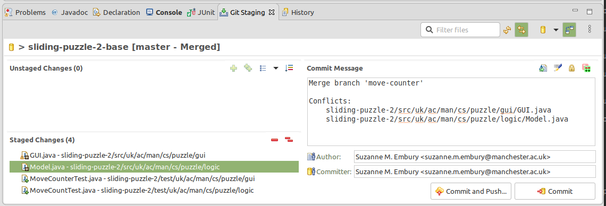
```

Notice that Git has now provided a commit message and has added in the author and committer details.  This is because Git recognised that we have now dealt with all the files affected by conflicts from the recent merge and are ready to proceed with it.

We can now edit the merge message if we want to.  You should always leave automatically generated merge messages unedited, as they provide useful metadata for understanding the flow of code change that has happened on the repository.  Some people remove the details of the conflicting files and some people leave them in.  Regardless, if some aspect of the conflict resolution was tricky or complex, it is useful to add a note explaining that to the merge commit.

**For this coursework, we ask that you add some extra information about how you handled the conflicts to the end of the commit message, but that you leave this automatically generated message unchanged at the start of the message.**

The local history view of the project now shows that the feature branch has been merged into `main`, with a merge commit.  The resulting code version contains both features, integrated together.

```{r localHistoryAfterMergeCompleted-fig, echo = FALSE, fig.align = "center", out.width = "100%", fig.cap = "Local history after merge completed"}
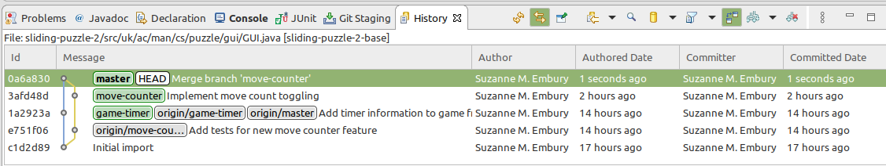
```

#### Now It's Your Turn {#yourturn}

For the coursework, you next task is to find and resolve all the conflicts introduced by the integration of your new Move Counter feature with the existing game features.  Specifically, you are integrating your work with those features that were added to the code base since the start of your feature branch: the Game Timer feature, in this case.

You therefore need to use the conflict resolution tools discussed in this document to create a version of the game that has both the Game Timer feature and the Move Counter feature, and that passes the tests for both features (and the existing test suite).  **This is a non-trivial task.**  You will need to think carefully about how you can get the two features to work well together in the single code version.

A good starting point would be to read and understand the Game Timer feature code that you are going to be working with, including (of course) the tests.

Make sure that the all the tests pass on the version of the code with the conflicts resolved, before you make the merge commit.  And don't forget to test the game manually by running and playing it.  The automated tests won't catch all problems, and should be supplemented by a small amount of carefully targeted manual testing.


**Hint: Making the Move Counter and Game Timer Appear Below the Main Game Panel**

View source to see the hint

<!--When you integrate the two lines of development, you'll find that both the Move Counter panel and the Game Timer panel are supposed to appear in this location in the GUI.  But, if you add them both with the `.SOUTH` position instructions, the layout manager will just use the one last added.

We could use a fancier layout manager, to help us stack these clocks vertically.  But putting effort into this for this coursework would only be worthwhile if you had personal reasons for wanting to practice Swing GUI construction. \medskip

For everyone who is here to learn about handling conflicts in Git, you can take the pragmatic approach of adding all the components to the same panel, perhaps with an additional separator `JLabel` containing just `|` in between the game timer and the move counter.
-->

::: {.rmdnote}
(ref:infobox)
**Suzanne's Tips for Conflict Resolution**

* Having to fix conflicts makes us appreciate it when our colleagues keep commits tightly focused on the task in hand, and avoid unnecessary and irrelevant changes to code layout, spurious comments and random reorganisations of the code.  These changes add nothing of value to the code base, and can considerably complicate the task of conflict resolution.  Be a good team member and keep your commits clean and lean.
* I try to run my IDE's automatic formatter over all files before committing them.  I may not like the automated format that comes out in all cases, but it is worth putting up with a slightly ugly layout if it means I won't have to deal with spurious formatting changes when I next need to resolve conflicts.
* I find it helps to decide in advance the `order` in which I'll put code for the features being integrated.  For example, for this coursework exercise, I might decide to put the Move Counter elements before the Game Timer elements.  This makes it quick and easy for me to be consistent about how I incorporate game changes across multiple classes, without requiring much thought.
* It is worth avoiding long and intricate conflict resolution tasks, especially close to the deadline.  Keep the scale of each resolution task low, by syncing frequently with your remote.  When implementing a new feature, I try to find a series of small `mini releases` that I can implement and merge individually, to keep the scale of the conflict resolution task down.
* I preferred to manually edit out conflict markers when I was first encountering Git, but now prefer to use the Merge Tool when using Eclipse.  Use the approach that's best for your current stage of learning.
* When using the Merge Tool, I normally expand it to fill the whole Eclipse window, so that I can see as much of the code that I am changing as possible, and can better understand the risks of what I am doing.
* *  When you think you've fixed the conflicts in a file, you may discover you have caused compilation errors due to the changes affecting other classes.  So check all files where Eclipse is reporting compilation errors and fix them, looking especially for errors in files you have not changed in your feature branch, before continuing with the merge commit.
* Make sure you run the tests as soon as you have got back to compiling code.  It's really easy to break things in the code you are merging into, especially if you didn't write it.  With good test coverage, the test suite will insulate you from some of these potential errors.  If you are working on a team project, getting some help with a buddy review of the code before you merge it can also help (though you may need to merge and push to a temporary branch instead of to the development branch if you need to do the buddy review remotely).  Using merge/pull requests can also help with this (though it's important to learn how to carry out merges manually first, so you really understand what these tools are doing behind the scenes on your behalf).


:::

### Step seven: Push the Completed Merge to the Remote Repository {#pushtoremote}

After the complexities of the previous step, this one is very easy.  Just push the new location of the `main` branch, plus the merge commit on it, to the remote, following the same instructions as for individual coursework exercise 1 in chapter \@ref(gitting).

Before moving on, don't forget to check that you can see the merge commit in your remote repository on GitLab, and that all the branches are pointing to the same commits as in your local commit graph.


### Step eight: Update the Issue Tracker and Request Marking {#requestm}

Finally, your last step is to update the issue tracker with a short summary of work done to resolve it.

If you have completed the implementation of the Move Counter, and have successfully integrated it into the main development line, with all tests passing, then you can close the issue.  Otherwise, leave the issue open.

When all this is done, you can add a comment to the issue to tell us that you are submitting your solution for marking.  Please add the text:

``` md
Project ready for marking.
```

When we next run the marking code, and it observes this comment, you will lose Developer access to your repository, so make sure you are ready for this before posting this comment.


### Messed Up? {#messi}

If you make a mistake with the coursework, you can request a reset from staff.  To do this, post the following line on the coursework issue in the issue tracker:

```md
    Please reset repository, @suzanne.m.embury.
```

We'll then reset the repository to the state it was at the start of the coursework.  Obviously, you'll then lose access to any commits you made for the coursework so far.

You can only request one reset for this coursework exercise, so use it wisely.


### Coursework Complete {#cw2fin}

This completes the instructions for the second individual coursework exercise for this course unit.  If you managed to complete it in full, then you'll be all to apply the same skills to the team coursework.  You will have practiced some basic test first development.  And you'll be ready to collaborate on team Git projects, and to handle the code integration conflicts this so often entails.  You should also have a better understanding of the practical importance of writing clear, focussed commits.


`Document version:` `r format(Sys.time(), '%d %B, %Y')`

<!--chapter:end:16-conflicting.Rmd-->

# Team Coursework 1 {#dealing}

Team coursework exercise 1: Dealing with Small Scale Code Changes

## Overview

For this first team coursework exercise, your team has been provided with a Git repository hosted on the School's GitLab server.  This repository contains a modified version version of the Stendhal code base.  Once the coursework begins, the issue tracker of this repository will be populated with a number of issues describing “bugs” in the code that your team must fix by the coursework deadline.

But we're not just asking you to fix the bugs.  We are asking you to work like a professional software development team.  You must ensure that all the issues you are fixing are covered by unit tests before you fix them, and you must use feature branches to protect the work of other team members from any mistakes you might introduce with.  We're also asking you to keep a close eye on the quality of your development and release branches (with the help of a continuous integration server), and to use basic Git techniques to ensure that, whatever happens to the code on your feature branches, only code changes that compile and pass the unit tests reach the released code.

The exercise will test your ability to:

* make use of a simple Git workflow, based on feature branches, to allow multiple coders to work safely on a code base at the same time,
* use an automated test suite to make code changes to a large body of code without causing regression,
* write new tests to make bugs visible before you fix them,
* use code reading techniques to locate the parts of a large software system that are relevant to a particular ug,
* prepare a good quality release incorporating the work of multiple developers, and  
* present a professional demonstration of the work you have done, and reflect upon your team processes and how hey can be improved.


## What You Have to Do

### Step one {#stepone}

Following the same process covered in the workshops, each team member should acquire their own local copy of the team repository, learn how to build and test it, and run the code as a locally hosted version of the game.  Instructions for doing this are in chapter \@ref(guiding).


### Step two {#steptwo}

Once you have had a chance to get used to working with the Stendhal code base, we'll upload a number of issues to the project's issue tracker.  Each issue will describe a bug or problem with the code base that you are asked to fix.

For each issue in this list, perform a minimal examination of the code base and decide as a team who will be responsible for fixing each bug.  The issues should be assigned to the responsible person in the issue tracker.

**Important: every member of the team must be assigned as the responsible person for one issue.**

If your team has the same number of members as there are issues, then you should plan to fix all the issues.  If your team has fewer members than that, you can choose which issues you will address.  For example, a team of 5 students will choose 5 of the issues to address in this coursework, and may ignore the others.  In this case, leave any unselected issues unassigned, and remove them from the Coursework 1 Release milestone in your issue tracker.  The automated marking system will mark only those issues that are associated with the milestone at the deadline.

::: {.rmdnote}

(ref:infobox)

**Bugs vs Features**

Every year, this exercise raises questions from students who are concerned that their assigned “bug” isn't really a bug.

What is a software bug?  The most widely accepted definition is that a bug occurs when the implemented behaviour of a system deviates from its specification.  This contrasts with a feature, which is defined as new behaviour needed of the system, that is not currently described in the specification.

This sounds very clear and reasonable in theory.  But in practice, the situation is complicated by the fact that most systems don't have a written specification.  Any specification that does exist is largely a collection of ideas and recollections in the heads of the people responsible for deciding what the system should do.  Whether a particular software change is a bug or a feature is therefore in the eye of the beholder, and there is very little to be gained from trying to argue one way or the other.

The “bugs” we have set for this exercise are all either actual bugs from the Stendhal project issue tracker, variations on reported bugs from the issue tracker or bugs that we have invented that are closely analogous to the kinds of bugs being reported by users of the game.

Unfortunately, many of the bugs reported on the Stendhal issue tracker are too complex, and too difficult to write tests for, to be suitable for a beginning coursework exercise like this one.  But we have tried to retain the form and spirit of “real” bugs in the issues we have assigned for the coursework.  This also means that they are at a range of difficulty levels.  If you were lucky/unlucky enough to be assigned an easy bug, consider pairing with someone else on your team who might be struggling with a harder one.  You can't do the work for them, but you can be a sounding board, and can help with exploring the code base to find the relevant parts of the code.

:::


### Step three {#stepthree}

Each team member should make an estimate of how long it will take to fix the bug they are responsible for.  This estimate should be recorded using GitLab's Time Tracking facility.  Information about how to do this can be found at:

[gitlab.cs.man.ac.uk/help/workflow/time_tracking.md](https://gitlab.cs.man.ac.uk/help/workflow/time_tracking.md)

At this stage, it is not important that your estimate is correct.  What is most important is that you make an attempt at estimating before starting to write code for the fix.

You should also set a Due Date for each issue in the issue tracker.  This should be the date when the work on this individual issue should be completed by.  Note that this *should not* be the deadline for the coursework.  You need to complete your individual work on the issue in time to merge the work into the development branch and for the new release to be created.


### Step four {#stepfour}

You must use separate feature branches for each issue, to protect your team mates from being affected by your changes until they are complete, quality checked and ready for use.  The next step, therefore, is to set up the branch for the issue you are responsible for fixing.

The branch names we ask you to use will be given on Blackboard, under `Assessment` > `Team Coursework` > `Team Coursework Exercise 1`, once the issues have been uploaded to your GitLab project.  These branch names are expected by the automated marking system.  Failure to use the exact names specified will mean that the marking system is unable to find and award marks for your work.

You must create each feature branch starting from the development branch of your team repository.  You must not create it as a branch off some other feature branch, for example.


### Step five {#stepfive}

Before getting started on the fixes, each team member must ensure that the bug they are responsible for is visible in the test suite.  That means that the presence of the bug must be flagged up by at least one failing test.  To do this, you may need to modify an existing test to make the unwanted game behaviour visible or (if the behaviour containing the bug is not currently tested at all) you'll need to create a new test class from scratch.  It is important that you locate any new test cases sensibly in the Stendhal code base, so that other developers familiar with the organisation of the code will be able to find it easily.  You'll also need to work out how to use the test objects that the Stendhal team have provided, to set up the a game (or partial game) in the state needed to make the issue visible.

**You should keep track of how long you spend on this step, to the nearest hour.**  (Note this is the actual number of hours spent on the task, not the elapsed time between when you started on it and when you finished it.)  When the step is completed, add a comment to your issue telling us how long this was.  Please use the following phrase, which will be searched for by RoboTA 🤖 the automated marking system:

```md
    Issue now visible in the test suite.
    /spend <time spent>
```

where `<time spent>` is replaced with the amount of time you spent on this task, expressed in a form that the GitLab issue time tracking facility can understand.

Capturing this fine-grained level of time tracking data is not a usual part of a software process.  We ask you to do it for this exercise so that you can gain an idea of how long these kinds of tasks take you personally.  This will help you in the future in creating defensible and realistic estimates for your work.


### Step six {#stepsix}

Once you have one or more tests that fail because of the presence of the bug, you can make changes to the production code (the code under the `src` folder) to fix it.  This step can be considered complete when the changes you have made in steps five and six are committed to your feature branch, and when the following conditions are all true when the feature branch is checked out:

* All the tests you wrote/modified to make the bug visible pass.
* No other tests in the Stendhal test suite fail.

**As in step 5, you should keep track of how long you spend on this step, to the nearest hour.**  When the step is completed, add a comment to your issue recording this.  Please use the following phrase, which will be searched for by the automated marking system:

```md
    Issue resolved.
    /spend <time spent>
```

where `<time spent>` is replaced with the amount of time you spent on this task, expressed in a form that the GitLab issue time tracking facility can understand.

You may push your feature branch to your team repository at any point during steps 5 and 6, to make your progress visible to your team and to preserve a record of it on the School GitLab server.  You do not have to wait until the issue is completely fixed.

Once you have pushed your feature branch to your team's remote, the continuous integration server will run the automated build and test processes, to determine the health of the code on your branch.


### Step seven {#stepseven}

The next step is to merge your work with the development branch.  The Stendhal team use the `master` branch as their development branch, and we ask you to continue to follow this convention in this coursework^[If you are familiar with the popular GitFlow workflow for collaborative coding with Git, you may be surprised at this, because in that workflow `master` is used as the branch that records the stable, integration version of the code for release (sometimes called the *production branch*), while development is done on a branch called `develop`.  In fact, in many common workflows, including Github Flow and Trunk-Based Development, `master` is used as the name of the development branch.  So the Stendhal team are in good company here.] For this coursework exercise, we ask you to perform merges in your local repository and push them to the team repository.  In later exercises, we will make use of Merge Requests on GitLab to help you manage the merging process, but for this exercise you should **not** create any merge requests (there is a mark penalty for doing so).  Your goal for this coursework exercise is to demonstrate that you understand the basics of merging, by carrying out the steps yourself.  When you have demonstrated that, we will move on to using merge requests.

Before merging your work into the development branch on your team's repository, you need to check that your code changes are not going to introduce any unexpected problems.  To do this, first, **fetch any changes from your team's repository**, and merge them into your local repository, to make sure you are working from the most up-to-date version of the code base.  (If your whole team is following the workflow correctly, this step should be trivial.

A team activity taking you through this process will be covered in the team study sessions.

Next, check out the `master` branch and merge your feature branch into it (following the same approach we covered in the GitLab Access Check activity).

**Do not push the `master` branch to your team's remote repository at this stage.**  (You may, of course, push the feature branch.)

Check that the code base that results from this merge compiles, and that the full test suite passes.  If you encounter any problems, you'll need to reset the `master` branch back to the commit it was on before the merge.  This will have the effect of undoing the merge you just made.

Fix the problem in your feature branch and start this step again.  (Of course, if the problem turns out to be caused by code one of your team members has committed to your team repository, you'll need to stop development and work with that team member to fix their feature branch and re-merge it, before coming back to start this step again for your own feature branch.)

Once you are confident you have a clean merge, you can push the changes to the `master` branch to your team repository.  (You may wish to fetch commits from your team repository again before doing this, if a certain amount of time has elapsed since you started work on this step.)

If, at this point, you get a clean development branch build from the continuous integration server **and** the bug cannot be replicated when the game is run from the development branch, you can close the issue in the issue tracker.


### Step eight {#stepeight}

As in steps 5 and 6, you should keep track of how long you spend on this step, to the nearest hour.  When the step is completed, add a comment to your issue telling us this.  Please use the following phrase, which will be searched for by the automated marking system:


```md
    Feature branch merged into development branch.
    /spend <time spent>
```

where `<time spent>` is replaced with the amount of time you spent on this task, expressed in a form that the GitLab issue time tracking facility can understand.

::: {.rmdcaution}

(ref:cautionbox)

  **Do not push broken code to your team's development branch**

If, by the deadline, you have a feature branch that contains compile errors or has failing tests, you should push it to the team repository for marking, but you should **not** merge it with your development branch.  Your team will get more marks for not merging broken code than you will get for allowing broken code to reach the development branch or release tags.

Leave issues for unmerged feature branches open.  The team needs to know that this issue has not yet been fixed, so they can return to it in a future release should customer interest in fixing it become pressing.


:::

Note that it is your team's collective responsibility to ensure that the status of issues in your issue tracker accurately reflects the state of the code base.  If a team mate has marked an issue as completed, but you notice that the tests are failing for the merge, you should reopen the issue, giving a description of the problem as a comment in the issue.  Similarly, if a team mate has fixed a bug but forgotten to close the issue, you can check with them and close the issue for them.


### Step nine {#stepnine}

The final technical step is to prepare the release.  Although several team members may contribute commits for this process, a single team member should take responsibility for carrying it out.  This team member should create an issue for this task called:

```md
    Prepare release 1.36uom
```

This issue should be associated with the coursework 1 milestone, and assigned to whichever team member is taking responsibility for carrying out the release task.

Choose the commit on the development branch which will form the basis for the release.  This commit should include all the changes for the issues that have been correctly fixed by the team during the coursework and have been merged successfully with the development branch.  These are the issues that will be included in the release.

If we look at the previous releases created by the Stendhal team, we notice that a number of changes are made in each case.  Notably:

* The version number of the software is updated in the `build.ant.properties` file (and the change is propagated to other files, through the build process).
* Any new authors are added to the `doc/AUTHORS.txt` file
* A description of the changes included in the release is added to the `doc/CHANGES.txt` file.

You will need to make these changes for your release too.  You can add them directly to the development branch (or you can use a release branch^[A release branch is just like a feature branch, except that it is created in order to manage the process of preparing a code base for release and to prevent that work from interfering with work on features for upcoming releases.] and merge with the development branch when complete, if you wish).

When you have created a commit that contains all the code and documentation you want to release, you should mark this by adding a *tag* at that commit.  The tag **must** be called:

```md
    VERSION_01_RELEASE_36_UOM
```

This is the version of the code that we will consider to be your released code, when we are marking.  So, it is important that you place it at the right place.  You can create the tag locally and push it, or you can use the GitLab web interface to create the tag once the final release commit has been pushed.


### Step ten {#stepten}

You are done with the technical work at this stage, but there is one more task to do: prepare for the marking interview that follows the deadline for the coursework.  In this interview, your TA will ask you to demonstrate some of your bug fixes in the released code, and will discuss with you how you have organised your work to balance load across the team and what monitoring steps you've taken to keep the work of the team on track for the deadline.

More information about the timing, location and format of this interview will be posted on Blackboard.

Note that all team members must attend the marking interview, and any team member may be asked to demonstrate and talk about the issue they were responsible for.  **Any team member who fails to attend and who has not registered a legitimate excuse with SSO or a member of the course team will receive an automatic 50% penalty on their mark for the exercise.**  Team members who attend the interview will be unaffected by this penalty.


## Submission of Your Team's Work {#imdone}

All submission of work for this coursework exercise is through your team's GitLab repository.  All you have to do is make sure the contents of your issue tracker and Git repository are ready to be marked by the deadline.  There is nothing else you have to submit.

A “live” marking scheme for the exercise can be found on the CI server used for this course unit.  (You will get information about this some days after the coursework is released to you.)  The marking scheme gives details of how the marks will be awarded, but also gives an interim mark for your team based on the work completed so far.  Of course, only some parts of the marking can be automated.  Others will need to be done by GTAs.  The GTA marking takes three forms:

1. Pre-deadline annotation of commits.  Your assigned GTA will look at your commits and add annotations to tell the automated marking code which parts of the exercise each commit contributes to.  You should take note of these annotations and let your GTA or a staff member know if you believe the annotation is incorrect.
1. Post-deadline marking of your team process and the changes you have made to the code base.
1. Marking based on your team performance in the marking interview, and your reflections on how well you worked as a team.

Once the deadline is passed, you will temporarily lose developer role access to the repository and won't be able to make further changes to the code or commit graph.  At this point, we will clone your team repository and the automated marking process will finalise as many of the marks as it can.  When the GTAs have completed the remaining marking process, the marks will be uploaded to Jenkins and your final mark plus feedback will be visible in your team's RoboTA build.

You'll get developer access back once the next coursework exercise begins.


## Coursework Extensions {#cwkex}

Since this coursework is a team exercise, no extensions will be given, and there is no option to submit your work late.  Team members who experience substantial difficulties in completing their work due to illness or other legitimate reasons will need to complete a Mitigating Circumstances form so that this can be taken into account later.  The marking process is sufficiently flexible to take into account non-contributing team members without significantly affecting the team mark for other members.

If you are not going to be able to carry out the work for your issue by the deadline set for your team, you **must** inform the other team members in plenty of time.  This will allow them to make decisions about what to include in the release, so as not to be penalised for the work you have not been able to do.


## Non-Contributing Team Members {#passengers}

Every team member is expected to contribute some meaningful code to the team's repository.  You should declare the work you intend to deliver as you contribution by assigning an issue to yourself in the issue tracker.  Commits on feature branches should be made by the team member recorded as responsible for the commit in the issue tracker.

A meaningful commit is one that contributes code changes to either test or production code that moves the team's repository closer to the fix for an issue in some way.  Adding white space, rewording comments or moving lines about are all examples of code changes that will not be considered to represent a meaningful contribution to the exercise.  Similarly, a merge commit is not by itself considered to be a contribution to the solution.


::: {.rmdcaution}

(ref:cautionbox)

Any student who has no assigned work in the issue tracker or who has not made at least one meaningful commit to their team repository, from their Department GitLab account, during the period covered by the exercise, will automatically receive a mark of 0 for the whole exercise.

This applies even if you decide to work in pairs on the issues.  Sitting and watching someone else make a commit, even if you are telling them what to type, does not count as a commit from you.  The commit must be made from your own GitLab account.

:::

If a team includes non-contributing members, the marking scheme will be adjusted to take this into account.  This means it is not necessary for contributing team members to pick up additional work, to fix issues that have been assigned to non-contributing members.  Instead, everyone should concentrate on fixing their own issue, and on including it safely into the release.  The team mark will be adjusted to take into account issues not fixed by team members who are non-contributing.


## Partially Contributing Team Members {#freeriders}

If a team member contributes something, but does much less than others or contributes their work in a way that causes problems for the rest of the team, the team as a whole can choose to reduce the mark of that student.  For this to happen, you must:

* Send an e-mail to the student as soon as the problem is noticed, pointing out the difficulties they are causing for the team, and asking them to say what they can do to resolve matters.  CC this e-mail to Anas or Duncan, so we have a formal record of the communication.
* Set a deadline for the team's work that is sufficiently far ahead of the actual deadline, so you have time to chase people who don't deliver.
* Before the team interview, send an e-mail to Anas/Duncan *and* the offending team member letting them know that the team will propose a reduced mark for them at the interview.
* At the interview, raise the issue with the TA, who will document the circumstances on your marking form, along with details of the proposed mark reduction.  If the affected team member agrees, the proposed reduction will be applied at that point.
* If team agreement on the mark reduction cannot be reached, the whole team will need to meet with Anas or Duncan to agree a way forward.

Note that this process is not necessary for team members who have not assigned themselves any issues or made any commits in your team repository, as they will automatically receive a mark of 0 in this case.

Mark reductions apply to individual team members only.  There is no effect on the mark of the rest of the team.  Teams are asked to try to resolve problems within the team if possible, before making mark reductions, but this option is there as a measure of last resort for those teams who need it.


## Plagiarism {#copycats}

This coursework is subject to the University's policies on plagiarism.  Details can be found on the School web pages at:

[studentnet.cs.manchester.ac.uk/assessment/plagiarism.php?view=ug](http://studentnet.cs.manchester.ac.uk/assessment/plagiarism.php?view=ug)

Note that committing the work of other people from your GitLab account counts as plagiarism, and action will be taken when it is detected.


`Document version:` `r format(Sys.time(), '%d %B, %Y')`

<!--chapter:end:17-dealing.Rmd-->

# Team Coursework 2 {#working}
Working with Features

## Overview {#ovirew}

In this second exercise using the Stendhal code base, you and your team are again presented with a number of issues recorded in your GitLab issue tracker.  This time, however, the issues describe new features rather than bugs.  That is, they describe extensions to the Stendhal game, rather than corrections to the implementation that bring it back into line with the way the game's owners believe it should behave.

This brings into play a number of new software engineering skills.  The first difference is the amount of work to be done.  Unlike the simple bugs we looked at in the last coursework exercise, the features your team has been presented with are larger in size, involving the modification of existing classes and the design of new classes.  Taken as a whole, they represent more work than you can sensibly achieve in the time given for the coursework.

**You must therefore choose a subset of the issues that your team will commit to deliver by the deadline.**

Another difference is in the scope of the work.  Most bug fixes will be implemented in full, with few decisions to be made about how much of the work described by the issue it is worthwhile to complete.  When adding new features the situation is more complicated: the full implementation may require a great many code changes, all of which may put other parts of the system's behaviour at risk.  In addition, it may not be clear how users will react to the new functionality, or what variants of it they may prefer to use.  It is therefore usual to introduce new features gradually, over the course of a series of releases, to manage the risks and to adjust the direction of travel in the light of user reactions to the new functionality.  

**You must therefore create a release plan for each issue, showing how it will be released incrementally into the game.  You will then implement only the first release of the full feature for this coursework.**

This exercise will follow the same broad phases as the first team coursework exercise, but with several additional steps being added:

1. Release planning.
1. Planning for the releases that will be implemented.
1. Testing and implementation.
1. Code review.
1. Integration and system testing.
1. Making a new release.
1. Preparing for the face-to-face interviews.

You can choose how you carry out these steps in your team, perhaps combining or overlapping some of the steps.


The exercise will test your ability to:

1. use basic software estimation techniques to commit to a workload that your team can deliver, and to divide work fairly across the team,
1. scope features to control the risk of adding new functionality to an existing development,
1. make use of a simple Git workflow for coordinating team development,
1. write test suites that maintain test coverage across new and existing code,
1. use code reading techniques to locate the parts of a large software system where new functionality can be safely added,
1. use basic code review techniques to help ensure the quality of your team's code, and
1. use test-first development and good OO design principles to guard against regression in this and future releases.

## What You Have to Do {#udo}

### Step 1: Release Planning {#releaseplan}

Your first task is to create a release plan for each of the issues in your issue tracker associated with the milestone for this coursework exercise.  We will show you how to do this in the workshops in the second part of the course unit.

The release plan for each issue will describe a sequence of incremental releases that, when complete, will fully implement the feature in the game.  This is done by dividing the work required for the full issue into sub-features, which can be delivered independently of each other.  For example, if an issue requires the addition of a new quest to the game, with a brand new item type as a reward, then we might plan to release the item first in one release, and only release the quest in the next release, once we had had some time to try out the new item in real game play.

For each release, you must describe:

1. The sub-features that will be delivered in the release.
1. The target audience for the release (which group of users the new functionality will be released to)
1. The existing game elements that can potentially be used to support some aspects of the sub-features to be delivered, and how they will need to be adapted.

The releases must be numbered and presented in the order in which they should be delivered.  This order should take into account dependencies between the sub-features.  For example, the release containing our new quest should come after the release that delivers the new reward item (for obvious reasons - we can't release the quest if the reward item does not yet exist in the game).

Releases should be designed so that each one delivers a “playable” feature, that can be tested in live play.  You also need to consider the effects on players of the game as they experience the different stages of release of the feature, and make sure that the overall sequence of releases makes for a sensible and pleasant game experience.  Players are normally happy to receive additional game features, more capabilities, better items, as releases progress, but are typically less happy for the game to be made more awkward or annoying than in a previous release, or to lose useful capabilities they had in previous releases.

The first release should be designed to be a "canary release" (also sometimes called a "feature rollout").  That is, it should aim to test that the most risky part of the feature is both technically feasible and provides a sensible and enjoyable game play experience.  Therefore, for each first release, you must also give a short rationale for why you chose this part of the full feature to implement and deploy into the game first.  (Only 3-4 sentences of rationale are required.)

You will document your release plans by placing them in the wiki of your team's GitLab project.  You should create a page in the wiki for each issue, using the page slugs shown on Blackboard (under `Assessment` > `Team Coursework` > `Exercise 2`.  For example, **for team S1Team107**, if the page slug for one issue is given as `slow-innkeeper`, then the wiki page for this issue would be reached at the following URL:

[gitlab.cs.man.ac.uk/comp23311_2021/stendhal_S1Team107/wikis/slow-innkeeper](https://gitlab.cs.man.ac.uk/comp23311_2021/stendhal_S1Team107/wikis/slow-innkeeper)

`NOTE: YOU'LL NEED TO SUBSTITUTE YOUR TEAM NUMBER INTO THE URL ABOVE`

The release plans for this stage can be quite high level and short. The aim is to do just enough planning to allow you to make good decisions about which features to commit to deliver, in the next step.

Please use the following text for the header for this section of the wiki page, so that we can generate links to your release plans in our instructions to GTAs for marking:

    ## Release Plan


### Step 2: Issue Planning {#issueplan}

### Step2.1: Choosing your Issues {#ischoose}

In most of the coursework you have been set for your degree, you are told exactly what you need to deliver and the work is set so as to be guaranteed to be achievable in the timescales allowed.  Real software engineering is not like this.  There is always more to be implemented than can realistically be achieved in the time available.  Making decisions about what to build, and how much to commit yourself and your team to deliver, is an essential part of software engineering.  This coursework gives you the opportunity to practice and reflect on this skill, before you have to apply it in real life.

To allow this, we have given you a selection of issues describing new features for this coursework that, if implemented in full, constitute more work than you can reasonably achieve in the time available.  You must choose a subset of issues to implement, balancing the need to do enough work to achieve your target mark for the exercise with the amount of time it is possible and worthwhile to devote to the exercise.

Each feature you implement is worth 10 marks, if implemented perfectly against the criteria in the marking scheme.  However, we have set a cap on the number of marks you can achieve for the implementation of features.  This means that if you select too many features to implement, you will be wasting your time, as you will not be able to achieve more marks for the additional work done.  Your aim is not to work long hours in order to achieve more than is needed, but instead to think about how you can use your time effectively, to deliver the expected amount of value in the fewest person hours.

Since this is a somewhat unsual approach to coursework, we have provided a spreadsheet that will help you in making your choice of features to implement. The spreadsheet will allow you to see the effects of your choices on the mark you will achieve, based on your predictions for the mark you'll be awarded for each individual component of the work. The spreadsheet can be found at [bit.ly/coursework-2-mark-scheme](https://bit.ly/coursework-2-mark-scheme)

**Remember when selecting issues that you will only need to implement the first of the releases in your release plan for each selected issue.**

Once you have decided which features you will not be delivering in this release, you should remove them from the Coursework 2 Milestone. Only the issues you are committing to deliver should be associated with this milestone by the deadline for the exercise.  RoboTA will mark the set of issues associated with the coursework milestone, so it is in your interests to make sure this is accurate before your coursework is marked.


### Step2.2: Creating a Work Breakdown Structure for the Selected Issues

For each selected issue, you should create a work-breakdown structure (WBS) to come up with a defensible estimate for the effort needed to implement the first release.  The work breakdown structure should be documented on the wiki page for the issue (in addition to and below the release plan for the issue).  WBSs for this stage should contain more detail than for the high level release plans created in the previous stage.  The level of granularity you should aim for is described in the RoboTA marking scheme for the exercise.

Please use the following text for the header for this section of the wiki page, so that we can generate links to your WBSs in our instructions to GTAs for marking:

    ## Work Breakdown Structure


### Step 2.3: Planning for the Implementation {#plimp}

You must next decide:
1. which team member will be the lead for each selected issue,
1. which team members will work on the implementation of each selected issue, and
1. which team members will act as code reviewers for each selected issue.

All these decisions should be documented in your issue tracker, as described below.

Since the features we have set are more substantial coding tasks than the bugs you fixed in the first exercise, you will need to work together, in groups of 2 or 3, to implement some of the selected features.  That is, you will break your team down into sub-teams, each of which will be responsible for delivery of the first release for an individual feature.  Such teams are sometimes called "feature teams".

A common cause of failure in team work is when all members of the team assume that some crucial task will be done by someone else.  To avoid this, it is important to assign a lead member for each sub-team.  This person is responsible for the detailed planning for their issue, for scoping it down, for coordinating the implementation work amongst the
members of the sub-team, and for documenting the work as needed for marking.  This does not mean that the team leader does all these tasks alone---it means only that the team lead is the person who will check that these tasks are all done and that everyone is clear about what they need to do and by when.  Apart from that, the way the tasks are shared amongst the sub-team members is up to you.  But it is expected that all sub-team members, including the leader, will do some coding for their issue, to allow them to meet the requirement that at least one meaningful commit be made for the coursework by every team member.

Team leads should be assigned as the responsible person for the issue in the issue tracker.

All other sub-team members for each issue must be recorded on the issue tracker, using a sentence of the form:


`Sub-team member: <URL of GitLab profile of team member>`

GitLab profile links have the form: [gitlab.cs.man.ac.uk/name](https://gitlab.cs.man.ac.uk/name), where `name` is a GitLab username.  Multiple sub-team members may be recorded in separate comments, or in a single comment with newlines between the sentences.  You do not need to record the team lead as a sub-team member.

Note that to receive marks for the coursework, every team member must be assigned to a sub-team for the exercise, either as lead or as a sub-team member, and must make a meaningful commit contributing towards the implementation of the feature their sub-team is assigned to implement.  Work allocation must be designed to ensure that all team members are able to meet the criteria for receiving marks.

A further assignment of roles must be completed at this stage before you can proceed to the implementation of the issue.  For this coursework, we ask you to apply the practice of reviewing all code before it is integrated into the mainline of development for your team.  Therefore, you should also decide who will carry out code review for each issue.  Every member of your team must carry out some code review, and the code for every feature must be reviewed before integration.  While you are welcome to carry out buddy reviews within sub-teams, the pre-integration code review step must be carried out by someone from another sub-team.

Code reviewers for issues must be recorded on the issue tracker, using a sentence of the form:

`Code review by: <link to GitLab profile of team member>`

Multiple code reviewers may be recorded for a given issue, if wished.

You should document your estimate for the **effort** required to implement each feature in the issue tracker.  For this exercise, we are going to use GitLab's Time Tracking facility.  Information about how to do this can be found at:

[gitlab.cs.man.ac.uk/help/workflow/time_tracking.md](https://gitlab.cs.man.ac.uk/help/workflow/time_tracking.md)


The results of your planning must be documented in the issue tracker and on the wiki *before* you begin work on each selected issue.

### Step 3: Testing and Implementation {#timp}

Once issues have been allocated a team lead, feature teams can start work on the implementation of their features.  The team lead should begin by expanding the WBS for the work on the issue's wiki page (if necessary), and by allocating parts of the work to the sub-team members.  Care should be taken to find a breakdown of the work that allows sub-team members to work in parallel on different parts of the feature and to meet the criteria to receive marks for the exercise.

The team lead should set a due date for the delivery of the feature to the team, using the issue tracker's Due Date facility.  Obviously, this due date should be chosen to allow time for code review, corrections and merging of the feature into the development branch, plus making corrections in the event that this breaks the build.  The due date must be set *before* work on the issue begins (considered to be the time when the first commit for the implementation is made).

The team lead should update the estimate for the issue in the issue tracker if, based on the more detailed planning carried out, the sub-team feel the original estimate was inaccurate.

We ask you to use the same Git workflow as you used in the first exercise, to allow your sub-team to work collaboratively on each issue without interfering with the work of the rest of your team by using feature branches.

In addition, there are some new skills we ask you to demonstrate in this second course unit.  We are asking you to code in a test-first manner, to manage the quality of the commit messages your team makes, and to use a test coverage tool to assess whether you have written sufficient tests or not.  Details of all these requirements are given below.


#### Choosing a Sensible Starting Commit {.unnumbered #sensible}

It is important that all the team start their feature branches from a clean commit.  Otherwise, problems in commits for the 1st exercise (such as failing tests) will be carried forward into the new feature branches, and may result in lost marks for this exercise too.  It is your reponsibility to ensure that this does not happen.

Teams with a clean build for their development branch in Jenkins should be okay to start the work for the next coursework exercise from this point.  Teams with unstable or failed builds on their development branch will need to start by getting the `master` branch to a clean state.  If the problems were caused by merging feature branches with unstable or failed merges into `master`, then you will need to revert those commits^[The use of Git revert as a quick fix for Git errors is never pretty and should be avoided where possible.  However, in this case, it may be the quickest way to get your codebase to a clean starting state for the exercise.].  Please get help in an early team study session if you are unsure about this

**Once a suitable starting commit has been identified or created, one member of your team should create a tag pointing to that commit.  The tag should be called:**


`EX2_START`

We have created a Jenkins build for this tag, to help you choose a good starting point for your work for this exercise.  Push the tag to your candidate starting commit and then manually request that the job be built (You'll need to build this job manually if you push this tag without code changes.)

If you place the tag at the wrong commit, and need to change it, you will need to delete it and recreate it.  Instructions for deleting tags can be found at the end of this document.

It is expected that your development branch will start at this commit for exercise 2, so make sure your master branch is located at this commit before you start work on the features.  All named feature branches for exercise 2 should begin at this tagged commit or a later commit on the development branch.


#### Git Workflow {.unnumbered #gitworkflow}

As before, you should use feature branches to keep the work on each feature separate from the main development branch, until you are satisfied that the code is ready to be integrated into the main game code.  Please continue to follow the Stendhal team's practice of using the `master` branch as the development branch.

Please use the feature branch names given on Blackboard for this exercise.  A change from the previous exercise is that you are likely to have more than one person working together for some issues, and therefore will have more than one person committing to your feature branch.  You are free to create sub-branches off this, if individual team members want to work in isolation for part of the work.  These sub-branches would then be merged into the feature branch; they should *not* be merged directly into the `master` branch.

Note that the branch names given on Blackboard are expected by the automated marking system.  Failure to use these exact names will mean that the marking system is unable to find and award marks for your work.


#### Best Practice Commit Messages {.unnumbered #bpcm}

For this exercise, we ask you to gradually increase your Git skills by following best practice in terms of the commit messages you use.  We ask you to adopt the style of commit message recommended by GitHub.  Details of this format can be found on Blackboard under the Course Content for week 6 ("Git Workflows").

An example of a commit message that follows the format we want you to use is:

`Allow Joshua to list ingredients for spy glass`

`When asked, Joshua will now list the ingredients he needs for making the new spy glass item.  This was trickier than it looked, because Joshua was already using all the available conversation states.  I added a new state (QUESTION_4) to make it work.`

Note the phrasing of the first line, as a sentence in the imperative that completes the sentence “When applied, this commit will...”.

Please note that all team members must use their own GitLab account to commit and push their work, and that commits must have your University e-mail address as the e-mail of the commit author.  This is set using `git config`, as described on the School wiki:

[wiki.cs.manchester.ac.uk/index.php/Gitlab/Git_Setup](https://wiki.cs.manchester.ac.uk/index.php/Gitlab/Git_Setup)


::: {.rmdcaution}

(ref:cautionbox)
Please make sure you set the `user.name` and `user.email` variables on all machines you intend to commit from.  Your email needs to you `firstname.lastname@student.manchester.ac.uk` address.

**Commits made from other accounts will NOT be considered to be part of your team's submission for the exercise!**
:::

#### Test-First Coding {.unnumbered #tfcode}

As in exercise 1, you are asked to write tests to describe the behaviour of the code change you are making.  For this exercise, we ask you to use the test-first development strategy introduced in the workshops.

Each sub-team should begin by writing at least two failing acceptance tests for the feature you plan to implement, following the test-first approach demonstrated in the workshops.  These tests should describe core elements of the features, not trivial side cases.  For example, a test where a quest is undertaken and completed in the quickest way would be considered core, while a test where a quest is refused at first offer is not.

To help us assess and give feedback on your use of test-first development, we ask you to commit these two failing acceptance tests **before** you commit any of the production code changes that will make them pass.  You may make changes to these tests in later commits, as well (of course) as changes to production code.  But the first commits on the feature branch should contain two tests that are sufficiently complete in their implementation to allow the code to compile and run to an unstable build.  (Note that it is not normal practice to enforce the committing of new tests to a feature branch, although of course when using a test-first approach this tends to be what happens naturally.  We are taking a slightly stricter line on this than would be expected in practice, in order to help you demonstrate that you understand the principle of test-first coding and are able to apply it in practice.)

To tell us when you have committed the test code and are ready to start working on the production code, we ask you to mark the final test code commit with a special tag.  The names of these tags are given on Blackboard.  Jenkins builds have been set up to build the commits marked by these tags, to allow you to heck you have positioned them correctly and to aid us in marking.


#### Management of Test Coverage {.unnumbered #testcov}

When writing tests for more extensive functionality changes, you may wonder when you have written enough tests and when you can stop.  This is a critical question for software developers, since writing tests is not free (neither in terms of developer time, nor the time required to run the tests).  For this coursework, we ask you to use test coverage to help you manage your tests, and determine whether you need to write more.

Since this is the first time that most of you have used a test coverage tool, we are setting a fairly low coverage goal for this exercise.  We ask you to ensure that you maintain the overall instruction coverage level for the coursework set by the Stendhal team in the starting commit for the coursework.  For most teams, this will be either 52% or 53% instruction coverage for all classes.

We will mark your team's coverage using the instruction coverage for all classes, given in the “Overall Coverage Summary” values on your team's development branch build in Jenkins.

If your team's coverage is lower than this value, you will need to use the coverage reports to find areas of the new code you have written that is not well covered by tests.  Looking at the instructions that were not executed during the test suite execution, you'll need to think of extra tests to add that will cause those instructions to be executed.
(Obviously, these tests will necessarily be added after the main work on the production code has been completed.)


#### Documenting Your Work {.unnumbered #docuwork}

You should use the issue tracker and the team wiki to document any problems you encounter that require you to make changes to your plan or your team structure.  Discussion while implementing using other tools (such as Facebook or Slack) is obviously fine but remember that we can only mark what we can see.  Key decisions regarding who does what work, and changes to the planned scope for features that are running late, must be documented on your GitLab repository if we are to be able to take them into account when marking.

An important piece of documentation to keep is the record of how long you have spent on the feature so far.  You should record this in your team's issue tracker on GitLab, using the  “time tracking” feature, as you did in exercise 1.  Information on how to use this is available from the side bar of each issue.  Note that you will need to record all the time spent by all sub-team members.  You will probably find it easier to update the time spent as you go along, rather than trying to remember and adding the total in at the end but either strategy is acceptable.

For this exercise, there is no need to record the times for the different tasks (writing tests, implementation, merging) though you may wish to do this for your own personal reference.


### Step 4: Code Review {#codereview4}

For this exercise, we ask you to start to make use of an additional code quality management technique: code reviews.  Your goal is to ensure that no code is merged into the development branch without having an independent team member look over it and check for errors or code quality problems.  You will lose marks if unreviewed code is merged into the development branch.

Both test code and production code changes must be reviewed.  You can choose whether to review individual commits as you proceed, or to review the whole code for a branch before merging.

Reviews must be given using the GitLab commit comment feature, or through merge requests.  Reviews given verbally, or recorded in some tool other than GitLab, will receive no marks (for obvious reasons).

Every contributing team member must perform at least one review in GitLab across the exercise.

A guide to performing code review can be found in the online course handbook.


### Step 5: Integrate Completed Features into the Development Branch {#devbranch}

When you are satisfied that a feature branch contains code that is fit to be integrated into the game, you should merge the feature branch into the development branch.  For this exercise, **we ask that you use non-fast-forward merges for all merges of your feature branch into the development branch**^[For this coursework, you are asked not to use rebase when integrating feature branch commits into the development branch.  There are lots of good reasons to use rebase for code integration, but it really only makes sense when used in conjunction with Git features for creating a tidy commit history.  Our goal at this stage in your degree is for you to be comfortable with the simpler merge approach.  If you want to get some experience with rebase (a good idea), you can create a separate clone of your team's repository and hack it about to your heart's content, without putting your team's coursework mark at risk by trying to push any of the results of your experimentation to it.  Note that you can also get practice with using rebase to synchronise with your team repository, as described in the [team study article on that topic](https://software-eng.netlify.app/syncing.html).].  To do this in Eclipse, use the `Team` > `Merge` command from the project context menu, and select the option to create a merge commit in the event of a fast-forward merge shown in figure \@ref(fig:NonFFMergeOption-fig).

```{r NonFFMergeOption-fig, echo = FALSE, fig.align = "center", out.width = "80%", fig.cap = "Non Fast Forward Merge Option in Eclipse"}
knitr::include_graphics("images/NonFFMergeOption.png")
```

Unfortunately, the handy merge option accessible through the History View doesn't give the chance to request this option, so should not be used for merges of your feature branch into the development branch.  If you use this version of merge by mistake, don't panic.  Fast forward merges are easily undone just after you make them by resetting master to the commit it was at before the merge was made *provided you have not pushed your merge to your team's remote*.  Please continue to make merges locally, checking them in the History View before carrying out the merge in your team's remote.

You should use merge requests for this coursework exercise, to provide a  “quality gate” for code, to prevent it from being integrated into the development branch before it has undergone code review.  GitLab will perform the merge itself through merge requests if you request it, but you are advised to use caution with this option.  It is very easy to create an incorrect merge using merge requests unless you really understand how they work.  Worse still is that they create a merge directly into your team's remote repository, making it difficult to fix any merge errors that have been made.  Even if you plan to create the merge through a merge request, we still recommend checking the merge out on a temporary local branch before pressing any GitLab merge buttons.  (We've also set up Jenkins jobs to merge your feature branches into the development branch on each commit, to give you early warning of any problems that might arise---these builds are true “continuous integration” builds.  The merges are carried out on Jenkins and are thrown away once the next build takes place.  The merge will not be pushed back to your team's repository.)

We will assume that new issues will be created for the remaining releases for this feature.  Therefore, once your feature branch has been merged into the development branch, and the resulting commit produces a clean stable build, and you have observed the feature working in game, you can consider the issue to be closed and should update its status in the issue tracker.  Don't forget to add the time required to carry out the merge to the issue's time tracker.

Issues for un-merged features should be left open, even if some commits have been made for them.  The team needs to know that this feature's canary release was not completed, so they can return to it in future should customer interest in the functionality proposed make the effort worthwhile.


### Step 6: Prepare the Release {#reeleaseprep}

The final technical step is to prepare the release.  Although several team members may contribute commits for this process, a single team member should take responsibility for making sure the release is created correctly.  This team member should create an issue for this task called:


`Prepare release 1.37uom`

This issue should be associated with the coursework 2 milestone, and assigned to whichever team member is taking responsibility for carrying out the release task.

Choose the commit on the development branch which will form the basis for the release.  This commit should include all the changes for the features that have been completed by the team during the coursework and have been merged successfully with the development branch.  These are the issues that will be included in the release.

Once again, you will need to update:


1. The version number of the software is updated (to 1.37uom).
1. The `doc/AUTHORS.txt` file
1. The description of the changes included in the release in the `doc/CHANGES.txt` file.

You can make these changes directly on the development branch (or you can use a feature branch and merge with the development branch when complete, if you wish).

When you have created a commit that contains all the code and documentation you want to release, you should mark this by adding a *tag* at that commit.  The tag **must** be called:


`VERSION_01_RELEASE_37_UOM`

This is the version of the code that we will consider to be your released code, when we are marking.  So, it is important that you place it at the right place.  You can create the tag locally and push it, or you can use the GitLab web interface to create the tag once the release commits have been pushed.


### Step 7: Prepare for the Marking Interview {#interviewprep}

You are done with the technical work at this stage, but there is one more task to do: prepare your team for the marking interview for the exercise.  In this interview, your GTA will ask you to demonstrate some of your features in the released code, and will discuss with you how you have organised your work to balance load across the team and what monitoring steps you've taken to keep the work of the team on track for the deadline.

More information about the timing, location and format of this interview can be found in section \@ref(mint).

Note that all team members must attend the marking interview, and any team member may be asked to demonstrate and talk about the issue they were responsible for.  **Any team member who fails to attend and who has not registered a legitimate excuse with SSO or a member of the course team will receive an automatic 50% penalty on their mark for the exercise.**  Team members who attend the interview will be unaffected by this penalty.


## Submission of Your Team's Work {#teamsubmit}


All submission of work for this coursework exercise is through your team's GitLab repository.  All you have to do is make sure the contents of your issue tracker, wiki, commit comments and Git repository are ready to be marked by the deadline.  There is nothing else you have to submit.

Once the deadline is passed, you will lose developer access to your repository and will no longer be able to push any commits or change any references.  You will still have access to the issue tracker, but since all actions on the issue tracker are time-stamped, any changes you make after the deadline will be ignored for the purposes of marking the work.


## Coursework Extensions {#xtensions}

Since this coursework is a team exercise, no extensions will be given.  Team members who experience substantial difficulties in completing their work due to illness or other legitimate reasons will need to complete a Mitigating Circumstances form so that this can be taken into account later.  The marking process is sufficiently flexible to take into account non-contributing team members without significantly affecting the team mark.

If you are not going to be able to carry out the work for your issue by the deadline set for your team, you *must* inform the other team members in plenty of time.  This will allow them to make decisions about what to include in the release, so they don't lose time dealing with the fact that your work has not been done.


## Non-Contributing Team Members {#nctm}

Every team member is expected to contribute some meaningful code to the team's repository.

::: {.rmdcaution}
(ref:cautionbox)

Any student who has not been assigned to a sub-team for an issue, whether as lead or as sub-team member, by the deadline for the coursework, will automatically received a mark of 0 for the whole exercise.

Any student who has not made at least one meaningful commit to their team repository, from their student account on our GitLab server, during the period covered by the exercise, will automatically receive a mark of 0 for the whole exercise.

This applies even if you decide to work in pairs on the issues.  Sitting and watching someone else make a commit, even if you are telling them what to type, does not count as a commit from you.  The commit must be made and pushed from your own GitLab account.


:::

A meaningful commit is one that contributes code changes to either test or production code that moves the team's repository closer to the fix for an issue in some way.  Adding white space, rewording comments or moving lines about are all examples of code changes that will not be considered to represent a meaningful contribution to the exercise.


## Partially Contributing Team Members

If a team member contributes something, but does much less than others or contributes their work in a way that causes problems for the rest of the team, the team as a whole can choose to reduce the mark of that student.  For this to happen, you must:

1. Send an e-mails to the student as soon as the problem is noticed, pointing out the difficulties they are causing for the team, and asking them to say what they can do to resolve matters.  CC this e-mail to Duncan, so we have a formal record of the communication.
1. Set a deadline for the team's work that is sufficiently far ahead of the actual deadline, so you have time to chase people who don't deliver.
1. Before the team interview, send an e-mail to Suzanne *and* the offending team member letting them know that the team will propose a reduced mark for them at the interview.
1. At the interview, raise the issue with your GTA, who will document the circumstances on your marking form, along with details of the proposed mark reduction.  The opinion of the affected team member will also be recorded, if they are present.
1. If team agreement on the mark reduction cannot be reached, the whole team will need to meet with Duncan to agree a way forward.


Note that this process is not necessary for team members who have not made any commits in your team repository, as they will automatically receive a mark of 0 in this case.

Mark reductions apply to individual team members only.  There is no effect on the mark of the rest of the team.  Teams are asked to try to resolve problems within the team if possible, before making mark reductions, but this option is there as a measure of last resort for those teams who need it.


## Plagiarism

This coursework is subject to the University's policies on plagiarism.  Details can be found on the School web pages at:

[studentnet.cs.manchester.ac.uk/assessment/plagiarism.php?view=ug](http://studentnet.cs.manchester.ac.uk/assessment/plagiarism.php?view=ug)


Note that committing the work of other people from your GitLab account counts as plagiarism, and action will be taken when it is detected.  Rebasing commits authored by others does not count as plagiarism, providing the original authorship information is retained in the commit metadata.


## Technical Appendix

### Deleting a Tag on GitLab {#delab}

If you need to move the position of a tag you have created in GitLab, you will need to first delete the tag (using the red dustbin icon on the Tags page) and to recreate it in the right place.

This is easy enough.  However, as always when making changes to a team's remote repository, there is a complication to be aware of.  If other team members have the old tag in their local repository, you will need to make sure that the tag is updated to point at the right commit, before someone pushes the old location back to the repository again.

Therefore, as soon as the tag has been recreated in GitLab, **all** team members should run the following command, at the command line, from the folder where their local Stendhal Git repository is located:

`% git fetch --tags`

You can check that the tag now refers to the correct commit using the command:

`% git rev-list -1 <tag name>`

It is recommended that operations on your team repository, such as correcting the location of a tag, are done in a team study session, when all the team is present and able to carry out the necessary commands on their local repositories at the same time.


<!--Team coursework 3: Migrating a Family of Features removed-->


`Document version:` `r format(Sys.time(), '%d %B, %Y')`

<!--chapter:end:18-working.Rmd-->

# (PART) Self study materials {-}

# Testing Stendhal {#guiding}

Guidance for Testing Stendhal.

## Introduction {#intros}

In the team study sessions from week 2 onwards, you'll be working on your team coursework.  The focus initially is on writing tests to make the issues visible: that is, you will write tests that fail when the bug reported by the issue is present in the code base, and pass when it is not present.  The process is:

1. First, understand the bug by replicating it manually in your local copy of the game.
1. Check to see whether any existing tests fail because of the presence of the bug.
1. If not, you need to write a test that has this property.  Use the existing test suite as a source of inspiration and ideas for this.
1. Check that the test fails on the original version of the code base (i.e., it reveals the presence of the bug).
1. Figure out what is causing the bug and fix it in the production code.
1. Check that all the tests are now passing, including the one that reveals the presence of the bug.

In this approach, we start off with a green JUnit bar (because although the bug is present, no test reveals it), before moving to a red JUnit bar (because we have added a test that reveals the bug) and then back to a green JUnit bar (because we have a test that reveals the presence of the bug, but the bug is now fixed).

This document contains some suggestions for carrying out the first few of these steps more efficiently.  You'll look at techniques for carrying out the full process in the workshops in week 3.


## Manually Replicating The Issues {#replicating}

You will find the code base much easier to navigate, and the code relating to your issue much easier to find and understand, if you first replicate the issue manually.  This means running the game on your local server, to see the bug happening in the context of game play.  This will give you additional keywords for searching (to add to the keywords you can extract from the issue description itself) and will help you locate the relevant tests and the source of the bug.

This, however, raises a problem.  Some of the issues would require many hours of play to get a player character to the required level to be able to acquire the objects necessary and get to the NPCs involved in the issues.  You don't have that time to spare if you are going to get your fix tested and sorted in the timescales given for the coursework.

Following common practice, the Stendhal team have provided facilities for supporting targetted replication of issues through manual testing.  These facilities allow you to create a player character with `admin` status.  This gives the player special powers --- including the ability to teleport right to any NPC, to summon any item or creature, and to interrogate the internals of any item from within the game.

Information on these useful features can be found on the Stendhal wiki at [stendhalgame.org/wiki/Stendhal:Administration](https://stendhalgame.org/wiki/Stendhal:Administration)

Think carefully within your team about how you will use these admin features, and especially what test accounts you will use.  The admin accounts are specified through the contents of a file in the source code base, and therefore something that is potentially under version control.  You don't want to mess up your Git history by continually committing and changing everyone's favourite test accounts in this file.  A little coordination at the beginning can keep your Git history clean, while allowing everyone to be able to access at least one admin level player account.


<!--
%\section{Starting from Green}
%
%You saw in a previous team study session that the code base already fails a couple of the test cases, even before you start making any changes to the code.  This is very typical in real systems.  It is common for test cases to be present in the test suite that fail.  These may reveal bugs that it is not worthwhile at this time to fix, or that no one has yet got around to fixing.  Or they may be surprise regressions from a previous change that the development team have judged to be of lower priority than the implementation of the new features currently under way.  Or, as we have discussed, these failing tests might be brittle: they are failing because of some change in the environment and not due to any problems in the code base itself.
%
%But what do we do about these tests?  For your coursework, you need to make sure you have a clean release build: all the code must compile and all the tests must pass.  These existing failing tests are going to get in the way of making that happen.
%
%You could find the problem that causes the bugs and fix them.  But that could take time your team does not have.  These bugs are not on your priority list.  Your boss won't be pleased to find you have spent your time on an unimportant bug while the important ones go unfixed.
%
%Best practice for failing tests that we don't have the resources to deal with right now is to ``quarantine'' them.  That means to label the tests in such a way that they can be easily switched on or off.  We will turn them off for now, but at regular intervals will turn them back on again, to see if they are still failing.
%
%A variety of quarantining methods exist, but none are perfect.  The Stendhal team have adopted a very common but very imperfect approach to other such tests: they have used the `@Ignore` annotation to tell JUnit not to run these tests (i.e. to skip them).  You can see from the JUnit results that 9 tests have been ignored in the full test suite so far.  This is clearly a technique that the Stendhal team use sparingly (and rightly so).
%
%We suggest you follow the current practice of the Stendhal team, and @Ignore any of the tests from the original test suite that are failing, provided you are confident that they are not caused by any of the issues your team has been assigned to fix.
%
%You will want to discuss with your team how you will make the commits with these @Ignore annotations in your repository.  How can you make the commits visible to all team members, so that they are included in their feature branches where they are working on their own issues?
%
%Try to avoid the mistake that some teams made in previous years, where several team members made the change in their feature branches, and then experienced conflicts when they merged the work together.  The result was a lot of commits adding and then removing the `@Ignore` annotations, across several branches.  How can you coordinate with your team work so that these annotations are added once, in one clean commit, and then are available for all team members when they begin work on their own issues?-->


## Getting Inspiration for Writing your Own Test Cases {#inspirations}

Most people find writing test cases for bugs in large unfamiliar code bases very challenging. This is normal and to be expected.  Writing test code is quite a different style of coding than most of you will be accustomed to, and you are working blind, since you don't have much existing experience of working with this particular code.  The idea of the first team coursework exercise is for you to get experience in writing fairly simple tests.  It will be difficult at first, but remember that we are on hand to give help whenever you need it.  Don't sit stewing in silence because you don't know what you are doing.  Just ask!

A major source of inspiration for your test cases is the existing test suite.  A good starting point for writing your own test case is to look through the code base for test cases that are similar to the one you want to write.  

In some cases, you may find that test cases already exist for the piece of functionality you are working on, and you just need to add some additional cases to cover the specific functionality affected by the bug you are solving.  That is the easiest case.  If there is no test at all for you to work from, you can look at similar tests for ideas.  For example, if you need to write a test that checks the properties of an object, you can look for other tests on the `Item` class and get ideas from those.  Or, if you are writing a test for a quest, then you can look at tests for other similar quests, to get an idea of how these tests are structured, and what testing utility code the Stendhal team have provided to help you get started quickly.

Sometimes you might need to put ideas together from two different places to write the test you need.  For example, if you are dealing with an issue that describes an error in how pets are affected by stings from poisonous creatures, you might look for tests that deal with poisoning of player characters, and tests that deal with the health of pets.  Putting the ideas from these two tests together helps you write the new test you need.  You can also look at the production code for ideas when working with functionality that is not well covered by tests.

Existing test cases will also give you lots of useful tips on where to locate your new test code, whether in an existing test class or whether you need to create a brand new test class for your issue.

You should not feel embarrassed about copying and pasting existing test code and modifying it to fit your own issue.  This is a normal survival technique for software engineers in the wild.  Do make sure though that you understand the code you have copied, at least at a high level.  Don't leave bits of code in there when you are not sure what they are for.  That will just lead to brittle and slow tests.

Of course, since this is a coursework exercise, you *should* feel embarrassed about copying and pasting solutions written by the members of other teams for your issues.  That would be plagiarism. Just use your own version of the Stendhal code base, and the work of your team members, to build your own tests on.

`Document version:` `r format(Sys.time(), '%d %B, %Y')`

<!--chapter:end:19-guiding.Rmd-->

# Integrating commits {#committing}
Integrating Your Commits with Your Team's Commits


## Introduction {#commintro}

In the team study activity, Syncing with your Team Repository, we practised how to synchronise your local repository with your team's when someone in your team had pushed work to the remote since you last synchronised.  In this follow on self-study document, we'll cover the procedure we recommend you to follow when you have work on your local `master` branch that you need to integrate with work at the team remote.  It covers more complex cases than the team study activity. but ones which are very common when working on a collaborative coding project using Git.

Note that this document is an explanation of various Git concepts, using a running example based on the example used in chapter \@ref(syncing) *Syncing with your Team Repository*.  You won't be able to follow along with these exact steps on your own project, but you'll be able to use the concepts and ideas we describe in your own work afterwards.

## Git has Rejected my Push {#rejected}

Suppose you and a team mate have both made commits on your local `master` branches, from the starting commit of the project.  You worked on a feature branch, and merged it into the development branch (using a fast-forward merge) so your local history looks like figure \@ref(fig:localCommitGraphBeforeRejectedPushNoHistoryGraphOnly-fig).

```{r localCommitGraphBeforeRejectedPushNoHistoryGraphOnly-fig, echo = FALSE, fig.align = "center", out.width = "100%", fig.cap = "Your local history"}
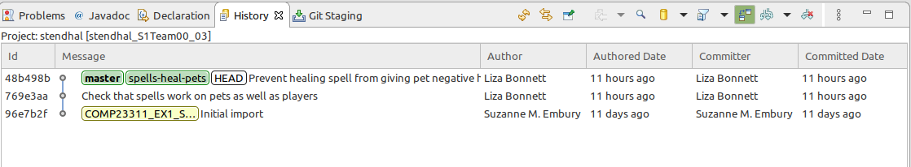
```

Your team mate made a single commit directly onto the development branch and pushed their work to the team repository, so that the remote commit graph looks like figure \@ref(fig:commitGraphInGitLabAfterPushNoHistoryGraphOnly-fig).

```{r commitGraphInGitLabAfterPushNoHistoryGraphOnly-fig, echo = FALSE, fig.align = "center", out.width = "100%", fig.cap = "Your remote commit graph"}
knitr::include_graphics("images/commitGraphInGitLabAfterPushNoHistoryGraphOnly.png")
```

When you push your work, Git rejects the attempt, shown in figure \@ref(fig:pushRejectedNoHistory-fig).

```{r pushRejectedNoHistory-fig, echo = FALSE, fig.align = "center", out.width = "100%", fig.cap = "Can you see why git has rejected this push?"}
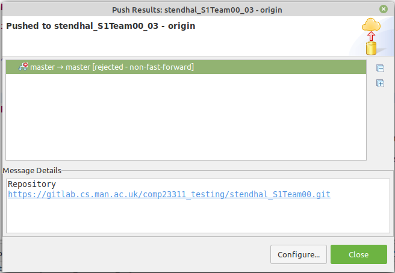
```

Can you see why?

::: {.rmdnote}
When you push your development branch to the remote, Git has to try to work out how to combine these two graphs.  The only commit that both graphs have in common is the starting commit (`96e7b2f`), so that will appear once in the combined graph, with two lines of commits extending from it---the line leading to your local `master` branch and the line leading to your team mate's `master` branch, at its position when it was last pushed to the team's remote repository.

Combining these commit graphs is easy and Git can do it for us automatically.  The problem comes when Git tries to work out the position of `master` branch in the combined commit graph.  Git needs to reconcile the current position of `master` (at commit `012f3c3f`) with the new position you are suggesting for it (commit `48b498b`).  It tries to do this using a fast-forward merge, and if that isn't possible it will reject the attempt.  In this case, there is no path through the combined graph linking the two `master` branch positions that does not involve going backwards in time.  Therefore, a fast-forward merge is not possible, and Git rejects the push.
:::

When Git rejects a push, it means that we need to synchronise the state of our local repository with the team repository.  Then we can push again (and hopefully be successful---provided no work has been pushed to the repository in the meantime).

As before, synchronisation follows two steps:

1. Fetch down the new commits from the remote repository.
1. Integrate your existing commits with the new commits.

### Fetching the New Commits from the Remote {#fetchingr}

This step is straightforward.  Just right click on the project name in the `Package Explorer` view, and select `Team` > `Fetch from origin`.  Your local commit graph now looks like figure \@ref(fig:localCommitGraphAfterPushRejectedAndFetchNoHistoryb-fig)


```{r localCommitGraphAfterPushRejectedAndFetchNoHistoryb-fig, echo = FALSE, fig.align = "center", out.width = "100%", fig.cap = "Your local commit graph"}
knitr::include_graphics("images/localCommitGraphAfterPushRejectedAndFetchNoHistory.png")
```

We can see from this why a fast-forward merge of the remote tracking branch for `master` into our local `master` branch was not possible.

The next step is to integrate the work we pulled down from the team remote with our own, so that the result can be pushed to the remote and be visible to other team members.

Git provides two mechanisms for integrating separate lines of development work: merge and rebase.  They are both useful, but have different strengths and weaknesses.  Different workflows recommend they be used in different ways.  For example, GitFlow mandates the use of non-fast-forward merges, even in situations where fast-forward merges are allowed, while Cactus Flow requires the use of rebase for all code integration events.  Other workflows mix merge and rebase, as we do in the simple Feature Branches workflow we ask you to use in this course unit.

In the situation we are looking at now, synchronising your work with the work of your team, **we recommend that you use rebase rather than merge**.  In the remainder of this document, we'll look at both strategies, and explain why we make this recommendation.


## Integrating the New Commits using Merge

The Git merge operation takes two branches, one pointing to the line of development that needs to be extended with the new changes (the *target* branch), and the other pointing to the line of development containing the new changes that need to be integrated (the *source* branch).  There are three possible options for any merge:

1. The changes are already on the target branch (because the source and target both point to the same commit, or because the source branch points to a commit that is an ancestor of commits on the target branch).  In this case, the merge succeeds without Git having to do anything.
1. The changes are on the same line of development as the target branch, but ahead of it.  The target branch just needs to be moved forward along the line of commits, to reach the same point as the source branch.  This is the fast-forward merge case.
1. In all other cases, we need to create a new merge commit, with two parent commits, the source branch and the target branch.  The target branch is moved forward so that it points to the new merge commit, and so includes the commits in the source branch as well as all the commits it pointed to before.  This is the non-fast-forward merge case.

Looking at our example and the combined graph after the Fetch operation, we can see that the 3rd of these cases applies.

To make the merge commit, **first make sure that you have checked out the branch you want to integrate the new commit into**.  In this case, this is our local `master` branch.  We can see from the `History` view contents that it is already checked out.

Right click on the commit pointed to by the branch we want to integrate from: in this case, the commit pointed to by branch `origin/master`.  Select `Merge`.

This succeeds, and produces the  summary shown in figure \@ref(fig:mergeResultDialogueAfterNonFFMergeNoHistory-fig)

```{r mergeResultDialogueAfterNonFFMergeNoHistory-fig, echo = FALSE, fig.align = "center", out.width = "100%", fig.cap = "Merge result dialog box indicating success"}
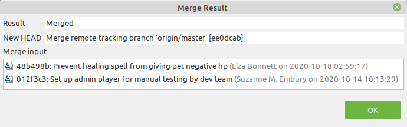
```

This tells us that the merge was not a fast-forward merge, that the checked out branch (`HEAD`) has been moved forward to point to the new merge commit, and reminds us of which commits were merged by this operation.  The `History` view shown in figure \@ref(fig:localCommitGraphAfterNonFFMergeNoHistory-fig) us the new local commit graph after this operation has completed:


```{r localCommitGraphAfterNonFFMergeNoHistory-fig, echo = FALSE, fig.align = "center", out.width = "100%", fig.cap = "The History view shows us the new local commit graph"}
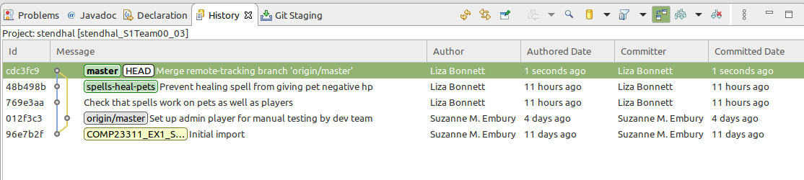
```

Here you can clearly see the new merge commit, with its two parent links.  The code base it represents contains the changes made by us (the fix of the healing spell bug) and the changes made and pushed by our team mate (the addition of an admin player to the `admins.txt` file.

Notice that only the checked out branch (`master`) changed its position as a result of this operation.  Our feature branch and the remote tracking branch for `master` both remain as they were before we made the merge.

If you compare our new local commit graph with the graph at the remote (still as it was at the start of the scenario) shown in figure \@ref(fig:commitGraphInGitLabAfterPushNoHistoryGraphOnly2-fig), you'll see that Git can now perform a fast-forward merge of the new commits on our local `master` branch with `master` branch at the remote.

```{r commitGraphInGitLabAfterPushNoHistoryGraphOnly2-fig, echo = FALSE, fig.align = "center", out.width = "100%", fig.cap = "New local commit graph with the graph at the remote, still as it was at the start of the scenario"}
knitr::include_graphics("images/commitGraphInGitLabAfterPushNoHistoryGraphOnly.png")
```

 So now, we can push our work, and the push should succeed.

The remote repository now contains our commits, integrated with our team mates' commits, on `master`.

```{r commitGraphInGitLabAfterNonFFMergePushedNoHistory-fig, echo = FALSE, fig.align = "center", out.width = "100%", fig.cap = "The remote repository now contains our commits"}
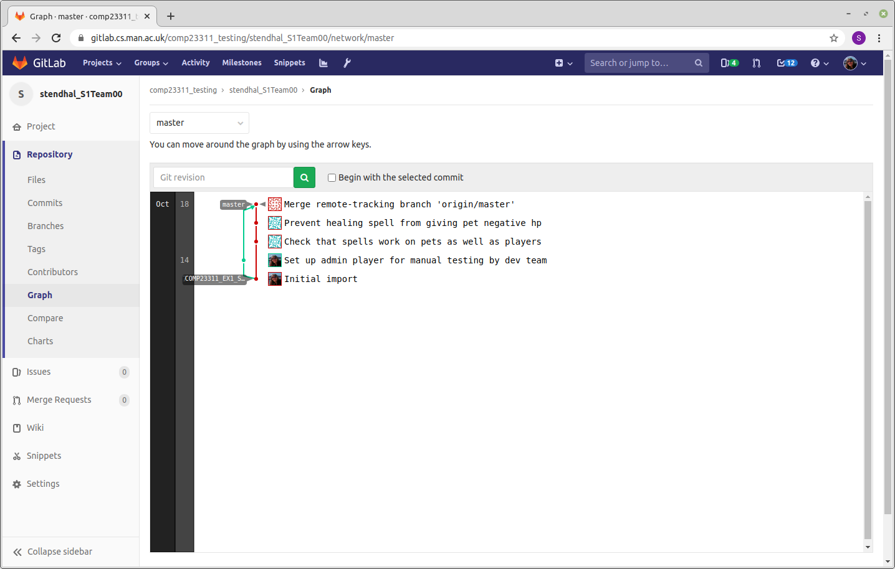
```

(Note that we didn't push our feature branch, so it is not visible on GitLab ((gitlab.cs.man.ac.uk)[https://gitlab.cs.man.ac.uk/], even though the commits that were made on it are now present in the team remote.  Git keeps a clear distinction between commits and branches.  If you push a branch, you also push the commits it is pointing to, but you don't automatically push all branches or tags that are pointing to those commits.)

In our local repository, Git has updated the position of the remote tracking branch, `origin/master`, to reflect the change in position of the branch in the remote.

```{r localCommitGraphAfterSuccessfulPushAfterNonFFMergeNoHistory-fig, echo = FALSE, fig.align = "center", out.width = "100%", fig.cap = "Git has updated the position of the remote tracking branch"}
knitr::include_graphics("images/localCommitGraphAfterSuccessfulPushAfterNonFFMergeNoHistory.png")
```

Merge in Git is a great tool when we want to integrate feature branches into our development branch, or hotfix branches into our release branch, or any situation where a line of development has reached a stable state and needs to be integrated with the next line of development in the pipeline leading to released code.

But, it is not a great tool to use for synchronising our work with our team's.  This is because it creates unnecessary merge commits and branching structures in our code history that don't reflect key points of code integration, but simply reflect that we decided to synchronise our code at that time.  This isn't information that we need to keep for future readers of the code base.  It complicates our code history, making it look less linear and clean than it should.  And anything that makes our code base harder to read is an added cost that we should avoid if we can.

Using the second technique for code integration, Git rebase, avoids this problematic cluttering of the code history. It requires a little more effort on the developer's part, but soon becomes second nature.  We'll now explain how to carry out the same synchronisation task just discussed, but using rebase instead of merge.

::: {.rmdnote}
**The Git Pull Command**
You may be wondering why we have not so far mentioned the Git `pull` command, which is commonly talked about as being the way to quickly sync up with your remote repository.
Git pull (in its vanilla form) is just syntactic sugar for the execution of two other Git commands: `git fetch` followed by `git merge`.  It's a handy shortcut for whenever you want to use the merge approach to synchronising your code, but also therefore shares all the same limitations of using merge for synchronisation.  Whenever you execute `git pull` you may be creating a new merge commit in your code history.

It is possible to configure the pull command to work differently (using rebase instead of merge, for example).  For this course unit, and especially for students who are new to collaborative coding using Git, we recommend that you avoid the use of the pull command, and instead carry out the two steps separately for yourself.  This does not require many more mouse clicks, and allows you to see what is happening at each stage, and adjust your next steps accordingly.  It also means you gain a much more solid understanding of what Git is actually doing, rather than just issuing a pull command and hoping for the best.
:::


## Integrating the New Commits using Rebase {#rebase}

Let's go back in time, to the point at which we started to integrate the commits we had fetched down from the remote.  (Luckily, we are using Git, which is a tool for going back in time very easily.)  Our local commit graph looks like figure \@ref(fig:localCommitGraphAfterPushRejectedAndFetchNoHistorya-fig)

```{r localCommitGraphAfterPushRejectedAndFetchNoHistorya-fig, echo = FALSE, fig.align = "center", out.width = "100%", fig.cap = "Our local commit graph"}
knitr::include_graphics("images/localCommitGraphAfterPushRejectedAndFetchNoHistory.png")
```

And our team remote looks like figure \@ref(fig:commitGraphInGitLabAfterPushNoHistoryGraphOnlya-fig).

```{r commitGraphInGitLabAfterPushNoHistoryGraphOnlya-fig, echo = FALSE, fig.align = "center", out.width = "100%", fig.cap = "Our team remote graph"}
knitr::include_graphics("images/commitGraphInGitLabAfterPushNoHistoryGraphOnly.png")
```

This time, we're going to use rebase to perform the synchronisation.  When we rebase branch A onto branch B, we are asking Git to replay the commits that are unique to branch A on the top of branch B, as though we had made the same changes with B checked out as we did formerly with branch A checked out.

For example, let's look at a simple commit made by the Stendhal development team to prepare one of the 2019 releases shown in figure \@ref(fig:sampleGitLabCommitView-fig)

```{r sampleGitLabCommitView-fig, echo = FALSE, fig.align = "center", out.width = "100%", fig.cap = "A simple commit made by the Stendhal development team"}
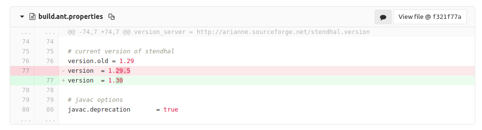
```

This shows the change introduced by the commit.  The red coloured lines (starting with `-`) are lines that have been deleted, and the green coloured lines (starting with `+`) are lines that have been added in the commit.  Git stores the 3 lines before the change and the three lines after the change, to allow it to work out where the change should be applied.  (Line numbers are also shown, but can't be relied upon entirely - if lines are added or removed to the part of the file before this, then the line numbers will be completely inaccurate.)

Although this change was made to a specific version of the code, the same change can be made to *any* version that includes this file, in a version that contains the lines that are modified by the commit and the preceding and following lines that identify them.  In other words, the commit can be taken and replayed in some other part of the commit graph.  Provided the affected parts of the files are the same, the commit makes just as much sense when replayed as it does when originally applied.  This is rebasing.

We can use this notion to integrate our work, with the work of the team.
Before we show how to use rebase in the case of our merged feature branch, we'll first illustrate the idea through some simpler scenarios.


### Rebasing Commits Made on the Master Branch {#rebasingc}

Imagine we have made some commits directly to our `master` branch and need to synchronise these with a commit to `master` made by a team mate and pushed to the team remote.  Our local commit graph looks like figure \@ref(fig:localCommitGraphMasterRebaseExampleBeforeRebaseNoHistory-fig).

```{r localCommitGraphMasterRebaseExampleBeforeRebaseNoHistory-fig, echo = FALSE, fig.align = "center", out.width = "100%", fig.cap = "Our local commit graph"}
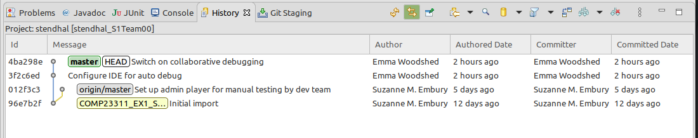
```

We can create a linear code history suitable for fast-forward merging by rebasing our two commits on top of the commit from our team mate.  To do this, we make sure we have our local `master` branch checked out.  Then we right click on the commit we want to rebase onto (commit `012f3c3`) and select `Rebase HEAD on` from the menu that appears.

This produces a commit graph shown in figure \@ref(fig:localCommitGraphMasterRebaseExampleAfterRebaseNoHistory-fig)

```{r localCommitGraphMasterRebaseExampleAfterRebaseNoHistory-fig, echo = FALSE, fig.align = "center", out.width = "100%", fig.cap = "A commit graph, note the changes carefully"}
knitr::include_graphics("images/localCommitGraphMasterRebaseExampleAfterRebaseNoHistory.png")
```

Look carefully at what happened here. It almost looks as though the two commits on `master` were moved across to the `origin/master` branch.  In fact, they are brand new commits; you will see that they have different SHA identifiers.  The change made to the code is the same, as are the commit message and the author details.  But the committer details have changed to show a different committed date.  And the committer could potentially have changed, if the person doing the rebase wasn't the same as the person making the commits in the first place.

The local `master` branch has now moved to point to the latest of the new (rebased) commits.  The old commits are still present in the repository, but since they are now not reachable from any branch or tag, Git does not show them.

Since `master` is now ahead of its position in the remote repository, we'll be able to push it to the team repository.  The `origin/master` branch will be moved forward to the tip of `master` as a result of the push.  When a local branch is at the same location as its remote tracking branch, then we know that the repositories are in sync (at least as far as those branches go).


### Rebasing to Sync Repositories When Working on a Feature Branch {#featureb}

Let's now consider a scenario where we are working on a feature branch.  We created the feature branch at the initial commit, and have made a couple of commits on it but have not yet finished working on it.  At the start of our working day, we want to synchonise our repository with the team's, so that we don't diverge too far away from the work the rest of our team is doing.  After we've fetched in the commits from the remote, our local graph looks like figure \@ref(fig:localCommitGraphFBRebaseExampleBeforeRebaseNoHistory-fig).

```{r localCommitGraphFBRebaseExampleBeforeRebaseNoHistory-fig, echo = FALSE, fig.align = "center", out.width = "100%", fig.cap = "Our local graph after we've fetched in the commits from the remote"}
knitr::include_graphics("images/localCommitGraphFBRebaseExampleBeforeRebaseNoHistory.png")
```

If we'd started work on this feature branch after our team mate had pushed their commit to the remote, we'd be able to synchronise easily.  Our feature branch would have begun at commit `012f3c3`, where our local `master` branch would be.  We'd be able to push the code to the remote straightaway, as all integration would be with fast forward merges.

We can use rebase to get our code base into this state.

First, we synchronise the position of our local `master` branch with the `origin/master` branch.  To do this, we check out `master` then right click on the commit that `origin/master` is pointing to (commit `012f3c3`) and select `Rebase HEAD on`.  The result looks like figure \@ref(fig:localCommitGraphFBRebaseExampleAfterMasterRebaseNoHistory-fig).

```{r localCommitGraphFBRebaseExampleAfterMasterRebaseNoHistory-fig, echo = FALSE, fig.align = "center", out.width = "100%", fig.cap = "updated commit graph"}
knitr::include_graphics("images/localCommitGraphFBRebaseExampleAfterMasterRebaseNoHistory.png")
```

Notice how we appeared to have performed a fast-forward merge of `master` into `origin/master`?  There is no difference between the commit graphs that result from a fast-forward merge and from a rebase, in this case.

Next, we need to replay our feature branch commits on top of `master`. Check out the feature branch, then right click on the commit where the two `master` branches are located and select `Rebase on HEAD`.  The commit graph will now look like figure \@ref(fig:localCommitGraphFBRebaseExampleAfterFBRebaseNoHistory-fig):

```{r localCommitGraphFBRebaseExampleAfterFBRebaseNoHistory-fig, echo = FALSE, fig.align = "center", out.width = "100%", fig.cap = "New commit graph"}
knitr::include_graphics("images/localCommitGraphFBRebaseExampleAfterFBRebaseNoHistory.png")
```

As can be seen, we now have a synchronised (and tidy!) commit history.  The local `master` branch is at the same location as its remote tracking branch (for now) and the feature branch is based on the latest version of the code.  We can now push either `master` or the feature branch successfully, and can continue work on the feature branch knowing we are building on a recent version of the code.

::: {.rmdnote}
**Only Rebase Local History, Not Shared Public History**

Rebase is a little riskier than using merge.  Merge leaves the whole history intact, only adding a merge commit to it, so there is no risk of losing any commits.  But rebase rewrites the history of the code changes, potentially in quite radical ways.  Information, and in some cases even commits, can be lost.

While it is no problem to rewrite the code history in your local repository, it's vitally important that you don't attempt to change the history of your team's remote.  That is confusing and disruptive for everyone on the team, and runs a significant risk of losing commits---not your own commits, but the commits of your colleagues.  They will not be pleased...
So when using rebase it's important to keep in mind which commits in your local commit graph also exist in your team's remote and which commits are just local to your own code history.  Commits in the former category should not be rebased.  Commits in the latter category can be.
:::


### Rebasing to Sync Repositories After a Fast-Forward Merge {#rebaseffm}

We can now finally return to the scenario we started this document with.  As a reminder, in our local repository, we had just merged a feature branch with our local `master` branch, and then discovered that new commits had appeared on the remote master when we synchronised before attempting to push:

```{r localCommitGraphAfterPushRejectedAndFetchNoHistory-fig, echo = FALSE, fig.align = "center", out.width = "100%", fig.cap = "A reminder of the commit graph"}
knitr::include_graphics("images/localCommitGraphAfterPushRejectedAndFetchNoHistory.png")
```

This scenario gives an example of how rebase requires a little extra thought before using it.  We need first to decide what we want the code history to look like, and then we can use rebase to make that happen.

In this case, we need to decide what we want the history of the merged feature branch to look like.  If we had remembered to fetch and sync before starting work on the feature branch, we would have ended up with a fast-forward merge of the branch on `master`, with its parent at `origin/master`.  So, let's make the history look like that's what happened.

To achieve this history, we first reset the local `master` branch to point to `origin/master`---the commit it would have been on, if we had remembered to sync before creating the feature branch.  Check out `master`, then right click on the `origin/master` commit and select `Reset` > `Hard`.

```{r localCommitGraphRebaseExampleAfterResetMasterNoHistory-fig, echo = FALSE, fig.align = "center", out.width = "100%", fig.cap = "local commit graph after reset"}
knitr::include_graphics("images/localCommitGraphRebaseExampleAfterResetMasterNoHistory.png")
```

Then we rebase the feature branch on top of `master`.  We first check out the feature branch, and then right click on the `master` branch commit, and select `Rebase HEAD on`.  This results in the graph shown in figure \@ref(fig:localCommitGraphRebaseExampleAfterFBRebaseNoHistory-fig)

```{r localCommitGraphRebaseExampleAfterFBRebaseNoHistory-fig, echo = FALSE, fig.align = "center", out.width = "100%", fig.cap = "Resulting commit graph after feature branch rebasing"}
knitr::include_graphics("images/localCommitGraphRebaseExampleAfterFBRebaseNoHistory.png")
```

Now we have reorganised the history to the point where we are ready to merge the feature branch into our development branch.  This is a feature branch integration step, so we should strictly speaking use Git merge.  But since it will be a fast forward merge, there is no difference in terms of the commit graph outcome between using merge and rebase in this case.

```{r localCommitGraphRebaseExampleCompleteNoHistory-fig, echo = FALSE, fig.align = "center", out.width = "100%", fig.cap = "Reorganised history"}
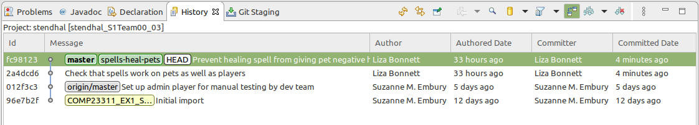
```

The repository is now ready to push. Since `master` is ahead of `origin/master` on the same line of development, Git will have no problem in making the fast-forward merge needed to allow it to accept the push shown in figure \@ref(fig:localCommitGraphRebaseExampleAfterPushNoHistory-fig)

```{r localCommitGraphRebaseExampleAfterPushNoHistory-fig, echo = FALSE, fig.align = "center", out.width = "100%", fig.cap = "local commit graph after push"}
knitr::include_graphics("images/localCommitGraphRebaseExampleAfterPushNoHistory.png")
```

And our code history on GitLab looks pleasantly clear and linear as in figure \@ref(fig:commitGraphInGitLabRebaseExampleAfterPushNoHistory-fig).

```{r commitGraphInGitLabRebaseExampleAfterPushNoHistory-fig, echo = FALSE, fig.align = "center", out.width = "100%", fig.cap = "Our code history on GitLab is pleasantly clear and linear"}
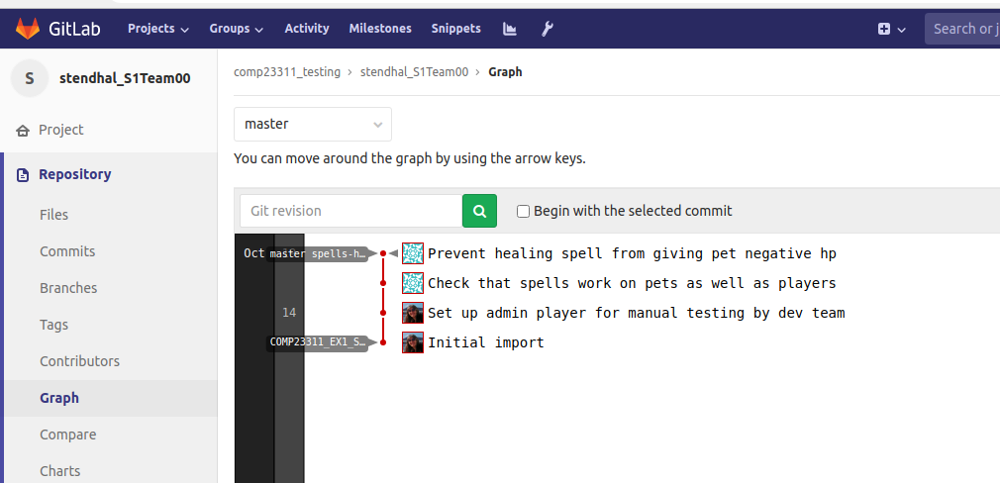
```


::: {.rmdnote}
**Force Push**
Because rebase changes the code history, it is easy to get into a situation where your local history differs from the remote history in ways that mean Git refuses to push your work.  This can be stressful (especially if close to a looming deadline) but you need to resist the temptation to use force push.  This almost always leads to loss of your colleague's commits and can be very disruptive for your team.
Instead, you need to get your repository into a state where it can be pushed, without requiring the `--force` flag.  As long as you stick to the rule of not changing commits that also exist in your team remote, all should be well.  Though it is always worth leaving yourself enough time before the deadline to get help from your team mates or from the course team if things do go wrong.
:::


## A Final Word {#rFinalWord}

In this document, we took you through several different approaches to synchronising your local repository with your team remote, after your team mates have made changes.  In this course unit, we ask you to use:

* Git Merge for integrating finished feature branches into your development branch, and
* Git Rebase for synchronising your repository with your team remote.

This allows you to practice both styles of code integration in the single project, while also keep to a fairly simple and well-used workflow (based on feature branches).

This is by no means the only workflow you could use, and we certainly don't claim it as the best in all circumstances.  But it is an approach that allows you to gain the core Git skills that will enable you to use any workflow that you may be called up on to comply with in future projects.

One major omission from this document is any discussion of what happens when we encounter conflicts while integrating code or synchronising our repository.  We've chosen the issues for exercise 1 to try to avoid conflicts, but you will definitely encounter them in the second team coursework exercise, when you start to work on larger features in sub-teams.  We'll cover handling conflicts in another learning resource for the unit.

Good luck!

`Document version:` `r format(Sys.time(), '%d %B, %Y')`

<!--chapter:end:20-committing.Rmd-->

# Continuous integration {#integrating}

Continuous integration (CI) is the practice of automating the integration of code changes from multiple contributors into a single software project.

## Introduction to Continuous Integration {#ici}

In (ref:coursecode) so far, you have begun to use a number of modern software development tools that help us keep our code quality high, even when multiple developers are working on the same code base.  We're now going to introduce another class of tool: the *continuous integration server*.

As the name indicates, these tools have the job of continually putting a software system through the processes that lead to releasable software. A typical continuous integration server will:

* Integrate the various components of the system.
* Compile the code and create an executable version of the system.
* Run the unit tests, integration tests and acceptance tests.
* Generate reports on the quality of the system (for example, test coverage reports).
* Inform the development team when some part of the above process fails.

These steps will be undertaken at regular intervals, usually based on some automated trigger.  Developers do not need to remember to request that it happens; the CI server takes care of it for us.

The aim of repeatedly going through this process is to discover problems early, well before the release deadline, so that there is plenty of time to correct them.

Before such tools came into common use, developers concentrated on their own parts of the system, building and testing them in isolation, until the release deadline approached. Only then would the whole system be compiled and integrated, and the tests run on the full code base. Inevitably, some of the tests would fail or, in the worst cases, some of the code would fail even to compile.  With the deadline looming, the panicked team would have to find and fix the problems under pressure, often leading to more bugs being introduced and poor decisions being taken that could have been avoided if only the team had thought to integrate, build and test their code as they went along instead of at the last minute.

There is a lot to be said for building and testing code frequently. When we go through this process after just a few small changes have been made to the code base, it's a fairly safe bet that the cause of any failing tests will be one of the changes we've just made.  Even if our changes did not cause the error, something we have done has caused the error to become visible.  In most cases, we'll only need to examine these changes to be able to track down the root cause of the error.  The problem can then be fixed fairly quickly, before other code changes in that area of the code start to happen and before other developers have made use of the same buggy code.

Contrast this with having to fix multiple interacting bugs at the same time, with the deadline looming, while the code gets messier and messier and we all get more and more frustrated and tired.

So, building and testing the whole system frequently, from the beginning of the project, is a good idea. The problem is that most programmers (being only human) don't remember to do it. We build and test our own local version of the system easily enough: our IDE will continually check for compile errors, as we type, and it is fairly easy to get into the habit of building and running unit tests locally as we code.  But how many of us will be willing to break off our chain of thought on a piece of code in order to integrate our work with that of other developers and to wait while lengthy acceptance test suites are run?  Instead, the CI server takes on this task for us, only interrupting us when something has gone wrong.

Continuous integration servers typically run on separate shared machines that are set up to build and test the code as frequently as we like. We can set a timed schedule (e.g., to build every morning before our developers come in to start work) or we can ask for the build and test process to be carried out every time someone on the team pushes changes to the shared repository. This latter option is good if we can manage it, because if we have pushed code that breaks some aspect of the build and test pipeline, then we'll get an almost immediate warning of that from our continuous integration server.  We'll receive an e-mail from the server, or else the server might be set up to push a notification to our team's chat channel on Slack or Discord or MS-Teams, or to some other communication system.

That is what the CI server is doing for us on (ref:coursecode). One of the best practices we try to follow in this course unit is that of maintaining clean releases. (We obviously don't want to deploy code to the customer that has known faults.) The CI server helps with that by telling you about the problems with the code you push to GitLab within minutes of it appearing there. That means you can fix problems while they are still on your feature branches, and you can make sure that only clean code makes it through to the development branch or (most importantly) to the release tags.

For this course unit, we will use Jenkins ([jenkins.io](https://www.jenkins.io/)), a well-established CI server.  We have set up a number of build jobs for you, that will show you the health of your team's submission for the coursework exercises so far.  This brief guide will show you how to use Jenkins to access information about the build health of your team, and how to interpret the reports it provides.


## Logging onto Jenkins CI Server:  {#logging}

You can login to the Departments Jenkins continuous integration (CI) server at [ci.cs.manchester.ac.uk/jenkins](https://ci.cs.manchester.ac.uk/jenkins/login). This will take you to a login screen.  Enter your University username and password into the form and press `Sign in`.

You should now be taken to the main Jenkins "dashboard", showing the folder we have created to contain your build jobs for the (ref:coursecode)  team coursework this semester, which should look something like figure \@ref(fig:dashboard-fig)

```{r dashboard-fig, echo = FALSE, fig.align = "center", out.width = "100%", fig.cap = "The main Jenkins dashboard"}
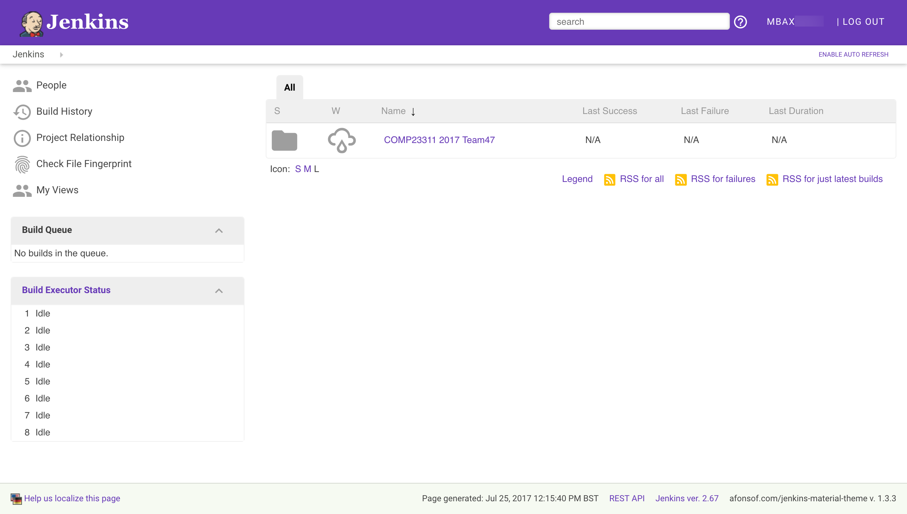
```

There are various features to note about this screen.  On the left is a menu of basic commands, and below this is some information about what builds Jenkins is currently running.  We have set the Jenkins server up so it can run a number of builds in parallel (exactly how many varies from year to year, with the resources we have available).  If more build jobs than this are requested at any time, some of the jobs will be show in the Build Queue, waiting for a build executor to become available.  You will only be able to see build information for your own team's jobs, and often Jenkins will be occupied building jobs from other teams, so at busy times (for example, in the days before a coursework deadline) your team's build jobs may be stuck in the queue for anything from a few minutes up to several hours.

On the right of the dashboard, you can see a list of the top-level jobs and folders you have access to.  At the moment, the only thing you can see is the folder for your work on (ref:coursecode).  The grey folder icon indicates that this is a folder and not a build job.  Next to it, you can see an icon indicating the "weather" for this set of builds.  That is, it shows the status of the builds within the folder over recent builds.  A stormy weather icon indicates that the builds in this folder are failing, and have been for some time.  In contrast, a sun icon would indicate that the builds in the folder are all succeeding.  Figure \@ref(fig:weather-montage-fig) shows some of the build health icons, and their meanings.

<!--%%% TODO: add missing build weather icons
% Problem: when trying to "open image in new tab" on icons of the new theme, those of the old theme appear: I can't download the right icon by just knowing the names
https://ci.cs.manchester.ac.uk/jenkins/static/7d74f0f2/images/build-status/weather-sprite.svg#weather-sunny
https://ci.cs.manchester.ac.uk/jenkins/static/7d74f0f2/images/build-status/weather-sprite.svg#weather-puring
https://ci.cs.manchester.ac.uk/jenkins/static/7d74f0f2/images/build-status/weather-sprite.svg#weather-cloudy
https://ci.cs.manchester.ac.uk/jenkins/static/7d74f0f2/images/build-status/weather-sprite.svg#weather-partly-cloudy
https://ci.cs.manchester.ac.uk/jenkins/static/7d74f0f2/images/build-status/weather-sprite.svg
-->

```{r weather-montage-fig, echo = FALSE, fig.align = "center", out.width = "100%", fig.cap = "(ref:captionweather)"}

```

(ref:captionweather) A range of icons indicate  the health of a build. From left to right: A rain icon is used to indicate that between 20% to 39% of builds were successful. A cloud icon: 40% to 59%. An overcast icon: 60% and 79% of builds were successful.  A sun icon indicates that greater than 80% of builds were successful.  


You can get more information about the health of an item by hovering over the weather icon in Jenkins shown in figure \@ref(fig:toolTipWeatherExercise1-fig).

```{r toolTipWeatherExercise1-fig, echo = FALSE, fig.align = "center", out.width = "100%", fig.cap = "Hovering over an icon will display a tool tip that gives more information about what the icon means in terms of the build."}
knitr::include_graphics("images/toolTipWeatherExercise1.png")
```

As you can see, the tool tip gives more information about the build health, and also indicates the worst performing build within the folder.  This is really useful for diagnosing problems, and finding branches that need extra attention.

Team 47 doesn't have a great build health at the moment, but they still have time to improve their build "weather" before the coursework deadline.  Take a look at the weather status of your own team's build folder.  As you complete the coursework and your builds move from red to green, your build health icon should become sunnier.


## Accessing your Coursework Builds {#cbuilds}

Next, we're going to look at the builds that have been set up for your exercise 1 coursework.

Click on the link for your team's (ref:coursecode) folder.  This will show you a list of the builds and folders that have been created for your team for this course unit shown in figure \@ref(fig:sem1-build-jobs-fig).

```{r sem1-build-jobs-fig, echo = FALSE, fig.align = "center", out.width = "100%", fig.cap = "An example of how a teams coursework builds look in Jenkins"}
knitr::include_graphics("images/sem1-build-jobs.png")
```
At this stage in the course unit, only builds for exercise 1 have been set up. Later, more folders and jobs will appear here, as the coursework progresses.

::: {.rmdnote}
This year, you will see an additional project in your team's folder.  This job creates and stores the reports on your work created by the RoboTA automated feedback and marking system.  To see how your team is doing on the coursework so far, click on this job and then selected the *Team Marks and Feedback* report.

:::
We'll now take you through the builds we have set up for your team for team coursework exercise 1.  Click on the *Exercise 1 Builds* folder link.  This will take you to a Web page showing the following builds as in figure \@ref(fig:contentsOfExercise1FolderOnJenkins-fig)

```{r contentsOfExercise1FolderOnJenkins-fig, echo = FALSE, fig.align = "center", out.width = "100%", fig.cap = "An example of the contents of the Exercise 1 Builds folder displayed in Jenkins."}
knitr::include_graphics("images/contentsOfExercise1FolderOnJenkins.png")
```

On this page, you can see the summaries of some actual builds, instead of just folders.  We have set up Jenkins projects to build the important code versions for this coursework: the development branch (`master`) and the release tag (`VERSION_01_RELEASE_27_UOM`) for the team in this screenshot---your team will use a different release tag).

Your team will also have an additional build, not shown in this screen shot, for a tag called `COMP23311_EX1_STARTING_POINT`.  This shows you the build health at the start of the coursework.

<!---infobox Jenkins Project Names
%
%You may have noticed that the Jenkins project for coursework starting point tag uses underscores instead of slashes in its name.  This is because slashes aren't allowed in Jenkins project names, so the code that configures Jenkins for this course unit replaces slashes with underscores in branch and tag names to create legal project names.  The branches and tags built by the projects still contain slashes.-->

Instead of a folder icon, build jobs have coloured icons indicating whether the most recent build was successful or not.  The red exclamation mark beside the release branch project shows that the latest build for this tag was unsuccessful.  Some error occurred during the build process that meant that executable code could not be produced.  This could be caused by a compilation error in the code, but it could also mean that the tag or branch to be built doesn't yet exist in the team's GitLab repository.  Builds of this kind are called *failed* builds.

The yellow icon beside the development branch build in the figure shows that the build process itself succeeded but that some of the unit tests failed.  A build like this, where executable code was created and could be run, but some other later check failed, is called an *unstable* build.

In total, there are four build status icons that you might see in Jenkins, shown in figure \@ref(fig:build-status-montage-fig).  The goal for most of our builds is to get a green build icon beside them.  This indicates a successful build: there were no compilation errors, the Ant build file was executed successfully and the unit tests all passed.  This kind of build is called a *stable* build.

The final type of build icon is grey, and this simply indicates either that no builds have yet been attempted for a particular job or that the last build was aborted before it could complete.  If no one in your team has pushed code to your repository since the Jenkins builds were created, then all your exercise 1 builds will be grey.  This will change as soon as some code changes are pushed.

```{r build-status-montage-fig, echo = FALSE, fig.align = "center", out.width = "100%", fig.cap = "(ref:captionbuildstatus)"}
knitr::include_graphics("images/build-status-montage.png")
```
(ref:captionbuildstatus) Four build status icons you might see. From left to right: 1. Grey no entry sign (**Not built**) build not yet attempted or build aborted. 2. Red exclamation mark (**Failed build**) the build process could not be completed. 3. Amber exclamation mark (**Unstable**) build succeeded but some tests failed. 4. Green tick (**Stable build**) build process succeeded and all tests passed.


To the right of the build job names, Jenkins gives some information about the previous builds.  It tells us how long ago the most recent successful build was (either stable or unstable) and how long ago the most recent failed build was.  It also gives a link to information about that build.  Here, five builds have been carried out for the development branch, so the link to the most recent successful build is to build `#5`, while the most recent unsuccessful build was build `#2`.

Jenkins also gives the duration of the last build.  This is important on real systems, as if builds are taking too long then it could indicate a problem with the system.  In addition, the length of a typical build affects how long programmers need to wait to get feedback on their pushes.  Experience has shown that programmers will wait for a few minutes for information on the status of their build, but if they have to wait much longer than 10 minutes, then they will change their focus to another task, and lose the context needed to efficiently fix problems that may be revealed by the build.  So it is important that build times are kept under control.

::: {.rmdnote}
**Manually Requesting a Build**

The buttons in the final column allow you to manually request that a build of the job be scheduled (as opposed to waiting until someone pushes new code to your GitLab repository).  Try pressing the button next to any of the build jobs now.  You should see the text `Build Scheduled` appear over the button, and (shortly) the job will appear on one of the Build Executors (or in the queue, if you request the build at a busy period).

When the build completes, the summary of builds for this job should be updated.  You may need to refresh your browser window to see the new information.
:::


## Drilling Down on the Development Branch Build {#drilling}

Next, we're going to drill down into the information Jenkins provides about individual build jobs.  We'll look at the development branch build first, and will come back to look at the contents of the `Feature Branch Builds` folder later.

Click on the build job link for the `master` branch.  You should be taken to a page that looks similar to figure \@ref(fig:master-branch-fig).

```{r master-branch-fig, echo = FALSE, fig.align = "center", out.width = "100%", fig.cap = "Jenkins view of the master branch"}
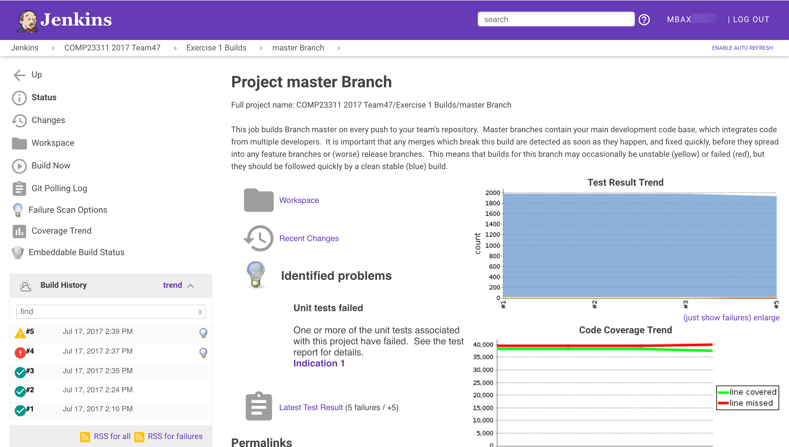
```

Figure \@ref(fig:master-branch-fig) is the main page for the build job we have set up for the development branch of your team's repository.  It gives a summary of the most recent build status for the job, and also information about the build history.  Let's take a look at the information and options provided by it.

At the top, below the purple Jenkins banner, you can see some breadcrumbs showing the parent folders for this particular job.  The names are all clickable links.

Just below this, on the left, there is a menu showing the things you can do with your build job.  Some of the buttons are links to further information about the build, and some are commands that you can issue.  Note, for example, the presence of the `Build Now` option, which gives another way to manually request that a build of this job be scheduled.

On the bottom left, you will see a table showing the build history for the job.  Each row summarises a past build attempt.  The status of the build is shown (by the coloured ball icon), followed by a link to the detailed build report and then the date and time at which the build took place.  Finally, all non-stable builds should end with a light bulb icon, indicating that the cause of the build failure has been analysed, and information about it has been added to the build report.  Hovering your mouse over the light bulb will give an indication of what went wrong.

On the remainder of the page is information about the status of the most recent build, including links to various reports produced during the build.  The first is a link to the workspace (i.e., filespace) used for the most recent build, and the second to information about the code changes that triggered the build.

Under the section headed `Identified Problems` (with the light bulb icon 💡) you will see a description of what caused the build to fail or to become unstable.  In this case, the code was able to compile successfully.  The problem is that some of the test cases have failed.

Next comes a link to a build report (indicated by the grey clipboard icon).  In this case, it is a report produced by JUnit when the build was last run.  The summary tells us how many tests failed in the build and (importantly) gives information about the change in test failures that occurred in the most recent build.  In this case, the summary `5 Failures / +5` indicates that five tests are failing in total, and that all five failures appeared in this recent build (this build added five failures).  This is useful information as test failures that appeared in a build are likely to be caused by the changes that were pushed to the GitLab repository and that triggered the build.  Test failures that first appeared in older builds will not have been caused by anything we have just done to the code.

You can click on the `Latest test result` link for information about which tests failed and why.

Two other build reports are shown on this page: the two graphs on the right hand side of the page.  The one at the top shows the test results trend over the course of recent builds.  The blue line shows the number of tests that pass, the yellow line shows the number of tests that have been skipped (using the `@Ignore` annotation) and the red line (the important one) shows how many tests have been failing.  We can just see a slight increase in the number of failing tests for the latest build (plus a corresponding decrease in the number of passing tests).

The graph below shows the code coverage trend, produced from the JaCoCo coverage reports from recent builds.  Coverage for this team has been fairly stable, with a slight drop in coverage in the most recent build, caused by the failing tests.  (It is normal for coverage to drop a little when tests fail, since not all the test assertions will be executed and therefore some lines will not be covered.  A significant decrease, however, could indicate that your tests are too bulky, and should be separated out into a larger number of smaller, more independent unit tests.)

You can click on any of these build reports to get more detailed information about the results of the most recent build.  You can also click on individual builds in the Build History, and see copies of the reports as created at the time of the build.  You can even see a copy of the console output that was produced when the build was run.


## What Happens When Jenkins Builds a Job {#happens}

It is all very well to have all this information at our fingertips, but it is only useful if we understand where it comes from.  So, now we are going to look at what happens when Jenkins performs a build of some job.


### What Triggers the Build? {#triggers}

The first question to answer is what causes Jenkins to start to perform a build for some job.  We have already seen that we can manually schedule a build, using the *Build Now* command or button.  But that relies on us, the developers, remembering to request that a build be done.  As we saw at the beginning of this exercise, the whole point of continuous integration servers is that we don't have to remember to request a build.  It should be done automatically, whether we remember or not.

Jenkins builds can be triggered automatically in a number of ways.  For example, we can put a schedule in place that causes the job to be built every hour, or every 6 hours, or every 15 minutes, as best suits our needs at the time.

But probably the most popular way of triggering a build is to set up a web hook that causes Jenkins to build a job whenever someone pushes new code (or changed code) to the team repository.  This is how we have set up your team repository.  Whenever you push code changes to your repository, GitLab sends a notification to Jenkins about the change.  Jenkins then uses this information to trigger any jobs that use the repository that was changed.

Keep an eye out for this the next time you or anyone on your team pushes code changes to your team repository.  As soon as the push is made, take a look at the Jenkins dashboard and wait to see if a build is triggered.

::: {.rmdnote}
**Triggering Builds Without a Code Change**

Jenkins can be set up to trigger on all kinds of GitLab actions, including commenting on an issue and creating a tag.  However, when Jenkins detects that one of the triggering events has happened, the first thing it does is to check that something has changed in the code base.  If there are no changes to the code, there cannot be a different build outcome, so Jenkins saves time by ignoring the triggering event.

This is sensible behaviour most of the time, but is sometimes a bit of a nuisance.  For example, if we have a build job set up for a tag, we might expect Jenkins to notice when the tag is created and to rebuild the job.  Jenkins can indeed notice the tag appearing, but since such a change involves no new commits, it will not trigger a rebuild.  In these cases, it will be necessary to request a build manually.

You'll encounter this issue with the builds for your release tags.  When you've prepared your team's release, you'll add the required release tag to the commit.  But Jenkins won't build your release tag project at this stage.  You'll need to manually request the build to check whether your release build has good health.

:::


### The Jenkins Workspace {#workspace}

When a job is triggered (and code changes have occurred), Jenkins uses a GitLab plugin to connect to your team's repository and to create a clone of the whole repository in the workspace set aside for the job.

It then checks out the branch that has been specified to be the focus of the build.

At this point, Jenkins has created a directory folder in its own internal space, with a copy of your team's code base that mirrors the one you have on your machine.  (It obviously doesn't have any files or changes that you have not yet pushed to your team's repository.)


### Jenkins Runs the Ant Build {#antbuild}

Once we have a copy of the code in the workspace, Jenkins attempts to build an executable from it.  It does this in exactly the same way we have practised in the workshops: it calls Ant and invokes the *dist* target in the `build.xml` file within the workspace.

This is done within a shell.  Jenkins records all the outputs from running the build script in the shell, and stores this with each build, for later diagnostic purposes.

We have also set the Jenkins jobs up to run the unit tests.  Once the build is complete, Jenkins will invoke the *test* Ant target, in order to cause the unit tests to be run, and the coverage information to be gathered --- in exactly the same way that these things happen when you run the Ant script from within your IDE.


::: {.rmdnote}
**Digression (Not Examinable)**

There is one difference in the way Jenkins runs the unit tests.  The machine on which Jenkins is running is a headless server.  There is no graphics console attached to it.  It sits in a machine room, rather on someone's desk and is operated remotely through the terminal rather than through a graphical interface with a mouse or a trackpad.  This means that any test cases that exercise the GUI of the Stendhal game system will fail, because no graphical display is configured for the machine.  We get round this by running Xvfb, the X Virtual Framebuffer, before running the unit tests.  This creates a virtual graphical display --- or just enough of one --- to allow the unit tests that exercise GUI elements to function as they would on a normal desktop machine.
:::


### The Results are Published {#results}

The final step in the Jenkins build process is to publish any reports created during the build process so that they can be accessed from the build web pages.  This happens for the JUnit test results and the JaCoCo coverage results.  If we had not configured your builds with publishing steps for both of these, then the graphs and web page test results would not appear on the build web page.


## A Look at Feature Branch Builds {#fbuilds}

This almost concludes our tour around the Jenkins builds we have created for you to use with your work in exercise 1.  We'll finish with a look at the contents of the `Feature Branch Builds` and the `Issue Revealing Builds` folders.

In your browser, click on the breadcrumb for the Exercise 1 Builds.  Then click on the link for the `Feature Branch Builds` folder.

You should be taken to a web page containing something like figure \@ref(fig:FeatureBranchBuilds-fig).

```{r FeatureBranchBuilds-fig, echo = FALSE, fig.align = "center", out.width = "100%", fig.cap = "Jenkins view of the feature branch builds"}
knitr::include_graphics("images/FeatureBranchBuilds.png")
```

As you can probably work out for yourself by now, this folder contains a whole collection of different builds.  Team 47 is working on a different set of issues from your team, and therefore is working with different branch names from the ones in your team's builds.  But the overall organisation should be similar for your own team.  There should be one build job set up for each of the feature branches we have asked you to create.  The feature branch builds should be stable because they should compile and (since by the deadline they need to contain code that fixes the bug) they should pass all the tests.

You can drill down into any of these builds to get more information about the build, and information about what caused any failed or unstable builds.

The second set of builds are in the *Issue Revealing Builds* folder.  If you navigate down into that folder, you will see a set of builds looking something as in figure \@ref(fig:IssueRevealingBuilds-fig).

```{r IssueRevealingBuilds-fig, echo = FALSE, fig.align = "center", out.width = "100%", fig.cap = "The Issue Revealing Builds folder in Jenkins"}
knitr::include_graphics("images/IssueRevealingBuilds.png")
```

These builds are a little unusual.  Their job is to run the tests on a code base consisting of the production code from the start of the exercise (i.e., the code that does not contain your fixes) *and* the test code from your feature branch tip (i.e., the code that contains the tests you wrote to reveal the issue).  This means that we expect these builds to be unstable.  We want to see the tests failing, so that we can see that the issue is properly exposed by them.  To be fully sure you have revealed the issue correctly, you'll need to drill down into the build and take a look at the tests that are failing.  Ideally, these should just be the tests you have written to reveal the issue.  If some other test cases are failing as well (or, worse, instead of) your new test cases, then your final mark will be reduced.

Builds of this kind would not normally be created for a real software team.  We have provided them to help you track your own progress towards the goals of the coursework, and to help us in marking your tests fairly and accurately.

Note that all the builds in these two folders should be either stable or unstable by the deadline.  There is only one case in which a failed (red) build will be acceptable in the released repository: when you have fewer people in your team than the number of bugs assigned.  Each team is expected to fix one issue per person.  For example, a 5 person team will be expected to fix only 5 of the issues provided.  In that case, the builds for any issue left unfixed can fail without any marks penalty (since they will fail because the required branch and tag will not be present in your team's repository).


## Confused? Stuck? Need Help? {#confused}

If any aspect of the Jenkins builds we have created for you are unclear, please come and get help from a TA or a member of staff during the team study sessions.  If you meet the workshop attendance requirements, you are also free to e-mail Suzanne with questions outside the team study sessions.

The School's CI server is administered by Chris Page.  Technical faults and outages should be reported to him through [support.cs.manchester.ac.uk](https://support.cs.manchester.ac.uk).

Bugs or feature requests for the RoboTA system should be reported through the project issue tracker at [gitlab.cs.man.ac.uk/institute-of-coding/robota-issue-tracker](https://gitlab.cs.man.ac.uk/institute-of-coding/robota-issue-tracker)


`Document version:` `r format(Sys.time(), '%d %B, %Y')`

<!--chapter:end:21-integrating.Rmd-->

# Code review {#reviewing}
In addition to the time spent debugging code (see chapter \@ref(debugging)), software engineers spend lots of time reviewing other people's code. Its a crucial part of building better quality software, see figure \@ref(fig:xkcd-code-quality-fig). Code review is a crucial skill to learn, both as a reviewer and a reviewee. This chapter introduces key concepts in code review that you can use on this course.

```{r xkcd-code-quality-fig, echo = FALSE, fig.align = "center", out.width = "100%", fig.cap = "(ref:captionxkcdquality)"}
knitr::include_graphics("images/code_quality_3.png")
```

(ref:captionxkcdquality) Does your code look like song lyrics written using only the stuff that comes after the question mark in a URL? Reviewing other people's code can be hard work but probably not as hard as having other people review *your* code. However, code review is fundamental to building quality software. [Code Quality (xkcd.com/1833)](https://xkcd.com/1833/) by [Randall Munroe](https://en.wikipedia.org/wiki/Randall_Munroe) is licensed under [CC BY-NC 2.5](https://creativecommons.org/licenses/by-nc/2.5/)


## Why Review Code? {#why}

Code review is the process by which program code written by one person (or group of people) is inspected by another person (or group of people), to find errors and infelicities. It is one of the primary tools used today to manage the quality of an organisation's code base. Code review comes in lots of different flavours (we will list the main ones later in the document) but the core idea, common to them all, is a very basic one: it is easier to spot problems in code written by someone else than in your own code.

It is easy to see why this might be the case. When we have just written some code, the idea of what the code should be doing is fresh in our minds. It is hard to see the discrepancies between our mental model of what the code should be doing and what the code we have written is actually doing. But when we read code written by someone else, we do not have so many preconditions and assumptions that get in the way of understanding what has been written, as opposed to what was intended.

This applies to general code quality issues as well as bugs. A code reviewer can spot when we have failed to follow the naming and layout standards in use within the code, or when we have used comments in a way that does not follow the conventions of the rest of the code base. It is hard to keep track of all these things, especially when new to a team, as well as making the code do what it should. A code review can point out problems before they leave our feature branch, so that only good quality code reaches our development branch.

We saw earlier in this course unit that there are major advantages to finding bugs earlier after they are introduced rather than later, with costs rising especially dramatically when bugs make it through to code that is used by the customer^[Refer back to Boehm's Cost of Quality model, presented in lectures in week 1 and chapter \@ref(estimating) details.]. While automated testing (unit testing, etc.) can go a long way towards finding defects before they reach the customer, it is not by itself a complete solution to the problem. Testing can only find defects that we have thought to check for. And testing cannot help us weed out poor quality code that makes future bugs harder to find and fix.

It turns out that code review is an excellent complement to testing. Studies have shown that code review can find up to 60% of defects [@codecomplete], with unit testing only finding 25%.  The two techniques work well in partnership: automated testing is relatively cheap to run, and can be run repeatedly without needing (much) human intervention.  Code review is more expensive, and requires human effort for each time it is performed, but can find a wider range of defects.  A good workflow therefore is to make sure that the bugs that are detected by code review are converted into test cases, so that they can be detected cheaply in future versions of the code, and the valuable code review effort can be put towards finding new defects not currently covered by the code base.  Of course, for maximum efficiency, this requires that code review is only ever performed on code that already passes the test suite.

Code review has other advantages as well, in helping to homogenise and improve coding styles across teams, and to spread knowledge of the code base more evenly throughout the team. If all code is reviewed by at least one person, then the days when parts of the code are untouchable by anyone except the lone expert who created them are gone and the team's truck factor is increased^[The *truck/bus factor* of a team is the number of its members who would need to be run over by a truck/bus for the team to be unable to fulfil its function in some significant way.  A team where only one person understands and can safely change the code that interfaces with the database, for example, has a truck factor of 1, and the team should consider itself to be at risk.  What do you think the truck factor of your (ref:coursecode) team is?  If it is low, what steps might you take to increase the truck factor for later exercises?]. And it is human nature to code more carefully and correctly when we know that one of our colleagues will be looking over any code that we push to the team repository.

It is important to be aware of the costs of code review, as well, however. Code review takes time. Typical code review rates are between 100 and 200 lines of code per hour, for experienced professionals [@kemerer; @bisant]. New team members will be slower than this.  In a typical team, one can expect to spend between 1 and 5 hours per week reviewing code (more, perhaps, as a release deadline approaches). Time spent reviewing is time not spent coding, and it can sometimes be hard to justify spending the time when deadlines are looming. But, it is exactly when the team is under pressure that code reviews are most needed. Any errors that slip through at this stage will only come back in a more expensive form, when the customer feels their bite.


## Types of Code Review {#crtypes}

There have been many proposals for different ways of doing code reviews, ranging from the very simple and informal to heavyweight and expensive monitoring programmes. Here, we mention a few of the key types, to give you a feel for the different ways in which code review has been implemented in practice.


### Buddy Review {#buddy}

Starting with small and simple, there are several informal kinds of code review. These normally come under the heading of "buddy review". As the name suggests, this kind of review is done informally, between coders with more or less equal status within the team, on an as-needed basis. This could be as simple as asking someone else in your team to look over a particularly tricky piece of code before you commit it ("over the shoulder" review). Or, in some teams, developers have an assigned "buddy" who they talk code through with, when it is ready to be pushed.

In teams that use the agile practice of pair programming, code review will be happening all the time, as the pair takes it in turns to act in the "driver" and "navigator" roles. The navigator looks over the code written by the driver, performing what is essentially a code review function, on a continuous basis with a very short feedback time.


### Team-Based Review {#goteam}

Many teams have more formal structures for reviewing code, to ensure that quality is managed evenly across the team, regardless of individual team members' preferences for or against code review.

The rise of source code repositories like GitHub and GitLab, and the coding workflows that have developed around them give a perfect framework into which to insert code review into the normal day-to-day work of the team. For example, many teams will require the code in a feature branch to be reviewed by another team member before it can be merged with the development branch. This can even be enforced by the use of tools such as Gerrit, which allows code to be held in a "staging area" for code review, and which blocks the integration of code into the main development branch until an authorised user has agreed that it meets the team's quality standards.

However, other forms of team-based code review are possible, and have been in use for many years. One common team-based review technique is the "walkthrough". This involves a meeting of affected team members (typically more than 2) in which one team member gives a verbal presentation of some artefact, taking the rest of the team through the way it works and what it is intended to achieve. Walkthroughs can take place early in a development, to sanity check a planned design, for example, or later in a release cycle, to check that correctness of the implementation of some key algorithm or section of the code, by working through it together line-by-line.


### Formal Review {#formal}

The most formal type of code review involves the work of a team being inspected by an external team. This kind of review is usually only performed in large organisations with very tightly-defined processes for managing software quality across the organisation. They sometimes go by the name of "inspections", "formal technical reviews" and "formal management reviews". A formal technical review will involve the work of the team being assessed by an external team of technical experts. Formal management review, on the other hand, is an assessment of the quality of a team's processes, and will normally involve the work of the team being inspected by more senior (possibly non-technical) staff within the organisation.

These reviews are often linked to the long term future of a team or project. Continued funding may be dependent on successfully passing through a series of formal review processes.

Unsurprisingly, the most formal type of code review is also the most expensive, with extensive documentation and presentations having to be prepared in advance, as well as hotel and meeting rooms needing to be booked for the participants, sometimes for 2 or 3 days.

Now that teams are taking on responsibility for their own code reviews, using more informal techniques, these large scale formal reviews are less common. (There were always doubts about their cost-effectiveness, and the effects on staff of these stressful reviews was often seen as being counter-productive in the long term.) While funding reviews and presentations to senior management or customers are still a normal part of life as a software engineer, code quality is typically managed through more informal, team-based routes in modern organisations.

## Good Practice for Code Reviewers {#goodpractice}

If code review is to be an effective means of discovering and removing defects from software, then it is important that everyone involved (reviewers and reviewees) see the process as a positive one, rather than as a chore to be endured. It is important that criticisms are worded constructively, and that questions of blame are regarded as being of less importance than finding and fixing the errors. Code reviewers should be seen as allies against a common enemy (bugs that reach the customer), but at the same time few people enjoy having their flaws publicly pointed out.

It is therefore important that code reviewers adopt a neutral tone, and balance negative points out with positive comments about aspects of the code that are done well. This is particularly important when performing code review in a new team. Later, when trust and mutual respect have been built up, code reviews can be less carefully worded. But in the early days, it is important to think about how comments can be worded, to ensure that they will be received in a positive way.  But regardless of the diplomacy with which the reviewer carries out their work, for the reviewee, code reviews are a powerful mechanism for learning to be challenged, to cope with constructive criticism and to defend your own ideas where you feel the reviewer has overlooked something of importance.

The learning effect of code reviews can be helped by making all reviews accessible to the whole team (as they are in a GitLab repository). That way, the code reviewer is held accountable for their reviews, just as the coder is being held accountable for their code.

Another technique that can help is the practice of "promiscuous reviewing", in which all team members review the work of all other team members, over time, rather than sticking with rigid and unchanging buddy review pairings. This avoids the risk of "revenge reviews", and helps to foster an "all-in-it-together" team mentality.  The person reviewing your code will be conscious that, not too far in the future, the roles will be reversed.  This can help to keep the review process constructive and considerate.

When performing a code review, the following aspects of the code can be commented on:

* Possible defects: for example, pointing out an off-by-one error in a loop, or improper handling of negative numbers.
* Possible flaws in testing: for example, a missing case that is not covered by tests, or pointing out when two tests seem to be testing the same thing (i.e., redundant tests).
* Design issues: for example, pointing out that a class should be split into two classes, or recommending that a method be moved to a different class.
* Naming issues: for example, noting where a class name is drifting out of line with the changing function of the class, or where legacy variable names need to be updated to follow the team's current practice.
* Coding style issues: for example, pointing out inconsistent code layout, or where naming of constants is inconsistent with constants elsewhere in the code.
* Presence of code or test smells: for example, methods that are too long, or test methods containing two separate tests bundled together.
* Use of Git: for example, noting when a commit message is insufficiently clear or when commits should be squashed together to make a more meaningful representation of the change being made.
* Comments on the Build: for example, noting which platforms a bug-fix is suitable for, or pointing out where a change will require changes in the build process or other configuration elements.
* Effect on Team Metrics: for example, noting where code coverage is negatively or positively affected by a change, or any additional technical debt that the change incurs.
* Examples of good practice: for example, where an elegant solution has been found to a problem, or where code is clear and readable without requiring any comments.


We can see from this list that code review can address more than just defects and errors, covering also code quality, enforcement of conventions, performance issues and code readability aspects. Code reviewers should try not to comment on matters of preference. For example, if the team has not agreed to on a convention for white space in code, reviewers should not criticise team members for using spaces when their own preference is for using tabs, provided the look of the code is the same for both options. The line between preference and best practice is not always clearly defined, so some degree of trial and error is in order. If you find you are continually pointing out that someone is placing their curly brackets differently from the rest of the team, and that person continually ignores your advice, it is probably time to move on to find bigger fish to fry.

To give an indication of the kinds of conversation that can productively take place using code review, the links below show examples of commit comments.

* [github.com/nodejs/node/pull/9440/files](https://github.com/nodejs/node/pull/9440/files)
* [github.com/nodejs/node/commit/2e568d95bdd689494b163f1cfe8bbc38f32e45ed#commitcomment-19306986](https://github.com/nodejs/node/commit/2e568d95bdd689494b163f1cfe8bbc38f32e45ed#commitcomment-19306986)

These examples are taken from the NodeJS project at [github.com/nodejs/node](https://github.com/nodejs/node).

## Code Review Facilities in GitLab {#gitlabrev}

GitLab, like GitHub, provides facilities for commenting on merge/pull requests, and on individual commits.

When examining a merge request, GitLab allows comments to be placed on the code changes included in the proposed merge. The merge request is assigned to the person who will review the code. After examining the changes, the reviewer can decide to accept the merge request, or to request further changes. Once the changes are made, the developer can request a second round of review. In this way, the code reviewer acts as a gate keeper, preventing poor quality code from reaching the development branch.

```{r merge-request-assignee-fig, echo = FALSE, fig.align = "center", out.width = "100%", fig.cap = "Sample conversation from nodejs"}
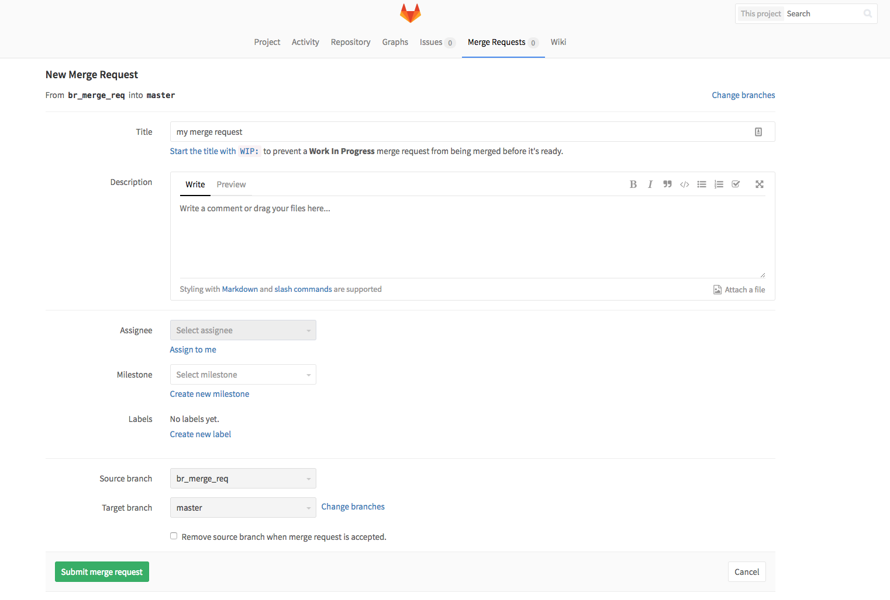
```

Or, comments can be added directly to individual commits. Comments on the commit as a whole can be added through the dialogue box at the end of the commit. Or, comments can be added at specific lines. To do this, hover your mouse over the line in the commit where you wish to add the comment. A small speech bubble will appear to the left hand side of the line. Click on this to bring up a comment box, shown in figure \@ref(fig:comment-commit-fig) similar to those shown in the NodeJS examples given in the previous section.


```{r comment-commit-fig, echo = FALSE, fig.align = "center", out.width = "100%", fig.cap = "Sample conversation from nodejs"}
knitr::include_graphics("images/comment_commit.png")
```


## Code Review in COMP23311 {#crcourse}

For exercises 2 and 3 of the (ref:coursecode) team coursework, you are asked to practice an informal team-based code review system. You should ensure that the code for every feature you add to the Stendhal code base, or change, is reviewed by a separate team member. This includes both test code and production code changes.

You should use GitLab's comment facility to review your team's work. If a feature is short enough to review in one go, and is produced in plenty of time, you can add your code review to the merge request for the feature branch.

If you are attempting a larger feature, or a smaller feature is taking a long time to implement, you may want to give interim code reviews, on partial versions of the feature or its test code. For this, you can use GitLab's comment facility on individual commits. This means you can review any commits that have been pushed to your team's repository, even if the branch they are on has not been merged into the main development branch yet. In this case, you should check with the coder whether they are happy to have the commits reviewed, as it can be quite annoying to be told about problems you are aware of, and are in the middle of fixing.

It is up to you how you organise your team to complete the reviews provided that:

* All code changes made for your new features are reviewed.
* All contributing team members carry out at least one code review.

Code review is very widely used in the software development industry today. You can expect to be subjected to code reviews as soon as you start to write code that becomes visible in your team's repository. Many companies also expect all software engineers, no matter how junior, to review the code of others. As well as helping to keep the quality of your team's code base high, code review is also a great way to learn the conventions and standards used by your team. Look at code reviews provided by your colleagues to learn what is considered good and bad practice, and to get a feel for the degree and style of review comments your team members expect.

In (ref:coursecode), we ask you to carry out some basic buddy reviewing. Through the coursework, you can practice commenting on others code, and responding to comments on your own. This will be useful interviewing material, and will also prepare you to join a software team using modern software quality management techniques.

You can also ask your industry mentor about code reviewing practices used in their organisation, and how they help the work of the team.

Good luck!

`Document version:` `r format(Sys.time(), '%d %B, %Y')`

<!--chapter:end:22-reviewing.Rmd-->

# Unit testing {#automating}


> "Never in the field of software development was so much owed by so many to so few lines of code"
>
> --- [Martin Fowler](https://en.wikipedia.org/wiki/Martin_Fowler_(software_engineer)) on [JUnit.org](https://junit.org/)


## Introduction {#jintro}

In (ref:coursecode), we are going to make use of an industry strength toolkit for software engineering.  This document introduces you to a part of that toolkit that we'll be making use of right from the beginning of the course unit: JUnit.  JUnit is a testing harness for Java that allows us to write concise and readable automated tests for Java code.  It also provides facilities for executing tests and reporting on the results.

Those of you who took COMP16412 (Programming 2) last year will have encountered JUnit while learning to code in Java.  For that course unit, JUnit test suites were provided for you to use, but not much was said about how to interpret them or how to write them.  For others, JUnit will be completely new.

Either way, by the end of (ref:coursecode), you will have written your own JUnit tests---possible quite a lot of them---and you will have experienced the benefits of coding with the support of a large (ish) automated test suite.  We'll be spending quite a lot of the workshops and the coursework talking about and developing these ideas.  For now, this short document introduces you to the basic concepts you need to get started.


## What is Automated Testing and Why Do We Need It? {#automated-test}

Testing a piece of software is the process of running it to determine how closely its actual behaviour matches the requirements set for it. This means deciding on a selection of *input values* the code will be run with, and working out in advance of running (and sometimes even writing) the code what the *expected output* should be for each  input if the code is behaving as we wish it to.  When we run the code with the selected inputs, we check the *actual output* produced by the code, and compare it to the expected output.  If the actual output matches the expected output, then we say that the test *passes*.  If it differs in some way, then we say that the test *fails*^[Note the binary outcome here.  A test either passes or fails.  It is important to stick to this, and not to allow yourself to think of tests as "partially passing" or "nearly passing".  These halfway house concepts aren't helpful to us in achieving high code quality.].

A failing test is evidence that the software we are building does not correctly implement the behaviour we require of it.  It tells us that we have more coding work to do before we are done, and gives us some information about what that work is.

By contrast, we can't learn much from the fact that an individual test passes, since bugs may still exist in parts of the code not covered by the test.  But if we have a comprehensive test suite, covering all the key cases, then we can start to have some confidence that we might have implemented it correctly once all the tests in the suite pass.


The most basic approach to testing software is manual testing.  In manual testing, a person operates the software, entering the selected input values and painstakingly observed the results the software outputs, to check whether it was what was expected or not.  In the early days of software engineering, all testing was done like this.  Humans are flexible and creative, but they are also slow and unreliable.  But thorough manual testing requires a lot of effort and is very boring and repetitive.  It is easy for a human tester to miss out key cases, to mistype a selected input or to misread an output.

Computers, on the other hand, are excellent at repeating the same action over and over again, and they can do this very quickly and with perfect reliability.  In theory, they ought to be much better at systematic testing than humans, and in fact this turns out to be largely (though not completely) the case.  Software testers started to write scripts to automate the process of running the software with the selected inputs, so the human tester only had to eyeball the output and see whether it matched what was expected.  These scripts save a lot of time, and help manual testers to be more consistent and thorough in the test cases they check.  But, they are not fully automated tests, since they do not check for themselves whether the actual output matches the expected output.  The human testers still had to do this work for themselves.

It turns out that computers can do this part of the testing process for us too, and can do it much faster and more precisely than manual testers could hope to.  By fully automating our testing, we get a test suite that takes a little bit more effort to set up in the first place, but which we can run many times over, very cheaply.  This simple idea has revolutionised the way we develop software over the course of the last two decades.

Let's look at one way in which an automated test suite can save us time when coding.  Suppose we have a comprehensive, semi-automated test suite for some code we are about to write, perhaps in the form of a collection of scripts.  Running the scripts and checking the results takes a good 15 minutes of concentrated effort, and so we normally only run it a couple of times a day, sometimes only running the suite at the very end of a day of coding.   One afternoon, when we run the tests, we notice that some of the tests that used to pass now fail. Something we have added to the code that day has broken functionality that we thought was working.

This is called "regression", since the behaviour of the software system has "regressed" from the requirements which were previously met.  When we cause a regression, it should (ideally) be fixed before we try to add more functionality or fix other bugs.  Often, regressions are caused by changes we have made recently, so the starting point is to look through the 50 or so new lines we added that day and the 100 lines of code we changed to find the source of the regression, and fix it.  We might also need to look through all the lines of code that the lines we have changed or added interact with.  That is going to take some time!

Imagine instead that we have a fully automated test suite that takes just seconds to run, and which works out which tests have failed for us.  Instead of running this suite just once or twice each day, we run the test suite after making every small code change.  Now, when we notice a newly failing test, we only have to look at the last 5 or 6 lines of code that we changed since we last ran the tests (and the related lines of code) to find the source of the problem.  This reduces the scope of the debugging task, and makes bugs much cheaper and simpler to find.  We also find bugs earlier, when they are easier to correct because our attention is already focused on the area of code they are hidden in.  We never end up in the situation where we have a large body of code with several (many!) bugs all mixed up together, requiring a marathon debugging session of goodness-knows-how-long to fix.

The cost savings from the frequent use of a comprehensive automated test suite can be significant---so much so that many organisations now make use of continuous integration and test systems, which automatically build and test each new piece of code that is checked into the version control system, reporting back to the developers if and when problems are discovered.  You'll get a chance to work with such a system later in this course unit.


## Automated Testing in JUnit: a Simple Example {#simpleg}

The most commonly used testing harness for Java code is JUnit and that is the main testing tool you will learn to use in this course unit.  The principle behind JUnit is very simple: an automated test case in JUnit is merely a Java method (the test method) that invokes another Java method (the code under test) with some selected inputs, and compares the output against the expected result.  If the actual output matches what is expected, then the test has passed and JUnit exits quietly.  But if there is a discrepancy, then JUnit reports the test as having failed, and gives the programmer some information about the differences in output it observed.

<!--%%% Ideally, the example used in the rest of this document would
%%% match up with one of the examples used in COMP16412.-->
We'll introduce these ideas by looking at how we would use JUnit to test a very simple Java method.  In the code listing below, you'll find the code for some JUnit tests for a method that calculates the largest square that is less than or equal to its parameter.  We'll go through this test class line by line.

````java
import static org.hamcrest.MatcherAssert.assertThat;
import static org.hamcrest.core.Is.is;

import org.junit.Test;

public class LargestSquareTest {

    @Test
    public void shouldReturn0AsLargestSquareLessThanOrEqualTo0() {
        assertThat(LargestSquare.lessThanOrEq(0), is(0));
    }

    @Test
    public void shouldReturn1AsLargestSquareLessThanOrEqualTo1() {
        assertThat(LargestSquare.lessThanOrEq(1), is(1));
    }

    @Test
    public void shouldReturn1AsLargestSquareLessThanOrEqualTo3() {
        assertThat(LargestSquare.lessThanOrEq(3), is(1));
    }

    @Test
    public void shouldReturn4AsLargestSquareLessThanOrEqualTo4() {
        assertThat(LargestSquare.lessThanOrEq(4), is(4));
    }
}
````

After some import statements to pull in the JUnit classes and static methods we need, you'll see what should be a definition for a class called **`LargestSquareTest`** with `public class LargestSquareTest`.  JUnit classes are ordinary Java classes, defined in the usual way.  This JUnit class is going to contain tests for a solution class called **`LargestSquare`**, so we will call it **`LargestSquareTest`**.  In fact, the class could have any legal name.  But, here, we're following a common convention that JUnit test classes are named after the class they test, with the word `Test` stuck on the end.  This is useful because, as a reader of code, we can see instantly which classes are test classes and which not, and also which class is being tested by which test class.

Inside the class, there are four method definitions.  Each of these methods describes a separate test case for the class under test.  These too are ordinary Java instance methods, of the kind you have met before, with the exception of the fact that they are each annotated with `@Test`.  You have not encountered annotations in COMP16121/212, but they are very simple to understand.  They allow us to annotate code with information that is useful to the compiler and other language processors, but which will be ignored during ordinary execution.  In this case, the purpose of the annotations is purely to tell the JUnit test runner which of the methods defined on the class should be executed as test cases, and which should not.

There are a couple of other JUnit annotations that we'll encounter later in the course.  For now, the important thing to note is that we must put the `@Test` annotation at the start of every test case method we write.  If we don't, the test case described by the un-annotated method won't get executed when we run the test suite.

Now let's look at the test methods themselves.  Every JUnit test method should be public (to allow the JUnit runner to call it) and should have a void return type.  JUnit test methods must have no input parameters.  They can be called any legal Java method name, but (just as with JUnit class names) it is usual to follow some naming conventions.  Some people (for historical reasons) begin every test method with the word "test".  I prefer to follow the convention of beginning the test names with the word "should", and making the name describe the behaviour that the test is testing.  The idea is that the names of the tests, when viewed in isolation (as is possible in some IDEs) should read like a specification for the code under test.


You might be a bit surprised by how long these method names are.  You may even be wondering if such long method names can possibly be best practice.  It's true that these names would be too long and cumbersome for ordinary code.  But we are not writing ordinary code here.  JUnit methods are called by the JUnit runner, which uses reflection to identify the methods tagged with the **`@Test`** annotation, and then run them.  No human will ever have to write code which calls these JUnit methods.  No human will ever have to type these long names in.  So, the only role they play is one of documentation; the method names should tell us what the intent of the test case is.  That usually means writing quite a long method name, but it is also useful, as it forces us to think what the test we are going to write is for, before we get into the nitty gritty of coding it up.

Next, we'll look at what is happening inside the test case methods themselves.  Let's focus on the example `assertThat(LargestSquare.lessThanOrEq(0), is(0))`.  Here, we are calling the code under test (a static method on the **`LargestSquare`** class called **`lessThanOrEq()`** with a specific input value (in this case, `0`).  Then, we are using a method provided by the test harness **`assertThat()`** to state what we expect the result of this to be, when the method is called with the specified input value.  In this case, we expect the output to be `0`.

**`assertThat()`** is a matcher method that is provided as part of the Hamcrest matching library.  It comes in several forms (some of which are quite complicated), but all you need to understand at the moment is that it takes the value given as its first parameter, and matches it with the expression in its second.  If the values match, then the assertion exits quietly.  If there is a mismatch then the assertion flags this up as a failing test, along with some information about the exact form of the mismatch detected.  The assertions in the test class in the code listing above all use the pre-provided matcher **`is(value)`**, that checks whether the provided value is equal to **`value`** or not.  So, the **`assertThat()`** statement in the code listing checks that **`LargestSquare.lessThanOrEq(0)`** returns a value that is equal to 0, and lets the programmer know about it if it doesn't.

Notice how the whole test case reads quite like an English sentence describing how we want the code to behave.  We want to "assert that the largest square less than or equal to 0 is 0".  Well-written test cases should have this property.  They should (as far as practicable) read like natural, readable statements of the behaviour we are trying to implement.

There is a lot more to learn about JUnit than the very simple tests we have described so far.  But, this brief introduction should be enough to help you get started on working with tests in the workshops and coursework over the next few weeks.

`Document version:` `r format(Sys.time(), '%d %B, %Y')`

<!--chapter:end:23-automating.Rmd-->

# References {#reading}

As well as the recommended reading from section \@ref(recread), this section lists everything we've cited. Links to `librarysearch.manchester.ac.uk` take you to electronic copies (login required) at the University of Manchester, the pages take a few seconds to render but they do appear (eventually).

`r if (knitr::is_latex_output())'
Since you are reading the pdf version, all the references can be found in the bibliography section following this page.
'`

<!--chapter:end:24-References.Rmd-->

